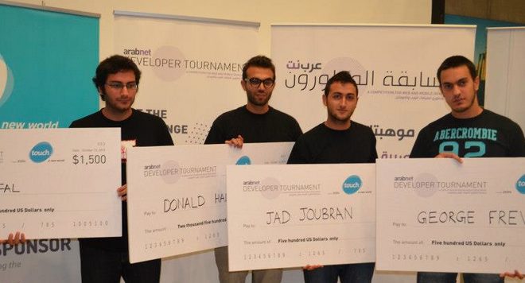

بعد النجاح الذي حصدته مسابقة المطورين العرب في كل من بيروت وعمان والرياض. تستعد عرب نت لإطلاق الجولة الرابعة من هذه المسابقة في 20 من أبريل/نيسان الجاري بمدينة دبي ، وسنتعرف من خلال المسابقة على أهم المبرمجين و المطورين الموهوبين في الإمارات العربية المتحدة من خلال سلسلة من التحديات البرمجية المميزة.

بتنظيم من عرب نت وبرعاية شركة دو للاتصالات و باستضافة من مدينة دبي للانترنت تقام هذه المسابقة التي تهدف للبحث عن أهم مواهب البرمجة و تطبيقات الويب و الموبايل الموجودة في المنطقة بغية إيصالهم لأفضل فرص عمل في القطاع الرقمي المتنامي.

صرّح عمر كريستيديس المؤسس و المدير التنفيذي لعرب نت:

<blockquote>

> 
> ستسلط مسابقة المطورون العرب الضوء على الأبطال المخفيين في الصناعة الرقمية –المطورون و المبرمجون الذين يصنعون مختلف المواقع الالكترونية التي نزور أو التطبيقات التي نستخدم
> 
> 
</blockquote>

وفي هذا الصدد، قال ماجد السويدي، مدير إدارة التطوير الأعمال في مدينة دبي للإنترنت ومنطقة دبي للتعهيد:

<blockquote>

> 
>  نأمل من خلال استضافتنا لهذه المسابقة بأن نكون قادرين على إعطاء دفعة إيجابية للقوى العاملة المحلية وتلبية احتياجاتها وإيصال أفكارها إلى السوق. وانسجاماً مع هذا الهدف، نؤكد من خلال مركز  In5 للابتكار، الذي تستضيفه مدينة دبي للإنترنت، التزامنا بدعم مشاريع الشباب والشركات الناشئة ابتداءاً من المراحل الأولى لابتكار الأفكار وتطبيقها على أرض الواقع وصولاً إلى الإطلاق التجاري لمنتجاتهم، وذلك من خلال توفير بنية تحتية قوية فضلاً عن بيئة عمل ديناميكية تفاعلية توفر لهم الأدوات اللازمة التي تمكنهم من المنافسة في سوق العمل العالمية.
> 
> 
</blockquote>

بعد أن تجاوز الاستثمارفي الشركات التقنية الناشئة في المنطقة 124$ مليون دولار أمريكي في عام 2012 ،القطاع الرقمي في الشرق الأوسط يتنامى بشكل ملحوظ و بسرعة هائلة ولكن مازالت الصعوبة في إيجاد المواهب التقنية من مطورين و مبرمجين واحدة من أهم و أكبر العراقيل التي تواجه الشركات –كما أوضحت دراسة حديثة في موقع Dice.com –أحد أهم مواقع فرص العمل في القطاع التكنولوجي-

كما وخلصت دراسة أخرى نشرت في موقع hiring managers أنه من أكثر شواغر العمل صعوبة في الملء ضمن الولايات المتحدة الأمريكية هي الوظائف التي تخص المطورين حيث أنها تعتبر أصعب بمرتين أو ثلاث مرات من أي شواغر أخرى.

<!-- more -->

مسابقة عرب نت للمطورين تتناول هذا التحدي من خلال تقديم منصة لربط المطورين بفرص العمل ،إما كمؤسسين تقنيين لشركات ناشئة جديدة أو كقادة للفرق التقنية الموجودة ضمن الشركات و المؤسسات.

تنطلق المسابقة في الثامنة صباحاً من يوم السبت 20 أبريل/نيسان في صالة المؤتمرات رقم 1 و 2  في قرية دبي للمعرفة ، حيث سيتنافس المطورون من خلال أربع جولات على امتداد 12 ساعة.  وسيتم  الإعلان عن الفائزين في نهاية جولات المسابقة.

كما في كل من بيروت،عمان و الرياض، سيحصل الرابحون الأربعة الأوائل في دبي على جوائز نقدية بقيمة 5000$ دولار أمريكي، بالإضافة لفرصة تمثيل بلدهم في الجولة النهائية  من المسابقة في قمة عرب نت الرقمية  في حزيران 2013

يمكن للمطورين الراغبين بالإشتراك بمسابقة المطورين التسجيل وبشكل مجاني بمجرد الضغط على الرابط: [register](http://tournament.arabnet.me/register/)

كما ويمكن معرفة المزيد من المعلومات عن مسابقة المطرين العرب في دبي وغيرها من المدن العربية الأخرى من خلال الرابط التالي: [http://tournament.arabnet.me/](http://tournament.arabnet.me/)

--

**لمحة عن عرب نت**

عرب نت هو ملتقى محترفي الحقل الرقمي ورواد الأعمال العرب كي يتواصلوا ويتعلموا. ينظم عرب نت عدة مؤتمرات في المنطقة تهدف لتنمية قطاع الويب وإنشاء شركات رقمية جديدة. ، يعقد عرب نت مؤتمرًا دوليًا (قمة عرب نت – التحول الرقمي)، والذي يُعرف بأنه من أهم الأحداث التي تتناول قطاعيّ الويب والموبايل في الشرق الأوسط. بالإضافة لمجموعة مؤتمرات  تخصصية في مجال القطاع الرقمي و تطوره في العالم العربي . كما يجدر بالذكر أن مسابقتيها ماراثون الأفكار و عرض الشركات الناشئة حصدتا نجاحاً كبيراً وذلك لدورهما الهام في ربط رياديي الأعمال و أصحاب الشركات الناشئة بكل من الممولين وحاضنات الأعمال.
