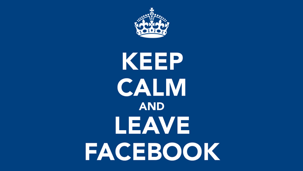

هل سبق لك أن تساءلت عن السبب الذي يقف وراء عدم ظهور كل المنشورات على **صفحتك على فيس بوك** إلا لقلة قليلة من المُعجبين بها؟ هل كنت تظن أن السبب هو نوعية المنشورات لوحدها؟ أو أن صفحتك تكون قد تعرضت "لعقوبة" ما سلطتها عليها إدارة فيس بوك لا تدري ما هي؟ بين هذا وذاك، قد تتساءل مع هي العوامل التي تجعل صفحة منافسيك أكثر شعبية من صفحتك، وما الذي يجب عليك أن تفعله حيال ذلك؟

لفهم الوضعية التي تُعاني منها صفحات فيس بوك، يجب أولا أن نعرف ما هي الآلية التي تتحكم في ظهور منشوراتها في الخط الزمني **TimeLine** كل مستخدم. إن كنت تستعمل الإنترنت بشكل مستمر، فإنك ومن دون شك سبق لك وأن التقيت وأنت تتجول على الإنترنت بمصطلح/ خوارزمية PageRank والذي تستعمله Google لترتيب نتائج بحثها. فيس بوك تستعمل خوازمية مماثلة (إن صح التعبير) والتي لا تُعنى بالبحث على شبكتها الاجتماعية وإنما بترتيب المنشورات على الخط الزمني لكل مستخدم. خوازمية فيس بوك هذه يُطلق عليها اسم **EdgeRank** حيث تهدف –حسب فيس بوك- إلى تحسين تجربة المستخدم على شبكتها، لكن هذا التحسين له وجه سلبي، ربما لا يُمكن الوصول إلى درجة عالية من تحسين تجربة المستخدم من دونها، أو ربما تكون مقصودة بشكل مباشر، حيث أنه أصبح الوصول إلى المعجبين أصعب فأصعب.

لنفرض مثلا أنك تملك صفحة على فيس بوك، ولنفرض أنك قضيت الليالي الطوال لتحديثها ولإبقاء المعجبين بها على اطلاع دائم بأفضل المحتويات ولجذب مُعجبين جدد، إن كنت محظوظا جدا فإن رسائلك ومنشوراتك ستصل في أفضل الحالات إلى عشر عدد المُعجبين بالصفحة. تشير فيس بوك إلى أن منشوراتك تصل إلى مُعجبي صفحتك وفقا لعدد مُعين من المعايير، كنوعية المنشور (صورة، تحديث،...)، وعدد التعليقات عليها.

تود أن توصل رسائلك إلى عدد أكبر، فيس بوك تقدم لك حلا سحريا، ادفع وستصل منشوراتك إلى عدد أكبر من المستخدمين، فمن خلال خدمة **Promoted Posts** الإعلانية، لن تظهر منشوراتك على القائمة الجانبية للشبكة، وإنما ستظهر ضمن التحديثات الأخرى، مما سيزيد من أعداد من يرونها وبالتالي أعداد من يتفاعلون معها.

بعبارة أخرى، ستبذل جهدا كبيرا في الحصول على أكبر قدر من المُعجبين، وبنشر محتويات مميزة لكسب رضاهم، وفوق كل هذا يجب عليط أن تدفع مقابل أن تصل المنشورات إلى أكبر قدر من المستخدمين. ما يزيد الطين بلة هي ما كشفته بعض الدراسات مثل [هذه](http://www.pewinternet.org/Reports/2013/Coming-and-going-on-facebook/Key-Findings.aspx) والتي تُشير إلى أن 27% من مستخدمي الشبكة ينوون قضاء وقت أقل هذا العام على فيس بوك، مقابل 3% ينوون قضاء وقت أطول. بعبارة أخرى، بعد كل هذا التعب الذي بذلته على صفحتك، فمن المحتمل جدا أن الأعضاء الذين تود استهدافهم بصفحتك/منتجك يقضون أوقاتهم في أماكن أخرى.

ما الحل إذاً؟ إن كان هدفك الوصول إلى أكبر قدر من الزبائن المحتملين لمنتجك فمن الأفضل لك تنويع وسائل الوصول إليهم وتجنب وضع كامل جهودك وبيضاتك في سلة واحدة. بعبارة أخرى إن كانت لديك ميزانية محددة للترويج على الشبكات الاجتماعية فمن باب أولى أن تقسمها على عدة شبكات، وليكن لكل من تويتر، LinkedIn ، Google+ وحتى Pintereset نصيب منها.

أسئلة عديدة تطرح نفسها تحت ضوء الأوضاع الحالية للنشر على فيس بوك: إلى متى سيظل الإعلان على فيس بوك وتنشيط صفحات الشركات الناشئة له فائدة؟ وهل سيأتي اليوم الذي يصبح تنشيط هذه الصفحات عديم الفائدة؟ وهل ستستغل شبكات اجتماعية أخرى كـ Google+ هذه المشاكل لجذب اهتمام الشركات إليها؟

هذا المقال مستوحى من [هذا المقال](http://www.forbes.com/sites/work-in-progress/2013/04/22/should-you-leave-facebook-edgerank-confusion-promoted-posts-and-why-small-business-owners-are-exceedingly-frustrated/) على موقع Forbes.
