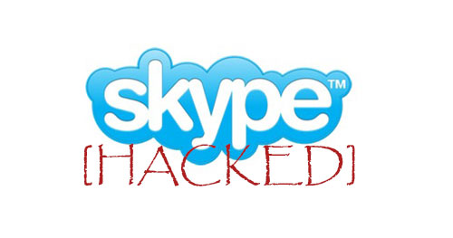

نظرا للطريقة السيئة المتعبة من طرق خدمة **Skype** لاسترجاع كلمات المرور/الحسابات المنسية، فقد تمكن أحد الباحثين الأمنيين من اكتشاف طرق ملتوية يمكن لأي مخترق اتباعها و**كشف كلمة مرور حسابك**، خاصة إذا كان يعلم عنك بضع معلومات بسيطة.

الطريقة تعتبر من بدائيات الـ [Social Engineering](http://en.wikipedia.org/wiki/Social_engineering_%28security%29) أو [الهندسة الاجتماعية](http://ar.wikipedia.org/wiki/%D9%87%D9%86%D8%AF%D8%B3%D8%A9_%D8%A7%D8%AC%D8%AA%D9%85%D8%A7%D8%B9%D9%8A%D8%A9_%28%D8%A3%D9%85%D9%86%29)، ومع ذلك فهي تعمل بكفاءة، فكل ما على المخترق معرفته عن الضحية هو:

	  * 3 أو 5 من جهات اتصال لك على Skype.
	  * إحدى عناوين البريد الإلكتروني كنت قد استعملتها في أي مرحلة من مراحل حسابك على Skype أو لا زلت تستعمله حاليا.
	  * اسمك و/أو لقبك، على Skype طبعا.

الباحث مكتشف الطريقة هو @TibitXimer، حيث [يقول أنه تم سرقة حسابه 6 مرات في يوم واحد فقط](http://community.skype.com/t5/Security-Privacy-Trust-and/URGENT-Skype-Support-Account-Security-Issue-CAN-AFFECT-ALL-USERS/td-p/1552372). وأن جميع حسابات Skype معرضة لنفس الخطر الذي تعرض له. في حين لم يعترف فريق دعم Skype بالأمر ولا بانتشاره! ولم يرد بشكل رسمي لحد كتابة هذا الخبر.

بالنسبة لكيفية الحماية مبدئيا، فهناك اقتراحات بتغيير البريد الإلكتروني المستعمل مع الخدمة إلى آخر فريد/جديد غير مستعمل في مكان آخر. أو أن تتعلم كيف تحمي نفسك من خدع الهندسة الاجتماعية.

يجدر الإشارة إلى أن الباحث الأمني، اقترح على Skype مجموعة من التدابير الأمنية الواجب اتخاذها لتحسين الخدمة، منها توفير عملية التحقق بعاملين، [Two-factor authentication](http://en.wikipedia.org/wiki/Multi-factor_authentication) وتحسين عملية التحقق من مالك البريد.

ما رأي القارئ في هذا؟
