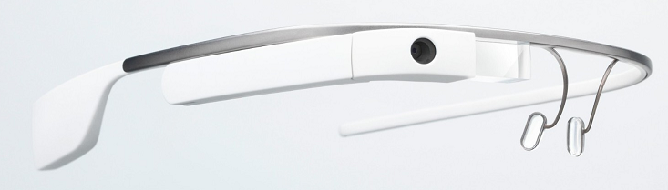

كثر الحديث مؤخرا عن نظارات **Google Glass** الذكية، وتباعدت الآراء حولها بشكل كبير، هناك من يرى بأنها تقنية ستغير وجه المستقبل، تماما مثلما فعلها الجيل الأول من هواتف iPhone، وهناك من يرى بأن الضجة التي أحدثتها **Google Glass** تفوق بكثير المنتج في حذ ذاته، إلا أن هناك من يدعو إلى التريث وعدم التسرع في الخروج بنتائج، لأن مستقبل نظارات Google لا يزال لم يُكتب بعد، أو أنه ستكتبه أيادي مطوري أولى تطبيقاته.

بداية، نظارات Google Glass ليست متاحة للجميع، حيث عمدت Google إلى خدعة، تجعل الكثير يرغبون بها ويبدون رضاهم عنها (سواء رضوا عنها فعلا أو تصنعوا الأمر)، حيث أنها نظمت مسابقة تسمح للفائزين بها بالانضمام إلى قائمة المحظوظين الثمانمائة  الذين سيدفعون 1500$  لشراء النظارات. بعبارة أخرى، يجب أن يتم اختيارك أولا، ثم أن تدفع ثانيا سعرا يراه الكثيرون مبالغا فيه، وبعد ذلك، لا يبدو لي بأنه سيبقى لك خيار آخر إلا أن تبدي رضاك على الجهاز، على الأقل لتظهر في مظهر الـ Cool الذي حصل على Gadget قد تغير من وجه العالم قريبا، لأنك وبكل بساطة لا يُمكنك التخلص منها ببيعها مثلا، حيث تنص اتفاقية استخدام القطع الأولى التي تم بيعها من هذه النظارات بأنه [سيتم تعطيلها](http://gizmodo.com/5994953/google-bans-selling-or-lending-of-glass) إذا تم بيعها، إعارتها أو حتى تأجيرها لأشخاص آخرين، بعبارة أخرى، مبروك عليك، لقد اشتريت حقوق استخدام النظارات وليس النظارات في حد ذاتها.

من جهة لدينا شخصيات قررت [أنها لم تنزع نظارات Google Glass طيلة اليوم](https://plus.google.com/+Scobleizer/posts/TcaqNeYJWXo) (حتى لدى الاستحمام)، وأخرى [أصبح شغلها الشاغل نشر صور على تويتر تم التقاطها عبر نظاراته](https://twitter.com/loic) ، ومن جهة أخرى نقرأ [مقالات تؤكد بأنه لا أحد يحب نظارات Google Glass](http://www.businessinsider.com/nobody-really-likes-google-glass-2013-5#ixzz2SGKxQkCx) وتعدد المشاكل التقنية التي يُعاني منها، كقصر عمر البطارية، العلل البرمجية التي لا تزال تُعاني منها، أو حتى آلام الرأس التي يسببها. بعبارة أخرى، لا يوجد إجماع على نظارات Google ولا عن الاستخدامات المستقبلية له، وهو أمر لا يلعب ضد هذه النظارات كما قد يتبادر إلى الأذهان، فيذكرنا [مقال على TechCrunch](http://techcrunch.com/2013/05/03/weve-heard-a-similar-reaction-to-google-glass-somewhere-before/) بأن نفس الأمر حدث مع الجيل الأول من هواتف iPhone، حيث أنه كان أغلى هاتف يُطرح في السوق، هاتف لا يحتوي على لوحة مفاتيح فيزيائية وهو ما يجعله حسب Steve Ballmer -[والذي تسرع حينها ليبدي رأيه في الأمر](http://www.youtube.com/watch?feature=player_embedded&v=eywi0h_Y5_U#at=121)- غير موجه لقطاع الأعمال، كما أنه أتى ولم يحمل معه سوى التطبيقات القاعدية والتي تجعل منه مجرد هاتف خليوي آخر بشاشة كبيرة وببطارية لا تدوم طويلا، وفوق كل ذلك نوعية الاتصال الخاصة به لم تكن بتلك الجودة العالية. بكلمات أخرى، يكفي أن تعود بذاكرتك إلى ما قاله المشككون في هاتف iPhone لدى صدوره، لتحصل على فكرة جيدة على ما قيل وما سيُقال على Glass خلال الأشهر القادمة.

أمام Google Glass مسار طويل، مسار محفوف بمشاكل عديدة منها ما يتعلق بفائدة استخدامه والتي يُمكن أن تحل بعد ظهور تطبيقات مفيدة لم يكن من الممكن التفكير فيها قبل إطلاق Glass (تماما مثلما حدث مع iPhone)، ومنها ما يتعلق بسعره، وهو أمر لن يُشكل عائقا في المستقبل لأن مواصفاتها التقنية ليست بالعالية (لديها قوة [مماثلة لقوة جهاز الجيل الأول من Kindle](http://www.businessinsider.com/nobody-really-likes-google-glass-2013-5#ixzz2SGKxQkCx)، وبالتالي فإنه من المحتمل جدا أن يتم تخفيض سعرها)، ومنها ما يتعلق بمظهر لابسيها الذين يبدون في غاية الغرابة في أعين الكثيرين، وهو أمر يُمكن حله أيضا، إن اعتمدت Google سياسة مماثلة لما تم اعتماده مع سماعات beats والتي حصلت على شعبية كبيرة بعد أن قام الكثير من النجوم باستخدامها في الأماكن العامة.

السؤال الذي يطرح نفسه، متى ستحدث هذه الثورة التي وعدت بها Google Glass، ما الأثر التي ستتركه في طريقة تعاملنا مع التقنية؟ وهل سنشاهد قريبا تنافسا ما بين الشركات التقنية لإطلاق نظاراتها الخاصة تماما مثلما فعلته مع الهواتف الذكية والحواسيب اللوحية.
