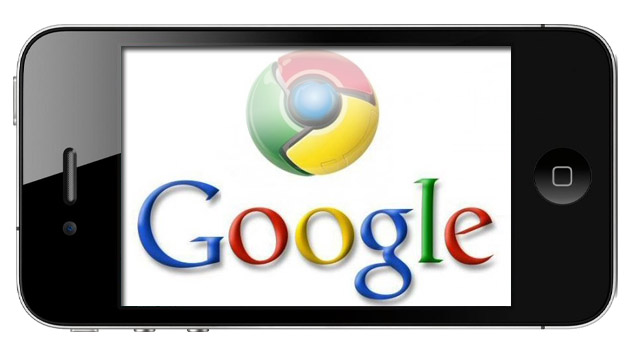

هل سيصبح نظام **iOS** بجهازيه **iPhone** و**iPad** مُقاطعة قابعة تحت إدارة **Google**؟ قد يبدو الأمر مستبعدا كثيرا، لكنه على الأقل أمر تسعى إليه Google، ربما بشكل غير مُباشر. إلا أن تحليلا سريعا لما فعلته وما تنوي فعله على نظام iOS يوحي بأن الأمر ليس هدفا بعيد المنال.

تعود أولى مغازلات Google لنظام iOS إلى الأجيال الأولى من هواتف iPhone (والذي كان يُسمى حينها iPhoneOS) حيث قامت -بالشراكة مع Apple- بتوفير تطبيقين لكل من Youtube وGoogle Maps يأتيان بشكل قياسي مع النظام. قررت مؤخرا Apple بأن الأمر لم يعد يخدمها كثيرا، وقررت إيقاف التطبيقين في الإصدارات الحديثة من النظام واستبدلت أحدهما (Google Maps) بتطبيق قامت هي بتطويره. رغم ذلك لم تُخرج Apple غريمتها كلية من أراضيها، حيث أنها لم تتخلص من منتج آخر وهو متصفح Chrome والذي وفرته أشهرا قبل ذلك على متجر تطبيقات Apple.

هل نسينا تطبيقا آخر؟ نعم تطبيق Gmail وهو الذي يُمكن أن يستبدل تطبيق البريد الإلكتروني القياسي (إن كنت تستعمل Gmail طبعا)، هل هناك تطبيق آخر؟ طبعا، هناك جملة من التطبيقات الأخرى: Google+، Translate،Drive، Earth، Books وهلم جرا. بعبارة أخرى، رغم إيقاف تطبيقي Google Maps و Youtube، لا يزال حضور Google قويا من خلال باقي تطبيقاتها.

ماذا حدث بعد ذلك؟ قامت Google بتطوير وتوفير تطبيقين جديدين خاصين بها لكل من Youtube وGoogle Maps. هذا الأخير حصل على شعبية كبيرة جدا، سمحت له [باعتلاء سلم ترتيب أكثر التطبيقات المجانية تحميلا على متجر AppStore](http://www.engadget.com/2012/12/13/google-maps-app-store/) لحين من الزمن.

مؤخرا، وكخطوة اعتبرها الكثيرون منتظرة وطبيعية، قامت Google [بإطلاق خدمة Google Now](http://www.theverge.com/2013/4/29/4275334/google-now-available-on-iphone-and-ipad) (والتي كانت حكرا على مستخدمي الإصدار 4.1 من نظام Android والإصدارات التي تلتها) على نظام iOS، رغم ما قيل حول أن التطبيق [ليس بالجودة التي عليها نظيره على نظام Android](http://pandodaily.com/2013/04/29/google-now-on-ios-is-neither-google-nor-now/)، إلا أنها تعتبر خطوة إضافية لاحتلال المزيد من الأراضي على جزيرة iOS، وستمكن Google من منافسة عمود آخر من أعمدة نظام iOS والمتعلق هذه المرة بـ Siri.

قد يبدو بأن كل هذه [التطبيقات معزولة](http://pandodaily.com/2012/12/27/every-app-is-an-island-and-thats-just-the-way-apple-wants-it/)، وقد لا تشكل تهديدا مباشرا لـ Apple، رغم أنها تشكل تهديدات مباشرة على تطبيقات Apple، وخدماتها القاعدية، فلا مجال للمقارنة مثلا ما بين تطبيق Google Maps ونظريه الذي طورته Apple، كما أنه يُمكن قول نفس الأمر حول تطبيقات البريد الإلكتروني، وبصفة أقل على متصفح Chrome، إلا أن هناك [أمرا آخر في غاية الخطورة شرعت Google في القيام به](http://pandodaily.com/2013/05/06/the-iphone-is-one-step-closer-to-becoming-a-true-google-phone/) بكل صمت، دون أن تثير الانتباه إليها، ويتعلق الأمر بربط هذه التطبيقات بعضها ببعض، فبعد أن كان بالإمكان فتح روابط تطبيق Google+ في متصفح Chrome إن كان منصبا على الهاتف، [أطلقت Google تحديثا جديدا لتطبيق Gmail](http://thenextweb.com/apps/2013/05/06/gmail-for-ios-now-links-directly-to-native-youtube-google-maps-and-chrome-apps/?fromcat=all) يتيح للمستخدمين البقاء في "نظام" Google دون الحاجة إلى المرور عبر خدمات Apple، فعلى سبيل المثال، إن احتوت رسالة ما رابطا لموقع جغرافي مُعين فإنه أصبح بالإمكان استعراضه مباشرة على تطبيق Google Maps. نفس الأمر يُمكن القيام به مع الفيديوهات والتي يُمكن استعراضها مباشرة على تطبيق Youtube أو الروابط التي يُمكن فتحها من دون أية تعقيدات على متصفح Chrome.

لتلخيص الأمر، قامت Google بتوفير بدائل لخدمات iOS القاعدية بشكل تدريجي، ثم هي الآن تشرع في ربط تلك الخدمات بعضها ببعض لتميكن المستخدم من البقاء على خدمات Google (أو نظام Google على iOS إن صح التعبير) من دون المرور على غيرها.

ما هي الخطوة القادمة؟ تخيلوا مثلا لو قامت Apple بإتاحة كتابة تطبيقات من صنف Launcher (ربما لمغازلة فيس بوك ولحدثها على إطلاق خدمة [Facebook Home](https://www.it-scoop.com/tag/facebook-home/) على نظام iOS أيضا)، ربما ستستغل Google تلك الفرصة لبناء Launcher خاص بها، سيجعل من هاتفك... نسخة مطورة من نظام Google على نظام iOS (لكيلا نقول نسخة مصغرة من نظام Android) معدة خصيصا لتشغيل تطبيقات Google. قد يبدو الأمر مبالغا فيه (ربما بشكل كبير)، لكن لا يبدو أن هناك أية عوائق تقنية ستمنع  Google من احتلال المزيد من الأراضي على أرض غريمتها Apple.

في رأيك، هل ستعمد Apple إلى سن قوانين جديدة للتضييق على Google ولمنعها من مواصلة استغلال نظام التشغيل الخاص بها؟ وهل تتوقع أن يتحول iPhone قريبا إلى هاتف Google بامتياز؟
