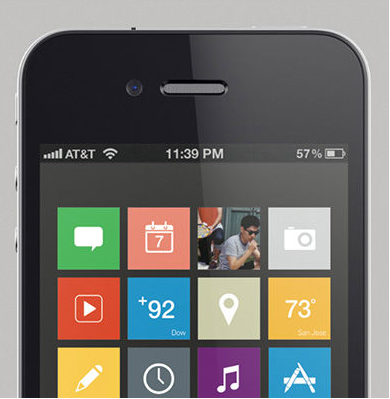
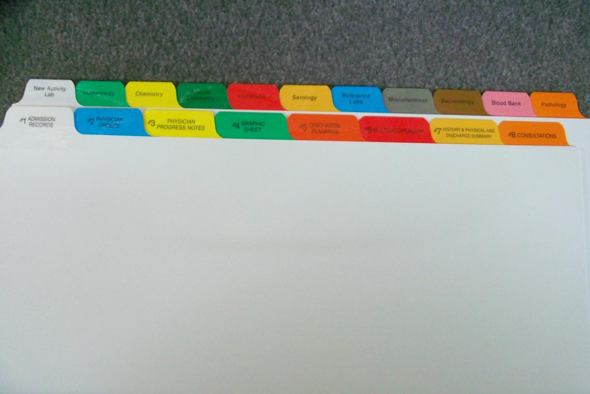
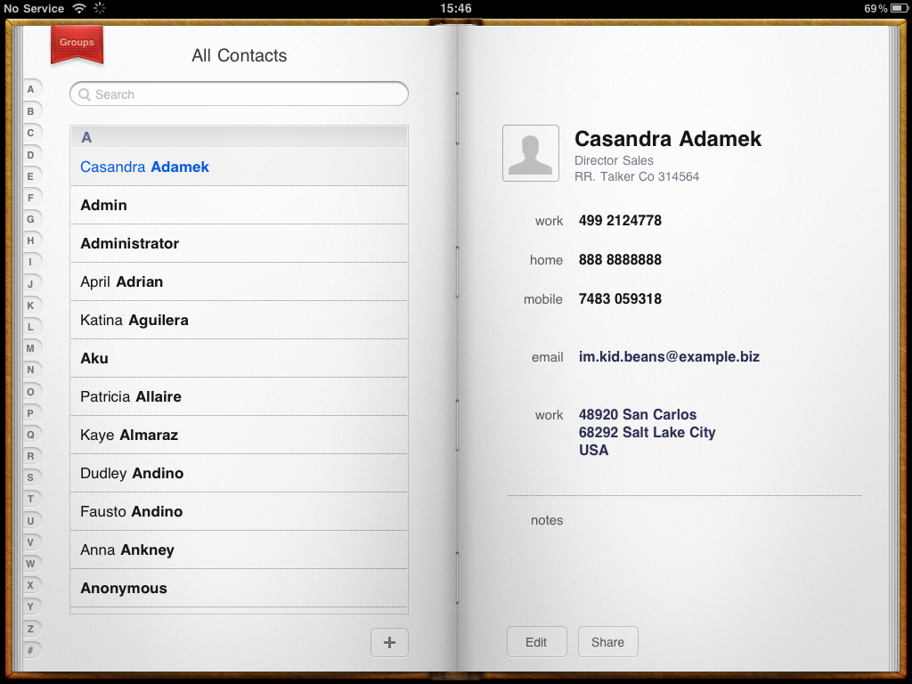
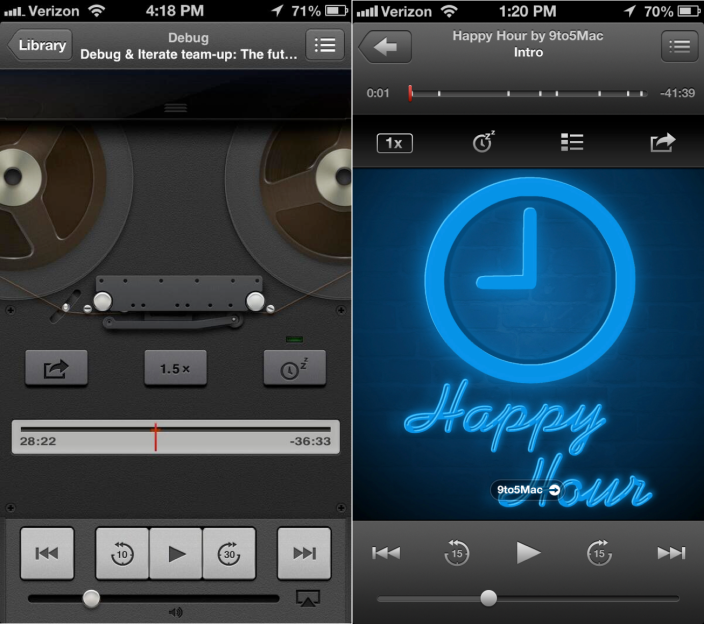

هذا المقال خليط من عدد من المقالات بالإنكليزية (المصادر ترد كروابط في سياقها) مع أفكار شخصية.

هل من ترجمة أفضل لمصطلح Skeuomorphism؟ باختصار يعني هذا المصطلح (في عالم التقنية) أن يتبع تصميم المحتوى الرقمي -إن كان موقع ويب أو تطبيقًا أو سوى ذلك - عناصر وجمادات مادية غير رقمية في محاولة لمحاكاة مظهرها والمواد المصنوعة منها. فإن كان المحتوى كتابًا رقميًّا، فعليه أن يبدو تبعًا لهذا النهج في التصميم ككتاب حقيقي، بصفحات يمكن قلبها كما في الواقع، وألوان وظلال كتلك التي نُحسّها في الكتاب المطبوع. لكن المصطلح العام خارج العالم التقني يعني محاكاة عنصر مادّيّ ما مصنوع بطريقة معينة لخصائص ومظهر عنصر مادّيّ آخر مصنوعٍ من مادة أخرى أو بطريقة مختلفة.

قد يبدو هذا التعريف غامضًا نوعًا ما، خصوصًا في غياب مصطلح عربيّ مقابل (على الأقل ضمن حدود معرفتي)، وكما [جاء في موسوعة ويكبيديا](https://en.wikipedia.org/wiki/Skeuomorph) فإن المصطلح مشتق من جزأين الأول skeuos بمعنى وعاء أو أداة، والآخر morph ويعني شكلاً، وقد وظّف هذا المصطلح لوصف العناصر المادية منذ 1890، وهو يستخدم الآن لوصف واجهات الكمبيوتر. وهذا ما يهمّني دراسته الآن. لنلق نظرة على هاتين الصورتين، ولنسأل أنفسنا أيهما يتبع نمط التصميم المقلّد للواقع؟

هل قلت إنه التطبيق في الجهة اليمنى؟ الإجابة الصحيحة أن كلا التصميمين مقلّد للواقع، وسنعرف الآن لماذا.

قلتُ بداية إن مبدأ التصميم المحاكي للواقع يعني محاولة اتباع مظهر العنصر المادي في تشكيل المماثل الرقمي، وضربت مثالاً على ذلك الكتاب الرقمي، الذي تضاف إليه مظاهر الظلال وتأثيرات الانتقال بين الصفحات كما نشاهد في أجهزة iOS، لكن الحقيقة أن هذا المثال لا يفي بالغرض تمامًا، وإنما يقرّب إلى الأذهان المفهوم، وإذا أردنا وضع مصطلح Skeumorphism تحت المجهر، ودراسته كما ورد تعريفه في ويكبيديا، فإننا نجد أن معظم العناصر في واجهات الحاسوب هي عناصر مقتبسة من الواقع المادي، بدءًا من الملفات والمجلدات، مرورًا بالأزرار التي نجدها إلى الآن في الأجهزة الإلكترونية ولوحات التحكم، وسطح المكتب (desktop) الذي نراه على الحواسيب الشخصية هو محاكاة لسطح المكتب الحقيقي، حيث يوضع على سطح هذه الطاولة (أو المكتب) عناصر كالملفات والمجلدات (الحقيقية)، وربما نضع عليه بعض الأوراق والملاحظات التي وجدت طريقها إلى عالم الحاسوب من خلال ما نسميه desktop widgets أو gadgets باصطلاح Windows، وكذلك يمكنك القياس على القوائم، ولعل علامات التبويب (Tabs) واحدة من أكثر العناصر التي يمكن بسهولة إدراك مقابله الواقعي، تلك العلامات التي نشاهدها في الكتب والكراسات.

<!-- more -->

[caption id="attachment_12218" align="aligncenter" width="432"] صورة 01 - [مصدر الصورة http://wikivillage.co.za/prestige-stationers/blog/files-storage][/caption][caption id="attachment_12219" align="aligncenter" width="332"] [صورة 2][/caption]لكنّ هناك نوعًا محدّدًا من التصاميم المقلدة للواقع هو ما نقصده في هذا الموضوع، ويرى البعض تسميته بالواقعية (realism) بدل skeuomorphism، وهو يُشاهد كثيرًا على أجهزة Apple، فتطبيق الكتب يضم رفوفًا خشبية، والكتب ذاتها تتبع تصميم الكتب الحقيقية، وتطبيق Podcasts في نسخه القديمة كان يحوي شريط تسجيل (tape)، والظلال الكثيفة تعطي انطباعًا بأن للعناصر أبعادًا مادّيّة، وكذلك أيقونات التطبيقات تبدو لماعة كما لو أنها مصنوعة من الزجاج وألقيَ عليها الضوء، وموضع تثبيت التطبيقات (dock) أيضًا يبدو كرف يمكن صفّ العناصر عليه، وتطبيق جهات الاتصال (contacts) يقلّد مظهر دفتر العناوين بحذافيره، وحتى الآلة الحاسبة تبدو وكأنها حقيقية، وتطبيق الملاحظات يبدو نسخة طبق الأصل عن دفتر الملاحظات.

مؤخرًا كثرت الشائعات التي تتحدث عن نية Apple الابتعاد عن نمط التصميم هذا بعد منح Jony Ive (المسؤول عن تصميم القطع hardware ﻷجهزة Apple) سلطة على البرامج software إلى جانب مهمته الرئيسية، وتذكر الإشاعات نيته الاتجاه نحو النمط الدراج حاليًّا وهو التصميم المنبسط (flat) والذي نراه بوضوح في Windows 8 وبعض تصاميم Google الحديثة، ونعود لنقول إن نمط التصميم المنبسط لا يتنافى مع التصميم المحاكي للواقع بمفهومه العام (skeuomorphism) فالأزرار وعلامات التبويب وكل العناصر المألوفة ما تزال موجودة في التصميم المنبسط، ولكنه يصطدم مع التصميم الواقعي (realism) الذي ذكرناه للتوّ.

لكن لماذا تقدم Apple على هذا؟ الجواب يقع في قسمين، الأول متعلق بالتصميم ذاته، والآخر متعلق بوضع Apple الحاليّ.

فأما ما يتعلق بالتصميم ذاته:

 	  * يضيف التصميم الواقعي عبئًا اكبر على المطورين (في Apple والمطورين الآخرين لمنصاتها) بحيث يضطرون إلى إنشاء الظلال وتأثيرات اللمعان ورسم الخامات وما إلى ذلك، وهذا قد يتطلب استخدام مكتبات رسومية، وهذه بدورها تتعامل مع القطع hardware، وإن لم يحتج ذلك فإنه على الأقل يستغرق وقتًا أطول، دعك من الحاجة لمحاكاة الحركة، وهذه وحدها مُجهِدة. وإذا قُورن هذا كله مع التصميم المنبسط الذي قد يأخذ أيضًا ببعض مبادئ [التقليلية (minimalism)](https://en.wikipedia.org/wiki/Minimalism) وهو ما يتكرر كثيرًا في Windows 8، فإن المطورين سيندفعون لاختيار الخيار الأخير خصوصًا مع أفول ظل التصميم الواقعي بتراجع بريق Apple، والحاجة لأن تكون التصاميم أبسط ما يمكن عند التطوير على الويب لضمان إمكانية تشغيل الموقع على عشرات المتصفحات بين الحواسيب والهواتف المحمولة وما بينها، والتي يختلف كل منها في دعمه للمعايير الحديثة التي تتضمن الحركات والظلال وسواها.

 	  * سبب آخر يتعلق بالارتباك (confusion) الذي يسببه هذا النمط من التصميم، فمن المفترض أن محاكاة العناصر الواقعية تهدف إلى جعل التعامل مع المحتوى الرقمي أيسر للمبتدئين وجعله أقرب للأشياء المألوفة في حياتنا، لكن Apple بالغت كثيرًا في ذلك، بحيث حاكت دفتر العناوين، ورفوف المكتبة والخشب الذي تصنع منه وشريط التسجيل؛ وإذا فكرنا قليلاً في هذا، فمن منا يستخدم هذه الأشياء حاليًّا؟ إذا كنت متوسط العمر، فعلى الأغلب إنك تعرف هذه الأشياء في الواقع، لكنك لا تستخدمها، فما بالك بصغار السن؟ هم غالبًا لا يعرفون دفتر العناوين ولا شريط التسجيل، وعرض هذه العناصر عليهم في المحتوى الرقمي لا يبدو فكرة سديدة، بل ربما يحتاج إلى تعلم استخدامها رقميًا من جديد - خصوصًا أن كثيرًا من هذه العناصر لا يكتفي بمحاكاة المظهر، بل يحاكي كذلك طريقة عملها - الأمر الذي يلغي الهدف منها، وهو تسهيل استخدامها على المبتدئين! كذلك فإن التصميم الواقعي يسبب ارتباكًا من نمط آخر، وهو اضطراره للدمج بين عناصر تتبع نمط الواقعية مع عناصر مألوفة في واجهات الكمبيوتر ولا تعتبر تابعة لنمط الواقعية (realism)، فلنأخذ على سبيل المثال تطبيق العناوين، الذي من المفترض أن يكون نسخة رقمية لدفتر العناوين المادي، نلاحظ في النسخة الرقمية أنه وعلى الرغم من محاولته محاكاة الدفتر الحقيقي، فإنه يحوي أزرار إضافة اسم جديد، وبدء محادثة مع الاسم المُختار، بل إنه يحوي قائمة بالأسماء وعليك (النقر على أحدها لتحصل على تفاصيله)، فهل نجد مثل هذه الأمور في الدفتر الحقيقي؟ المفترض أن إضافة اسم جديد تتم من خلال الكتابة بالقلم، وكتابة تفاصيل الاسم مثلاً تُجرى بفتح صفحة جديدة فارغة (هنا يجب أن يحاكي التطبيق فتح صفحة جديدة)... وكذا يمكن الحديث عن تطبيق التقويم الذي يحوي أزرار لإضافة المواعيد وما إلى ذلك على الرغم من أنه يحاكي التقويم الحقيقي. لاحظ أن الأزرار هي في أصلها عناصر مادية، لكنها لا توجد في الدفاتر والتقويم، وهذا من شأنه أن [يضيف مزيدًا من الارتباك لو نظرنا للأمر من ناحية المبتدئ الجديد الذي ربما يعتقد أن العناصر الرقمية يجب أن تتصرف كمماثلاتها المادية.](http://morrick.me/archives/5390)

[caption id="attachment_12222" align="aligncenter" width="614"] [صورة: يبدو تطبيق جهات الاتصال لـiPad كدفتر عناوين حقيقي، لكنه لا يسمح للمستخدم بالتقليب بين الصفحات][/caption]على أية حال فإن فكرة "الإرباك" التي يدعيها البعض ليست دقيقة، ويبدو لي أنها تنطبق فقط على القادمين من العصر الحجري، أما اليوم فحتى الأطفال يجيدون التعامل مع الأزرار التي تستخدم في غير موضعها ضمن تصميم محاكي للواقع، ربما لأنهم لم يتعرفوا على العناصر المادية التي تمثلها تلك التصاميم، وبالتالي لا يدركون أن هذه الأزرار في غير موضعها، وأفترض أن الأطفال الذين يتعاملون مع التقنية باكرًا ينظرون إلى العناصر الرقمية على أنها الأصل، وربما يعتقدون أن الواقع يحاكيها!

 	  * نقطة أخيرة يشير إليها بعض المصممين، وهي أن التصميم المحاكي للواقع يعيق التطور الطبيعي للمنتجات الرقمية، فالحرص على تقليد الآلية التي تعمل بها العناصر المادية يعني خلق عوائق رقمية مماثلة للعوائق الميكانيكية التي صممت العناصر المادية بها، بينما تفتح الحواسيب عالمًا بإمكانات أوسع بكثير وعوائق أقل.

على الرغم من هذا يبقى لنمط التصميم هذا أنصاره الذين يقولون إن استخدام عناصر مشابهة للعناصر الواقعية يجعل استخدام الواجهات أسهل، وكذلك فإنه يجعل استخدام التطبيقات ["تجربة تُذكر"](http://tobiasahlin.com/blog/skeumorphism-and-storytelling) من خلال خلق مشاعر في قلب المستخدم، لا أن يكون التطبيق مجرد أداة. ومهما يكن فنحن هنا لسنا بمعرض تفضيل نمط معين من التصاميم، وإنما نراقب كيف يتراجع نمط ويصعد نمط آخر.

هذا كان فيما يتعلق بالتصميم الذي اتبعته Apple، وأما فيما يتعلق بـApple ذاتها فلا بد من الاعتراف بأنها [فقدت جزءًا لا بأس منه من مكانتها](http://readwrite.com/2013/03/12/why-apple-ios-7-needs-to-kill-it) في عيون مستخدميها وفي عالم التقنية على حد سواء، وكثير من محبيها ومن يُسمّون "المبشرين" بها، [قرروا](http://ardroid.aitnews.com/2013/03/03/google-hires-guy-kawasaki/)  ["القفز من السفينة الغارقة"](http://readwrite.com/2013/03/07/andy-ihnatko-apple-fanboy-switches-to-android)، [والتحول إلى Android](https://www.it-scoop.com/2013/03/android-future) والإلحاح في الدعوة إليه كذلك! ومن لم يفعل ذلك فهو على الأقل بات ينظر في هيبة إلى Android بعد أن كان محط سخرية مستخدمي iPhone، فهذا الروبوت الأخضر [يتطور من ناحية التصميم بسرعة تفوق سرعة تطور Apple في خدمات الويب](http://www.businessinsider.com/apple-google-design-web-services-2012-1)، ويُصر على التخلص من عيوبه في كل إصدار، وإن كان [يعاني من بعض المشاكل في قابلية الاستخدام إلى الآن](http://forabi.blogspot.co.uk/2013/02/android.html).

لكن ما علاقة التصميم الذي تتبعه Apple بوضعها ومكانتها؟

لطالما عُرفت أجهزة Apple بسهولة استخدامها، وهو ما يجعلني أشك في فكرة "الإرباك" تلك، لكن الفكرة الأخرى المتعلقة بالتصميم، والقائلة بأن التصميم المتبع في أجهزة Apple يضيف عبئًا أكبر على المطورين، تبدو صائبةً إذا علمنا أن مئات الآلاف من أجهزة Android تُفعّل يوميًا، وهذا يعني المزيد من المستخدمين، والمزيد من المطورين الراغبين بنشر تطبيقاتهم على مدى أوسع، بينما تحافظ Apple على استقرارها نسبيًّا. ولذلك يبدو أن التخلص من أعباء التطوير قدر الإمكان أمر مرغوب، بالطبع هذا لا يعني أن التطوير على أجهزة Apple صعب بل بإمكانك إنشاء تطبيقات دون مظاهر كالدفتر وشريط التسجيل والكتاب، لكن التميز في التصميم ومحاولة اتباع طريقة Apple قد يضيفان عبئًا أكبر على المطور، بينما توصي Google باتباع نمط تصميم بسيط هو Holo الذي تتوفر عناصره بشكل افتراضي ويمكن لأي تطبيق أن يتبعه ليبدو منسجمًا مع بقية مكونات النظام والتطبيقات الأخرى، ولا حاجة لإضافة خامات وعناصر واقعية كتلك التي نشاهدها في تطبيقات Apple.

والآن يمكن أن نتعرّف إلى أين ستتجه Apple؛ فالخيار الذي تتحدث عنه الإشاعات هو التصميم المنبسط (Flat design) الذي يتخلص من كل الظلال الكثيفة والخامات المحاكية للواقع ويبدو مسطّحًا (دون عمق)، وهذا النمط من التصميم شاع كثيرًا في الإصدارات الحديثة من منتجات Microsoft حتى وكأنها هي من يقود عملية التحول إليه (على الرغم من أن التصميم المنبسط ليس بالضرورة أن يتبع طريقة Microsoft، بل إن Microsoft أسست طريقتها الخاصة ضمن التصاميم المنبسطة التي تبتعد ما أمكن عن الرموز وتركز على الخطوط الكبيرة)، وأما في تطبيقات Google الحديثة مثل Google Now وGoogle Keep فإننا نشهد نمطًا هجينًا من التصميم يمكن وصفه بـ"**منبسط تقريبًا ونصف حقيقي**" لأن الظلال والتدرجات المستوحاة من الواقع ما تزال موجودة لكنها لا تكاد تكون ملحوظة على الرغم من أن أثرها العام على التطبيق جليّ، بينما تأخذ العناصر شكل مستطيلات ذات لون أحادي وخط موحّد وهذا الجزء يمكن تصنيفه ضمن التصميم المنبسط.

يتوقع الكتاب التقنيون أن يتولى Jony Ive مسؤولية تحويل تطبيقات Apple على أجهزة iOS والملامح العامة للنظام باتجاه هذا النمط الدارج من التصميم على نحوٍ تدريجي وبطيء يمتد على أكثر من إصدار iOS، والسبب هو أن التغييرات الجذرية الطارئة قد تسبب إرباكًا للمستخدمين الحاليين وكذلك يسمح الإدخال التدريجي للتغييرات برصد ردود أفعال المستخدمين وتحسين التصميم بناءًا عليها؛ وعلى هذا يتوقع ألا نشاهد في الإصدارات القادمة من iOS تعديلات على أجزاء واسعة من النظام من ناحية التصميم، بل قد نلاحظ بعض العناصر هنا وهناك وقد تخلصت من الظلال والخامات الواقعية وبدت أكثر تسطّحًا، وهكذا يتكرر الأمر في كل إصدار لاحقٍ؛ [ويمكن للمراقب أن يلاحظ أن هذه التغييرات قد بدأت بالفعل](http://9to5mac.com/2013/04/29/jony-ive-paints-a-fresh-yet-familiar-look-for-ios-7/)، في تطبيق Podcasts مثلاً:

