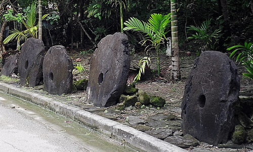

منذ أن طفت قضية **Bitcoin** إلى السطح من جديد وأنا أرغب في كتابة شيء مبسط عنها، تناقشت مع [وليد](https://www.it-scoop.com/author/dzgeek/)  حول الأمر لنرى أينا سيكتب عن الأمر لكن التعقيدات التقنية التي ترافق هذه العملة المشفرة دفعت كلانا إلى إرجاء الأمر، إلى أن قرأت مؤخرا مقالين نُشرا على منصة Medium والتي تشرح بشكل مُبسط دون الخوض في أي من تعقيدات تشفير هذه العملة. سأحاول في هذا المقال استعراض زبدة الموضوعين لتبسيط فهم مبدأ عمل هذه العملة على من التبس عليه الأمر (لا تقلق التبس الأمر على الجميع، حتى من كان يُكثر الحديث حولها :) ).

لشرح آلية عمل Bitcoin يقوم كاتب المقال الأول والذي عنونه بـ "[كيف تشرح Bitcoin لرجل الشارع العادي](https://medium.com/future-of-currency/c817c0659b10)" بالعودة بنا إلى عصر أبعد ما يكون عن التشفير وسراديبه المعقدة، وتحديدا إلى [Yap](http://en.wikipedia.org/wiki/Yap) الواقعة في جنوب المحيط الهادي والمتكونة من أربع جزر. بحكم أن هذه الجزر لم تحتو على أي من المعادن النفيسة التي يُمكن الاعتماد عليها كقاعدة للمعاملات المالية مثلما كان عليه الحال مع باقي الأمم اكتشف سكان هذه الجزر نوعا من الأحجار الكلسية في مجموعة جزر تبعد عنها بحوالي 250 ميلا، وبحكم البعد الجغرافي لهذا المكان وعدم توفر هذا النوع من الأحجار على جرز Yap تم اعتمادها كقاعدة للتبادل التجاري. يقوم زعماء القبائل هناك بتنظيم رحلات ما بين الحين والآخر لجلب بعض الأحجار المنحوتة على شكل أقراص والتي يترواح حجمها ما بين الصغيرة التي لا يتجاوز طولها الإنش الواحد والتي يصل طولها إلى 12 قدما، يحصل زعيم كل قبيلة على 40% من الأحجار التي تم جمعها ويوزع الباقي على أعضاء الرحلة.

<!-- more -->

بحكم أن الأحجار الكبيرة صعبة النقل من مكان إلى آخر، فإنه -وبدل نقلها من منزل المشتري إلى منزل البائع (أو إلى منزل المُهدى إليه في حال قام مثلا زعيم قبيلة بإرسال هدية إلى زعيم قبيلة أُخرى)- يتم التفاهم بأن هذا الحجر هو ملك الشخص الفلاني أو زعيم القبيلة العلانية دون الحاجة إلى نقلها. إلى هنا يبدو الأمر بسيطا، لكن في بعض الأحيان يفقد أعضاء الرحلات الاستكشافية بعض الأحجار الكبيرة التي حصلوا عليها بسبب العواصف مثلا، أحجار يُفترض بها أن تُصبح ملكا لزعيم القبيلة. لما يرجع أعضاء الرحلة الاستكشافية إلى قبيلتهم، يتم إعلام الزعيم بذلك، ويتم التفاهم على أن ذاك الحجر هو ملك الزعيم. بعبارة أخرى **لا يهم نقل الحجر فقط من مكان إلى آخر فحسب، بل لا يهم أن يعلم أحد بمكان تواجده بشكل دقيق، كل ما يُهم أن يتفاهم الجميع على أن الحجر الفلاني ذي الحجم العلاني، هو ملك لشخص مُعين**.

لتلخيص الأمر، "النظام البنكي" لجزر Yap كان مبنيا حول زعماء مجموعة من القبائل والذين يملكون الحصة الأكبر من العملة التي تتمثل في مجموعة أحجار قرصية الشكل تتختلف أحجامها وقيمها تباعا لتلك الأحجام، ولا حاجة لنقل الأحجار الكبيرة من مكان إلى آخر، بل كل ما يحتاجه هذا النظام ليعمل بشكل جيد هو أن يعلم الجميع أي حجر يملكه أي زعيم قبيلة.

الأمر مماثل بشكل قد يصل إلى التطابق مع عملة Bitcoin، حيث أنه وبدل استعمال مادة نادرة والمتمثلة في الأحجار الكلسية في المثال الأول، تعتمد Bitcoin على مجموعة من الأرقام التي تملك خواصا مُعينة، هذه الخواص متوفرة في مجموعة نادرة من الأرقام والتي يصعب إيجادها، لكن بمجرد إيجادها يمكن التحقق من أنها فعلا تملك تلك الخواص (تماما مثلما يُمكن لسكان جزر Yap التحقق من أن الأحجار المعروضة لهم متكونة فعلا من نفس مكونات أحجارهم الكلسية)، وبدل القيام برحلات لجلب تلك الأحجار من جزر بعيدة، يتم اكتشاف تلك الأرقام بتشغيل برامج تقوم بالبحث والتنقيب المتواصل عنها، وبمجرد إيجادك لتلك الأرقام تصبح ملكا لك (لن تدفع 40% منها لأي كان) وسيتم إعلام الجميع في شبكة Bitcoin بأنه تم إيجاد ذلك الرقم وبأنه ملك لك، إلا أن الاختلاف مع أحجار Yap  هو السرية التي تحيط بالأمر، فبدل أن يُقال بأن الرقم كذا وكذا هو ملك سعيد ابن أبيه مثلا، سيتم ربط الأرقام التي تم إيجادها بمفاتيح تشفير خاصة ، ومالك تلك المفاتيح هو الذي يقدر على التحكم في تلك الأرقام.

وتماما مثلما يحدث على جزيرة Yap ولدى تحويل بعض الـ Bitcoins من حساب إلى آخر فإنه لا يتم إرسال تلك الـ Coins بل يتم إعلام الجميع بأن المالك الجديد لها هو صاحب مفتاح التشفير المُعين. وهنا يكمن السبب وراء اهتمام وسائل الإعلام بهذه العملة حيث أنها توفر مستوى عاليا من "الغفلية" anonymity (إن كانت لديك ترجمة أفضل لهذا المصطلح فأعملني به في تعليقك) لكل مستخدم، كما أنه لا يُمكن لأي جهة حكومية التحكم في سيرها حيث أنها عملة لا تقوم على مبدأ الثقة كما هو عليه الحال مع العملات الحالية، بل العكس تمام، فـBitcoin تقوم على مبدأ عدم الثقة بأية جهة وتشارك البيانات حول جميع الأموال المتوفرة مع الجميع.

مثال آخر يشرح بشكل أكثر تبسيطا (وربما أكثر سطحية) مبدأ عمل هذه العملة، والذي عنونه صاحبه بـ "[كيف تشرح Bitcoin لطفل في السابعة من عمره](https://medium.com/future-of-currency/a9a8c094feaf)"، والذي يأتي على النحو التالي:

لنفرض مثلا وجود غرفة يُمكن للجميع الدخول إليها لكنها محروسة بكاميرات مراقبة يُمكن لأي كان مشاهدة ما تُصور كما أنها تحفظ ما يتم تصويره إلى الأبد. تحتوي هذه الغرفة على حصالات (piggy banks) مصنوعة من بلاستيك شفاف تُمكن الجميع من رؤية أي قطع نقدية (Coins) موجودة في أية حصالة، إلا أنه لا يُمكن إخراج هذه الحصالات خارج الغرفة، كما يملك كل شخص يدخل إلى هذه الغرفة حصالة خاصة به.

كلما أراد شخص ما شراء شيء ما باستخدام ماله الموجود في حصالته، سيقوم البائع بإعلام المشتري أي تقع حصالته، وكل ما على المشتري فعله هو أن يدخل إلى تلك الغرفة متخفيا وراء قناع يخفي وجهه، ومن ثم يقوم بفتح حصالته باستخدام مفتاحه الخاص وتحويل بعض من ماله إلى حصالة البائع، ومن ثم يترك الغرفة. ما الذي حصل الآن؟ أصبحت معروفا لدى الجميع (كل من يشاهد تسجيلات كاميرات المراقبة) بأن جزءا من مالك تم تحويله إلى حصالة البائع، وهو ما يحصل مع جميع المعاملات التي تحصل في تلك الغرفة، يعني يعلم الجميع تاريخ كل قطعة نقدية وإلى أية حصالة تنتمي.

لكن من أين يتم الحصول على تلك القطع النقدية؟ لتبسيط الفكرة، يفرض هذا المثال بأن هناك روبوتا يقوم بسحب (lottery) على الحصالات الموجودة في الغرفة ومن ثم الوضع في إحداها مجموعة من القطع النقدية، سابقا كان من السهل الحصول على تلك القطع النقدية بما أن عدد الحصالات كان قليلا، لكن الأمر تغير بعد أن زاد الاهتمام بتلك الغرفة وأنشأ الكثيرون حصالات لهم فيها.

لا يُمكن لأي كان أن يدخل عملات أو قطع نقدية مزيفة إلى حصالته لأن كل قطعة نقدية تملك تاريخا مفصلا يعرفه جميع من يشاهد تسجيلات كاميرات المراقبة، يُمكن للجميع معرفة أن تلك القطع النقدية المزيفة لم يقم الروبوت سابق الذكر بتوزيعها.

يختتم المثال الثاني بسؤال حول هوية صانع ذلك الروبوت، تبقى هوية مُبدع عملة Bitcoin مجهولة حيث يختفي وراء الاسم المستعار **Satoshi Nakamoto** والذي يوحي بأنه ياباني الجنسية، إلا أن بعض المقالات التي تتحدث حول الأمر تُشكك في ذلك كون أول وثيقة نُشرت حول Bitcoin استعملت لغة انجليزية عالية المستوى، ويُرجح أن يكون كاتبها انجليزيا.

هل زال الغموض حول عملة Bitcoin بعد قراءتك لهذين المثالين؟
