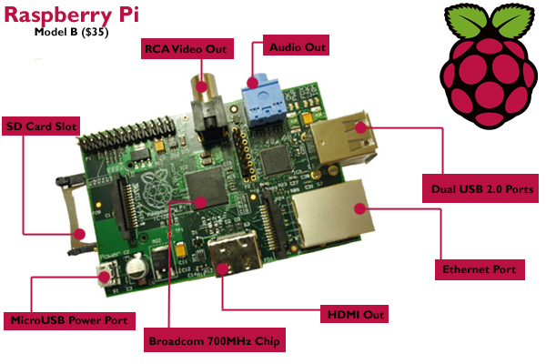

أطلق مشروع **Fedora** الراعي لتوزيعة لينُكس الحاملة لنفس الاسم نسخة من هذه التوزيعة موجهة خصيصا لأجهزة  **Raspberry Pi** أطلقت عليها اسم **Pidora Remix**.

بداية، ماهي Raspberry Pi ؟ هي أجهزة حواسيب صغيرة الحجم (كحجم بطاقة الائتمان) بسعر 25 أو 35 دولاراً حسب المواصفات المطلوبة، وقبل أن تسأل، هي بدون شاشات ولا   لوحة مفاتيح ولا شيء آخر، فقط لوحة أم عليها عقل الحاسوب، ذاكرته، منفذ USB -أو اثنان- ، منفذ للشاشة وقد يتواجد آخر للإترنت. يأتي  بمواصفات متواضعة لكن كافية وتفي بغرضها المتمثل أساسا في الترويج لعلم الحاسوب ومساعدة المدرسين في الجامعات أو حتى الأطفال وغيرهم، كذلك في توفير حلول حوسبة منخفضة التكاليف تُحاكي عمل الحواسيب المكتبية العادية وتُجاريها بأبحاث تصب في هذا الهدف وتدفع بعجلة تطوير أداء الالتكونيات المصغرة ومعالجات الـ ARM وزيادة الاعتماد عليها وتوفير الحلول البرمجية لها، بدءًا من أنظمة التشغيل، ومنه خبرنا هذا من نصيب مشروع Fedora الذي أطلق نظاما موجه خصيصيا لأجهزة Raspberry Pi سمّاه Pidora.

Pidora نظام مصغَر من Fedora Remix تم تجميعه خصيصا لمعماريات ARM بما في ذلك رزم -packages- البرامج التي يحويها النظام، وحدات Python خاصة بجهاز Raspberry Pi ومكتبات أصيلة -native- مع توفير أدوات خاصة تسمح بالوصول والتخاطب مع وحدات وقطع الجهاز. ثم فوق هذا، يأتي النظام بواجهة سطح المكتبة XFCE الخفيفة.

يتم تنصيب النظام عبر شرائح الذاكرة  SD Cards وهو متوفر للتحميل المجاني عبر[ موقع النظام الرسمي](http://www.pidora.ca/).

ليست Fedora بالسبَّاقة لهذا الأمر، فقد سبق وأن أطلق مشروع Debian نظام [Raspbian](http://www.raspbian.org/)، وكذلك توزيعة Arch Linux نظام [Arch Linux Arm](http://archlinuxarm.org/) وهما النظامان المدعومان [بشكل رسمي](http://www.raspberrypi.org/downloads) من طرف مشروع Raspberry Pi.

هل ترى مستقبلا لهذه الأجهزة في أي من المجالات؟

هل تنوي شراء Raspberry Pi والتجريب عليه؟

ما رأيك باقتراح أجهزة Raspberry Pi على جامعتك في كليات الالكترونيات والأجهزة المضمنة أو كليات علم الحاسوب؟
