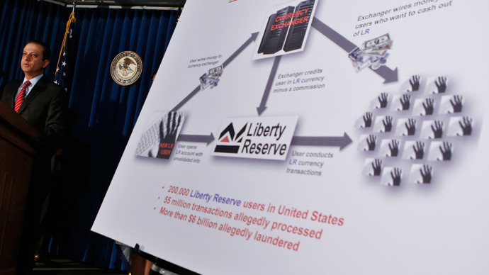
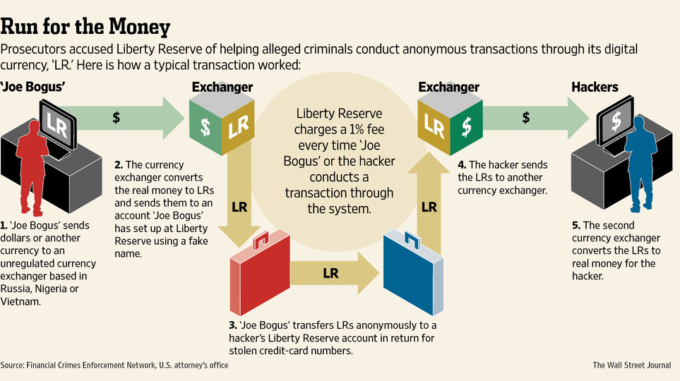

أعلن قضاء نيويورك عن تعطيله لشبكة العُملة الافتراضية **Liberty Reserve** وإصداره مذكرات للقبض على سبعة من مسؤوليها بتُهمة تبييض ما لا يقل عن 6 ملايير دولار خلال السنوات السبعة التي تُمثل عُمر هذه الشبكة، في حين وُصفت العملية بأنها الأكبر في التاريخ ضد عمليات تبييض/غسيل الأموال والتي شملت 17 بلدًا.

بداية ما هي Liberty Reserve وما مبدأ عملها؟ Liberty Reserve هي شركة خاضعة لقوانين دولة كوستا ريكا، توفر شبكة للتحويل المالي الإلكتروني التي تستخدم عُملة تحمل نفس الاسم (Liberty Reserve أو LR اختصارا)، سمحت هذه الخدمة لمستخدميها الذين تجاوز عددهم المليون (خُمسهم في الولايات المُتحدة) بإرسال واستقبال أموال بمجهولية (anonymity) ومن دون الخضوع إلى أية قوانين أو مُحاسبة، وتقتطع الشبكة نسبة صغيرة جدا على كل عملية تحويل لا تتجاوز 1% وهو ما جعلها قبلة مُفضلة –حسب القضاء الأمريكي- لكل عمليات تبييض الأموال أو العمليات الإجرامية على الإنترنت خاصة ما تعلق منها بسرقة بيانات البطاقات الإئتمانية وبطاقات الهوية، التطبيقات المُقرصنة وغيرها.

<!-- more -->

حسب [جريدة Le Monde الفرنسية](http://www.lemonde.fr/economie/article/2013/05/29/le-site-de-paiement-en-ligne-liberty-reserve-accuse-de-blanchiment_3419963_3234.html) فإن الخدمة أضافت طبقة من التعقيد على خدمتها لتصعيب مهمة متابعة العمليات التي تتم عليها حيث أنه لا تسمح بتعبئة الأرصدة مباشرة على موقع الخدمة بل تطلب من المستخدمين المرور عبر مواقع خاصة بذلك والتي يمكلها بعض ممن تم توجيه التهم إليهم في هذه القضية.

هناك –كما سبق ذكره- عاملان جعلا من Liberty Reserve قبلة للباحثين على وسائل للدفع الإلكتروني على الإنترنت، ويتعلق الأمر بالرسوم المنخفضة المُطبقة على كل عملية تحويل والتي لا تتجاوز 1% [إضافة إلى 75 سنتا](http://online.wsj.com/article/SB10001424127887323855804578511121238052256.html?mod=business_newsreel) لحماية الخصوصيةـ حيث يتم إخفاء رقم حساب المستخدم مما يجعل عملية التحويل غير قابلة للتتبع، مقابل 1.4 إلى 3.4% على Paypal مثلا، وهذا ما دفع ليس بالمنخرطين في عمليات إجرامية على الإنترنت فحسب باستخدامها بل حتى المستخدمين العاديين الذين يُهمهم تقليل الرسوم التي يدفعونها مقابل الخدمات الإلكترونية. أما العامل الثاني فهو عدم اهتمام الموقع بالتحقق من هويات الحسابات الجديد، حيث يكفي استخدام اسم مستخدم وعنوان بريد إلكتروني فقط لإنشاء حسابات عليها، حسابات لا يتم إيقافها حتى ولو أعلن أصحابها صراحة بأنهم ينوون استخدامها في عمليات غير قانونية (كبيع المخدرات مثلا)، هو ما لا نجده على خدمات أخرى، فعلى سبيل المثال تحتاج Paypal إلى التحقق من هوية مستخدميها وهو ما يتم عبر ربط حساباتهم على هذه المنصة بحساباتهم البنكية.

بما أن Liberty Reserve ليست الوحيدة على الساحة، وبعد ما حدث لها مؤخرا، قرر بعض منافسيها وخاصة WebMoney و Perfect Money إيقاف التسجيلات القادمة من الولايات المتحدة لتجنب أية تبعات مماثلة قد تحدث لهم.

لكن هل يُمكن اعتبار إيقاف Liberty Reserve بداية حرب طويلة الأمد تخوضها الإدارة الأمريكية ضد العملات الافتراضية بشكل عام وضد [Bitcoin](https://www.it-scoop.com/2013/05/bitcoin/) بشكل خاص؟ هناك من يرى ذلك خاصة وأن السلطات الأمريكية خاضت "أولى معاركها" ضد Bitcoin منذ أيام فقط، حيث أنها قامت [بحجز حسابات](http://www.forbes.com/sites/petercohan/2013/05/29/after-liberty-reserve-shut-down-is-bitcoin-next/) تابعة لـ Mutum Sigillum وسيط منصة Mt. Gox اليابانية الخاصة بتداول عملة Bitcoin والتي تتحكم في 80% من عمليات تداول هذه العُملة. كما أنها قامت [بإيقاف جميع العمليات التي تتم على هذه المنصة باستخدام منصة الدفع الإلكتروني الأمريكية Dwolla](http://siliconangle.com/blog/2013/05/15/bitcoining-just-got-a-bit-more-complicated-no-thanks-to-dwolla/). إلا أن Patrick Murck المستشار القانوني لمؤسسة بيت كوين (Bitcoin Foundation) بأنه تجب قراءة عملية Liberty Reserve على أنها مُجرد تحذير لمنصات تبادل Bitcoin غير القانونية.

على خلاف Liberty Reserve التي تتسم بقدر كبير جدا من المجهولية يصل إلى حد المجهولية التامة[، تبقى مسألة تتبع عمليات تحويل الأموال عبر Bitcoin مُمكنة](http://bits.blogs.nytimes.com/2013/05/29/bitcoin-is-not-anonymous-but-it-could-be/) تقنيا وذلك بالرغم من عدم التمكن من معرفة هوية أصحابها بشكل مُباشرة، إلا أنه أمر يُمكن حله لو يتم حفظ بيانات المشترين المستخدمين لهذه العُملة مع كل عملية. في المقابل نشر بعض الباحثين الأسبوع الماضي نتيجة عملهم حول إضافة لعملة Bitcoin أطلقوا عليها اسم [Zerocoin](http://spar.isi.jhu.edu/~mgreen/ZerocoinOakland.pdf) تجعل من مهمة تتبع هذه العملة أمرا مستحيلا، إلا أن الإضافة ستحتاج إلى أن يتقبلها مُجتمع هذه العملة لكي تحققها أهدافها، وهو ما قد يبدو مستبعدا بعض الشيء بسبب التعديلات التي يتطلبها الأمر، إضافة  القوة الحسابية الإضافية التي تحتاجها وطول مدة التحقق من العملية.

هل تتوقع أن تتعرض عُملة Bitcoin إلى مضايقات قانونية من طرف الإدارة الأمريكية؟ ما المستقبل الذي تتوقعه للعملت الإلكترونية بشكل عام ولهذه العُملة بشكل خاص.
