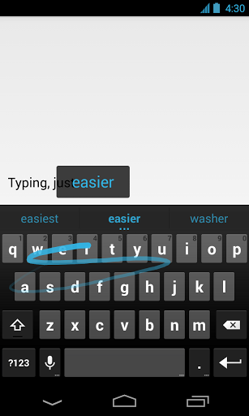

إن كنت مُستخدما لنظام **Android** وكنت مُتابعا لأخبار هذا النظام فإنك –ومن دون أي شك- قد سمعت بخبر إطلاق Google **للوحة مفاتيح نسخة 4.2 من نظام ****Android**** كتطبيق خاص على متجر ****Google Play**. دعونا أولا نستعرض الخواص التي يُوفرها هذا التطبيق، ما الذي يعنيه للتطبيقات المُنافسة، ولماذا تُعتبر هذه الخطوة في غاية الأهمية فيما يتعلق بُمستقبل نظام Android وطبيعته "المفتوحة" (نسبة إلى المصدر المفتوح) ككل.

من بين أهم خواص لوحة مفاتيح Google هو دعمها لخاصية "الكتابة بالإيماء" (Gesture Typing) حيث يكفي تحريك الإصبع من دون رفعه من حرف إلى آخر حتى يفهم التطبيق ما تقصده ويقوم بإكمال الكلمة بناء على الحرف التي يتوقف عندها الإصبع قبل الانتقال إلى الحرف الذي يليه. هذه الخاصية لوحدها ساهمت في نجاح العديد من لوحات المفاتيح مدفوعة الأجر على متجر Play مثيلات SwiftKey وSwype. تقوم لوحة المفاتيح أيضا باقتراح تكملات للكلمات التي يقوم المُستخدم بكتابتها (يعني تكفي كتابة الحروف الأولى لكلمة ما ليقترح التطبيق كلمات يُحتمل أن تكون المقصودة). بعد الفراغ من كتابة أية كلمة تُحاول لوحة المفاتيح التنبأ بالكلمة القادمة التي ينوي المُستخدم كتابتها، وهي خاصية في غاية القوة. كما يُوفر التطبيق خاصية الكتابة الإملائية (يعني يكفي أن يتكلم المُستخدم ويقوم التطبيق بتحويل ما يقول إلى نص مكتوب). كل هذه الخواص مُتوفرة بـ 26 لغة مختلفة.

كما نرى فإن التطبيق الذي سيتوفر بشكل تدريجي لجميع اللغات (حاليا يوفر التطبيق لوحة مفاتيح Qwerty فقط)  سيشكل تهديدا لأكثر من طرف. التهديد المُباشر سيكون للشركات التي توفر لوحات مفاتيح تجارية بنفس الخواص، وخاصة Swype وSwiftkey. أما التهديد غير المُباشر فسيكون للشركات التي تبني أجهزة بنُسخ مُعدلة من نظام Android والتي تُوفر لوحات مفاتيح خاصة بها. التهديد هنا (إن صحت تسميته بتهديد) لا يخص لوحات مفاتيحها بعينها، وإنما يخص تجربة المستخدم على هذه الأجهزة ككل.

من جديد، قد لا يُعتبر الأمر تهديدا لهذه الشركات بقدر ما سيعود بالنفع على المُستخدم، حيث أن إصدار لوحة المفاتيح هاته تندرج ضمن جهود Google لتوفير تجربة مُستخدم متماثلة على جميع الأجهزة التي تشتغل بـ Android مهما كان مُصنعها دون التأثير على طبيعة Android  المفتوحة، وهي الرسالة التي ظل Sundar Pichai المسؤول الجديد لـ Android لدى Google منذ أن عوض Andy Rubin على رأس هذا القسم.

لفهم الوضع بشكل أفضل دعونا نُلقي نظرة على تطبيقات Google والتي لم تعد جزءا من نظام Android [بل أصبحت مُتوفرة بشكل مُنفصل على متجر Google Play](http://blogs.computerworld.com/android/22295/google-deconstructing-android)      . ابحث على المتجر وستجد أن كلا من التطبيقات التالية أصبحت مستقلة بذواتها:

 	  * Gmail
 	  * Google Calendar
 	  * Chrome
 	  * Hangouts
 	  * YouTube
 	  * Google Search
 	  * Voice Search
 	  * Sound Search
 	  * Google Maps
 	  * Google Earth
 	  * Google+
 	  * Google Play Music
 	  * Books
 	  * Magazines
 	  * Google Currents
 	  * Google Wallet
 	  * Google Keyboard.

هذا من دون تطبيقات أخرى لم تكن يوما جزءا من النظام كـ Drive، Keep، Goggles وغيرها.

ما الذي يعنيه ذلك؟ هل تذكرون المقال "[كيف نجحت Google بصمت في احتلال جزء كبير من أراضي iPhone دون أن تحرك Apple ساكنا](https://www.it-scoop.com/2013/05/iphone-google-phone/)"، يُمكن القول بأن Google تقوم بنفس الأمر هنا، حيث أنها تُحاول الآن استرجاع ما احتلته الشركات المُصنعة للهواتف والأجهزة اللوحية من أراضي Android دون أن تُحرك هذه الشركات ساكنا، حيث أنه سيصبح بإمكانها –بعد أن تُكمل فصل جميع تطبيقات Android الرئيسية من النظام- أن تُوفر نفس تجربة المُستخدم للجميع بغض النظر عن الجهاز الذي يستعملونه. قد يحتاج الأمر إلى جهد إضافي من طرف المُستخدم، لكن من المُحتمل جدا أن تعمل Google على تسهيله عليه، لكن في كل الأحوال لن يكون بنفس التعقيدات التي يتطلبها تنصيب نسخة مُعدلة من نظام Android على الهاتف للتخلص من الطبقة الإضافية لهاته الشركات.

ما التطبيقات التي [ينبغي لـ Google فصلها عن النظام](http://blogs.computerworld.com/android/22295/google-deconstructing-android)؟ لم يبق سوى تطبيق الكاميرا، Gallery وتطبيق People إضافة إلى تطبيق آخر في غاية الأهمية (وقد يكون آخر تطبيق ستقوم Google بتوفيره بشكل منفصل) وهو Launcher.

سيكون لتأثير Launcher الخاص بـ Google لما ستقوم بإطلاقه (يعني الأمر ليس محل شك وإنما مجرد مسألة وقت فقط) على عالم Android قويا بنفس القوة التي أرادتها [فيس بوك للـ Launcher الخاص بها (Facebook Home)](https://www.it-scoop.com/2013/04/facebook-home-android/)، وستستعيد Google من خلاله ما احتلته Samsung، HTC وغيرها من أراضي Android، وسيصبح بالإمكان حينها الرجوع إلى نظام Android بُنكهة Google (أو بالأحرى من دون أية نكهات) بُمجرد تنصيب تطبيق واحد فقط.

تجدر الإشارة إلى أن Google قد تفاهمت مع كل من Samsung وHTC لتوفير أحدث أجهزتها ([Galaxy S4](http://mashable.com/2013/05/15/unlocked-samsung-galaxy-s-4/) و[HTC One](http://mashable.com/2013/05/30/htc-one-nexus/)) من دون أي طبقات/نكهات إضافية.

في رأيك، هل ستُوفق Google في مساعيها لاسترجاع ما أُخِذ منها؟ وكيف ستكون ردة فعل الشركات المُصنعة للأجهزة التي تعمل بنظام Android؟

[صفحة التطبيق على متجر Google Play](https://play.google.com/store/apps/details?id=com.google.android.inputmethod.latin)
