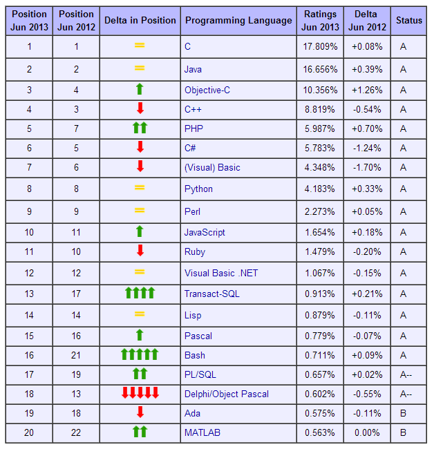

نشرت **[Tiobe](https://www.it-scoop.com/tag/tiobe/)** ترتيبها الشهري **للغات البرمجة الأكثر شعبية** والتي كشفت عن تغييرات في قائمة Top 10، في حين حافظت لغة C على صدارتها.

أهم "حدث" في ترتيب Tiobe في هذا الشهر هو رجوع لغة **JavaScript** إلى قائمة لغات البرمجة العشرة الأكثر شعبية. يُشير [التقرير](http://www.tiobe.com/index.php/content/paperinfo/tpci/index.html) بأنه من الغريب أن تبقى لغة JavaScript خارج قائمة Top 5 وهذا بالرغم من كل الحديث الذي يدور حول هذه اللغة، ، إلا أنه من المُحتمل أن يرتفع ترتيبها لاحقا بفضل **node.js** والتي جعلت من لغة JavaScript لغة تُكتب بها تطبيقات جهة الخادوم أيضا Server-side.

وفي رسالة وجهها إلى [Info World](http://www.infoworld.com/t/javascript/javascript-claws-back-top-10-programming-languages-220459)، يُشير Paul Jansen مدير Tiobe بأنه من المُحتمل أن يكون السبب الذي يقف وراء "قلة شعبية" لغة JavaScript هو كونها لغة ثانوية في مشاريع الويب، حيث أنها دائما ما تُقرن بلغات أخرى، حيث تُستعمل عادة في جهة المُستخدم من التطبيق client-side في حين يكون باقي التطبيق الأهم والذي يقع من جهة الخادوم من التطبيق مكتوبة بلغة أخرى كـ PHP.

يُسلط التقرير الضوء على الأخطار التي قد تهدد مُستقبل لغة JavaScript، فعلى سبيل المثال يُنظر إليها بأنها لُغة يسهُل ارتكاب أخطاء لدى استخدامها، وبما أنها لُغة مُفسرة فإن أغلب الأخطاء لا تظهر سوى لدى تنفيذ شفراتها، وهو ما دفع بـ Google مثلا إلى إطلاق لغة [Dart](https://www.it-scoop.com/tag/Dart/) التي يُراد منها استبدال JavaScript والتي تحل حاليا في المرتبة 80. كما أن هناك لغات أُخرى تقوم بتوليد شفرات JavaScript بدل كتابتها يدويا، ويتعلق الأمر بكل من CoffeeScript التي حلت في المرتبة 139 و TypeScript التي حلت في المرتبة 207.

على الجانب، هناك خطر آخر قد يهدد لغة JavaScript لم يُشر التقرير إليه وهو شروع إطار عمل مثل Angular.js في توفير [نسخة منه تعمل بلغة Dart](https://github.com/angular/angular.dart)، مما يجعل من مهمة انتقال مُطوري التطبيقات المبنية بأطر العمل التي تعتمد هذه الثنائية إلى Dart عملية في غاية السهولة.

أما لغة PHP فلقد تقدمت قليلا في ترتيب هذا الشهر، حيث أنها حلت خامسا مُقابل حلولها سابعا في ترتيب نفس الشهر من العام الفارط، مُشكّلة بذلك قائمة الـ TOP5 بمعية كل من C التي حلت أولا وتبعتها في الترتيب كل من Java، Objective-C وC++.

للتذكير، فإن ترتيب Tiobe لا يعكس مدى انتشار/ استعمال لغات البرمجة، وإنما يدرس مدى شعبيتها، حيث يعتمد على عدة مصادر، كنتائج محركات البحث المختلفة، الفيديوهات التي تنشر على Youtube، الكتب التي تباع على Amazon، موسوعة Wikipedia وغيرها.

في رأيك، هل تتوقع عودة JavaScript من جديد ودخولها إلى حلقة Top5؟ وهل تتوقع أن تنجح لغات أخرى كـ Dart في استبدالها (خاصة وأنها مدعومة من Google)؟

