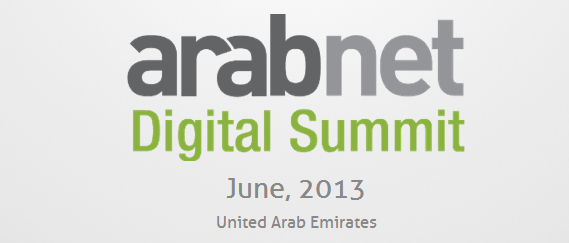

الإمارات العربية المتحدة تستقطب 49٪ من مجمل الاستثمارات في الشركات الناشئة الآن في الشرق الأوسط والشركات المسجلة في مدينة دبي للإنترنت حققت نموا بنسبة 15٪

تزدهر منطقة الشرق الأوسط وشمال أفريقيا وسط ثورة للتكنولوجيا المتطورة، ودولة الإمارات العربية المتحدة تعبّد الطريق إلى الابتكار. "ما يقرب من نصف إجمالي الاستثمارات في الشركات الناشئة في المنطقة تأتي الى الإمارات العربية المتحدة، وهذا الرقم هائل. هذا النمو في الفرص هو السبب الرئيسي الذي دفعنا الى إدراج "منصة الشركات الرقمية" ضمن برنامج قمة عرب نت الرقمية في دبي. فهي مصممة لتكون المنصة الأولى في المنطقة لنمو الشركات الرقمية الفتيّة والتي تتطلع إلى التوسع في أسواق جديدة" وفقاَ للمؤسس والرئيس التنفيذي لعرب نت، عمر كريستيديس.

تم تصميم "منصة عرب نت الرقمية" تحديداً للشركات الرقمية الفتيّة والتي لديها منتجات أو خدمات قائمة في أسواقها المحلية. وتعتبر من أبرز مميزات قمة عرب نت الرقمية المزمع عقدها بين 24 و26 يونيو في فندق اتلانتس، النخلة، دبي. حيث توفر هذه المنصة للشركات فرصة لعرض أعمالها وتسليط الضوء على أحدث منتجاتها، إلى جانب التواصل الفردي مع الزبائن ووسائل الاعلام ومدراء التسويق ومشغلي الاتصالات والبنوك ومؤسسات الدفع وغيرها من الشركاء والعملاء الاستراتيجيين. كما توفر هذه المنصة للمؤسسات المشاركة فرصة للقاء المستثمرين النافذين مما سيساعدهم على النهوض بمؤسساتهم والدفع بها الي مراحل متقدمة من النمو. وقد شهدت السنوات القليلة الماضية زيادة في تدفق الاستثمارات في مجال التكنولوجيا إلى منطقة الشرق الأوسط، وخاصة إلى دولة الإمارات العربية المتحدة.

صرح كريستيديس قائلا: "تأمل عرب نت في إشراك أكبر عدد ممكن من الشركات ضمن المنصة الرقمية" .

أظهر تقرير صدر مؤخراً من "سندباد للأعمال" أن المبلغ الإجمالي للاستثمار في الإنترنت والتكنولوجيا في دولة الإمارات العربية المتحدة للأعوام 2011 و2012 تجاوز 74 مليون دولار، وهو أكثر من مجموع تدفق الاستثمار إلى الأردن والمملكة العربية السعودية ومصر ولبنان والمغرب مجتمعة.

الجيل الرقمي العربي الملم بأمور التكنولوجيا والذي ولد بين عامي 1977 و1997، يمثل 40٪ من سكان المنطقة ويشكل شريحة متميزة اقتصادياً واجتماعياً وسياسياً. وينعكس تعطش هؤلاء الشباب لخوض المعركة الرقمية من خلال نسبة الزيادة في اختراق الهواتف الذكية في دول مجلس التعاون الخليجي والتي بلغت 60٪ خلال السنة الماضية. وطبقاً لهذا الإقبال المتزايد على التكنولوجيا، فإن معظم الشركات الإقليمية باتت تخصص حوالي 22٪ من ميزانياتها التسويقية للتكنولوجيا الرقمية، كما زادت ميزانيات الشركات للتسويق الرقمي هذا العام لتصل الى 58٪.

<!-- more -->

 تنعقد قمة عرب نت الرقمية، أكبر تجمع سنوي لروّاد ورجال الأعمال في القطاع الرقمي في العالم العربي، بين 24 و26 يونيو في فندق الاتلانتس، النخلة، دبي. لدعم هذه التظاهرة التكنولوجية ستجمع قمة عرب نت الرقمية أكثر من 800 من الخبراء والمستثمرين وقادة الصناعة الرقمية في قلب المجتمع الرقمي العربي. وقد قال عمر كريستيديس المؤسس والرئيس التنفيذي لعرب نت "عندما ترغب في استضافة حدث بهذه الضخامة لا بد أن تذهب إلى مركز ازدهار الأعمال الرقمية في المنطقة، ولهذا السبب تم اختيار دبي". وبالفعل، فقد استقطبت دبي الشركات الرقمية الإقليمية ومتعددة الجنسيات لأكثر من عقد من الزمن، فمنذ افتتاح مدينة دبي للإنترنت في عام 2000، اتجهت الشركات من جميع أنحاء العالم إلى دبي لتساهم في ازدهار المنطقة. تعد جوجل ومايكروسوفت ولينكدإن ومؤخراً فيس بوك من بين 1400 شركة مسجلة حالياً في مدينة دبي للإنترنت. ويتزايد هذا العدد بنحو 15٪ سنوياً، كما أن أكثر من 25٪ من الشركات خلال العام الماضي كانت من شركات وسائل الاعلام الاجتماعي.

يمكنكم التسجيل للقمة على [www.arabnet.me](http://www.arabnet.me/)

لمحة عن عرب نت:

عرب نت هو ملتقى محترفي الحقل الرقمي ورواد الأعمال العرب كي يتواصلوا ويتعلموا. ينظم عرب نت عدة مؤتمرات في المنطقة تهدف لتنمية قطاع الويب وإنشاء شركات رقمية جديدة. ، يعقد عرب نت مؤتمرًا دوليًا (قمة عرب نت – التحول الرقمي)، والذي يُعرف بأنه من أهم الأحداث التي تتناول قطاعيّ الويب والموبايل في الشرق الأوسط. بالإضافة لمجموعة مؤتمرات تخصصية في مجال القطاع الرقمي و تطوره في العالم العربي . كما يجدر بالذكر أن مسابقتيها ماراثون الأفكار و عرض الشركات الناشئة حصدتا نجاحاً كبيراً وذلك لدورهما الهام في ربط رياديي الأعمال.
