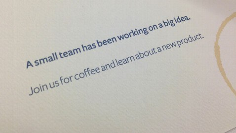

بعد أن قررت Google إيقاف خدمتها **Reader** مع بداية الشهر القادم، طفت إلى السطح العديد من الشركات الناشئة التي تسعى إلى فرض نفسها كبديل لهذه الخدمة، وبعد كل من Feedly وDigg تتجه الأنظار هذه المرة نحو **فيس بوك** من المُحتمل أن تطلق حلها الخاص لخلاصات **RSS** بحر هذا الأسبوع.

أول إشارة إلى إمكانية إطلاق فيس بوك لتطبيق خاص بـ RSS يعود إلى [اكتشاف أحد المُبرمجين](http://tom.waddington.me/blog/2013/06/13/facebook-rss-to-replace-google-reader/) إلى إشارة إلى rssfeeds في الواجهة البرمجية لـ Graph الخاصة بفيس بوك، إلا أن المُطور الذي اكتشف الأمر لم يستطع قراءة الخلاصات باستخدامه لهذه الواجهة البرمجية حيث حصل على رسالة خطأ تُعلمه بأن الخاصية مُتاحة حاليا لمجموعة من عناوين IP فقط.

ثم عاد الحديث حول الأمر أمس لما قامت فيس بوك بإرسال دعوات "ورقية" لحضور مؤتمر لها خلال هذا الأسبوع، واكتفت بالإشارة إلى أنه يتعلق بـ <del>Big Data  </del>فكرة كبيرة Big Idea .ويرى Josh Constine الذي [كتب حول الأمر على TechCrunch](http://techcrunch.com/2013/06/14/facebook-reader/) بأن الدعوة في حد ذاتها تحتوي إشارة غير مُباشرة إلى أمر يتعلق بـ RSS حيث يرى بأن آثار فنجان القهوة التي ظهرت على الدعوة نجدها عادة على الجرائد والأخبار التي نقرأها لدى ارتشافنا لتلك القهوة، وربط الأمر باحتمال إطلاق الشبكة لخدمة RSS.

كاتبة أخرى على TechCrunch [ترى](http://techcrunch.com/2013/06/13/api-code-could-point-to-facebook-building-an-rss-reader/) بأن الإشارة إلى rss التي تم اكتشافها في واجهة فيس بوك البرمجية قد لا يكون لها علاقة مُباشرة بالـ RSS وإنما بمشروع آخر، ويتعلق الأمر بتحديث لخاصية notes التي تسمح بكتابة شبه مقالات على فيس بوك وليس مُجرد تحديثات، وهو تحديث –إن تم- من شأنه أن يُنظر إليه على أنه [مُحاولة لمنافسة Tumblr](http://techcrunch.com/2013/05/27/facebook-blogs/).

أيا كان الأمر الذي ستكشف عنه فيس بوك خلال هذا الأسبوع فإنه سيصب في خانة إبقاء المُستخدم لأطول فترة مُمكنة على الشبكة، فإن كان ما ستكشف عنه فيس بوك هو قارئ RSS فإن من شأن ذلك أن يبقي المُستخدم لفترة أطول على الموقع لاستهلاك كل تلك المقالات التي يود قراءتها، رغم أنه يُمكن استبعاد ذلك لإمكانية أن يتعارض ذلك مع مصالح المواقع التي تنشر محتوياتها على شاكلة خلاصات RSS على صفحاتها على فيس بوك. أما لو كان الأمر متعلقا بتحديث لـ notes يجعلها أقرب ما تكون من منصة تدوين (على شاكلة Tumblr) فهذا سيجعل فيس بوك شبكة لإنتاج المحتوى أيضا بدل مجرد استهلاكه، وستتيح rss التي تم اكتشافها في الواجهة البرمجية إلى متابعة مختلف التدوينات.

<del>ما علاقة كل هذا بـ Big data</del> ما الفكرة الكبيرة التي ستكشف عنها فيس بوك؟ الإجابة سنحصل عليها يوم 20 يونيو الجاري تاريخ عقد مؤتمر فيس بوك المنتظر.

ما الذي تتوقع أن تقوم فيس بوك بإطلاقه خلال هذا المؤتمر؟
