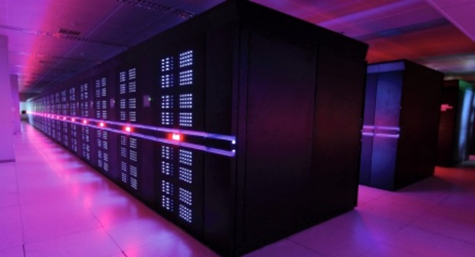

كشف ترتيب **Top500** الذي يُعنى بأسرع **الحواسيب الخارقة****Supercomputer**** **في العالم عن استرجاع الصين لصدارتها التي فقدتها مؤخرا بفضل حاسوبها الخارق الجديد **Tianhe-2** والذي تُقدر سرعته بـ **33.86 بيتافلوب** (بيتافلوب =1000 تريليون عملية) في الثانية.

الحاسب الخارق Tianhe-2 والذي تم تطويره في الجامعة الوطنية للتكنولوجيا والدفاع الصينية يُعتبر أقوى بكثير من أقرب منافسيه، حيث تقارب سُرعته ضعف سرعة حاسوب Titan الأمريكي الذي أزاحه من على رأس الترتيب والذي تُقدر سرعته بـ 17.59 [بيتافلوب](http://en.wikipedia.org/wiki/FLOPS)، إلا أن الأمريكين لا يزالون يحتلون 5 مراكز في قائمة الحواسيب الخارقة العشرة الأكثر سرعة، وتملك الصين حاسوبين، وألمانيا حاسوبين، وتملك الحاسوب الباقي اليابان. أما في كامل قائمة الـ TOP500 فتملك أمريكا أكثر من نصفها (252 حاسوبا عل وجه التحديد) تلتها البلدان الآسيوية بمجموع 119 سابقة بذلك البلدان الأوروبية والتي تملك 112.

ويشير تقرير Top500 بأنم تم تصنيع أغلب مكونات حاسب  Tianhe-2 وعلى خلاف سابقيه  في الصين، ويتعلق الأمر بكل من نظام التشغيل، والتطبيقات ومعالجات front-end وآليات ربط المعالجات بعضها ببعض باستثناء المعالج الرئيسي والذي قامت بتصميمه Intel الأمريكية.

[تشير جريدة Le Monde الفرنسية](http://www.lemonde.fr/technologies/article/2013/06/18/le-plus-puissant-super-ordinateur-au-monde-est-chinois_3431798_651865.html) بأن الرقم القياسي الجديد الذي سجله حاسوب Tianhe-2 أثار حفيظة اليابانيين ، حيث حل أسرع حاسوب خارق لديهم والذي يُطلق عليه اسم K في المرتبة الرابعة، بعد أن حل أولا في يونيو 2011 مسجلا حينها رجوع اليابان إلى رأس الترتيب بعد غياب دام 7 سنوات (مند يونيو 2004)، ويرى اليابانيون بأن الصينيين يهتمون فقط بسرعة المعالج دون الاهتمام بمقدار الطاقة التي يحتاجها على عكسهم حيث أنهم يولون اهتماما كبيرا بذلك. كما أن الصحافة اليابانية ركزت على أن معالج Tianhe-2 موجه بشكل كبير لحساب مسارات الصواريخ الحربية أو لعمليات حساب عسكرية، في حين تركز اليابان على محاكات الكوارث الطبيعية ودراستها.

سيتم تشغيل حاسوب Tianhe-2 (أو Milky Way-2)  نهاية العام الجاري مركز الحواسيب الخارقة في مدينة قوانغتشو الصينية، ويعتبر الأمر مفاجئة لمتتبعي أخبار الحواسيب الخارقة حيث أن الصينيين وصلوا إلى هذه النتيجة قبل عامين من الوقت الذي خططوا فيه للوصول إليه.
