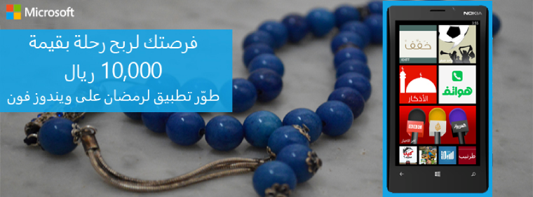

أطلق **الفرع السعودي لشركة ****Microsoft** مبادرة تهدف من شأنها إلى دفع المُطورين إلى الاهتمام أكثر بمنصة Windows Phone في المنطقة، حيث اغتمنت فرصة قروب رمضان لتكشف عن **مسابقتها لأفضل التطبيقات الرمضانية**.

المسابقة التي تقتصر على السعوديين والمقيمين في السعودية فقط تستهدف مطوري التطبيقات الإسلامية بشكل عام والتطبيقات الرمضانية بشكل خاص (يبدو هذا غريبا بعض الأمر، لكن ستقبل تطبيقات "الأكلات الرمضانية" في المسابقة أيضا)، حيث يكفي أن يقوم المطور برفع تطبيقه الذي قام بتطويره وإرسال رابطه إلى عنوان خاص بالمسابقة (ادخل إلى [صفحة المسابقة على فيس بوك](https://www.facebook.com/msSaudiCommunity?v=app_201965929950712) لمعرفة آلية الاتصال) للدخول في المسابقة.

لم يتم الكشف عن المعايير التي يتم اعتمادها لاختيار التطبيقات الفائزة، ولا عن لجنة التحكيم (والتي من المفترض أن تكون داخلية للشركة)، لكنه تم الكشف عن الجوائز التي تنتظر الفائزين، ويتعلق الأمر برحلة سفر بقيمة 10 آلاف ريال لشخصين، جهاز لوحي مجهز بنظام Windows8 وهاتف ذكي مُجهز بنظام Windows 8 أيضا.

آخر أجل لإرسال روابط التطبيقات المُشاركة هو الثاني من شهر أغسطس القادم.

[صفحة المسابقة على فيس بوك](https://www.facebook.com/msSaudiCommunity?v=app_201965929950712)
