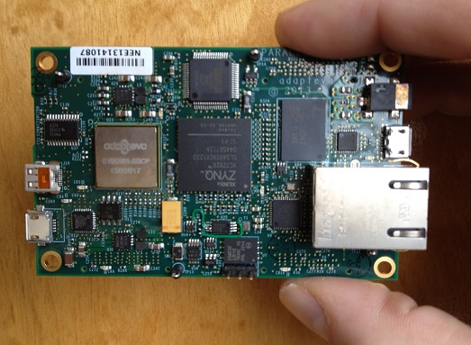

كل بضعة أشهر تطل علينا** لوحة تطوير جديدة** بمميزات مختلفة لتلائم كافة أطياف مجتمع المطورين والهواة على حد سواء، بدءاَ من Raspberry pi وليس انتهاء بـ BeagleBoard. اليوم سنتحدث عن لوحة جديدة، قد لا تكون حظيت بالاهتمام الذي تستحقه، والتي أُطلق عليها اسم **Parallela**

قبل نحو عام من الآن، ظهرت على شبكة kickstarter [حملة تحمل شعار "الحوسبة الخارقة للجميع"](http://www.kickstarter.com/projects/adapteva/parallella-a-supercomputer-for-everyone). المنتج عبارة عن لوحة  Parallela، تتكون بشكل أساسي من رقاقتين، الأولى تدعى Zynq والثانية Epiphany، وباستهلاك طاقة منخفض للغاية لا يتجاوز 5 واط، كل ذلك بسعر مناسب جداً يبلغ 99 دولار أمريكي. تفاصيل اللوحة بعد قليل.

المشروع ليس مجرد لوحة، بل هو يشمل اللوحة إضافة إلى حزمة تطوير البرمجيات (SDK)، عدا أن المشروع بأكمله **Open Hardware (عتاد مفتوح)**، حيث يمكنك تحميل جميع مخططات العتاد والبرمجيات الملحقة من حزمة المشروع على موقع [GitHub](https://github.com/parallella/parallella-hw) .

والآن، دعونا نرى لماذا هذا المشروع يمثل نقلة نوعية (أو على الأقل خطوة إلى الأمام) في عالم التكنولوجيا.

الرقاقة الأولى Zynq عبارة عن نظام-على-رقاقة (SoC)  من إنتاج شركة Xilinx الأولى عالمياً في إنتاج الـ FPGA. تحتوي الـ Zynq على FPGA من نوع 7 Artix بإصدار سرعة -1 (للعلم فإصدارات السرعة الأخرى المتوفرة هي -2 و-3، حيث أن -1 هو الأبطأ، يستطيع العمل ضمن حدود 700 ميجاهرتز...طبعاً هذا الرقم ليس "دقيق" حيث أن مكونات النظام المختلفة تعمل بسرعات مختلفة...) إضافة إلى معالج ARM Cortex A-9 ثنائي النواة مع وحدة FPU وامتداد NEON. هناك إصداران من لوحة Parallela، الأول يحتوي على Zynq-7010 بـ 28 ألف خلية منطقية قابلة لإعادة البرمجة، والثاني يحتوي على Zynq-7020 بـ 85 ألف خلية. ظهرت هذه الرقاقة لأول في عام 2012.

الرقاقة الثانية هي Epiphany وهي ببساطة معالج مساعد (coprocessor) ذو 16 نواة في الإصدار الأول و 64 نواة في الإصدار الثاني، من إنتاج شركة Adaptevia (وهي نفس الشركة المنتجة للوحة Parallela). تتميز معيارية هذا المعالج بسهولة الاستخدام (دعم ANSI C/C++)، الفعالية، الاستهلاك المنخفض جداً للطاقة (حتى 70 مليار عملية في الثانية لكل واط) بفضل استخدام تقنية التصنيع 28 نانومتر وأخيراً قابلية التوسع. إن السر في انخفاض تكلفة وبساطة هذا المعالج المساعد هي أنه لا يحتوي على كثير من "المميزات" المعقدة الموجودة في معالجات أخرى مثل ARM، فمثلاً ليس هناك وحدة إدارة للذاكرة MMU وليس هناك تعليمة للقسمة، وغيرها الكثير من المميزات التي ارتأت الشركة أنها غير ضرورية في معالج كهذا. قد يبدو ذلك مخيباً للآمال، لكن العكس صحيح نظراً لأن االمعالج ليس مخصصاً للاستخدام العام بل هو موجه للاستخدامات الخاصة كمعالجة الإشارات الرقمية (مثالي لتنفيذ عمليات ضرب المصفوفات و FFT وغيرها). يعمل هذا المعالج بسرعة 800 ميجاهرتز، ويعطي 32 مليار عملية في الثانية في نسخة الـ 16 نواة، و 102 في نسخة الـ 64 نواة.

لمقارنة الأداء، حصل هذا المعالج (إصدار 16 نواة) على 19487 نقطة حسب تصنيف CoreMark، بينما حصل معالج Intel i3-2350M 2300 على 28576 نقطة، وهو فارق صغير نسبياً إذا ما أخذنا فرق السعر الهائل بعين الاعتبار.

بالطبع تشمل اللوحة رقائق وتوصيلات أخرى كذاكرة عشوائية من نوع DDR3L سعة 1 جيجابايت، ذاكرة فلاش لتخزين ملفات الإقلاع بسعة 32 ميجابايت، وصلتي USB 2.0، منفذ إيثرنت 10/100/1000، منفذ ذاكرة SD، منفذ HDMI ومنافذ للتوسعة.

الإصدار الأساسي من اللوحة تم توفيره للداعمين عبر kickstarter بسعر 99 دولار أمريكي، وغير الداعمين يمكنهم حجز لوحة عبر الموقع. الإصدار المتقدم تم توفيره للداعمين بسعر 199 دولار أمريكي.

مقارنة بلوحة Raspberry Pi والتي تعمل بمعالج ARM1176JZFS بسرعة 700 ميجاهرتز، إضافة إلى معالج رسومي GPU من نوع Videocore 4، يقدم (بمفرده) 24 مليار عملية في الثانية،  تحتوي على ذاكرة عشوائية سعة 512 ميجابايت، إضافة لباقي الملحقات القياسية. السعر 35 دولار أمريكي. الفرق واضح بالتأكيد لصالح parallela، حيث وجود رقاقة zynq لوحده كفيل بقلب الموازين.

الخلاصة: إن أردت تجميع تلك القطع بمفردك فستدفع على الأقل ضعف المبلغ، حيث أن شراء القطع بكميات كبيرة (أكثر من 6000 لوحة في هذه الحالة) ساعد المنتجين في الحصول على أسعار مناسبة جدًا. نرى أن مثل هذه اللوحة ستشكل ثورة في عالم المعالجة المتوازية بقدراتها الفائقة جداً، حيث تتغلب من حيث الأداء (نسبة للسعر) على أي لوحة أخرى في السوق.

 لمزيد من المعلومات يمكنك زيارة موقع اللوحة على الانترنت:[ www.parallela.org](http://www.parallella.org/).
