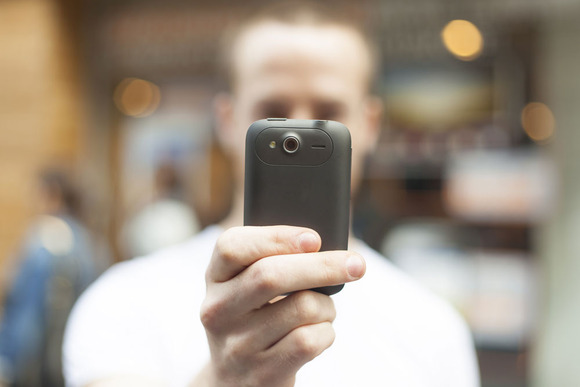

هل تتذكر آخر مرة التقطت فيها صورة احتفظت بها على شكلها الورقي أو قمت بوضعها في برواز وعلقتها على حائط في بيتك؟ هل لا تزال تحتفظ بألبوم صور (ورقي) تحتفظ فيه بذكرياتك وتضيف إليه صورا بشكل مستمر لتتذكر بعض اللحظات التي لا تود أن تنساها، مُعظمكم لن يُجيب بشكل سريع وبالإيجاب على هذين السؤالين، وهذا أكبر دليل على التحول الذي طرأ على الصور وأفقدها خاصية حفظ الذكريات التي لطالما حملتها ليتم استبدالها بخواص أخرى تدور كلها في فلك التواصل الاجتماعي.

يُقال أن سيرجي برين ثاني مؤسسي Google قد أبدى إعجابه واستغرابه من حادثة وقعت معه، حيث أنه لما كان يأكل أحد وجباته اليومية، لابسا نظارة Google Glass (طبعا) وصلته رسالة نصية قصيرة يسأله فيها صاحبها عما يقوم به الآن، ما أثار إعجاب برين هو السهولة التي رد بها على الرسالة، حيث اكتفى بالتقاط صورة وإرسالها دون الحاجة إلى إرفاقها بأية كلمات أو وصف.

بداية هذا التحول قد يكون مع ظهور أول الهواتف الذكية المُجهزة بكاميرات رقمية، حيث سمحت تلك الكاميرات لمستخدميها بالتقاط آلاف الصور، فلم يعد الأمر مقتصرا على تصوير منظر طبيعي جميل أو صورة تذكارية مع بعض الأصدقاء بل أصحبنا نصور ما نأكل وما نشرب أيضا، بل وبلغ الأمر إلى درجة مبالغة الكثيرين في التقاط صور لأنفسهم، حتى أنه انتشرت طرفة على الإنترنت تقول بأن نيل آرمسترونغ لما ذهب إلى القمر التقط 5 صور فقط، في حين التقطت مراهقة لنفسها 43 صورة بمجرد دخولها إلى الحمام.

<!-- more -->

ثم تلتها خدمات تشارك الصور الاجتماعية، فهذا Instagram يسمح لمُستخدميه بالتقاط صور وإدخال تعديلات عليها تجعلها تظهر في مظهر الصور الاحترافية، وهذا Vine يسمح لمستخدميه بنشر فيديوهات تدوم ثوانٍ معدودات، وهذه فيس بوك وتويتر تسمح لك بإخبار أصدقائك بالصور والفيديوهات التي ألتقطتها عبر الخدمتين آنفتي الذكر. إلى هنا يبدو وكأن الصور كانت لا تزال تحتفظ بجزء من خواصها المُتعلقة بحفظ الذكريات إلى أن ظهرت خدمات أخرى غيّرت من الوضع قليلا (أو كثيرا)، وأقصد هنا بالتحديد **Snapchat** والتي تسمح لمستخدميها بالتقاط صور أو فيديوهات يتم حذفها بشكل آلي بعد ثوان معدودات من وصولها إلى الطرف الذي أرسلت إليه.

يقول Robin Kelsey بروفيسور التصوير في جامعة هارفارد -والذي [نقلت](http://bits.blogs.nytimes.com/2013/06/30/disruptions-social-media-images-form-a-new-language-online/) مدونة Bits كلامه-: "نعيش زمنا أصبحنا نبتعد فيه عن استخدام الصور كأدوات لحفظ الذكريات وتحويلها إلى أداة تواصل".

ويضيف: "لدينا الآن صور لا حياة فيها، هي مجرد وسائل للتخاطب"

كثر الحديث حول أن أكثر ما يتم استخدام Snapchat فيه هو ظاهرة الـ Sexting والتي يقوم بها المراهقون عادة بإرسال صور غير محتشمة لأنفسهم، لكن هل يا ترى سيتسابق المستثمرون للاستثمار في خدمة هدفها الأساسي هو إرضاء رغبة المراهقين في عدم الاحتفاظ بصور ألتقطوها لأنفسهم بعد التقطاها لو أنهم لم يفهموا التغيير الكبير الحاصل في طريقة استخدام الصور؟ فعلى سبيل المثال تشير آخر [الأخبار](http://techcrunch.com/2013/06/22/source-snapchat-snaps-up-80m-from-ivp-at-a-800m-valuation/) بأن Snapchat قد حصلت على تمويل إضافي يقدر بـ 80 مليون دولار رفع قيمة الشركة إلى أزيد من 800 مليون دولار. هذا دون أن ننسى بأن تويتر قد سارعت إلى شراء Vine حتى قبل أن تقوم بإطلاق خدمتها للعموم، وأن فيس بوك لم تتحرج من [دفع مليار دولار لشراء Instagram](https://www.it-scoop.com/2012/04/facebook-instagram/) في حين لم تدفع Yahoo منذ سنوات سوى 30 مليون دولار لشراء Flickr في زمن كانت الصور لا تزال تستخدم فيه... كصور وليس كوسيلة تخاطب اجتماعي.

لنفهم هذا التحول في آليات التخاطب والتراسل بشكل أفضل وكيف بدأت الصور تلعب دورا أساسيا فيها يجب علينا أيضا أن نلقي نظرة على الاستخدام المتزايد لرسائل MMS على حساب رسائل SMS النصية فقد أشار تقرير لـ [CTIA](http://www.ctia.org/) بأن عدد الرسائل النصية القصيرة SMS التي تم إرسالها في أمريكا والذي قُدر بـ 2.19 ترليون رسالة سنة 2012 سجل تراجعا يُقدر بنسبة 5%  مقارنة بالعام الذي قبله، في حين سجل استخدام MMS زيادة قدرها 41% خلال نفس الفترة ليصل إلى 74.5 مليار رسالة.

ماذا عن إحصائيات خدمات تشارك الصور المختلفة؟ صرح Evan Spiegel مؤسسSnapchat  مؤخرا بأن عدد الصور التي يتم إرسالها عبر هذه الخدمة وصل إلى 200 مليون صورة بشكل يومي، بعد أن كان في حدود 50 مليون خلال شهر ديسمبر الماضي. أما مستخدمو Instagram فينشرون 45 مليون صورة يوميا (16 مليار صورة منذ انطلاق الخدمة)، وينشر مستخدمو فيس بوك 300 مليون صورة يوميا، في حين يتم إرسال 27 مليار رسالة يوميا على WhatsApp (صور وغيرها)، وتم نشر مالا يقل عن 13 مليون فيديو على Vine.

أمر آخر يرجح الكفة لصالح الصور مقارنة بالنصوص والرسائل النصية القصيرة وهو كون الصور "عالمية اللغة" فعلى سبيل المثال لن لا يحتاج الصيني إلى نظارات خاصة ليفهم ويتدبر في صورة نشرها صديقه الأمريكي مثلا أو العكس، إلا أن لهذا الأمر جانب سلبي أيضا، حيث أن نشر الصور لا يحتاج إلى أي مجهود فكري وبالتالي فإنه يُمكن اعتبار Instagram وأخواتها عبارة عن تويتر للذين لا يحسنون الكتابة.

في رأيك هل ستتحول الصور إلى أدوات للتواصل الاجتماعي بامتياز؟ وهل تعتقد بأن هذا التحول ستكون له آثار إيجابي أم سلبية على آليات التواصل الاجتماعي؟

