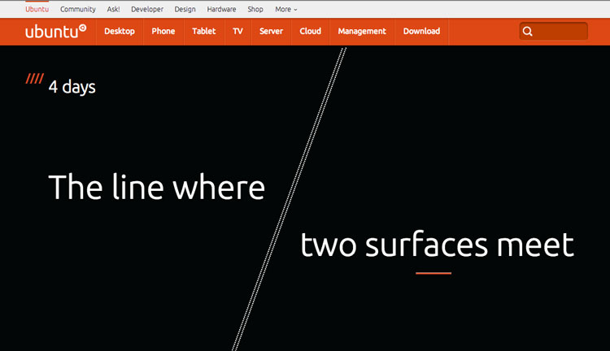
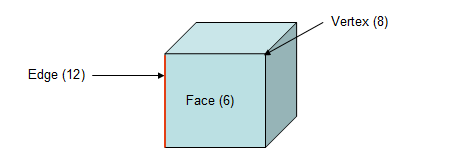
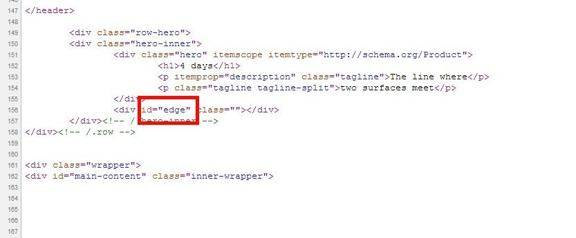

**ملاحظة**: ليس من عادتنا ترويج الإشاعة أو الكتابة عنها، وقد جاء هذا الخبر فقط كنوع من الفسحة التقنية.

إثارة التشويق على الموقع الرسمي لـ **Ubuntu** أصبح عادة لدى **Canonical**. فيبدو أنها تفضل استغلال هذا العنصر مع قوة الويب عوض إقامة المؤتمرات الفاخرة في الترويج لمنتجاتها، فكل ما تحتاج إليه هو عد تنازلي أنيق مع تلميحة أو لغز يثير فضولك.

العد التنازلي هذه المرة وعلى غرار [Ubuntu touch](https://www.it-scoop.com/2013/01/ubuntu-phone-os/) و [Ubuntu for tablet](https://www.it-scoop.com/tag/ubuntu-for-phones/) جاء بالأيام وليس بالساعات، طبعا بدأت التحاليل تظهر على الويب، منها المنطقي ومنها الساخر، ومنها ... خارج مجال التغطية.

بالنظر إلى التلميحة، فإن هناك 3 كلمات مهمة، **الخط** الذي **يلتقي** فيه **سطحان**. وبالتالي فإن هناك من يفسرها على أنها سطح معصم يدك حين يلتقي بالسطح السفلي للساعة، وبالتالي فإن Canonical تلمح إلى ساعة ذكية SmartWatch؟ وهناك من يقول أنه يجب علينا النظر إلى أشكال الهواتف الذكية والحواسيب اللوحية، فهي مسطحة، فربما قد وجدت Canonical أخيرا مصنّعا رسميا لنظامها؟ آخرون ممن بهم هوس Microsoft يقولون ربما هي قابلية تثبيت نظام Ubuntu touch على لوحي Surface.

<!-- more -->

لنعد إلى **خط**، **يلتقي**، **سطحان**،<del> **مقص** :P</del> مع بعض حيل مهوسيي التقنية الذي وصل بهم الفضول إلى قراءة شفرة الـ html لصفحة العد التنازلي. هل نسينا شيئا؟ نعم، لاحظ الخط الذي يوجد أسفل كلمة Surface والذي هو تقريبا تحت حروف fac. كذلك الخطوط المائلة بجانب 4 days.

سواء كنت [أدبيا](http://dictionary.reference.com/browse/edge) أو [رياضيا](http://www.mathopenref.com/edge.html)، فإنه قد يخطر ببالك أن الثلاث كلمات هي تعريف لكلمة: **حافة** أو **Edge** بالانجليزية، فهي الخط الذي يلتقي فيه سطحان:

<blockquote>In any geometric solid that is composed of flat surfaces (faces), an edge is a line segment where two such surfaces meet.</blockquote>

أو من موقع dictionary:

<blockquote>a line at which two surfaces of a solid object meet: an edge of a box.</blockquote>

زيادة على هذا،[ أشار الناشط في مجال البرمجيات الحرة Alan Bell](https://plus.google.com/109175303602657131317/posts/ghhqL6Nq22W)، إلى أن اسم النطاق ubuntuedge.com قد تم حجزه من طرف Canonical بحر هذا الأسبوع ، كما أنها [سجّلت](http://phandroid.com/2013/07/16/ubuntu-edge-trademark-upcoming-smartphone-name) مؤخرا علامة تجارية باسم Ubuntu Edge. وما تلك الخطوط المائلة بجانب 4 days بزواياها إلا إيماءة لشكل الحافة.

وكبرهان آخر طريف هذا ما يوجد على شفرة الصفحة:

أنظر أيضا في الشفرة (سطر 151) إلى itemtype يشير إلى [هذا](http://schema.org/Product)، أي أنه **منتوج** وتعريفه: أي شيء متاح للبيع. وهذا قد يعني أن Cannonical وجدت مصنعا لمنتوجها.

حسنا أطلنا الحديث لنخلص إلى أمرين شبه مؤكدين: الأمر يخص Ubuntu Edge وهو منتوج للبيع من طرف مصنع رسمي.

لحظة، ماذا عن الخط الذي أسفل fac ؟ هو صورة باسم tagline.png ويظهر لي شخصيا أنه شعار العلامة، وهو خط ببساطة، مرة مائل ومرة مستقيم أفقي.

انتهت فلسفتنا التقنية، حلل وناقش.

طبعا مصداقية ما ذكر في هذا الخبر على الحافة، فإما تنجو أو تسقط.
