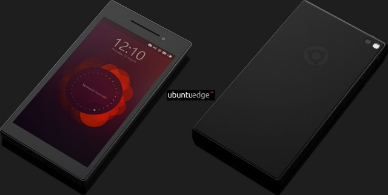

بعد إظهار عد تنازلي قبل أربعة أيام، ثم انقطع ذلك العد وكأن لسان حالهم يقول: كشفتمونا يا إخوة،  أعلنت **Canonical** أخيرا عن تفاصيل السر المكشوف، وكما كان متوقعا فالأمر يتعلق بـخط يلتقي فيه سطحان، ولا يتناطح عليه كبشان (ولا حتى جاموس Gnu)، وإلا لسقط إحداهما على الحافة، حزرتم؟ إنه **Ubuntu Edge** طبعا.

  إذا يتعلق الأمر بهاتف <del>ذكي</del> **خارق**، ذي مواصفات عالية، ثنائي الإقلاع، سواء بنظام **Ubuntu touch** أو بنظام **Android** على الخيار، وما الخارق فيه؟ - أنه يتحول إلى نظام سطح مكتب عادي عند إصاله بشاشة حاسوب. أما بالنسبة للمواصفات الأساسية فهو يأتي بـ: 4Gb ذاكرة عشوائية، معالج متعدد الأنوية ومساحة قرص SSD تصل إلى 128Gb وهي سابقة في عالم الهواتف الذكية ، كذلك بدقة شاشة 1280×720 HD، و 2 كاميرا أمامية وخلفية، تقنية NFC، .. وغيره من المواصفات.

لكن قبل أن تفرح بهذا الخبر، فإن ما تم كشفه عبارة عن حملة تمويل جماعي فقط  [على موقع indiegogo](http://www.indiegogo.com/projects/ubuntu-edge)، مع تعيين 32 مليون دولار كهدف يجب أن تصل إليه الحملة، مرفقة بنموذج وصفي لما سيكون عليه الجهاز الحقيقي. الفيديو التالية لـ Mark Shuttleworth تشرح هذا النموذج.

<!-- more -->

[youtube http://www.youtube.com/watch?v=eQLe3iIMN7k]

الحملة عبارة عن تبرعات بقيم 20، 600 أو 800 دولار أو أكثر، بالنسبة لمن يتقدم بـ 600 دولار في اليوم الأول فسيحصل على الجهاز شهر ماي من العام المقبل، بعد اليوم الأول، لن يتمكن من يقدم التبرعات من الحصول على الجهاز بذلك السعر إلا أن يتقدم بـ 830 دولار أو أكثر. مع ذلك فإن Canonical تأمل أن تحطم حملتها هذه جميع الأرقام القياسية، خاصة وأنها تتمتع بقاعدة مستخدمين عريضة وشركات تعتمد خدماتها.

الجدير بالذكر أنه وفي أقل من 12 ساعة، تمكنت الحملة من الوصول إلى قرابة 2.5 مليون دولار وإذا واصلت على هذا المنوال فإنها ستصل إلى الهدف المنشود وقد تجتازه في أقل من المدة المحددة.

باختصار Ubuntu Edge يهدف إلى إنشاء فئة جديدة باسم super phone وإلى أن يكون حاسوبك ورفيقك الدائم يسرعة وسعة تخزين كبيرتين.

	  * هل يا ترى ستصل الحملة إلى مبتغاها؟ أم أنها تسارعت فقط لمجرد عرض 600$؟
	  * ما رأيك بفكرة ومواصفات الجهاز؟ وكيف ستبلي البطارية في حالة إيصالها بالشاشة؟

**صور للجهاز:**

[gallery ids="12407,12408,12409,12410,12411,12412"]
