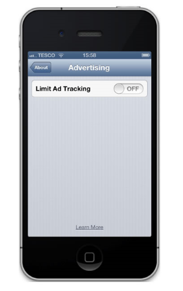

هل سبق لك أن اشتركت في موقع وبعد مدة بدأت تتهاطل عليك حملات ترويجية عبر البريد الإلكتروني والتي لم تفهم كيف وصلت إليك؟ هل سبق لك وأن أردت شراء شيء على الإنترنت وقبل أن تدفع (وأحيانا بعد أن تدفع) تكتشف بأنك قد دفعت ثمنا أكبر من الثمن الذي كنت تتوقعه أو أنك اشتريت منتجا إضافيا لم تكن ترغب فيه؟ إن كانت إجابتك بنعم فما حصل هو أنك قد تعرضت لأحد حيل **Dark Patterns** التي أصبحت ميزة شائعة في الكثير من المواقع. فما هو بالتحديد  **Dark Patterns.**

باختصار Dark Patterns هو ما يُقابل مفهوم **Black hat SEO** في مجال تهيئة المواقع لمحركات البحث. في حين يهتم هذا الأخير بتحسين ترتيب المواقع التي تستعمله في نتائج مُحركات البحث بطرق غير مشروعة فإن Dark Patterns يُعنى بقابلية الاستخدام وبتجربة المستخدم ككل، سواء كان على المواقع الإلكترونية، تطبيقات الهواتف الذكية وغيرها. إن كانت Black hat SEO مذمومة ومُنفرا منها (على الأقل بشكل رسمي) فإن تقنيات Dark Patterns منتشرة بكثرة بل ومستعلمة حتى من طرف كُبريات الشركات التقنية. حتى Apple والتي يُفترض بها أن ترجح الكفة دائما لصالح المُستخدم وقعت في هذا الفخ (أو بالأصح أوقعت مستخدميها فيه).

لنأخذ المثال الموجود في [هذا المقال](http://www.90percentofeverything.com/2013/07/23/the-slippery-slope/) (والذي دفعني إلى كتابة المقال الذي أنت بصدد قراءته) حول الطريقة التي تستعمل فيها Apple Dark Patterns لأغراض قد تكون غير نبيلة. تتوفر في نظام iOS خاصية تسمح للمُعلنين بتتبعك والتي تأتي مُفعلة بشكل قياسي مع إمكانية تعطيلها. بما أن الخاصية مُـتعلقة بخصوصية المُستخدم فإنه من البديهي أن يتم وضعها تحت تصنيف Privacy في إعدادات النظام، إلا أن Apple رأت غير ذلك ووضعتها في مكان يصعب توقعه وإيجاده، حيث يجب عليك أن تذهب أولا إلى General ثم إلى About ومنها إلى Advertising لتجد الخاصية التي تود تعطيلها.

قد يبدو الأمر إلى هذا الحد مُزعجا في حد ذاته وقد يبدو بأن Apple ترغب في إخفاء هذه الخاصية، لكن ستصاب بالذهول لما تعرف بأن الأمر أسوأ من ذلك، حيث سمت الخاصية Limit Ad Tracking وبما أن الخاصية تحمل القيمة<!-- more --> Off بشكل قياسي فإنه سيُخيل إلى المُستخدم (والذي سبق له أن عانى ليصل إلى هذه الخاصية) بأنه لا يتم تتبعه، لكن الوضع عكس ذلك، حيث أن النفي Off الموجود هنا هو نفي لعدم التتبع. يعني هناك نفيان ولإيقاف التتبع يجب اختيار On.

إن كان هذا المثال يستغل عدم بحث المُستخدم في دقائق إعدادات النظام الذي يستخدمه فإن هناك استخدامات لـ Dark Patterns تستغل إما سذاجة المُستخدمين أو تسرعهم لإنهاء ما يقومون به. فعلى سبيل المثال وبما أنه ألفنا أن ننقر على CheckBox في آخر كل صفحة تسجيل لنؤكد بأننا قرأنا شروط الاستخدام (وهو أمر نادرا ما نقوم به) فإن هناك من يستغل ذلك ليضع CheckBox ليس للموافقة على شروط الاستخدام وإنما الموافقة على استخدام بياناتك الشخصية (رغم أن الأمر ليس ضروريا لإكمال عملية التسجيل).

وهناك بعض المواقع كموقع  post-office.co.uk الذي يضرب به المقال آنف الذكر مثالا والذي يضيف عدة CheckBox يجب أن تقوم باختيارها إن لم تكن ترغب في أن تتم مُراستلك بعروض ترويجية، لأنه عادة لما تكون هناك عدة Checkbox بجانب بضعها البعض يعتقد المُستخدم بأنه يحتاج إلى اختيارها للحصول على أمر إضافي (إزعاج ترويجي عبر البريد الإلكتروني) وليس لضمان عكس ذلك، وهو ما يتم استخدامه على هذا الموقع أيضا وفق قاعدة النفي المزدوج التي سبق وأن تحدثنا عنها. وهناك من المواقع التي لن تُرغمك على اختيار أي Checkbox إطلاقا بل يتم ذلك بمجرد موافقتك على شروط استخدام الخدمة مثلما هو الحال مع موقع Quora مثلا، أو أنه يتم اختيار (Check) هذه الـ Checkboxs بشكل قياسي لما يتم إضافة خواص جديدة إلى خدمات سبق لك أن استخدمتها، مثلما هو الحال مع التغريدات التي تُرسلها لك تويتر عبر البريد الإلكتروني.

قد يبدو هذا الأمر غير مُضر (إن لم يكن يهمك تتبع المُعلنين لك) لكن ماذا لو ألحق الأمر ضررا بميزانيتيك المالية.  يضرب موقع [darkpatterns.org](http://darkpatterns.org/)  عدة أمثلة لمواقع تستعمل تقنيات Dark Patterns لجعلك تدفع أكثر مما تظن. في حين يرى صاحب الموقع -[في إحدى المحاضرات التي ألقاها حول الأمر](http://www.slideshare.net/harrybr/ux-brighton-dark-patterns?from=ss_embed)- بأن الأمر قد يبقى أخلاقيا في حال ما إذا كان الأمر مُتعلقا بموقع لجمع التبرعات يقوم بإظهار خياري "دفع شهري" و"دفع لمرة واحدة" بشكل واضح جدا مع اختيار الخيار الأول بشكل قياسي، ينظر إلى الحيل التي تستعملها باقي المواقع بطرقة ملتوية بعين الريبة، فعلى سبيل المثال نجد [هنا](http://darkpatterns.org/library/hidden_costs/) عدة أمثلة لمواقع تُقوم بذلك، فهذه خدمة استضافة تظهر الثمن الشهري لإحدى خطط الاستضافة الخاصة بها ولدى القيام بحجز سنة كاملة يصبح السعر أكبر من مجموع أسعار 12 شهر. وهذا موقع آخر يُظهر السعر من دون أية رسوم لجذب المستخدمين إلى غرف الفنادق التي يقوم بتأجيرها ولدى القيام بذلك تظهر رسوم إضافية لم يحسب لها المستخدم حسابا. لكن قد يكون الأسوأ في هذه الحيل تلك التي تجبرك على التسجيل باشتراك شهري يتم تجديده بشكل آلي دون أن يتم الإشارة إلى ذلك التجديد، حيث يجد المستخدم البسيط الذي اختار أن يشترك في الخدمة لشهر واحد يخسر أكثر مما لو اشترك لسنة كاملة نظرا لأن أسعار الاشتراك السنوي أقل.

إن كانت هذه المواقع تحاول أن تسهل عملية التسجيل والدفع قدر المستطاع فإنها تعمل جاهدة على جعل عملية إلغاء الاشتراك عملية في غاية الطول والثقل، فعلى سبيل المثال هناك مواقع تستغل نقطة ضعف لدى المُستخدمين، فكما هو معروف كلما زاد عدد الحقول الواجب ملئها في نموذج ما كلما زاد الاحتمال أن لا يقوم المستخدم بإنهائه وإرساله، ولهذا تقوم بعض المواقع بإجبارك على الإجابة وملء نموذج متعدد الأسئلة لتشرح سبب إلغاء اشتراكك، وبما أن كل الحقول ضرورية فإنه يستحيل إلغاء الاشتراك دون ملء جميع الحقوق وبالتالي تعقيد المهمة أمام المستخدم البسيط والذي قد يدفعه كسله إلى عدم إكمال ملء النموذج.

مثال آخر حول التعقيدات التي تصاحب إلغاء عملية الاشتراك والتي أشار إليها darkpatterns.org   على موقع إحدى شركات خطوط الطيران، بعد أن يجعل الموقع من مهمة عدم شراء ضمان السفر أمرا مُعقدا بطرح السؤال بشكل غريب حيث يجب على من لا يرغب في شرائها اختيار خيار "No Travel Insurance Required" والتي تقع ما بين بلدي Latvia وLithuania (حتى الترتيب الأبجدي لا يفسر هذا المكان للإجابة) يجب على من يود إلغاءها بعد شرائها عن طريق الخطأ أن يتصل برقم خاص بذلك يقوم بإحالته على وكالة السفر والتي قد لا تعمل طيلة ساعات اليوم وطيلة أيام الأسبوع، مما قد يطيل عملية الإلغاء إلى أكثر من يومين.

بعد كل هذه الأمثلة السؤال الذي يطرح نفسه هو: لماذا لا يتم التنفير من هذه العادات مثلما يتم التنفير من الـ Black hat SEO عادة؟ الجواب حول هذا الأمر قد لا يكون سهلا، لكن هناك عدة عناصر قد تساعد على فهم ذلك. فبداية هناك حارس أمين ضد عمليات Black hat SEO ويتمثل عادة في Google حيث أنها تعاقب كل من يقوم بتلك الحيل ليرتقي في ترتيب النتائج بصورة غير طبيعية، لكنه لا وجود لأي جهة تملك هذه السلطة في مجال Dark Patterns. الأمر الثاني هو أن تقنيات SEO بشكل عام تظهر جلية على الشفرة المصدرية لكل صفحة وبالتالي يسهل تحليلها آليا وتمييز الخبيث منها من الطيب وهو أمر يبقى مستحيلا –على الأقل في الظرف الحالي- مع واجهات المستخدم فلا يُمكن تحليل الصفحات لمعرفة ما إذا كانت تود التحايل على المستخدم أو لا.

يؤكد Harry Brignull بأن الأمر ليس مُتعلقا بأخطاء في تصميم واجهات المُستخدم وإنما هي حيل يُراد بها استغلال المستخدم، ويختم عرضه التقيديمي حول الأمر بقوله بأن الحل الوحيد المتوفر حاليا هو التشهير بالمواقع التي تمارس هذه الحيل والتقنيات وهو ما يسدفعها إلى تغيير الوضع أو إلى التقليل منه.

هل سبق وأن صادفتك حيل مُماثلة؟ هل انطلت عليك الحيلة؟ كيف تعاملت معها؟
