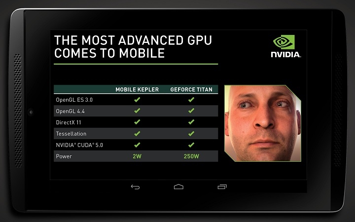

في السنوات الماضية، أصبحت الأجهزة المحمولة (الهواتف والأجهزة اللوحية ) جزءاً لا يتجزأ من حياتنا اليومية، وقد تطورت قدراتها الحاسوبية بحيث أضحت تضاهي أجهزة الحاسوب الشخصية. تقدم شركة **Nvidia** رقائق تسعى إلى تقديم معالجة رسومات من فئة الحاسوب الشخصي للأجهزة المحمولة أطلقت عليها اسم **Logan**.

 

[كشف](http://blogs.nvidia.com/blog/2013/07/24/kepler-to-mobile/) شركة Nvidia -والمعروفة من قبل الجميع كالشركة الأولى عالمياً في تصنيع بطاقات الرسوميات- هذا الأسبوع عن مشروع Logan، وهي أولى رقائق للأجهزة المحمولة من تصميم الشركة تستخدم نفس محرك الرسوميات الموجود في بطاقات الرسوميات المصممة للحاسوب الشخصي. تقول Nvidia أن هذه الجهود -والتي ماتزال في مراحلها الأولى- ستصل إلى مرحلة التصنيع في النصف الأول من العام القادم كجزء من رقاقة Tegra من الجيل التالي والخاصة بالشركة.

يمكنك رؤية العرض من هنا:

<!-- more -->

[youtube=http://www.youtube.com/watch?v=Vx0t-WJFXzo]

يقول دان فيفولي، نائب رئيس شركة Nvidia "لقد عملنا على هذا المشروع لعدة سنوات حتى نصل إلى المستوى المطلوب". استلمت الشركة للتو الرقائق الأولية الاختبارية والتي تعمل بالمحرك الجديد، وقررت عرض نموذج عنها في معرض siggraph الشهير، هذا الأسبوع. وبحسب Nvidia فإن محرك الرسوميات المحمول الجديد قوي بما فيه الكفاية للقيام بأحد عروض الشركة الأكثر إجهاداً والذي يخص التصيير في الوقت الحقيقي لوجه بشري غني بالتفاصيل. سبق وأن عرضت الشركة عرض "Ira" باستخدام رقاقة رسوميات مخصصة لمحطات العمل المتطورة.

أصبح الآن للشركة نسخة مطورة من Ira، ليست بالضبط نفس العرض السابق، حيث أن نسخة الأجهزة المحمولة توفر معدل إطارات أبطأ قليلاً، ودقة أخفض. لكن ما هي/هو Ira على أي حال؟ Ira هو تصيير rendering رسومي في الوقت الحقيقي يعتبر "الأكثر إثارة" بحسب فيفولي، والذي أضاف قائلاً: "إن حقيقة أنه قد أصبح بإمكاننا عمل إصدار من Ira للعمل على الأجهزة المحمولة هو أمر مذهل حقاً". من حيث استهلاك الطاقة، فإن استخدام Logan لمعمارية Kepler الخاصة بشركة Nvidia يترجم إلى ثلث ما تستهلكه وحدات المعالجة الرسومية الحالية كتلك التي في أجهزة الـ iPad، بينما تنتج نفس درجة التصييرات. تدعم الرقاقة أيضاً OpenGL 4.4 و OpenGL ES 3.0 إضافة إلى DirectX11.
