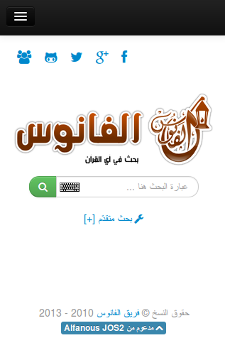
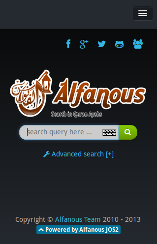
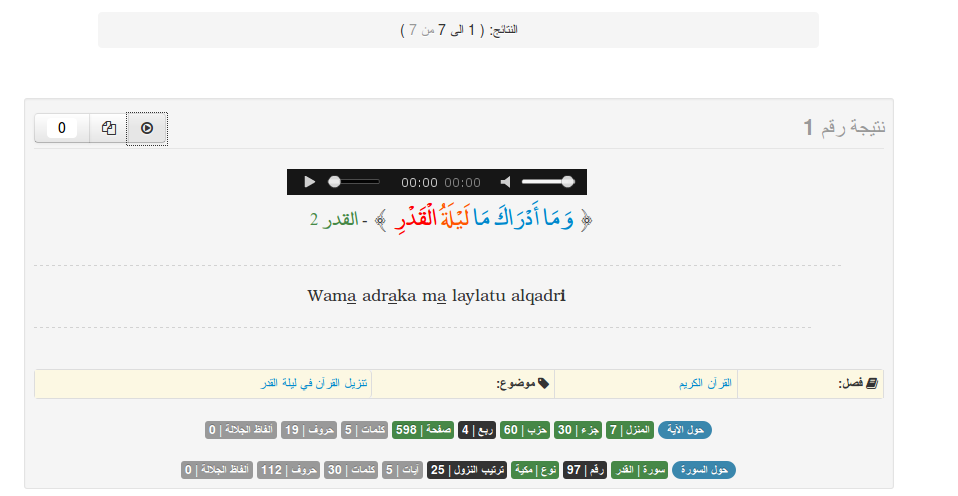

كنا قد أعلنّا قبل حوالي شهرين عن إطلاق نسخة جديدة من محرك البحث القرآني المتقدم "**الفانوس**"، أغلب ما تم إدخاله حينذاك كان من جهة الخادم ووظائف المحرك، مما قد لا يلاحظه المستخدم النهائي العادي، لكن اليوم، أتبعَ فريق **الفانوس** باطن التطوير الذي قام به بظاهر يليق به ويساير متطلبات الويب الحالي، حُلة جديدة سمّوها **الياقوت** ألبسوها إياه، وآثروا أن يخرجوا بها في أيام رمضان المبارك قبل العيد.

إذا كنت تجهل حول هذا المحرك القرآني المتقدم، فننصحك أولا [بقراءة مقالنا السابق](https://www.it-scoop.com/2013/06/alfanous-new-back-end-version-2/) عنه.

لا شك أن الملاحظ لتطور الويب اليوم، قد رأي أن وسائل النفاذ إليه والتصفح فيه قد تباينت سواءا في أحجامها أم في أنواعها، فلم يعد الوصول إلى موقع ما يتم حصرا عبر متصفح من جهاز سطح مكتب بل يتعداه الآن إلى الأجهزة اللوحية والهواتف الذكية بمختلف قياسات شاشاتها. من هذا المنطلق ظهر مفهوم [التصميم المتجاوب](http://en.wikipedia.org/wiki/Responsive_web_design) في عالم تطوير المواقع، وسدًا لهذه الحاجة المتزايدة ومُسايرةً لهذا التوجه جاءت واجهة الفانوس الجديدة ليس فقط لتحسّن المظهر وتزينه بمزيد من البساطة في التصميم وقابلية الوصول، بل ولتجعلته متجاوبا، متكيّفا مع مختلف شاشات أجهزة العصر. مثال ذلك الصورة التالية، وهي لما ستحصل عليه لو تصفحت الموقع من هاتف ذكي:<!-- more -->

وبه بضعة قوالب يمكنك التبديل بينها بما تشاء، مثال:

وزيادة على العرض الجديد لنتائج البحث، أصبحت خاصية قراءة الآيات تعتمد على عناصر HTML5 عوض مشغل Flash ما أمكنها ذلك (أي على المتصفحات التي تدعم هذا الأمر أو على الأجهزة اللوحية والهواتف الذكية)، حيث تعرض مشغلات الصوت الجديدة المضمنة في المتصفحات مثال:

تأتي هذه الإصدارة بخمس لغات هي العربية، الإنجليزية، الفرنسية، الأندونيسية واليابانية وهي قابلة للترجمة إلى لغات أخرى، يمكن التبديل بينها بسهولة، وإلا فسيحاول الموقع اكتشاف إعداداتك اللغوية في جهازك أو على متصفحك ليختار لك اللغة الأنسب عند زيارتك له أوّل مرة.

الجدير بالذكر أنه قد فازت هذه الواجهة حينما كانت في مرحلتها التجريبية شهر مايو الماضي بجائزة أحسن موقع ديني خلال مسابقة **Algeria Web Awards 2013** بالجزائر.

النسخة الجديدة على النطاق الرسمي الأول للمشروع ويمكن الوصول إليها من هنا: [www.alfanous.org](http://www.alfanous.org/).

لا يزال المشروع يتطلع لإنجاز تطبيقات للحواسب اللوحية و للهواتف الذكية لتوفير كامل المحرك ليعمل بدون اتصال على هذه الأجهزة، كذلك ينوي الفريق تحديث تطبيق سطح المكتب، وهو يرحب بأي مساهمة في هذين المجالين.

	  * موقع الفانوس: [http://www.alfanous.org](http://www.alfanous.org/).
	  * رابط [المساهمة بالترجمة](https://github.com/Alfanous-team/alfanous/blob/master/FAQ.rst#how-to-contribute-by-translation) أو بالتطوير.
	  * في حال اكتشافك لأي علّة أو خطأ، يمكنك الإبلاغ عن ذلك [من هنا](https://github.com/Alfanous-team/alfanous/issues/new).
	  * صفحة [الفانوس على فيسبوك](https://www.facebook.com/Alfanous).
	  * [مستودع الشفرة البرمجية على موقع Github](https://github.com/Alfanous-team/alfanous).
	  * [قائمة المزايا](https://github.com/Alfanous-team/alfanous#search-features).
	  * [قائمة المساهمين](https://github.com/Alfanous-team/alfanous/blob/master/AUTHORS.rst).
	  * [صفحة للتغذية الرجعية](http://feedback.alfanous.org/).

المزيد حول الخبر على [مدونة قاسم ](http://www.kacemb.com/%D8%A5%D8%B5%D8%AF%D8%A7%D8%B1-%D9%86%D8%B3%D8%AE%D8%A9-%D8%A7%D9%84%D9%8A%D8%A7%D9%82%D9%88%D8%AA-%D9%85%D9%86-%D9%85%D9%88%D9%82%D8%B9-%D8%A7%D9%84%D9%81%D8%A7%D9%86%D9%88%D8%B3-%D9%84%D9%84/)، أحد المساهمين في المشروع بالكتابة.
