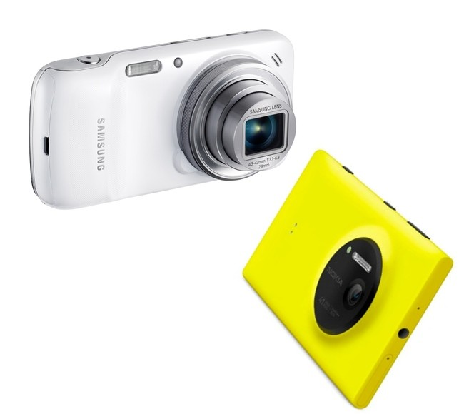

بعد أن كان التسابق ما بين مُصنعي الهواتف منحصرا على توفير أسرع/أصغر/أنحف/[ضع أي وصف هنا] هاتف ذكي، وبعد أن أصبح الجميع قادرا على القيام بذلك اتجهت المنافسة إلى توفير أكبر سعة تخزين، وأحدث إصدار من النظام دون أن ننسى أعلى دقة مُمكنة للكاميرات الرقمية. مؤخرا وصل التنافس ما بين المُصنعين إلى حد لم يعد من المُمكن التفريق ما بين هاتف ذكي وكاميرا احترافية (خاصة بعد أن أصبح الكاميرات تُزود بأنظمة تشغيل الهواتف الذكية)، لكن هل فعلا نحتاج إلى كل تلك الدقة العالية على هواتفنا الذكية؟

قد يكون أفضل مثالين على تسابق المصنعين لطمس معالم الحدود الموجودة ما بين عالمي الكاميرات الرقمية والهواتف الذكية هما هاتفا [Galaxy S4 Zoom](http://www.samsung.com/global/microsite/galaxycamera/s4zoom/specifications.html) و[Lumia 1020](http://www.nokia.com/global/products/phone/lumia1020/)، فلقد فضل مصنعاهما "إهمال" ما وصلا إليه من حيث تصنيع أنحف الهواتف الذكية لينتجا لنا هواتف على هيأة كاميرات تصوير من حيث الشكل ومن حيث دقة التصوير، حيث توفر Samsung كاميرا بدقة 16 ميجا بكسل في هاتفها، في حين ترفع Nokia سقف المنافسة عاليا بتوفيرها كاميرا ذات 41 ميجا بكسل.

وكما سبق وأن حدثناكم، فإن الشبكات الاجتماعية قد [غيرت مفهوم التقاط الصور وحولتها من أدوات لحفظ الذكريات إلى وسائل للتخاطب والتواصل الاجتماعي](https://www.it-scoop.com/2013/07/photography-new-communication-medium/) فإن نفس الشبكات الاجتماعية قد جعلت عملية التقاط الصور عالية الجودة تفقد معناها، حيث أنها لم تقم بتغيير مفهومه كما فعلت مع مفهوم التقاط الصور، بل ألغت الحاجة إليها بشكل كبير، وإليكم تفصيل ذلك.

لو ألقينا نظرة على أكثر الكاميرات استخداما لالتقاط الصور المنشورة على شبكة Flickr لوجدنا أن الهواتف الذكية [تحتل المراتب الخمسة الأولى](http://www.flickr.com/cameras) (4 هواتف iPhone إضافة إلى هاتف Galaxy واحد). أما لو ألقنا نظرة على إحصائيات Instagram لأبدينا إعجابنا بأرقامها، حيث يقوم مستخدموها النشطون المقدر عددهم بـ 130 مليون مستخدم بنشر ما لا يقل عن 45 مليون صورة بشكل يومي. ولو عرجنا على Snapchat لأصابتنا أرقمها بالذهول، لأن مستخدميها ينشرون مالا يقل عن 150[ مليون صورة كل يوم](http://abcnews.go.com/blogs/technology/2013/04/snapchat-users-upload-150m-photos-a-day-then-app-deletes-all/)، وفوق كل هذا من المتوقع [أن يقفز عدد الصور التي يتم التقاطها بشكل يومي عالميا من 500 مليون صورة يوميا حاليا، إلى مليار صورة العام القادم](http://www.slideshare.net/kleinerperkins/kpcb-internet-trends-2013).

قد تتساءل، وأين الخلل في كل هذه الأرقام؟ ألا يجعل الطلب المتزايد على الصور الحاجة إلى دقات تصوير أعلا مطلبا طبيعيا وعاديا؟ لكن ماذا لو كان "استهلاك" تلك الصور يتم على أجهزة دقات شاشاتها غير عالية، أو ماذا لو أنها كانت تنشر على خدمات تقوم بضغطها والتعديل عليها قبل أن يتم نشرها، أو أنه يتم التخلص منها بمجرد مشاهدتها؟ وهو فعلا ما يحصل مع قسم كبير من الصور التي يتم التقطاها ونشرها على الشبكات الاجتماعية، فالصور التي ننشرها على Instagram مثلا يتم ضغطها وإضافة بعض الـ Filters عليها وهو ما يجعلها تفقد الدقة العالية التي تم التقاطها بها، أما صور Snapchat فيتم حذفها (أو يتم جعل الوصول إليها غير مُمكن) بعد ثوان معدودات من مشاهدتها. أما الاستخدام المتزايد للهواتف الذكية فيدفعنا إلى أن نشاهد تلك الصور على شاشات صغيرة الحجم لا تسمح لنا بـ"الاستمتاع" بها إن هي نشرت بكامل "دقتها"، وكما يشير هذا [المقال على موقع Pandodaily](http://pandodaily.com/2013/07/15/do-we-really-need-all-those-megapixels-to-take-selfies/) فإن نشر ومشاهدة صور عالية الدقة على هذه الخدمات شبيهة بمشاهدة النسخة ثلاثية الأبعاد من فيلم Avatar على جهاز تلفزيون منخفض الدقة، بعبارة أخرى، قد الفكرة العامة للفيلم، لكن هناك تفاصيل كثيرة ستغيب عنك لأنك وبكل بساطة تستخدم جهازا لا يسمح لك بمشاهدتها.

بعبارة أخرى، إن لم يكن مصير الصور التي نلتقطها الحذف الآلي بعد نشرها أو نسيانها وضياعها على الشبكات الاجتماعية، فإن التعديلات التي ندخلها عليها عبر المرشحات Filters أو عمليات الضغط تُفرغ التسابق إلى توفير كاميرات بدقات عالية على هواتفنا الذكية من محتواه، لأنه –وبكل بساطة- لم يعد هناك حاجة ماسة إلى تلك الدقات العالية مثلما كان عليه الحال في السنوات الماضية قبل أن يتم طمس معالم الحدود ما بين عالم التصوير من جهة وعالم الهواتف الذكية والتواصل الاجتماعي من جهة أخرى.

عادة لما "تموت" الأجهزة وتغيب عن الساحة فإنها تفعل ذلك مرغمة بسبب ظهور أجهزة أخرى يُمكن لها أن تقوم بنفس الوظائف التي تقوم بها وبشكل أفضل/أسرع/أجود لأننا في حاجة إلى منتجات أجود/أفضل/أسرع/... . لكن يبدو بأن لهذه القاعدة استثناءات، فالهواتف الذكية ستقضي على كاميرات التصوير الاحترافية (أو تلتهم جزءا كبيرا من حصتها من السوق) رغم أننا سنحصل على نتائج أقل جودة مما كنا سنحصل عليها باستخدام كاميرات خاصة.

همسة: أغلب ما يتم التقاطه عبر هذه الكاميرات عالية الجودة، صور شخصية  Selfies، صور للمأكولات والمشروبات، وأحيانا صور لا تعبر فعلا عنا :)

بعد قراءتك لهذا المقال، هل ستكون  دقة الشاشة/ الهاتف أحد أهم عوامل اختيارك لهاتفك الذكي القادم؟
