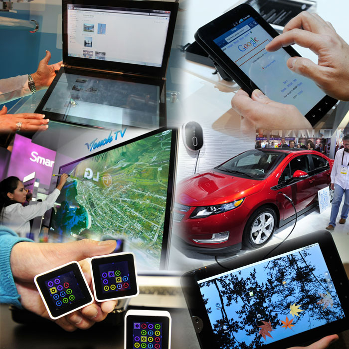

 بعد أن كان هذا الوصف يقتصر على بضعة أجهزة فقط كـ**الهواتف الذكية** مثلا، ظهرت مؤخرا العديد من الأجهزة التي يضاف إليها وصف الذكي، فلدينا الآن **ساعات ذكية**، و**ثلاجات ذكية** و**أجهزة تلفزيون ذكية**، بل وأطلقنا وصف الذكاء حتى على بعض أنواع المصابيح الكهربائية (**مصابيح كهربائية ذكية**). هل فعلا تتسم هذه الأجهزة بذلك الذكاء الذي يُبرر إطلاق هذا الوصف عليها؟ أم أنه يجب علينا أن نتوقف عن إلصاق هذا الوصف بكل جهاز جديد.

بداية لو عدنا قليلا إلى الوراء وإلى الهواتف الذكية على وجه التحديد لوجدنا أن ما يدفعنا إلى وصفها بذلك هو اعتمادها على أنظمة تشغيل تُمكنها من القيام بعمليات ووظائف لم يكن للهواتف التي سبقتها القيام بها، حيث أصبحت تلك الهواتف أقرب إلى حواسيب مُصغرة الحجم . ورغم أن الأمر لا ينم عن أي ذكاء حيث أن أقصى ما يُمكن لأغلب تطبيقات الهواتف الذكية القيام به هو تنفيذ مجموعة أوامر سبق وأن أُعدت لها (باستثناء بعض الحالات هنا وهناك) إلا أن وصف هذه الحواسيب الصغيرة التي نحملها في أيدينا وجيوبنا بالذكاء مقبول إلى حد ما، نظرا إلى الفارق الكبير الموجود بينها وبين الجيل الذي سبقها من الهواتف المحمولة.

أما لو أمعنا النظر قليلا في باقي ما يوصف بالذكاء فنجد أنها أوصاف قد لا يُراد بها سوى بيع أعداد كبيرة منها، وأحيانا لا يُطلِق هذا الوصف عليها سوى جماعة محدودة من الناس ممن يعملون على إنتاجها أو من المهووسين بالتقنيات الحديثة. فلا يصف عامة الناس أغلب أجهزة التلفزيون التي يملكونها بالذكاء رغم إصرار مصنعيها على ذلك بل ومحاولة إجبار المستخدمين بوصفها بالذكاء وذلك عبر إضافة "Smart” إلى الأسماء التجارية لتلك المنتجات.<!-- more -->

 إن كان وصف أجهزة التلفزيون التي يبلغ أقصى ما يُمكن لها القيام بها هو استعراض صفحات الإنترنت أو مشاهدة فيديوهات Youtube أمر فيه نظر فما بالك بإطلاق وصف الذكاء على ساعة لا يُمكن استخدامها ما لم تكن مربوطة بهاتف ذكي، أو مصباح كهربائي يكمُن "أقصى ذكائه" في إمكانية تغيير درجة سطوعه أو لونه عبر هاتف ذكي (هل فعلا نحتاج إلى مثل هذه المصابيح؟) حيث أن الأمر لا يعدو أن يكون مُجرد مبالغة هدفها دفع الآلاف إلى اقتنائها ومن ثم إقناعهم بشراء أخرى كلما زاد "ذكاء" تلك الأجهزة عبر إضافة خواص جديدة لها قد لا تكون سوى سعة تخزين أكبر أو بطاريات بعمل أطول.

 قد يبدو بأن القاسم المشترك ما بين كل الأجهزة التي توصف بالذكاء هو قدرتها على الاتصال بالإنترنت، مثلما هو الحال مع كل الآجهزة آنفة الذكر، أو مع ثلاجة [Samsung T9000](http://blog.evernote.com/blog/2013/01/23/beyond-the-evernote-fridge/) التي تأتي مُجهزة بشاشة LCD وبتطبيق Evernote خاص بها، لكن بحكم [أن الإنترنت بدأ في التحول إلى خدمة قاعدية أساسية ](http://pandodaily.com/2013/07/09/lets-kill-the-word-smart/)[commodity](http://pandodaily.com/2013/07/09/lets-kill-the-word-smart/) مثلا هو الحال مع الكهرباء، فإنه من الواجب أن نتوقف عن إطلاق وصف الذكاء على جهاز يكون بمجرد قدرته على الاتصال بالإنترنت. ومع صعود نجم ما يُعرف اصطلاحا بـ**إنترنت الأشياء** أصبح التوقف عن إطلاق هذا الوصف ضرورة مُلحة لأنه -إن نحن واصلنا القيام بذلك- سنجد أنفسنا خلال سنوات قليلة محاصرين من كل حدب وصوب بأجهزة "غبية" يُفترض بها أن تكون ذكية، وسيفقد وصف الذكاء معناه. كما أن إطلاق هذا الوصف على كل جهاز قادر على الاتصال بالإنترنت سيفقد معناه (إن نحن عنينا به القدرة على الاتصال بالإنترنت) لأن كل الأجهزة ستكون قادرة على الاتصال بالإنترنت (وبالتالي لن يكون ذلك علامة فارقة) تمام مثلما هو الحال وصف "الكهربائي" والذي قل استخدامنا له مع كل الأجهزة التي تستخدم الكهرباء كمصدر للطاقة، ولا نصف تلك الأجهزة التي تستخدمه بأوصاف غير وصف "الكهربائي"، كما أننا لا نصف تلك الأجهزة بالذكاء مثلا بمُجرد استخدامها للكهرباء.

إضافة إلى ما سبق ذكره، إطلاق وصف الذكاء على الأخضر واليابس معا، يعطي الانطباع بأن الأجهزة التي تتسم فعلا بالذكاء مثل السيارات الآلية التي تقود نفسها بنفسها وتتخذ قرارات من دون الحاجة إلى تدخل بشري (مثلما هو الحال مع سيارات Google الذكية) ليست بذلك الذكاء الذي تحمله، لأننا أسأنا وأفسدنا استخدام هذه الكلمة، وقد يصل بنا الأمر إلى استحداث كلمات جديدة لوصف الأجهزة الذكية فعلا(كـ "**فائقة الذكاء**" مثلا)، وهو أمر مشابه لما يحدث مع مفهوم الصداقة، حيث أفسدت الشبكات الاجتماعية (وخاصة فيس بوك) هذه الكلمة وأصبح الحديث عن الصديق الفعلي في أرض الواقع (أو الصديق بعيدا عن لوحة المفاتيح) يحتاج إلى إضافة أوصاف إضافية كأفضل/أعز صديق مثلا (وهو وصف كان يستعمل سابقا لوصف أمر آخر).

