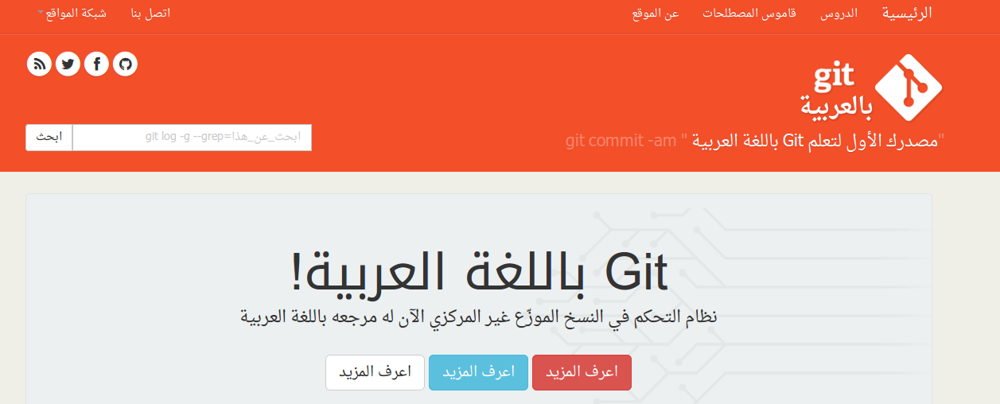

يسرنا أن نزف إليكم خبر ميلاد موقع جديد ينضم إلى عائلة مواقعنا اليوم، أسميناه [Arabic Git](http://www.arabicgit.com/) والذي سيُعنى بنظام إدارة النسخ Git بشكل عام.

الموقع الجديد والذي سيكون تحت إدارة وليد زيوش يهدف إلى توفير محتوى باللغة العربية يُسهل على القادم الجديد إلى عالم إدارة النسخ بشكل عام وإلى المستخدم الجديد لـ Git المهمة، وذلك عبر توفير مقالات، دروس، حيل وتوثيق لهذا النظام باللغة العربية. وسيتم اتباع نفس الأسلوب (وربما أيضا نفس الوتيرة) المُتبعة على باقي مواقع الشبكة.

 يُمكن معرفة المزيد حول الموقع وأهدافه بقراءة افتتاحيته والتي تجدونها [هنا](http://www.arabicgit.com/welcome/).
