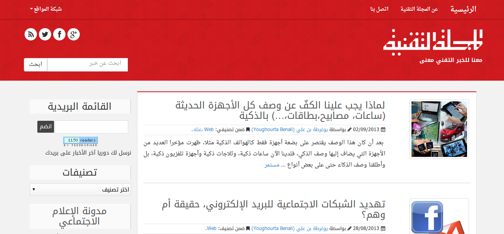

 أهلا بكم في **المجلة التقنية في حلتها الجديدة**، حلة اكتستها وأكستها باقي المواقع التي تقع ضمن شبكتها، ويتعلق الأمر بكل من[ مدونة الإعلام الاجتماعي](https://socialmedia4arab.com/)، [مدونة دروس الويب](http://www.webtuts.me/) إضافة إلى موقع [ArabicGit](http://www.arabicgit.com/) والذي[ انضم إلى شبكتنا مؤخرا](https://www.it-scoop.com/2013/09/arabic-git/).

 مررنا على المجلة التقنية خلال السنوات الماضية بعدة تغييرات، فبعد أن بدأنا كموقع إخباري لنقل الأخبار التقنية السريعة مع إضفاء نوع من العمق على ما ننشره، تحولنا بشكل تدريجي إلى موقع لنشر مقالات وتحليلات تقنية وتجنب الخوض في الأخبار سريعة التلف التي لا تحتوي أية مواد حافظة (أغلبها لا يصلح للاستهلاك البشري بعد مرور أيام على نشرها). يعود الأمر إلى عدة أسباب قد يكون أهمها هو كثرة المواقع التقنية باللغة العربية التي تقدم مثل هذا النوع من الأخبار (ما الحاجة إلى تكرار ما يُنشر هنا وهناك) وافتقار أغلبها إلى العمق في التحليل، إضافة إلى التحول في اهتمامات كتاب المجلة من مجرد نقل الأخبار إلى كتابة مقالات طويلة نسبيا. دون أن نُهمل عامل التفرغ والذي لا يُمكن إنكار بأنه أحد عوامل هذا التغير.

رافق هذا التحول إطلاق مواقع جديدة متخصصة، وهي -كما سبق ذكره- [مدونة الإعلام الاجتماعي](http://www.socialmedia4arab.com/) والتي تنشر مقالات متخصصة فقط في الإعلام الاجتماعي إضافة إلى [مدونة دروس الويب](http://webtuts.me/) والتي تنشر مقالات تخص برمجة الويب باللغة العربية.

نهدف من خلال شبكة مواقعنا إلى توفير مُحتوى جاد ومتخصص باللغة العربية ليس فقط لتسهيل المهمة لمن لا يُحسن اللغات الأجنبية مهمة الوصول إلى محتوى عالي الجودة، وإنما أيضا لتوفير محتوى يصلح أيضا للترجمة إلى لغات أخرى (هدف نعمل على تحقيقه على المدى البعيد).

القالب الجديد من تصميم وليد زيوش أحد أعمدة المجلة التقنية والذي يُتحفنا دائما بمقالاته التي يمزج عادة فيها الجد بالدعابة في قالب لغوي يندر أن نشاهد مثيلا له في المنشورات التقنية باللغة العربية، وهو نفسه الذي سيتولى مهمة تحرير وإدارة موقع ArabicGit.

القالب مبني اعتمادا على إطار Bootstrap في نسخته الجديدة مما يجعل الموقع قابلا للتصفح أيضا على الهواتف الذكية أو على الأجهزة ذات الشاشات الصغيرة.

تغيير آخر أدخلناه منذ أيام وهو الاعتماد على Disqus كنظام للتعليقات على مُختلف مواقع الشبكة.

 كما سبق وأن ذكرناه، سنواصل العمل على نفس الوتيرة البطيئة السابقة، وسنحاول نشر مقالات نحسبها عالية الجودة في كل مواقع شبكتنا، ومن يدري، لعلنا سنطلق مواقع أخرى متخصصة في مجالات تقنية أخرى في المستقبل.

أمر آخر، جميع محتويات المجلة التقنية والمواقع التابعة لها أصبحت تحت رخصة المشاع الإبداعي Creative commons CC BY-NC-SA 3.0 (ألق نظرة على ذيل الصفحة لقراءة الرخصة كاملة)

 إن كنت تشاركنا نفس التوجه فيما يخص آلية النشر ونوعية المنشورات، وإن كنت ترى في نفسك القدرة على اتباع نفس النهج المُتبع هنا، فإننا ندعوك للاتصال بنا والانضمام إلينا.

 آراؤكم حول هذه التغييرات واقتراحاتكم مرحب بها.

تنويه بسيط: إن كنت تتابعنا على فيس بوك وكنت ترغب في البقاء على اطلاع على كامل ما ننشر، فإنه من الأفضل أن تدخل إلى [صفحة المجلة](https://www.facebook.com/ITscoopMagazine) وتعمل التالي لتضمن ظهور منشوراتنا في خطك الزمني:

