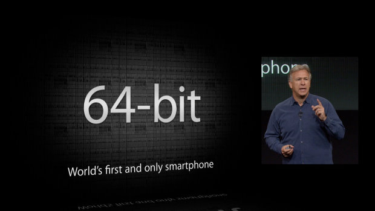

 قد تكون إحدى أهم الميزات في <del>هاتفي **iPhone** الجديدين **iPhone 5C** و **iPhone 5S**</del>  هاتف **iPhone 5S** الجديد هو المُعالج **A7** الجديد الذي <del>يُجهزهما</del> يُجهزه، حيث يُعتبر  iPhone 5S الجديد أول هاتف مُجهز بمُعالج **64 بت**. هناك من يراها ميزة في غاية الأهمية حيث أنها ستزيد من "قوة" الجهاز، وهناك من يعتقد بأنها أول خُطوة ضرورية لتقليص الفجوة الموجودة ما بين الهواتف الذكية والحواسيب المكتبية. كل هذا جميل، لكن هل فعلا يُمكن للمستخدمين الاستفادة من كل هذه القوة في الجهازين آنفي الذكر؟ أم هي مُجرد حيلة تسويقية تهدف بها Apple إلى دفع الكثيرين من عُشاق علامتها التجارية إلى استبدال هواتفهم بهواتف أقوى هم في غنى عن قوتها الإضافية، بل هم غير قادرين على استغلالها.

هل تذكرون الزمن الذي كنا نستخدم فيه حواسيب ذات مُعالجات 32 بت؟ طبعا تذكرون ذلك فلم يمض عن ذلك الكثير، رغم أن ما أغلب (وربما كل) ما يباع حاليا من حواسيب مكتبية أو محمولة تأتي مُجهزة بمعالجات 64 بت. قد يكون السبب الذي دفع الكثيرين منا إلى استبدال تلك الحواسيب بحواسيب ذات معالجات 64 بت هو حاجتهم إلى ذواكر أكبر. نعم السبب الرئيسي وراء الانتقال إلى معالجات 64 بت ليس القوة التي تأتي بها تلك المعالجات وإنما الحاجة إلى ذواكر أكبر، حيث أنه ليس بإمكان مُعالجات 32 بت التعامل مع ذواكر تفوق سعتها 4GB. يُشير مقال على [موقع ](http://www.neowin.net/news/editorial-iphones-64-bit-architecture-is-pure-marketing-fluff)[neowin](http://www.neowin.net/news/editorial-iphones-64-bit-architecture-is-pure-marketing-fluff) بأنه على نظام Windows XP لم يكن بالإمكان رؤية/استخدام سوى 3.5 GB من الذاكرة حتى ولو كنت تملك 4GB من الذاكرة RAM على جهازك.

بعبارة أخرى، معالج ذي 32 بت أكثر من كافٍ لاستخدام كامل الذاكرة التي تُجهز جهازي iPhone 5 C/S والتي تُقدر [بـ ](http://www.digitaltrends.com/mobile/iphone-5s-vs-galaxy-s4-vs-htc-one/)[1GB فقط](http://www.digitaltrends.com/mobile/iphone-5s-vs-galaxy-s4-vs-htc-one/).

يبدو أن من الصعب على الكثير من مُستخدمي الهواتف الذكية ممن ليست لديهم خلفيات تقنية أن ينتبهوا إلى مثل هذه التفاصيل، كما أن أغلبهم قد لا يكون على دراية بالفرق ما بين ذاكرة التخزينStorage والذاكرة الحية RAM التي تُجهز أجهزتهم، فليس مُستبعدا أن لا يعرف أصحاب هواتف 32GB (أيا كان الجهاز الذي يستعملونه) أي ذاكرة مقصودة بهذا الرقم. ويبدو أن عدم الدراية بمثل هذه التفاصيل التقنية، وربما حتى التسابق على امتلاك هواتف تملك "أرقاما" كبيرة هي التي دفعت بالكثيرين إلى كتابة تعليقات مثل هذه (والتي استشهد بها مقال Neowin آنف الذكر):

أضف إلى ذلك أنه يُحتمل بتطبيقات تمت ترجمتها للعمل على مُعالجات 32بت أن تكون [أبطأ على مُعالجات ](http://www.viva64.com/en/l/0002/)[64 بت، لأنه يُفترض بهذه المعالجات أن تقوم بتنفيذها داخل ](http://www.viva64.com/en/l/0002/)["محاكٍ](http://www.viva64.com/en/l/0002/)[" Emulator](http://www.viva64.com/en/l/0002/). وبما أن تطبيقات متجر AppStore مكتوبة لتعمل على نظام 32بت ستُضطر إلى توفير نسخ 64 بت لتجنب هذه المشاكل، وهو ما يوقع Apple في مشكل آخر كانت في منأى عنه طويلا، حيث من المنتظر أن تظهر تطبيقات جديدة لن توفر سوى نسخا تعمل على نظام 64بت وهو ما سيحرم أصحاب الهواتف الأقدم من هذه التطبيقات. بعبارة أخرى ما كان سابقا مُجرد مشكلة أندرويدية بحتة (عدم توافق بعض التطبيقات مع بعض الأجهزة) ستصبح مشكلة عامة في القريب العاجل.

بطبيعة الحال، هناك [فوائد مُباشرة وغير مباشرة](http://www.theguardian.com/technology/2013/sep/18/iphone-5s-apple-a7-chip-64-bit-explained) لمعالج Apple الجديد، لكنها لا تجعل من iPhone الجديد بضعف قوة iPhone5 مثلا، كما أنها قوة ضائعة لن تتمكن من استغلالها كاملة حتى ولو أردت ذلك. قد يصبح اقتناء هواتف ذكية بمُعالجات 64 بت فكرة صائبة بعد أن يتم تجهيزها بذواكر أكبر من 4GB، لكنه أمر لن يحصل في القريب العاجل، فأقصى ما يُمكنك الحصول عليه على هاتفي Galaxy S4 أو HTC One هو 2GB (تحديث: كما يُمكن الحصول على 3GB على هاتف Galaxy note 3) ، ويجب علينا أن ننتظر طويلا حتى نحصل على ذواكر 4GB وحينها يحق لنا أن "نحلم" بذواكر أكبر
