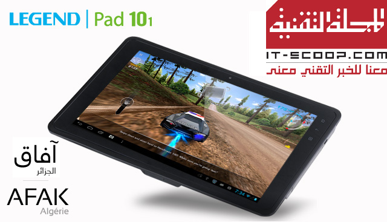

يسعدني أن أعلن عن نتائج مسابقة رمضان على المجلة التقنية والتي كانت تهدف هذا العام إلى تشجيع المُطورين الجزائريين على كتابة تطبيقات لنظام Android. [مسابقة هذا العام](https://www.it-scoop.com/2013/07/itscoop-ramadan-1434/) كان تهدف إلى توفير أفضل تطبيق إخباري لتصفح وقراءة ما يُنشر في الصحافة والمواقع الإلكترونية الجزائرية.

 

عدد المشاركين لم يكن كبيرا جدا (وهو أمر طبيعي نظرا لطبيعة المسابقة وللجمهور المُوجهة إليه) تراوحت التطبيقات المُشاركة ما بين الجيدة، المتوسطة وتلك التي يبدو بأن أصحابها لم يفهموا جيدا المطلوب من المسابقة. وكما سبق ذكره في نص المسابقة، من المُمكن حجب إحدى الجوائز أو أكثر في حال ما إذا لم ترتق التطبيقات المشاركة إلى المستوى المطلوب، وبناء على ذلك سيتم حجب الجائزة الرابعة.

 من دول إطالة إليكم التطبيقات الثلاثة الفائزة:

	  1.  المرتبة الأولى: تطبيق DZ News من تطوير AminexDev وهو مُتوفر على متجر التطبيقات Google Play [من هنا](https://play.google.com/store/apps/details?id=dz.amine.dzpress)
	  2. المرتبة الثانية: تطبيق DzNewsReader من تطوير محمد قندوز (غير متوفر في متجر التطبيقات بعد)
	  3. المرتبة الثالثة: تطبيق FenyPaper من تطوير سيد علي ملوك والذي يُمكن تحميله [من هنا](https://play.google.com/store/apps/details?id=com.fenylab.fenypaper).

مُسابقة رمضان لهذا العام على المجلة التقنية كانت بالرعاية الحصرية لشركة [آفاق الجزائر](http://afak-algerie.com/) والتي تقوم بتسويق عدة أجهزة مُختلفة تحمل العلامة التجارية [Legend](http://afak-algerie.com/fr/produit/tablette-legend-pad10/) في السوق الجزائرية، منها أجهزة لوحية (7 و 10بوصات) تعمل بنظام Android.

 للتذكير، ستحصل التطبيقات الفائزة على أجهزة لوحية [Legend Pad10″](http://afak-algerie.com/fr/produit/tablette-legend-pad10/) بقيمة 28 ألف دينار جزائري، إضافة إلى مبالغ مالية تتراوح ما بين 40 ألفا و10 آلاف دينار جزائري (تفاصيل ذلك في [نص المسابقة](https://www.it-scoop.com/2013/07/itscoop-ramadan-1434/)).

 سيتم الاتصال بالفائزين لتسليهم جوائزهم في أقرب فرصة.

 شكرا لجميع المُشاركين.
