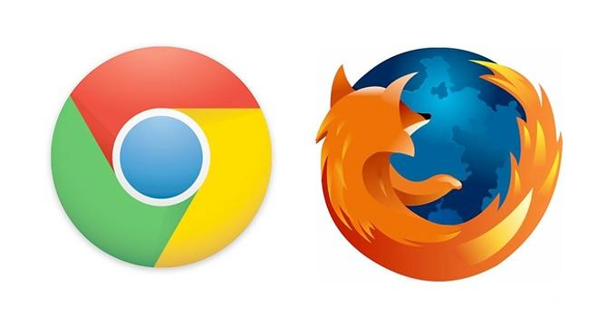

 منذ دخول Google إلى سوق **المتصفحات** والسباق حول تحسين أداء **محركات Javascript**، أخذت التقنيات التي تعتمد على **المُلحقات الإضافية** في التضاؤل شيئا فشيا. مبدئيا يبدو التخلص التدريجي من التقنيات المملوكة من المتصفحات (Flash، Silverlight، Java...) وتعويضها بالتقنيات القياسية (JavaScript، WebGL،...) أمرا محمودا، لكن في حقيقة الأمر الوضع ليس بتلك البساطة التي نظنها، فلا وجود لما يُمكن أن نُطلق عليه وصف "تقنية جيدة" أو "تقنية سيئة”. الجميع على علم بالهجوم الشرس الذي شنته Apple على Flash، والذي يبدو أمرا طبيعيا خاصة وأن هذه التقنية تهدد بيئتها المُغلقة، هذا بالرغم من أنها لم تفعل أي شيء للتخلص من Quicktime مثلا والذي يُعتبر أيضا إضافة وتقنية مملوكة ، لكن هذا موضوع آخر يخرج عن نطاق موضوعنا الحالي.

أعلنت كل من Google وMozilla مؤخرا -و بفارق يوم واحد فقط- عزمهما التخلص من لبنة أساسية في مجال إضافات المتصفحات والمتُعلقة بـ NPAPI:

 	  * [Google looks to drop Netscape Plugin API support in Chrome, starting with blocking most plugins in January 2014](http://thenextweb.com/google/2013/09/23/google-chrome-drops-netscape-plugin-api-support-to-improve-stability-will-block-most-plugins-in-january-2014/)
 	  * [Plugin Activation in Firefox](https://blog.mozilla.org/futurereleases/2013/09/24/plugin-activation-in-firefox/)

لتلخيص الأمر Netscape Plugin Application Programming Interface أو ما يُعرف اختصارا بـ [NPAPI](http://en.wikipedia.org/wiki/NPAPI) هي اللبنة البرمجية التي تسمح للمُلحقات الإضافية Plugins بالتخاطب مع الطبقات الدنيا من النظام والتي يبدو بأن لمنتجي المتصفحات رغبة في التخلص منها نظرا لأنها تقنية عفا عنها الزمن.

هناك عدد صغير جدا من المُلحقات الإضافية المعنية بهذه التغييرات (قارئاFlash وPDF غير معنين بالأمر)، فلم تحص Google سوى 6 ملحقات تعتمد على NPAPI والتي تم استخدامها من طرف أكثر من 5% من المُستخدمين خلال الشهر الذي سبق هذا الإعلان، ويتعلق الأمر بكل من Silverlight، Unity، Google Earth، Java، Google Talk و Facebook Video. ما دفع بـ Google إلى القيام بذلك هو عدم رغبتها في مواصلة دعم تقنية تم تصميمها لاحتياجات القرن الماضي. لكن يبدو بأن للأمر خلفية أعمق من ذلك، فمع الشعبية المتزايدة لمتصفح Chrome تود Google أن ترسل رسالة قوية اللهجة لمطوري المُلحقات الإضافية: تقول لهم فيها “أنتم الآن على أرض تابعة لـ Google وبالتالي عليكم الخضوع لقوانينها". يجب أن نضع في الحسبان بأن Google لا تستفيد من قبولها دخول المُلحقات الإضافية إلى أرض متصفحها (على الأقل بشكل مباشر) هذا إلى جانب أن فِرق عملها حققت تقدما ملحوظا على مشروع بيئة التنفيذ داخل المتصفح التي تقوم بتطويرها [NaCl](https://developers.google.com/native-client/). يمكن تكوين فكرة أوضح حول الأمر بقراءة هذا المقال: [Google’s Bet On Native Client Brings Chrome And Google+ Photos Closer Together](http://techcrunch.com/2013/09/15/googles-bet-on-native-client-brings-chrome-and-google-photos-closer-together/).

وضع Mozilla لا يختلف كثيرا على Google حيث أنها أيضا لا تستفيد بشكل مباشر من وجود المُلحقات الإضافية على متصفحها، وليس من الواضح إن كان الأمر مجرد صدفة فقط، فقد كشفت المؤسسة الأسبوع الماضي أيضا عن توفير إصدار [HTML5 ](http://techcrunch.com/2013/10/03/shumway-mozillas-html5-based-flash-player-replacement-lands-in-firefox-nightly/)[من قارئ ](http://techcrunch.com/2013/10/03/shumway-mozillas-html5-based-flash-player-replacement-lands-in-firefox-nightly/)[Flash Player](http://techcrunch.com/2013/10/03/shumway-mozillas-html5-based-flash-player-replacement-lands-in-firefox-nightly/) والذي أطلقت عليه اسم Shumway، وهذا بعد 7 سنوات من إطلاق هذا المشروع.

من جهة تقوم Google بإجراء تجارب مع تقنيات مملوكة خاصة بها، ومن جهة أخرى ترمي Mozilla بكامل ثقلها على JavaScript ويبدو بأنها وُفقت في مساعيها: [Surprise! Mozilla can produce near-native performance on the Web](http://arstechnica.com/information-technology/2013/05/native-level-performance-on-the-web-a-brief-examination-of-asm-js/). لكن هل يُمكن وصف ما تقوم به Mozilla بأنه إضاعة وقت ثمين لإعادة اختراع العجلة من جديد؟ قد يبدو الأمر كذلك، وقد يكون ما تقوم به المؤسسة هو مجرد تنفيذ [المهمة](http://www.mozilla.org/fr/mission/) التي وكّلت نفسها بتنفيذها والمتعلق بتوفير ويب أكثرا انفتاحا.

هل يعني كل ما سبق ذكره بأن نهاية عهد المُلحقات الإضافية على المُتصفحات باتت وشيكة؟ قد لا يبدو بأن القضاء على الإضافات هو هدف مطوري المتصفحات حاليا. ما دفع بالتقنيات المملوكة إلى فرض نفسها على المتصفحات هو التأخر الذي تسببت به W3C والتي لم تقدر على تطوير HTML بوتيرة عالية لتساير كافة الطلبات المتزايدة، ويبدو بأن المتصفحات تحاول حاليا إعادة ترتيب الفوضى التي نتجت عن ذلك وذلك عبر تقليص عدد التقنيات المملوكة على المتصفحات والحد من انتشار استعمالها.

في حقيقة الأمر المشكلة لا تكمن في المُلحقات الإضافية في حد ذاتها ما دام استخدامها يقتصر على مجال مُحدد بشكل واضح، فعلى سبيل المثال نستخدم Flash في مجال vector animation، إضافة QuickTime للفيديو، وUnity للألعاب ثلاثية الأبعاد. ويجب أن لا ننسى بأن الشركات التي توفر هذه الإضافات لا تتربح منها بشكل مباشر، فلا تربح Adobe أي شيء من قارئ Flash Player ولا تربح Unity أي شيء من Unity Web Player. لكن في المقابل تتربح هذه الشركات من بيئات التطوير التي تحتاج إلى تلك الإضافات لتنفيذ ما يتم إنتاجه باستخدامها، وهو ما يفسر الخطوة التي قامت بها Google مؤخرا عبر إطلاقها لبيئة تطوير خاصة بها [Google launches public beta of Web Designer, a free design tool for creating HTML5 ads and campaigns](http://thenextweb.com/google/2013/09/30/google-launches-public-beta-of-web-designer-a-design-tool-for-creating-html5-ads-and-campaigns/). هدف Google من هذه الخطوة هو فرض نفسها والتخلص من جميع الوسطاء في كامل سلسة إنتاج المساحات الإعلانية، فكما هو معروف فإنه يتم تصميم أغلب المساحات الإعلانية المتحركة التي نشاهدها على الويب باستخدام Flash، لكن بعد إطلاق تطبيق Web Designer ستتمكن Google من التحكم في كامل دورة حياة المساحات الإعلانية، حيث سيتم إنشاؤها باستخدام Web Designer، توزيعها عبر منصة DoubleClick ومن ثم قياس مدى نجاعتها عبر Google Analytics.

فيما يخص Unity فإن القيمة المضافة ليست في القدرة على إظهار أكبر عدد مُمكن من المضلعات على المُتصفح، لكن في بساطة وقوة بيئة التطوير. بالرغم من أنه يُمكن تطوير ألعاب كاملة وفي غاية القوة باستخدام تقنيات الويب المفتوحة فقط (ألق نظرة على [HexGL](http://hexgl.bkcore.com/)) إلا أن Unity تسمح بتطوير ألعاب عابرة للمنصات بشكل سريع جدا، خاصة إذا ما كنت ترغب في استهداف الأجهزة المحمولة أيضا (هل سبق لك وأن جربت [SuperHot](http://superhotgame.com/)؟). وكما سبق ذكره في بداية المقال لا يوجد تقنيات جيدة وأخرى سيئة، فبالرغم من أن هدف Unity هو بيع أكبر عدد مُمكن من تراخيص بيئة التطوير الخاصة بها، إلا أنه وبحكم أن التقنية التي تطورها -بالرغم من كونها مملوكة- تسمح بتصميم، تطوير وتوزيع ألعاب بشكل سهل وسريع فلا يوجد أي مانع من استخدامها. هذا الأمر يدفع بالبعض إلى تجنب مناصرة طرف على حساب طرف آخر (يعني إما أن نناصر التقنيات المملوكة، أو نكون من المتعصبين للتقنيات المفتوحة)، وهو ما يُمكن أن نلحظه مثلا في ظهور [Occupy HTML](http://occupyhtml.org/) .

خلاصة القول: لا فائدة من إضاعة المزيد من الوقت في النقاشات العقيمة حول أفول نجم المُلحقات الإضافية على المتصفحات أو حول قرب نهاية عهدها. لا يُهم الأغلبية الساحقة من المُستخدمين مثل هذه النقاشات مثلما يهمهم الحصول على محتوى وخدمات عالية الجودة. كما أنه لا رغبة لدى مطوري المتصفحات بالإيحاء لمستخدميهم بأنهم مقيّدون (فقط وحدها Apple من تجرؤ على ذلك). في المقابل فإنه من الطبيعي أن ترغب المتصفحات في تحسين شفراتها وتنظيفها من الوظائف التي لم تعد لها فائدة، وهو ما يبدو أنه الهدف الأساسي للعمليتين آنفتي الذكر، لا أكثر ولا أقل.

ترجمة -وبتصرف- للمقال: [Google et Mozilla cherchent-ils à tuer les plugins](http://www.interfacesriches.fr/2013/10/07/google-et-mozilla-cherchent-ils-a-tuer-les-plugins) لصاحبه [Frédéric Cavazza](https://twitter.com/FredCavazza).
