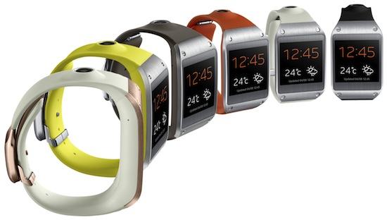
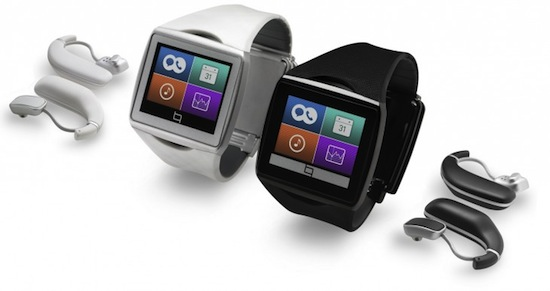
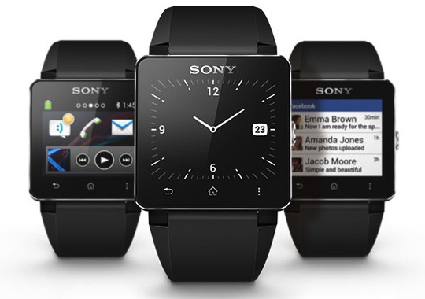
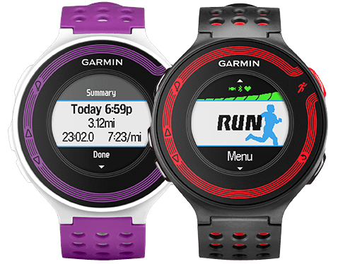

 المبدأ الذي تُبنى عليه **الساعات الذكية** ليس بالجديد فالنماذج الأولية لها تعود إلى سنة 2011، إلا أن المُصنعين احتاجوا إلى ما يُقارب السنتين للوصول إلى مرحلة يُمكنهم فيها تسويق أولى منتجاتهم. إلى غاية مستقبل قريب جدا لم تكن هناك خيارات كثيرة لمن أراد استعمال ساعة ذكية، وكانت ساعة **[Peeble](https://getpebble.com/)** الأكثر انتشارا ([Pebble Sold 275K Units Through Kickstarter And Pre-Orders, Tops 1M Watch Apps Downloaded](http://techcrunch.com/2013/07/11/pebble-sold-275k-units-through-kickstarter-and-pre-orders-tops-1m-watch-apps-downloaded/) )، مؤخرا شهدت ساحة الساعات الذكية دخول العديد من المُصنّعين الذين يريدون حصصهم من هذه الكعكة.

هذا الاهتمام المُتزايد بالساعات الذكية دفعت بفرق عمل Samsung إلى استخراج تصاميمها الأولية التي كانت بحوزتها ومواصلة العمل إليها وهو ما نتج عنه إطلاق ساعة [Galaxy Gear](http://www.samsung.com/global/microsite/galaxynote3-gear/) التي أطلقتها بداية شهر سبتمبر المُنصرم [Samsung Introduces Galaxy Gear, a Wearable Device to Enhance the Freedom of Mobile Communications](http://samsungmobileuspress.com/2013/09/04/Samsung-Introduces-GALAXY-Gear,-a-Wearable-Device-to-Enhance-the-Freedom-of-Mobile-Communications).

مثلما جرت عليه العادة مع مُنتجات Samsung تأتي ساعة **Galaxy Gear** مُحمّلة بالكثير من الخصائص والمُميزات ويتعلق الأمر خصوصا بالتنبيهات الذكية، التحكم الصوتي، كاميرا رقمية صغيرة إضافة إلى العديد من التطبيقات الخاصة بالساعة ([Galaxy Gear Integrates Fitness Apps, Competes With Trackers](http://readwrite.com/2013/09/04/galaxy-gear-fitness-apps) ). يُقدّر سعر ساعة Galaxy Gear بـ 300$. هناك من يرى بأن خواص ومزايا الساعة مُفيدة جدا، لكن لا يُمكن تجاهل أن السعر مُرتفع جدا.

ِ**Qualcomm** كشفت بدورها عن ساعة أخرى توازي قُوة وسعر Samsung أطلقت عليها اسم [Toq](http://toq.qualcomm.com/). ما يُميز ساعة **Toq** عن غيرها هو تجهيزها بسماعات وبشاشة مُلونة [Qualcomm takes on Samsung’s Galaxy Gear with Toq smartwatch, coming in Q4](http://thenextweb.com/gadgets/2013/09/04/qualcomm-takes-on-samsungs-galaxy-gear-with-toq-smartwatch-coming-in-q4/) .

 

بالرغم من عدم وُجود أية حاجة ماسة إلى شاشات مُلونة على الساعات إلا أن ما قامت به Qualcomm يُعد خُطوة مُهمة نحو توفير تقنية **Mirasol** التي بُني الأمر عليها في أجهزة مُختلفة مُوجهة لعموم المُستخدمين، رغم أن بعض الأخبار تُشير إلى تخلي Qualcomm عن هذه التقنية. بل هناك من سيعتقد بأن هدف Qualcomm من هذه الساعة ما هو سوى إعادة دفع عجلة Mirasol ولفت الانتباه إليها من جديد.

<iframe src="//www.youtube.com/embed/YzTrqifCOhs" allowfullscreen="allowfullscreen" height="480" frameborder="0" width="640"></iframe>

Sony بدورها كشفت عن ساعة ذكية جديدة خلال نفس الفترة ويتعلق الأمر بساعة [Smartwatch 2](http://www.sonymobile.com/fr/products/accessories/smartwatch-2-sw2/) والتي تملك خواصا مُماثلة لغيرها من الساعات الذكية (التنبيهات، الاتصال اللاسلكي، منصة تطبيقات للمُطورين،...) لكنها تتميز بسعرها المُنخفض مُقارنة بمنافسيها [Sony’s SmartWatch 2 is better than the first one, but still far too expensive](http://www.theverge.com/2013/9/4/4685294/sony-smartwatch-2-price-release-date-features).

 

مثلما هو الحال مع ساعة Galaxy Gear فإنه يُنصح باستخدام ساعة **SmartWatch2** بالتوازي مع استخدام هاتف من عائلة Xperia.

<iframe src="//www.youtube.com/embed/ApW7oknVnLU" allowfullscreen="allowfullscreen" height="480" frameborder="0" width="640"></iframe>

رغم كل الخواص التي تُقدمها هذه الساعات الثلاثة إلا أنها ليست بالأهمية التي قد تبدو عليها. فمن جهة أسعار هذه الساعات مُرتفعة جدا، ومن جهة أخرى هي ساعات لا تصلح للقيام بالكثير من المهام ما لم تكن مربوطة بغيرها، حيث أنها بحاجة إلى أن تكون مُتصلة بهواتف ذكية: **[لماذا يجب علينا الكفّ عن وصف كل الأجهزة الحديثة بالذكية](https://www.it-scoop.com/2013/09/smart-gadgets/)**. إن كان التقنية التي بُنيت عليها هذه الساعة قوية وبإمكانها أن تذهب إلى أبعد مما وصلت إليه الآن، إلا أن الاستخدامات الحالية لتلك الساعة ليست بتلك القُوة، فلا يُمكن للساعات الحالية القيام بأية وظائف لا يُمكن للهواتف الذكية القيام به، حيث يُمكن اعتبار هذه الساعات -في أفضل الحالات- كامتداد أو كإضافات للهواتف الذكية، كما أنها إضافات محدودة جدا: [Some thoughts on smartwatches](http://gigaom.com/2013/09/09/some-thoughts-on-smartwatches-including-samsung-galaxygear/).

السؤال الذي يطرح نفس في مثل هذه الحالات هو: هل هناك سوق ومُستقبل للساعات الذكية (أو بالأحرى الساعات الموصولة)؟ تبقى الإجابة على هذا السؤال صعبة. في المقابل بدأ ساعات ذكية من نوع مُختلف في الوصول إلى معاصم المُستخدمين، ويتعلق الأمر بالساعات المُوجهة للاستعمالات الرياضية. من بين الساعات التي يُمكن أن تحتل مكان ساعة MotoActv نذكر ساعة [Forerunner Coach](http://sites.garmin.com/forerunnerCoach/) الخاصة بـ **Garmin** والتي يُمكن اعتبارها الساعة المُثلى لمُمارسي رياضة الجري: [There’s A Coach In Every Watch: Garmin Forerunner 620 and 220 With Color Display ](http://garmin.blogs.com/my_weblog/2013/09/theres-a-coach-in-every-watch-garmin-forerunner-620-and-220-with-color-display.html).

لا تسارع إلى نقد شكل أو لون هذه الساعة فلا تهدف Garmin إلى الفوز بجائزة أجمل ساعة لهذا العام بقدر ما تهدف إلى توفير ما يحتاجه مُمارسو رياضة الجري لدى مُمارستهم لرياضتهم المُفضلة، مما يعني بأن هذه الساعة جادة شكلا ومضمونا.

في المقابل التساؤل الذي يطرح نفسه هو عن الدور الذي ستلعبه كل هذه الأجهزة "الذكية" والتي يُفترض بها أن تبقينا على اتصال مُباشر بتطبيقات بعضها أروع من بعض في إبقائنا مُنعزلين عن العالم الذي يُحيط بنا: [The Paradox of Wearable Technologies ](http://www.technologyreview.com/news/517346/the-paradox-of-wearable-technologies/). عدد الحوادث التي تسبب فيها أشخاص بسبب استخدامهم المُفرط لهواتفهم أثناء القيادة مثلا أو أثناء السير في الشوارع في ارتفاع مُستمر، فهل ستُساهم هذه التقنيات الجديدة في رفعها أكثر أم في تراجع أعدادها؟

من الصعب قراءة مُستقبل الساعات الذكية، هل هي مُجرد "لُعبة" أخرى في معاصم مهووسي التقنية والذين يستخدمون آلات وألعاب مُختلفة، أم أن مُستقبلها سيكون ضمن نطاقات وأسواق محصورة مثلما هو عليه الحال مع ساعة Garmin الرياضية، أو مثل الساعة التي كشفت عنها Nissan التي تهدف إلى إبقاء راكب السيارة مُتصلا بسيارته: [Nissan unveils the Nismo smartwatch, a wearable device to connect drivers to their cars](http://thenextweb.com/gadgets/2013/09/09/nissan-unveils-the-nismo-smartwatch-a-wearable-device-to-connect-drivers-to-their-cars/).

<iframe src="//www.youtube.com/embed/v4Wjpe0ZOxY" allowfullscreen="allowfullscreen" height="480" frameborder="0" width="640"></iframe>

بشكل عام يُمكن القول بأن ساعة **Nismo** مُشابهة لساعة Garmin حيث أنها تهدف إلى تتبع الأداء وإعطاء إحصائيات وقياسات دقيقة جدا. يُمكن أن نحلم بساعات يضعها السائق على معصمه بمجرد دخوله إلى السيارة والتي تقوم بإصدار تنبيهات صوتية أو حركية بُمجرد أن تُحس بأن السائق في مرحلة قلق أو غضب من زحمة السير أو بمُجرد أن ينعس السائق أو يُغمض عينيه لينام. في المقابل ألم يتم تصميم مثل هذه الأنظمة وتوفيرها في بعض السيارات والتي تقوم بمُراقبة عيني السائق ومن ثم هز مقعده بمُجرد أن يُغمض عينيه لينام؟ وبالتالي باستثناء التقنية المُتطورة المُستخدمة في هذه الساعات، ما مدى فائدتها وحاجتنا إليها؟ عودة إلى نقطة الصفر...

ترجمة -وبتصرف- للمقال: [Quel avenir pour les montres connectées ?](http://www.terminauxalternatifs.fr/2013/09/24/quel-avenir-pour-les-montres-connectees/) لصاحبه: [Frédéric Cavazza](https://twitter.com/FredCavazza)
