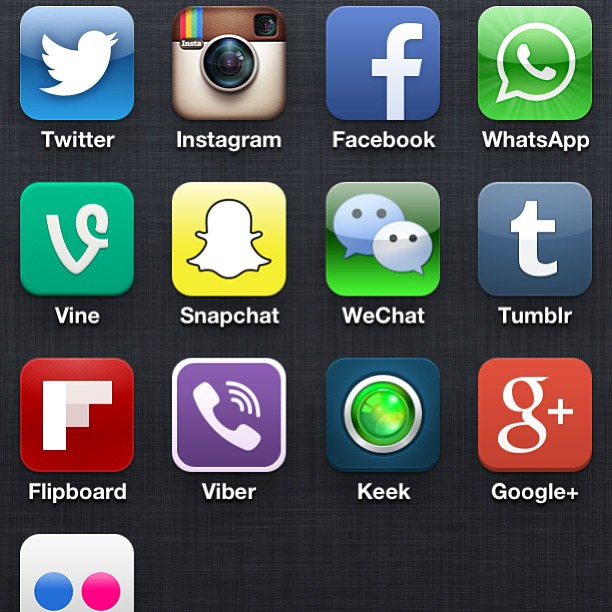

 شراء الشركات التقنية الكُبرى لشركات ناشئة أصبح أمرا مألوفا على الساحة التقنية. هناك عدة أسباب تدفع بالشركات الكبيرة إلى القيام بذلك، تتراوح عادة ما بين الرغبة في الاستفادة من خبرة فريق تطوير الشركة الناشئة، الرغبة في الحصول على عدد إضافي من المُستخدمين أو الرغبة في قتل المنافسة في مهدها. لكن ما يُمكن أن نلحظه هو أن الكثير من عمليات الشراء هذه لا تحقق أهدافها، ويبدو بأن عملية شراء فيس بوك لخدمة Instagram تقع ضمن هذا التصنيف.

 

عملية شراء فيس بوك لـ Instagram تبدو ناجحة لما ننظر إلى الإحصائيات من دون تمحيص، فالشبكة كانت تملك 30 مليون مُستخدم لما قامت فيس بوك بشرائها في شهر أبريل من سنة 2012 والآن بعد مرور 18 شهرا فقط قفز عدد المُستخدمين إلى 150 مليون مستخدم. هذا النُمو السريع يذكرنا بقصة شراء ناجحة أخرى: شراء Google لـ Youtube، حيث أن هذا الأخير أصبح أكثر شعبية بعد أن اشترته الأولى سنة 2006.

ما بين القصتين فارق شاسع جدا، حيث أن Youtube هي المنصة الأكثر شعبية لتشارك الفيديوهات، لكن Instagram ليست بخدمة تشارك الصور الأولى على الهواتف.

أحدث الأرقام التي كشفت عنها فيس بوك تُشير إلى أنه يتم تشارك [55 مليون صورة](http://instagram.com/press/#) على Instagram بشكل يومي إضافة إلى [350 مليون](http://www.businessinsider.com/facebook-350-million-photos-each-day-2013-9) صورة أخرى على فيس بوك نفسها. لكن في المُقابل نجد بأنه يتم تشارك [350 مليون صورة](http://techcrunch.com/2013/09/09/snapchat-now-sees-350m-photos-shared-daily-up-from-200m-in-june/) على Snapchat أيضا و[400 مليون](https://twitter.com/jankoum/status/394259718606053376) على Whatsapp، وما خفي من أعداد الصور التي تُنشر على Line، WeChat وجملة من الخدمات التي سيتم إطلاقها لاحقا قد يكون أعظم. في المُقابل يصل عدد المُستخدمين النشطين على Instagram إلى 150 مليون مُستخدم شهري مُقابل 350 مليون على Whatsapp إضافة إلى العديد من الخدمات الأخرى التي لديها عدد أكبر من المُستخدمين مقارنة بـ Instagram.

وبالتالي يبدو بأن فيس بوك لم تُوفق في التصدي للخطر القادم من المنصات التي تُركز على تقديم خدمة واحدة موجودة في فيس بوك بشكل أفضل بشرائها لـ Instagram حيث أنها اشترت فقط إحدى تلك الخدمات العديدة والتي لا تحتل المرتبة الأولى في القائمة.

مثلما نلحظه فإن كل هذه الخدمات مبنية على أساس أن الهواتف الذكية تملك من الخواص ما يُلغي الحواجز التي وضعتها فيس بوك لمنافسيها على الحواسيب الشخصية، ويتعلق الأمر بكل من:

	  * 

جهات الاتصال على الهواتف الذكية عبارة عن مُخطط اجتماعي جاهز للاستخدام يُمكن للتطبيقات الاعتماد عليه لبناء شبكة اجتماعية لكل مُستخدم.

	  * 

مكتبة الصور على الهواتف الذكية مفتوحة ومُتاحة للاستخدام من طرف جميع التطبيقات

	  * 

التنبيهات تلغي الحاجة إلى فتح المواقع بشكل مُستمر للتحقق من وجود مُحتويات جديد.

	  * 

الانتقال ما بين مُختلف أيقونات التطبيقات على شاشة الهاتف الذكي أسهل بكثير من الانتقال ما بين المواقع على مُتصفح على الحواسيب.

يبدو بأن السلاسة التي يُمكن الانتقال بها ما بين التطبيقات فتح الباب أمام أنماط استخدام لم تكن في الحسبان، فعلى سبيل المثال كان الاعتقاد السائد بأن هذه التطبيقات تقوم باستهداف خاصية مُعينة على فيس بوك وتقوم بتقديم تجربة مُستخدم أرقى لها على تطبيق مُنفصل بشكل كامل عن "التطبيق الأم" فيس بوك، لكن يبدو بأن حقيقة الأمر مُختلفة بشكل ما عن ذلك، حيث أن هذا الفصل ليس واضح المعالم كما قد نتخيل.

يكفي أن نقوم تحليل سريع لكيفية استخدام هذه التطبيقات لنجد بأن المُستخدمين لا يستخدمونها على هذا النحو، حيث أنه لا يتم استخدام Instagram للصور فحسب، أو WhatsApp للرسائل النصية،... بل يستخدمون كل التطبيقات للقيام بكل شيء. فعلى سبيل المثال يُمكن استخدام Instagram لإخبار المُتابعين (أو بعضهم) بأن صاحب الصورة سيتأخر قليلا عن موعده، كما يُمكن استخدام WhatsApp لتشارك صور إجازة مُعنية، Snapchat لتنظيم برنامج أمسية ما وهكذا دواليك. من الخطأ اعتقاد بأنه لا ينافس WhatsApp وinstagram بعضهما البعض فبالرغم من أنهما يقعان ظاهريا ضمن نوعين مُختلفين من التطبيقات إلا أنها يتنافسان على لفت انتباه المُستخدم وعلى وقته. بعبارة أخرى لفهم الوضع بشكل أفضل يجب أن ننظر إلى هذه التطبيقات بأنها تطبيقات تواصل اجتماعي تتنافس في هذا المجال بطرق مُختلفة ولا يُمكن اعتبارها بأي حال من الأحوال تطبيقات مُنفصلة ذات استخدامات مُتباينة.

ولو نظرنا إلى الأمر بهذا المنظور فسنجد بأن هذا التنافس ليس بالجديد، حيث أن هناك 3 تطبيقات "اجتماعية" على هواتفنا ويتعلق الأمر بتطبيق الهاتف (الصوت) تطبيق الرسائل النصية القصيرة، وتطبيق البريد الإلكتروني، ومثلما هو معروف فإننا لا نقوم باستخدام أحد هذه التطبيقات بشكل مُنفصل أو بعضها على حساب الآخر بل نقوم باستخدام كل هذه التطبيقات التي تبدو ظاهريا غير متنافسة للقيام بنفس الأمر ونقصد بذلك "التواصل". وبالتالي فإن هذه التطبيقات الجديدة ليست سوى خيارات إضافية للقيام بنفس الأمر، وهو ما يؤكد بأنه لا يُمكن أن يكون في هذا المجال تطبيق فائز واحد.

يبدو بأن شراء فيس بوك لـ Instagram كانت فكرة صائبة من حيث البعد التجاري لها حيث أن المنصة كانت لتكلف أكثر لو تم شراؤها الآن، لكنها صفقة عديمة الجدوى من حيث بعدها الاستراتيجي، فلن تقدر فيس بوك على شراء كامل المُنافسين في هذا المجال (Whatsapp، Snapchat، Line، Kakao والتطبيقات التي لم تُبصر النور بعد). من المُحتمل جدا أن تختفي بعض هذه التطبيقات مع مرور الوقت، لكن يبدو بأن فيس بوك ليست قادرة على سحق مُنافسيها بنفس الطريقة التي سحقتهم فيها في عالم الحواسيب الشخصية. على الهواتف الذكية لا يُمكن اعتبار فيس بوك سوى "مُجرد تطبيق تواصل اجتماعي آخر".

ربما يجدر بفيس بوك أن تُفكر في إعادة تصميم جوهر منتجاتها للوقوف في وجه هذه التطبيقات الصاعدة بدل بذل الكثير من المال في شراء تطبيقات يتبين لاحقا بأنها لم تكن سوى تطبيق عشوائي من جملة التطبيقات التي تتنافس على وقت وانتباه المُستخدم.

هذا الوضع يُعيد إلى الأذهان عملية شراء أخرى لم تُسل الكثير من الحبر في وقتها، ويتعلق الأمر بشراء Yahoo لخدمة Flickr. ففي فترة سابقة من تاريخ الإنترنت تنافست Yahoo مع AOL على شراء الكثير من خدمات الويب التي كانت ستشكل تهديدا على بواباتها الإلكترونية والتي أسيئت إدارة العديد منها بعد شرائها. ومثلما حدث حينها لم يكن بمقدور Yahoo أو AOL شراء جميع المواقع والخدمات التي كان بإمكانها تشكيل تهديد عليها، وهو ما يحدث الآن مع فيس بوك حيث أنه ليس بمقدورها شراء جميع منافسيها المُحتملين.

ترجمة -وبتصرف- للمقال: [Instagram and Youtube](http://ben-evans.com/benedictevans/2013/11/10/instagram-and-youtube) لصاحبه [Benedict Evans](https://twitter.com/BenedictEvans)
