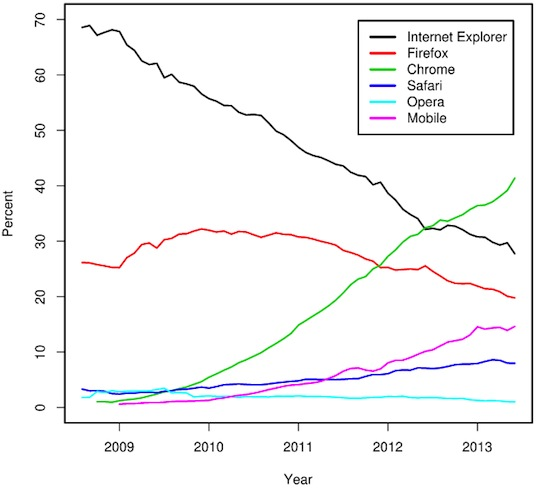
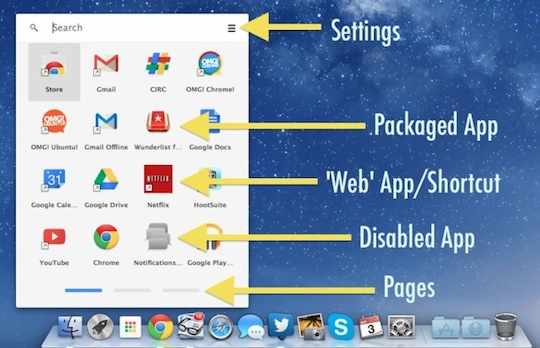
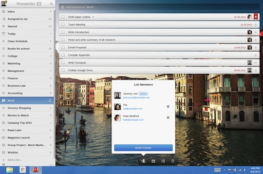
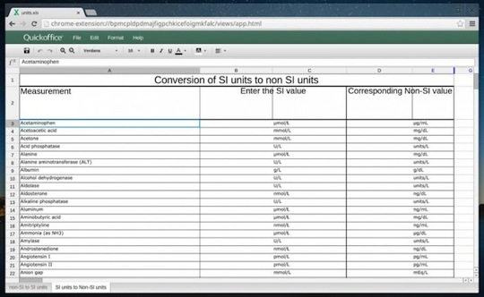

 رافق إطلاق مُتصفح Chrome منذ 5 سنوات مضت الكثير من الحماس، حماس خالطه شك في قدرة Google على فرض نفسها في سوق المُتصفحات. لكن مع مرور الأشهر والسنوات، بدأت تتكشف طموحات Google وخططها لجعل متصفحها ركيزة من ركائز استخدام الإنترنت. وبعد مرور أعوام خمسة على إطلاقه نرى بأن Chrome ليس المُتصفح الأكثر تقدما وإبداعا على الساحة فحسب، بل الأكثر شعبية رغم أن حصص كل مُتصفح تختلف باختلاف مصادر الإحصائيات التي نعتمد عليها.

[caption id="attachment_12662" align="aligncenter" width="540"] حصص مُختلف المُتصفحات حسب إحصائيات StatCounter[/caption]

في سباقها لأسر قلوب المُستخدمين اختار كل مُتصفح مجالا مُعينا للتركيز عليه: البساطة على مُتصفح Safari، الأمن وحماية خصوصية المُستخدم على فيرفوكس إلى جانب الأداء العالي والأجهزة النقالة لمُتصفح Opera. خيار Google كان جعل مُتصفح Chrome مُتصفحا غنيا. منذ سنوات والحديث حول دمج مُتصفح Chrome ونظام Chrome OS مُتواصل، والخواص الجديدة التي تم الكشف عنها خلال الأشهر الماضية تُساهم في إبقاء هذا الحديث مُتقدا، خاصة مع إضافة نظام للتنبيهات إلى المُتصفح ([Chrome 28 arrives with Blink, rich notifications for apps and extensions on Windows; Mac and Linux coming soon](http://thenextweb.com/google/2013/07/09/chrome-28-arrives-with-rich-notifications-for-apps-and-extensions-on-windows-mac-and-linux-coming-soon/) ) إضافة إلى خاصية أكثر أهمية ويتعلق الأمر بـ [packaged apps](http://blog.chromium.org/2013/02/chrome-app-launcher-developer-preview.html) .

لتبسيط الأمر، packaged apps عبارة عن تطبيقات ويب يتم تنفيذها في نوافذ مُنفصلة عن مُتصفح Chrome والتي يُمكن استخدامها من دون الحاجة إلى اتصال إنترنت، كما أنه بإمكانها استغلال موارد الجهاز كمنافذ USB، الاتصال عبر Bluetooth أو عبر TCP/IP وما إلى ذلك. بعبارة أخرى، تطبيقات packaged apps هي تطبيقات ويب أقرب ما تكون إلى التطبيقات الكلاسيكية على نظام التشغيل المُفضل لديك.

<iframe src="//www.youtube.com/embed/lBUGTVIJVfM" allowfullscreen="allowfullscreen" height="315" frameborder="0" width="560"></iframe>

اقتصر استخدام هذه التطبيقات سابقا على فئة المُطورين فقط، والذين لم يكن بإمكانهم الاستفادة منها ما لم يستخدموا إصدارات خاصة من مُتصفح Chrome، كما أنه كان بالإمكان الوصول إليها باستخدام إصدارات أخرى وذلك عبر استخدام مُشغل تطبيقات تتم إضافته في شريط تطبيقات Windows أو [Mac](http://www.omgchrome.com/chrome-app-launcher-for-mac/).

[caption id="attachment_12663" align="aligncenter" width="540"] مُشغل تطبيقات كروم على نظام Mac OS[/caption]

ولدى الاحتفال بمرور 5 سنوات على إطلاق المُتصفح خلال شهر سبتمبر الفارط، قام فريق تطوير Chrome بتضمين الـ packaged apps في [الإصدار ](http://chrome.blogspot.co.uk/2013/09/a-new-breed-of-chrome-apps.html)[30 ](http://chrome.blogspot.co.uk/2013/09/a-new-breed-of-chrome-apps.html)[من المُتصفح](http://chrome.blogspot.co.uk/2013/09/a-new-breed-of-chrome-apps.html)، وتمت إعادة تسيمتها بـ Chrome Apps مع المُحافظة على نفس الخواص: تشغيل التطبيقات في نوافذ مُستقلة، تشغيل التطبيقات في وضع offline بشكل آلي، إمكانية تشغيل التطبيق مُباشرة من شريط التطبيقات في نظام التشغيل... عدد التطبيقات المعنية بالأمر ليس بالكبير، لكن من المُحتمل أن يتغير الوضع مع مرور الوقت. من بين التطبيقات التي تم إطلاقها حينها نجد كل من [The Economist ](https://chrome.google.com/webstore/detail/the-economist/gebjgjhbjedcomcajgpodjgfjgkepgpl), [Pocket ](https://chrome.google.com/webstore/detail/pocket/mjcnijlhddpbdemagnpefmlkjdagkogk), [500px ](https://chrome.google.com/webstore/detail/500px/egpociadnldbkfkjpmjoaibnbcoeplja), [Lucid Chart](https://chrome.google.com/webstore/detail/lucidchart-diagram-app/djejicklhojeokkfmdelnempiecmdomj) إضافة إلى بعض الألعاب مثل [Cracking Sands ](https://chrome.google.com/webstore/detail/cracking-sands-racing/pnafpgbiiobelphegdbieldnmojicndb/), [Tank Riders ](https://chrome.google.com/webstore/detail/tank-riders/gdmmodjlfegeieihcdcgcalkgmhgmiae), [Spelunky ](https://chrome.google.com/webstore/detail/spelunky-html5/mhagnkphcmpkmabhocgimoncfaihkpof/), [They Need to be Fed ](https://chrome.google.com/webstore/detail/they-need-to-be-fed/madbiikglegjjjgpokagkobjaioeekpd). كما نجد تطبيقات لا تحتاج إلى نوافذ لتشغيلها مثل [Pixlr Touch Up ](https://chrome.google.com/webstore/detail/pixlr-touch-up/jklljiahjgoglchglekebfljnmbaleig/), [Any.DOأ](https://chrome.google.com/webstore/detail/anydo/ocgddccilgpeepgglnlpchkpgamkgmld)و [Wunderlist](https://chrome.google.com/webstore/detail/wunderlist-for-chrome/ojcflmmmcfpacggndoaaflkmcoblhnbh).

[caption id="attachment_12664" align="aligncenter" width="540"] تطبيق Wunderlist كمثال عن تطبيق Chrome apps[/caption]

مفهوم إضافات ومُلحقات المُتصفحات ليس جديدا، لكن ما قامت به Google هنا لا يتعلق بذلك وإنما بأمر مُختلف تماما، فمع تطبيقات Chrome apps قامت Google بتحويل مُتصفحها إلى بيئة لتنفيذ التطبيقات بطريقة مُماثلة لما هو عليه الحال مع Java مثلا. لشركات أخرى تجارب مُماثلة لا يُمكن وصفها بالناجحة مثلما هو الحال مع موزيلا وتقنية XulRunner وMicrosoft وتقنية Silverlight. تبدو التطبيقات المُتوفرة حاليا على مُتصفح Chrome مُقنعة إلى حد كبير رغم أنه لا مجال لمقارنتها مع تطبيقات ضخمة كتطبيق Photoshop مثلا، لكن صغر هذه التطبيقات لا يُشكل في حقيقة الأمر مشكلا ويكفي أن نُلقي نظرة على التطبيقات الخفيفة التي تُدر ملايين الدولارات سنويا على SalesForce لدحض الأمر.

مرور 5 سنوات على إطلاق المُتصفح تُعتبر خطوة في غاية الأهمية بالنسبة لـ Google والتي من المُفترض أنها أحكمت خطتها منذ البداية لتجعل من Chrome حلها السحري لمُنافسة Windows على طريقتها:  [Google’s Trojan horse: how Chrome Apps will finally take on Windows ](http://www.theverge.com/2013/9/5/4696618/google-chrome-apps-chrome-os-windows-os-x-blink). الصراع قد انطلق من جديد ولن نمكث طويلا حتى تظهر أولى بوادره. بفضل هذه الخاصية الجديدة فإنه سيصبح بإمكان Google استهداف سوق حواسيب Netbooks بشكل أفضل عبر أجهزة ستكون مُجهزة بنظام لينكس أو عبر أجهزة كروم بوك ([Like netbooks of old, Chromebooks are the fastest growing PC segment. What’s different? ](http://gigaom.com/2013/07/15/like-netbooks-of-old-chromebooks-are-the-fastest-growing-pc-segment-whats-different/)).

يُمكن لنا أن نذهب إلى أبعد من ذلك، حيث يُمكن القول بأن تطبيقات Chrome apps هي البوابة التي ستحتل من خلالها Google سوق الحواسيب الرخيصة، حيث أنه بإمكانها تحويل أجهزة netbook الرخيصة إلى أجهزة قادرة على تنفيذ أغلب ما يرغب فيه المُستخدم بتنصيبه لمُتصفح Chrome واستخدام تطبيقاته ([Nitrous.IO’s packaged Chrome app turns even a $200 Chromebook into a developer machine ](http://thenextweb.com/apps/2013/09/06/nitrous-ios-packaged-chrome-app-turns-even-a-200-chromebook-into-a-developer-machine/)).

بالرغم من أن سوق الحواسيب الرخيصة ليس جذابا مثل باقي الأسواق التي تُحاول Google استهدافها إلا أنه سوق لن يلبث طويلا حتى يتحول إلى قبلة للمزيد من المُوظفين الذين يتوجب عليهم استخدام أجهزة رخيصة للقيام بواجباتهم، خاصة مع الضغوط المُتزايدة على الشركات لتقليص مصاريفها. يبدو بأنه لا تعد تنقص سوى قطعة واحدة لتكتمل الصورة التي تُحاول Google رسمها، ويتعلق الأمر هنا بالتوافقية مع حزمة Office المكتبية وهو أمر قامت Google بإضافته حيث أصبح نظام Chrome OS يدعم ملفات Word و Excel بشكل كامل في الإصدارات الأخيرة من النظام: [Google adds native Microsoft Word and Excel file editing to latest Chrome OS build ](http://thenextweb.com/google/2013/06/28/google-adds-native-microsoft-word-and-excel-file-editing-to-latest-chrome-os-build/).

[caption id="attachment_12665" align="aligncenter" width="540"] تحرير ملفات حزمة أوفيس المكتبية باستخدام Chrome و QuickOffice[/caption]

ما بين هذا واستقالة Steve Balmer من منصبه، Microsoft تمر حاليا في مرحلة لا تُحسد عليها.

ترجمة -وبتصرف- للمقال: [Google transforme son navigateur en environnement d’exécution avec les Chrome Apps](http://www.interfacesriches.fr/2013/09/09/google-transforme-son-navigateur-en-environnement-dexecution-avec-les-chrome-apps/) لصاحبه: [Frédéric Cavazza](https://twitter.com/FredCavazza‎)
