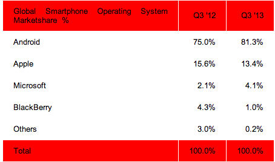
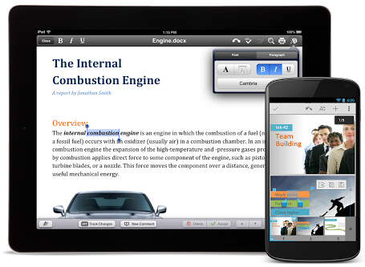
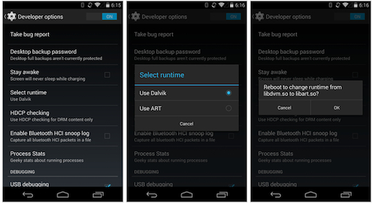

من المُسلّم به بأن نظام **أندرويد** هو النظام الأكثر شعبية على الهواتف الذكية، ويكفي للمُشكك أن يُلقي نظرة على أحدث إحصائيات نشرتها Strategy Analytics ليتحقق من ذلك، حيث تُشير هذه الأخيرة إلى أن نظام **Android** يحتل 81% من مجموع ما تم شحنه من هواتف ذكية خلال الربع الثالث من العام الجاري [Android Captures Record 81 Percent Share of Global Smartphone Shipments in Q3 2013](http://blogs.strategyanalytics.com/WSS/post/2013/10/31/Android-Captures-Record-81-Percent-Share-of-Global-Smartphone-Shipments-in-Q3-2013.aspx). نعم، 4 من كل 5 هواتف ذكية تم شحنها إلى المُوزعين تعمل بنظام تشغيل Google، وهذا لا يرجع بالضرورة إلى كون هواتف أندرويد أفضل من iPhone مثلا (لا داعي لأن نخوض في هذا الجدال العقيم من جديد)، ولكن بكل بساطة لأن نسبة الجودة إلى السعر على هواتف أندرويد أعلى من هذه النسبة على غيرها.

لم تحتج Google سوى لخمس سنوات لفرض نظام التشغيل الخاص بها على السوق، أحدث خلالها جملة من التغييرات على النظام. لم يَشُذ أحدث إصدار من النظام الذي يحمل الترقيم 4.4 والمُسمى بـ KitKat عن القاعدة التي اتبعتها الإصدارات السابقة له حيث أتى بالعديد من التحديثات التي ستُغير من وجه النظام. الأمر ليس راجعا بشكل أساسي إلى تغييرات في شكل النظام فحسب ([10 Things Developers And Users Need To Know About Android KitKat 4.4](http://readwrite.com/2013/11/07/android-kitkat-developers-users)) وإنما لأمور لا تظهر للعين المُجردة بحكم أنها تغييرات تخص الطبقات السُفلى من النظام. لم تمض سوى أسابيع قليلة منذ إطلاق هذا الإصدار، إلا أنها فترة كافية لفهم الثورة التي ستُحدثها عما قريب.

# QuickOffice

أول الغيث مع تطبيق [QuickOffice](https://play.google.com/store/apps/details?id=com.quickoffice.android) الذي يأتي [مُضمن](http://research.gigaom.com/2013/11/google-quickoffice-ships-with-android-kitkat/)[ا في أندرويد ](http://research.gigaom.com/2013/11/google-quickoffice-ships-with-android-kitkat/)[4.4 ](http://research.gigaom.com/2013/11/google-quickoffice-ships-with-android-kitkat/). يسمح [هذا التطبيق الذي قامت ](https://www.it-scoop.com/2012/06/google-quickoffice-meebo/)[Google بشرائه العام الماضي](https://www.it-scoop.com/2012/06/google-quickoffice-meebo/) بتحرير ملفات حزمة Office المكتبية. قامت Google بتضمين التطبيق في هذا الإصدار بُعيد إعلانها عن توفيره بشكل مجاني على متجر Google Play وبربطه بخدمة Google Drive السحابية [Freeing Quickoffice for everyone](https://plus.google.com/+GoogleDrive/posts/Gz5GpSeCW4x).

سيصبح بإمكان الجميع استخدام وتحرير الملفات المكتبية بسهولة أكبر مُباشرة من خلال الهواتف الذكية أو الأجهزة اللوحية من دون الحاجة إلى تطبيقات إضافية، فلم يكن الأمر مُمكنا من قبل بهذه السهولة. هذا الأمر، وتوفير Apple لحزمتها المكتبية بشكل مجاني يجعل Microsoft في وضع حرج نسبيا.

# ART :Android RunTime

الخاصية الثانية التي أثارت ضجة كبيرة هي توفير [ART](http://source.android.com/devices/tech/dalvik/art.html)، الإصدار الجديد من بيئة تنفيذ التطبيقات والذي يُفترض بها أن تستبدل بيئة التنفيذ Dalvik المُستعملة حاليا: [Google starts testing ART, a potential replacement for Dalvik in Android](http://gigaom.com/2013/11/06/google-starts-testing-art-a-potential-replacement-for-dalvik-in-android/). لتلخيص الأمر، تُعتبر Java لغة البرمجة الأساسية لكتابة تطبيقات نظام أندرويد، وبحكم أنها لغة مُتعددة المنصات (أي أنه يُمكن تنفيذ نفس الشفرة البرمجية على أكثر من نظام تشغيل دون الحاجة إلى إعادة كتابتها) فإنه تتم ترجمة الشفرات إلى ما يُعرف بـ [Bytcode](http://en.wikipedia.org/wiki/Java_bytecode) يتم تنفيذه في الآلة الافتراضية الخاصة باللغة، على عكس اللغات الأخرى والتي تتم ترجمتها مُباشرة إلى لغة الآلة ليتم تنفيذها على نظام تشغيل مُعين. إلى غاية الساعة تقوم الأجهزة التي تعمل بنظام Android بالاستعانة ببيئة تشغيل (آلة افتراضية) يُطلق عليها اسم Dalvik والذي يقوم بترجمة (Compil) الـ Bytocode لدى الحاجة ليتمكن من تفسيره (interpret). لكن مع ART (والذي هو اختصار لـ Android RunTime) فإنه سيتم القيام بترجمة مُسبقة (precompilation) مما يسمح برفع مُستوى أداء التطبيقات بشكل عام: [Meet ART, The New Super-Fast Android Runtime Google Has Been Working On In Secret For Over 2 Years](http://www.androidpolice.com/2013/11/06/meet-art-part-1-the-new-super-fast-android-runtime-google-has-been-working-on-in-secret-for-over-2-years-debuts-in-kitkat/).

في حقيقة الأمر تُعتبر هذه الخاصية لوحدها تحديثا في غاية الأهمية، لكن مثلما هو الحال مع الخواص غير الظاهرة للعيان بشكل مُباشر، لا تقوم Google بالترويج لها والحديث عنها كثيرا. لتجربة هذه الخاصية (والتي يبدو بأنها غير متوفرة لدى الجميع) يجب تفعيل وضع المُطورين، واختيار ART مثلما هو مُبين في الصور التالية. ستتم إعادة تشغيل الجهاز للقيام بعملية ترجمة مُسبقة لجميع التطبيقات.

حسب التجارب الأولية لهذه الخاصية، فإن عملية تفعيل ART تستغرق فترة زمنية طويلة نسبيا (تُماثل الفترة التي يتم فيها تحديث النظام)، لكن التحسن في أداء التطبيقات الذي ينتج عن ذلك ملحوظ بشكل واضح. هدف هذه العملية هو تسريع تشغيل التطبيقات وتوفير تجربة مُستخدم أكثر سلاسة.

لكن في المقابل ستحتاج التطبيقات التي خضغت لعملية الترجمة المُسبقة لمساحة تخزين إضافية تُقدر ما بين 10 إلى 20% حسب بعض التجارب الأولية، وهي زيادة مقبولة نظرا للتحسن في أداء التطبيقات. ما لم تكن مُطورا تعي جيدا ما تقوم به فلا يُنصح بتفعيل ART للمُستخدمين العادين حاليا حيث أنه من المُحتمل أن تتوقف بعض التطبيقات جراء ذلك. لم يتم الكشف عن موعد مُحدد لتفعيل هذه الخاصية بشكل قياسي، لكن من المُتوقع أن يتم ذلك في التحديث الرئيسي القادم للنظام (والذي يُحتمل أن يحمل الترقيم 5).

# إصدار جديد من WebView

يحمل الإصدر Kitkat من نظام أندرويد في طياته إصدارا جديدا منWebView، الواجهة البرمجية التي تسمح للتطبيقات باستعراض شفرات HTML / CSS داخل التطبيقات ( [Introducing Chromium-powered Android WebView](http://blog.chromium.org/2013/11/introducing-chromium-powered-android.html)). إلى حد الساعة فإنه تتم الاستعانة بمتصفح أندرويد الافتراضي لاستعراض شفرات HTML المُضمنة في تطبيقات أندرويد، وهو مُتصفح ضعيف الأداء. مع هذا الإصدار الجديد من WebView فإنه سيتم استخدام مُحرك تصيير Chromium الذي يعتمد على مُحرك V8 الخاص بـ JavaScript للقيام بذلك، وهو ما سيُمكن المُطورين من استغلال كامل قوة الثلاثي HTML / CSS / JavaScript داخل تطبيقاتهم: [KitKat’s WebView is powered by Chromium, enabling Android app developers to use new HTML5 and CSS features](http://thenextweb.com/google/2013/11/02/kitkats-webview-powered-chromium-enabling-android-app-developers-use-new-html5-css-features). ما الذي يعنيه ذلك؟ بكل بساطة سيحصل أندرويد على تطبيقات أكثر كفاءة، أسرع وأكثر ثباتا...

# Portable Native Client

آخر خاصية في هذه السلسلة هو إطلاق [Portable Native Client](http://blog.chromium.org/2013/11/portable-native-client-pinnacle-of.html) التقنية التي ستسمح للمُطورين بترجمة شفرات C /C++ وتنفيذها مُباشرة داخل المُتصفح مع المُحافظة على مُستوى أدائها كاملا: [Google launches Portable Native Client, lets developers compile their code to run on any hardware and website](http://thenextweb.com/google/2013/11/12/google-launches-portable-native-client-lets-developers-compile-code-run-hardware-site/). مثلما هو عليه الحال مع WebView فإن إطلاق هذه الخاصية لم يكن مُمكنا لو لم يتم استبدال المُتصفح الافتراضي السابق بمُتصفح Chrome. بفضل Portable Native Client سيُصبح بإمكان هواتف أندرويد تنفيذ تطبيقات "ثقيلة" من خلال مُتصفح كروم تماما مثلما يُمكن تنفيذها على الحواسيب الشخصية باستخدام تقنية [Nacl](https://www.it-scoop.com/2013/10/google-mozilla-kill-plugins/) (الأخ الأكبر لخاصية Portable NaCl). ما نتحدث عنه هنا هو خاصية في غاية الأهمية والقوة، لكن من جديد بحكم أنها تقنية يصعب شرحها وتقديمها للُمستخدم البسيط فإن Google لا تُحاول إضاعة الكثير من الوقت في الترويج لها، فليس من الهيّن أن تشرح لمستخدم بسيط مدى أهمية أن يسمح PnaCl بترجمة تطبيق مكتوب بلغة C++ إلى Bytecode للتمكن من تنفيذه على هاتف ذكي سواء كان يعتمد على معمارية ARM، x86 أو MIPS، وهو أمر يُمكن القيام به على مُتصفحات أخرى بفضل واجهة Pepper البرمجية.

لتلخيص الوضع، يُمكن القول بأن الإصدار 4.4 من نظام أندرويد عبارة عن إعادة بناء كاملة لبيئات تنفيذ التطبيقات (سواء كانت مكتوبة بـ Java أو بـ C/C++) وتطبيقات الويب (المكتوبة بـ HTML5)، وبالتالي التطبيقات الهجينة أيضا. من المُبكر جدا أن نقيس مدى تأثير هذه التغييرات على تجربة المُستخدم واستهلاك الطاقة، لكن في كل الأحوال سيكون تأثيرا إيجابيا بشكل عام يستفيد منه المُستخدم.

ترجمة -وبتصرف- للمقال: [Google prépare la révolution des interfaces Android](http://www.interfacesriches.fr/2013/11/12/google-prepare-revolution-interfaces-android/) لصاحبه: [Frédéric Cavazza](https://twitter.com/FredCavazza)
