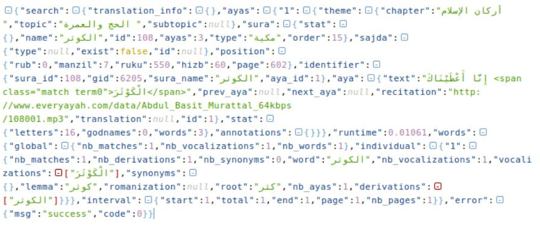
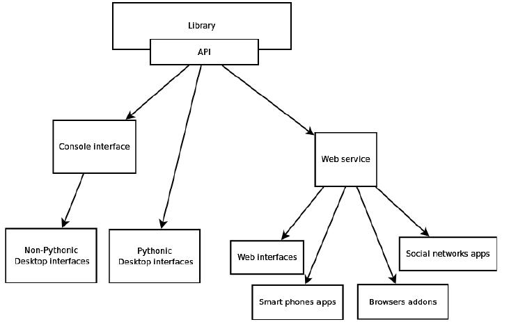

أطلق فريق مشروع **[الفانوس](http://alfanous.org/ar/aya/)** إصدارًا جديدًا من واجهته البرمجية (API) تعتمد على نظام مُخرجات جديد، بقاعدة برمجية مُوَّحَدَة له مُتَشَاركة بين كل من تطبيق الويب، سطح المكتب، CGI، أو عبر واجهة الصَّدَفة (Console interface). تحمل الاسم التشفيري «**الحجر الأسود**»  .

ولمن لا يعرف معنى [API](http://ar.wikipedia.org/wiki/%D9%88%D8%A7%D8%AC%D9%87%D8%A9_%D8%A8%D8%B1%D9%85%D8%AC%D8%A9_%D8%A7%D9%84%D8%AA%D8%B7%D8%A8%D9%8A%D9%82%D8%A7%D8%AA)، هي واجهة برمجية (لا رسومية) تسمح بنقل البيانات من مكتبة برمجية أو قاعدة البيانات أو محرك البحث على هيئة مُتعارف عليها بحيث تكون تلك الهيئة مفهومة من طرف عدة لغات برمجة على مختلف المنصات مثال ذلك [XML](http://ar.wikipedia.org/wiki/%D9%84%D8%BA%D8%A9_%D8%A7%D9%84%D8%AA%D8%B1%D9%85%D9%8A%D8%B2_%D8%A7%D9%84%D9%82%D8%A7%D8%A8%D9%84%D8%A9_%D9%84%D9%84%D8%A7%D9%85%D8%AA%D8%AF%D8%A7%D8%AF) و[JSON](http://ar.wikipedia.org/wiki/%D8%AC%D8%B3%D9%88%D9%86).

في حالة الفانوس، فإنه تم مراعاة [فصل الاهتمامات](http://ar.wikipedia.org/wiki/%D9%81%D8%B5%D9%84_%D8%A7%D9%84%D8%A7%D9%87%D8%AA%D9%85%D8%A7%D9%85%D8%A7%D8%AA) في تصميمه أو ما يعرف بـ [SoC،](http://en.wikipedia.org/wiki/Separation_of_concerns) أي أن مختلف الواجهات الرسومية (سواء على سطح المكتب أو الويب) منفصلة عن بعضها وعن الشفرة المصدرية لنواة المحرك، هذا الأخير يتلقى الاستعلام ولا يهمه من أرسل الاستعلام، فقط يرجع النتيجة على هيئة JSON، ميزة هذه الأخيرة أنه يمكن لأي تطبيق ويب، هاتف، سطح مكتب، إضافة مستعرض أو أي خدمة أخرى فهمها واستغلال نتيجتها مباشرة وعرضها.

**يبقى هنا أمران:**

	  * 

كيف يتم بناء ملف الـ JSON وعلى أي أساس؟

	  * 

من يوصل ذاك الـ JSON إلى التطبيق المنشود؟

أما البناء، فيكون بتعليم كل آية، اسمها، رقمها، سورتها، نوعها، موضوعها وجميع المعلومات الخاصة بها برقم أو مُتغير، ليكون الناتج وصفا مُلما بجميع الجوانب الدلالية، اللغوية والرقمية لتلك الآية، وإخراجه في ملف على هيئة JSON كما توضحه الصورة التالية:

أطلق مشروع الفانوس على هذا التخريج اسم JSON Output System أو اختصارا JOS، وقد تم توحيده في الإصدار الجديد وجعله مركزيا Centralized ، أي نفس النظام يخدم جميع أقسام المشروع، هذا يُسهل من عملية تطويره وإضافة الميزات عليه من مكان واحد.

تبقى مسألة من يوصل ناتج الـ JSON هذا إلى التطبيق المنشود؟  وهنا يأتي دور واجهات الفانوس، والتي تم تقسيمها حسب نوع التطبيقات

	  * 

واجهة الصدفة Console Interface، يُمكن استدعاؤها من الحواسيب العادية وتطبيقات سطح المكتب، أو الطرفية.

	  * 

واجهة خدمة الويب  Web service Interface، يمكن استدعاؤها من طلبات http.

	  * 

مكتبة بايثون، يمكن جلبها مباشرة في أي مشروع بايثون والاستفادة منها مباشرة في الشفرة البرمجية.

الصورة التالية توضح التقسيم الجديد للواجهة البرمجية لمشروع الفانوس:

نداء الواجهة البرمجية الجديدة لا يقوم فقط على تمرير كلمات البحث أو نص الاستعلام، فقد تم أيضا إدراج مبدأ "الأعلام" Flags والتي عن طريقها يمكن تخصيص نتيجة الاستعلام وزيادة كفاءتها.

فمثلا لو أردت أن تكون نتيجة البحث مشكولة يُمكنك رفع راية Vocalized، ولو أردت النتائج مرتبة حسب معيار معين يمكنك رفع راية sorted مع قيمة معيار الترتيب، ولو أردت البحث عن تلك الكلمة وجذور الكلمة ومترادفاتها أيضا يمكنك رفع راية البحث المُبهم Fuzzy Search، [وهكذا …](https://github.com/Alfanous-team/alfanous/tree/master/src/alfanous#flags)

بعض مما تم ذكرة حتى الآن كان موجودا قبل الإصدارة الجديدة، إذا:

**ماذا حملت الإصدارة الجديدة بالضبط ؟**

لتلخيص الأمر فقد جاءت الإصدارة الجديدة بالتغيرات التالية، مع الحفاظ على التوافقية الرجعية Backward-compatibility مع الواجهة البرمجية السابقة:

	  * 

تحسين في قائمة الأعلام [flags](https://github.com/Alfanous-team/alfanous/tree/master/src/alfanous#flags) وجعلها أكثر بداهة، حيث لا يُشترط رفع أو إعطاء قيم جميع الأعلام، أما تسمح في التحكم في كثافة النتائج.

	  * 

إدراج رموز الأخطاء للإخبار عن حالة الاستعلام في حالة فشله أو نجاحه.

	  * 

قابلية طلب معلومات الواجهة البرمجية الوصفية، يشمل ذلك معلومات عن: النسخة، رقمها، الرخصة، المؤلف، الترجمات والتلاوات المتوفرة، رسائل مساعدة وغير ذلك.

	  * 

نظام اقتراحات قائم على: النطق القريب للكلمة، تشكيل مُغاير للكلمة، مشتقات الكلمة، مُرادفاتها.

	  * 

إمكانية البحث وعرض النتائج بالكتابة اللاتينية للكلمة العربية باستعمال [Buckwalter](http://en.wikipedia.org/wiki/Buckwalter_transliteration).

	  * 

تحسين جلب الموارد، حيث تم تفويض جلب التلاوات، نص المصحف وترجماته إلى مصادر خارجية موثوقة بغية الإبقاء على رشاقة المشروع وجلب آخر الإصدارات من الموارد المذكورة.

	  * 

وحدات بحث متعددة، من ذلك بحث في الترجمات وبحث بالكلمة

	  * 

إعادة تنظيم شاملة كاملة للشفرة المصدرية لملاءمتها مع معايير جودة الشفرة القياسية.

**ما يُميز الفانوس:**

	  * 

أنه مشروع حر مجاني. لا إعلانات، لا يتطلب دفعا أو نقود، يمكن للجميع المشاركة في تطويره، التصميم له، ترجمته، بناء خدمات قائمة عليه.

	  * 

قائم على عمل بحثي، وليس مجرد مسح على نص القرآن الكريم.

	  * 

غني بالميزات وقابل ﻹثرائه بالمزيد منها.

الجدير بالإشارة أيضا، أن مؤسس المشروع ، [عاصم شلي](http://chiffra.blogspot.com/)، قام مؤخرا بعمل فيديو شاملة تشرح أقسام المشروع، كيفية تجهيزه للتجريب المحلي، وكيفية استدعاء مختلف الواجهات البرمجية.

<iframe src="//www.youtube.com/embed/wY1Nc-mgQNY" allowfullscreen="" width="560" frameborder="0" height="315"></iframe>

**ساهم في إخراج هده الإصدارة:**

	  1. عاصم  شلي (  Assem Chelli ) كمطّور: [G+](https://plus.google.com/u/0/+AssemChelli), [Twitter](https://twitter.com/assem_ch), [Blog](http://chiffra.blogspot.com), [Github](https://github.com/assem-ch)
	  2. وليد زيوش  (Walid Ziouche ) كمُختبر: [G+](https://plus.google.com/u/0/103271465015435002020), [Twitter](https://twitter.com/01walid), [Blo](http://01walid.com/)[g, Github](https://github.com/01walid)
	  3. أشرف على العمل البحثي الذي يقف عليه المشروع  الأستاذان [عمّار بالة](http://balla.esi.dz) و[ طه زروقي](http://tahadz.com)

قائمة المساهمين في المشروع ككل موجودة [هنا](https://github.com/Alfanous-team/alfanous/blob/master/AUTHORS.rst)

لمعرفة المزيد حول الأمر:

[صفحة الإصدار على Github](https://github.com/Alfanous-team/alfanous/releases/tag/API_0.7.01)

[وثيقة تشرح آلية عمل الواجهة البرمجية بشكل مُفصّل](https://docs.google.com/file/d/0B4k3dJT6t3wPRHlFSWNhcDNRRGc/edit)
