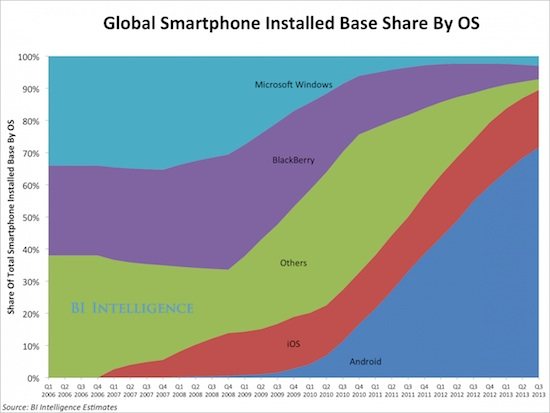
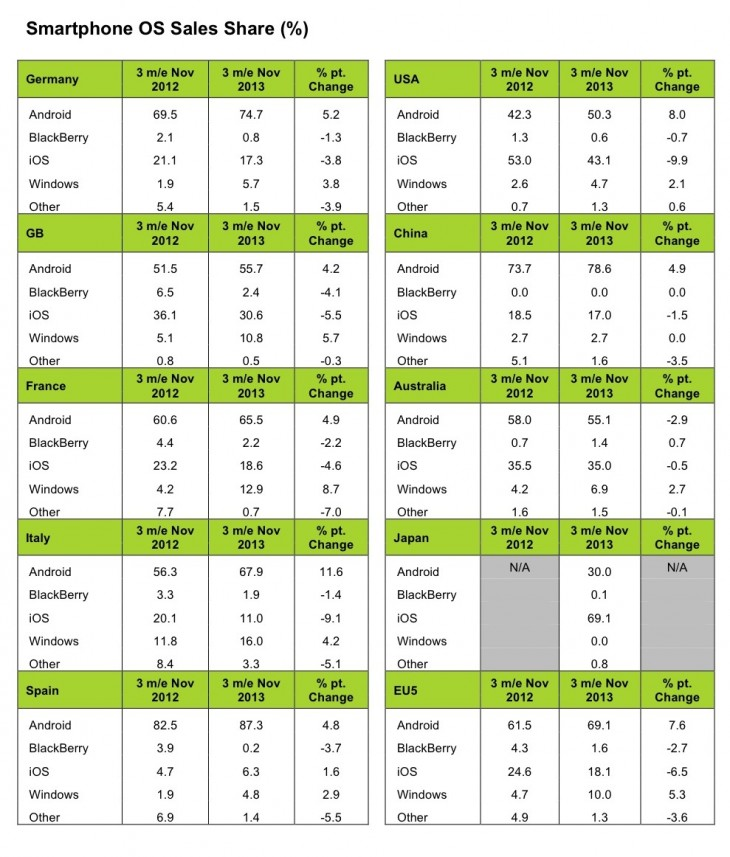
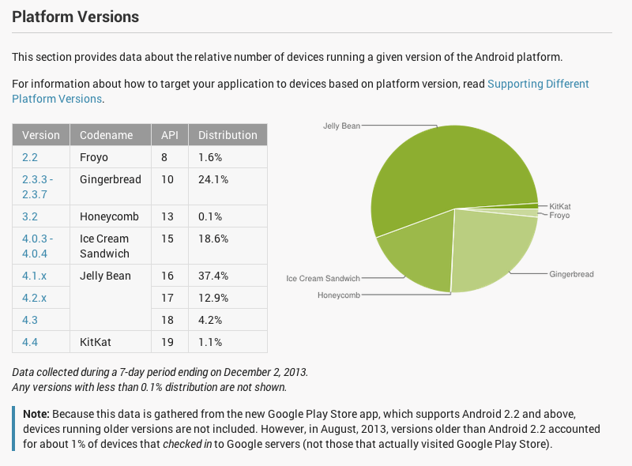
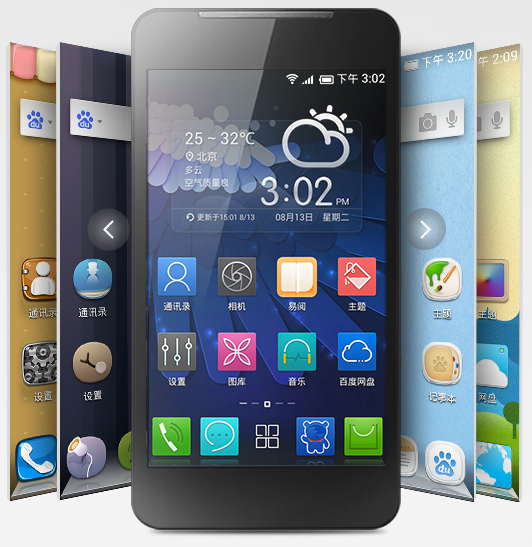

مع بداية هذا العام الجديد أصبحت هيمنة نظام** Android** على **الهواتف الذكية** أمرًا لا يقبل التشكيك، وهو ما يُجيز لفرق عمل Google التي جعلت من هذا الحُلم حقيقة أن تفرح بإنجازها. رغم ذلك فإن النجاح الذي يُفترض أن تجنيه Google من نظام تشغيلها ليس واضح المعالم بحكم تعقيد بيئة الهواتف الذكية الحالية. توفير نظام تشغيل مجاني سمح لعملاق البحث أن يُسجل حضورا قويا لدى مُختلف مُصنعي الهواتف الذكية، إلا أن هناك جانبا مُظلما لهذه القصة المُشرقة، فلم تعُد Google قادرة على فرض سيطرتها على نظام تشغيل الهواتف خاصتها، وهو ما يُعقد مهمة مُنتجي المُحتوى ومُطوري مُختلف الخدمات التي يتم استهلاكها واستغلالها على الهواتف الذكية المُجهزة بنظام Android بُحكم تعقيد السوق الحالي وصعوبة التحكم فيه.

## حصة تُقدر بنحو 75% من سوق الهواتف الذكية

من المعروف سابقا بأن نظام** أندرويد** كان يشهد نُموا متزايدًا، لكن الإحصائيات الحديثة المنشورة حول الأمر تُعطي صورة أوضح حول حجم هذا النُّمو ومكانة هذا النظام في السوق والتي تُشير إلى[ أنه ما لا يقل عن ](http://www.businessinsider.com/androids-dominance-on-smartphones-2013-11)[7 هواتف ذكية من كل ](http://www.businessinsider.com/androids-dominance-on-smartphones-2013-11)[10 تستخدم نظام أندرويد](http://www.businessinsider.com/androids-dominance-on-smartphones-2013-11).

المُثير للانتباه في الرسم البياني أعلاه هو أن هواتف iPhone لم تمتلك يومًا حصة سوق مُعتبرة، حيث أن سيطرة هواتف Apple لم تكن سوى على الانتباه والتغطية الإعلامية، فلم يسبق له أن تجاوز نسبة 20% من السوق العالمية.

وإذا ركزنا على هذه الإحصائيات أكثر لوجدنا بأن الأسواق الأنجلوفونية واليابان [مُختلفة عن باقي الأسواق العالمية](http://thenextweb.com/insider/2014/01/06/report-apple-faces-challenges-gaining-smartphone-sales-market-share-lg-sony-nokia/?utm_source=buffer&utm_campaign=Buffer&utm_content=buffer660cf&utm_medium=twitter#!rzc5N)، فحسب أحدث الإحصائيات المُقدمة من طرف Kantar Worldpanel نجد التالي:

 	  * 

تُسجل هواتف iPhone سيطرة مُطلقة على الأسواق اليابانية بحصة تُقدر بنحو 70% من السوق.

 	  * 

استطاع نظام iOS الصمود في الولايات المُتحدة أين يملك نسبة 43% من السوق، وهو أمر مُماثل لباقي الأسواق الأنجلوفونية (المملكة المُتحدة، كندا وأستراليا).

 	  * 

يُسيطر أندرويد على باقي الأسواق العالمية بنسب لا تقل عن 70%، ويصل الأمر إلى غاية 87% في إسبانيا مثلا.

على خلاف المُتوقع فإن هذه الإحصائيات تُشير إلى أن حصص iOS ليست بذلك الارتفاع الذي رسمته وسائل الإعلام في أذهاننا. أمر آخر يجب الانتباه إليه وهو أن التركيز أصبح يُوجه أكثر فأكثر صوب الأسواق الآسيوية بحكم أنها الأسواق التي لديها القدرة على النمو بشكل أسرع. هذه الأخيرة تعرف سيطرة واسعة لنظام أندرويد، حيث [سجلت مبيعات الهواتف الذكية نُموا قدره ](http://thenextweb.com/asia/2013/12/02/report-smartphone-sales-surge-61-in-southeast-asia-android-dominates-with-72-share/)[61%](http://thenextweb.com/asia/2013/12/02/report-smartphone-sales-surge-61-in-southeast-asia-android-dominates-with-72-share/) في الربع الثالث من العام المُنصرم في بلدان جنوب شرق آسيا، وتُقدّر حصة أندرويد في هذه الأسواق بنحو 72%. أما فيما يخص الهند فيعرف أندرويد [نُموًا مُشابها خلال نفس الفترة](http://www.techinasia.com/idc-android-windows-phone-growing-market-share-india-q3-2013/) رفعت حصته في السوق الهندية إلى نحو 81%.

رغم ذلك فإن المُصنعين "الأسطوريين" لم يقولوا كلمتهم بعد، حيث [لا تزال علامة ](http://thenextweb.com/asia/2013/12/16/nokias-brand-is-still-strong-in-emerging-markets-report-suggests/)[Nokia ](http://thenextweb.com/asia/2013/12/16/nokias-brand-is-still-strong-in-emerging-markets-report-suggests/)[التجارية قوية في أسواق البلدان الناشئة](http://thenextweb.com/asia/2013/12/16/nokias-brand-is-still-strong-in-emerging-markets-report-suggests/) وحال Apple بدأ يتغير إلى الأفضل بعد أن [أصبح بإمكانها الوصول إلى ](http://www.theverge.com/2013/12/22/4710262/apple-iphone-china-mobile-deal)[700 ](http://www.theverge.com/2013/12/22/4710262/apple-iphone-china-mobile-deal)[مليون مُشترك لدى ](http://www.theverge.com/2013/12/22/4710262/apple-iphone-china-mobile-deal)[China Mobile](http://www.theverge.com/2013/12/22/4710262/apple-iphone-china-mobile-deal). لكن رغم السمعة الجيدة التي تملكها شركة التفاحة المقضومة فإن مهمة إيقاف زحف الشركات الصينية اتجاه الأراضي التي تحتلها لن يكون سهلا، خاصة وأن المواجهة لا تتم مع شركة واحدة فحسب، وإنما مع رتل من المُصنعين ([Xiaomi ](http://www.xiaomi.com/en), [LTE ](http://wwwen.zte.com.cn/en/), [Oppo ](http://en.oppo.com/), [Huawei ](http://www.huawei.com/), [Lenovo ](http://www.lenovo.com/), [Yulong ](http://www.yulong.com.cn/), [Coolpad ](http://www.yulong.com.cn/), [Meizu ](http://en.meizu.com/)…) الذين لن تكون مهمة إزاحتهم سهلة.

توجه الأنظار الجميع نحو الصين حاليا راجع إلى كونها أكبر سوق حاليا وبلد التصنيع في آن واحد، وهو ما يجعلها في وضع خاص جدا، هذا ما دفع مثلا بشركة [Xiaomi الصينية إلى توظيف ](http://allthingsd.com/20130828/androids-hugo-barra-departs-google-for-chinas-xiaomi/)[Hugo Barra](http://allthingsd.com/20130828/androids-hugo-barra-departs-google-for-chinas-xiaomi/) أحد رموز أندرويد الذي "سرقته" من Google وضمه إلى فريقها.

## أندرويد في كل مكان، لكن...

مثلما نلاحظه فلقد استطاع نظام أندرويد أن يحول التأخر الذي كان يعرفه سابقا إلى تقدم وأن يزاحم هواتف iPhone.[ تُشير إحصائيات ](http://thenextweb.com/google/2014/01/07/android-will-pass-1-billion-users-across-devices-2014-according-gartner/)[Gartner](http://thenextweb.com/google/2014/01/07/android-will-pass-1-billion-users-across-devices-2014-according-gartner/) بأنه من المُتوقع أن يتجاوز عدد مُستخدمي نظام أندرويد حاجز المليار مُستخدم خلال 2014. الأدهى والأمر (من وجهة نظر Apple) هو احتلال أندرويد للمركز الأول في مجال الأجهزة اللوحية أيضا، وهنا [تُشير إحصائيات ](http://thenextweb.com/mobile/2013/12/04/idc-estimates-221m-tablets-shipped-in-2013-android-top-with-61-then-ios-35-and-windows-3/)[IDC](http://thenextweb.com/mobile/2013/12/04/idc-estimates-221m-tablets-shipped-in-2013-android-top-with-61-then-ios-35-and-windows-3/) بأنه تم شحن 221 مليون جهاز لوحي سنة 2013، قُدّرت حصة أندرويد منها بنسبة 61%، ثم تلاها iOS بنسبة 35% و Windows بنسبة 3%، كما أن ملامح هيمنة أندرويد على سوق السيارات الذكية بدأ في التوضح أيضا حيث تُحاول Google تكرار تجربتها مع الهواتف الذكية في مجال السيارات الذكية بإطلاقها لحلف [the Open Automotive Alliance](http://www.theverge.com/2014/1/6/5279116/google-open-automotive-alliance-android-car-announcement) والذي يضم كلا من Audi، Honda، GM وغيرها.

استطاع نظام أندرويد بفضل استراتيجية الاعتماد على الانتشار الكبير للهواتف الذكية الرخيصة أن يفرض نفسه في السوق، هذه الاستراتيجية ليست خالية من المشاكل والأخطاء حيث أنها تمت على حساب "تجانس" أجهزة مُستخدميه، فما نُشاهده حاليا على السوق ليس أندرويدا واحدا وإنما مجموعة أندرويدات، كما أن عمليات التحديث عليها تتم بشكل بطيء جدا مُقارنة بنظام iOS، حيث تُشير [بعض الإحصائيات](http://gigaom.com/2013/12/04/fragmentation-lives-ios-7-now-on-74-of-iphones-while-kitkat-has-only-reached-1-of-android-devices/) إلى أن 74%من هواتف iPhone تستخدم iOS7، في حين أن نسبة انتشار إصدار KitKat لا يتعدى 1% من إجمالي الأجهزة التي تعتمد على أندرويد.

المُشكل الآخر الذي يُعاني منه نظام أندرويد هو كون الغالبية العُظمى من مُستخدمي الهواتف الذكية المُجهزة به لا تستخدمه [كهواتف ذكية وإنما كمجرد هواتف عادية](http://www.businessinsider.com/apple-android-market-share-ecommerce-2014-1) صادف أن تكون مجهزة بنظام أندرويد. وحسب سيمون خالف مدير شبكة Flurry الإعلانية على الهواتف فإن مُستخدمي نظام أندرويد لا يُمثلون سوى ¼ المداخيل التي يُسجلها نظراؤهم على هواتف iPhone. بل هناك بعض الإحصائيات التي تُشير إلى أن 1/3 مُستخدمي هواتف أندرويد لا يقومون بتنصيب أية تطبيقات عليها في حين لا يقوم ثُلث آخر بتنصيب سوى 3 إلى 4 تطبيقات. يُعتبر هذا الوضع مُزعجا جدا خاصة إذا ما كان مصنعو الهواتف الذكية هم الذين يُقررون أي التطبيقات التي يتم تنصيبها بشكل قياسي.

## Google تفقد السيطرة على منتوجها

لنفهم الوضعية الحرجة التي تمر خلالها فرق تطوير Google فإنه يكفي أن نُسلط الضوء على أجهزة Amazon اللوحية، فأجهزة Kindle Fire مثلا مُجهزة بنظام أندرويد، لكنه أندرويد مُختلف ومُعد خصيصا ليسمح لشركة Amazon بفرض واجهاتها وخدماتها. فعلى سبيل المثال سنجد على هذه الأجهزة متجرًا للتطبيقات مُختلفًا. ما يزيد الطين بلة هو الجهود الصينية المُختلفة لتطوير إصدارات مُختلفة من نظام أندرويد خاصة بكل مُصنّع:

 	  * 

شركة Alibaba ونظامها [YunOS](http://www.yunos.com/) (والذي كان يحمل الاسم Aliyun سابقا).

 	  * 

شركة Baidu صاحبة التوزيعة [ROM](http://rom.baidu.com/home) (التي كانت تحمل اسم Baidu Yi سابقا) والتي [تتخلّص من خدمات ](http://9to5google.com/2011/09/05/baidu-launches-its-own-android-based-mobile-os-in-china-leaves-out-google-search-and-services/)[Google لتعوّضها بخدماتها الخاصة](http://9to5google.com/2011/09/05/baidu-launches-its-own-android-based-mobile-os-in-china-leaves-out-google-search-and-services/).

 	  * 

Tencent التي فضلت [الاستثمار](http://www.techinasia.com/tencent-invested-android-alternative-cyanogenmod-heres-matters/) في توزيعة CyanogenMod بدل تطوير توزيعة خاصة بها.

ما نستخلصه مما سبق ذكره هو أنه ما لم تُسارع Google [إلى تغيير قواعد اللُعبة](http://www.visionmobile.com/blog/2013/11/the-naked-android/) فإنها في طريقها إلى خسارة هذه اللعبة التي قامت هي بتصميمها بشكل كامل. صحيح بأن سيطرة أندرويد لا مجال للشك فيها إلا أنها سيطرة تمت على حساب سيطرة Google عليه. بعبارة أخرى، **نظام أندرويد أصبح نظام تشغيل للهواتف الذكية عام يقوم كل طرفه بتطويعه حسب حاجاته**. ولتجنب فقدان السيطرة بشكل كامل على نظامها تسعى Google إلى فرض توجه مُعين في سوق هواتف أندرويد الذكية عبر تسويق نماذج تتماشى مع نظرتها للنظام عبر هواتف Nexus 5 و Moto X. إضافة إلى الحصول على براءات الاختراع التي تملكها، لم تكن عملية شراء Google لشركة Motorola خالية من رغبتها في توفير عرض مُتكامل يشكل العتاد والنظام معا.

انقسام نظام أندرويد إلى مجموعة توزيعات مُختلفة يُشكل هاجسا حقيقيا لعملاق البحث خاصة وأن من يقم وراءها هي جهات تقوم بتوفير خدمات بديلة لخدمات Google الأساسية والتي تملك نوعية مُعينة تسمح لها بمنافسة خدمات Google الأصلية، وهو أمر يظهر جليا مع Baidu الصينية والتي تملك مُحرك بحث، خدمة خرائط، بوابة تسوق إلكتروني وغيرها. بعبارة أخرى، **يُمكن اعتبار Google الخاسر الأكبر هنا بحكم أنه لم تعد قادرة على استرجاع مداخيل من نظامها عبر الإعلانات أو عبر باقي خدماتها**.

لمواجهة المُنافسة التي يفرضها المنافسون عليها وعلى نظامها، تقوم فرق تطوير Google  بالعمل على استراتيجية جديدة والتي يُعتبر التركيز على مُتصفح Chrome أحد أعمدتها**. هناك عدة مشاريع حالية تُعطي الانطباع بأن مُتصفح Chrome سيكون حجر الزاوية في استراتيجية Google الجديدة في مجال الهواتف الذكية**:

 	  * 

إطلاق إصدار جديد من Webview وPortable Native Client، للمزيد حول الأمر اقرأ المقال التالي: [خواص غير مُعلن عنها في الإصدار ](https://www.it-scoop.com/2013/12/android-kitkat-revolution/)[4.4 من نظام ](https://www.it-scoop.com/2013/12/android-kitkat-revolution/)[Android تُمهّد لثورة في عالم الأجهزة المحمولة](https://www.it-scoop.com/2013/12/android-kitkat-revolution/)

 	  * 

مشاريع لنقل التطبيقات التي تعمل على Chrome إلى الهواتف الذكية، ومن المُحتمل أن يتم [إطلاق أولى إصدارات ذلك بداية هذا العام](http://thenextweb.com/google/2013/12/03/google-building-chrome-apps-support-android-ios-beta-release-coming-soon-january-2014/).

خلاصة القول: Google بصدد تحويل مُتصفح Chrome إلى بيئة لتنفيذ التطبيقات الخفيفة (للمزيد حول الأمر اقرأ المقال:[Google تُحول مُتصفحها إلى بيئة لتنفيذ التطبيقات بفضل تطبيقات ](https://www.it-scoop.com/2013/11/google-chrome-apps/)[Chrome Apps](https://www.it-scoop.com/2013/11/google-chrome-apps/))، وبناء على ذلك لن يكون المُطورون في حاجة إلى تضييع الكثير من الوقت لضمان التنفيذ الحسن لتطبيقاتهم على بيئات مُختلفة، حيث يكفي أن يقوموا بتطوير خدمات أو مُحتويات تكون على هيئة تطبيقات أصيلة Native applications يتم تنفيذها داخل المُتصفح، وهو ما سيُوفر عليهم الكثير من الجهد والوقت. مبدأ تطبيقات الهواتف الغنية أو ما يُعرف بـ **Rich Mobile Application** ليس بالجديد، لكن المُنافسة الصينية الشرسة ستدفع بـ Google إلى مُضاعفة جهودها لتنفيذ تصور لم تقدر Adobe على جعله حقيقة (من خلال تطبيق AIR على نظام أندرويد).

إن وُفقت Google في مساعيها فإن الجميع سيستفيد من ذلك:

 	  * 

سيُقلل مُنتجو المُحتوى والتطبيقات من كُلفة الإنتاج وسيفتح لهم المجال للوصول إلى شريحة أكبر من المُستخدمين.

 	  * 

سيكون بإمكان المُستخدمين الوصول إلى مُحتويات وتطبيقات عالية الجودة دون الحاجة إلى المرور عبر متاجر التطبيقات.

 	  * 

وستضمن Google بأن مُستخدمي نظامها لن يقوموا باستبدال مُتصفح Chrome بمتصفحات أخرى.

هدف Google من كل هذا هو ضمان مداخيل ثابتة من الإعلانات عبر فرضها لمُتصفح Chrome لأن المُطورين -وبحكم أنه لن يعود بإمكانهم بيع خدماتهم عبر متجر تطبيقات-  سيلجؤون إلى تمويل خدماتهم عبر الإعلانات، وهو ما سيتم عبر شبكة Google الخاصة بذلك (AdMob) وبالتالي ستزيد درجة تحكم Google في منصتها.

سيكون عام 2014 حاسما لـ Google ولنظام أندرويد خاصة في ظل المنافسة الصينية. السيناريو الأسوأ بالنسبة لـ Google هو قيام Samsung بإطلاق نسختها المُعدلة (بالمفهوم الذي سبق استعراضه أعلاه) من نظام أندرويد، وهو ما سيُعقد الوضع بالنسبة لـGoogle التي ستُضطر للقتال على أكثر من جبهة...

ترجمة -وبتصرف- للمقال: [Le succès d’Android ne profitera pas forcément à Google](http://www.terminauxalternatifs.fr/2014/01/07/le-succes-dandroid-ne-profitera-pas-forcement-google/).
