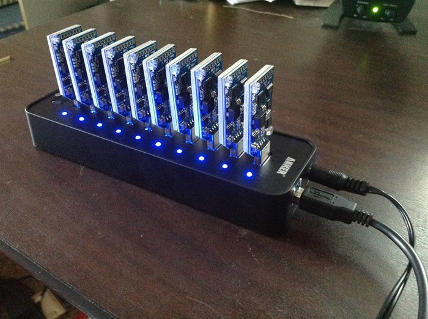

منذ ما يزيد عن العام والكل يتحدث عن عُملة Bitcoin، ويزداد الحديث عنها مع كل تجاوز لقيمة 1000 دولار (صعودا أو نزولا) لهذه العُملة، أو مع كل تراجع مُخيف لقيمتها. إن كنت تبحث عن مقالات مُفصلة لتفهم ما يجعل من هذه العُملة مُهمة فإنك إما ستجد مقالات الصحافة المُوجهة للعوام والتي عادة ما تُهمل الكثير من التفاصيل المُهمة، أو أنك ستجد مقالات لبعض مهووسي التقنية التي تُركز بشكل أساسي على جانب التشفير الخاص بالعُملة. هذا المقال عبارة عن مُحاولة للإتيان بشيء ما بين هذين البينين ولمُحاولة تسليط المزيد من الضوء على آلية عملة هذه العُملة والنتائج التي تترتب على ذلك. إذا لم تكن لديك أية فكرة حول هذه العُملة، فقد يكون من الأفضل أن تبدأ بمقال سبق أن نشرناه على المجلة حول [عملة بيتكوين](https://www.it-scoop.com/2013/05/bitcoin/) قبل أن تواصل قراءة هذا المقال.

**ملاحظات:**

	  * استخدمت في هذا المقال "بيتكوين" بدل Bitcoin، إضافة إلى جمعها على النحو التالي: "بيتكوينات"
	  * سنستعمل طيلة هذا المقال  مُصطلح "بيتكوين" للدلالة على العُملة، الشبكة الخاص بهذه العُملة والبروتوكول المُستعمل في هذه الشبكة دون الإشارة بالضرورة بشكل صريح إلى كونها عملة، شبكة أو بروتوكول.
	  * لدى الإشارة إلى المقال (بـ "لدى كتابة هذه السطور" مثلا فإن الأمر راجع إلى المقال الأصلي وليس المُترجم)
	  * قد لا تكون بعض الترجمات (خاصة المُصطلحات التقنية) دقيقة جدا (إن كانت لديك ترجمات أدق فلا تترد في إضافتها كتعليق).

## عُملات تشفيرية Cryptocurrencies

بيتكوين عبارة عن عُملة تشفيرية cryptocurrncy. هدف العُملات التشفيرية هي السماح للمُستخدمين بإرسال مبالغ مالية لبعضهم البعض على الإنترنت عبر شبكة [الند للند](https://ar.wikipedia.org/wiki/الند_للند) دون الحاجة إلى سلطة مركزية لمُراقبة عمليات الدفع والتحويل وهذا مع المحافظة على مجهوليته anonymity. لا تشترط العُملات التشفيرية فتح أي نوع من الحسابات، فكل ما تحتاجه هو تنصيب تطبيق خاص بالعُملة التي ترغب في استخدامها يتولى مهمة توليد "عُنوان" يتم استخدامه لإرسال واستقبال التحويلات. بطبيعة الحال لن تظهر لديك أية عملات تشفيرية بمُجرد أن تقوم بتنصيب هذا التطبيق، وعليه فإنك ستحتاج إلى أن تُقنع من يملكها بأن يُعطيك أو يبيعك بعضا من العُملات التي بحوزته، قبل أن يُصبح بمقدورك القيام بعمليات دفع عبر هذه العُملات. يُمكنك أيضا أن تحصل على العُملات التشفيرية عبر عملية التنقيب mining، لكنها طريق شاقة وطويلة ومن شأنها أن لا تُعطيك النتائج التي تصبو إليها من دون أن تستثمر في مُعدات تنقيب خاصة بذلك.

ربما قد تعتقد بأن بيتكوين هي العُملة التشفيرية الوحيدة الموجودة على شبكة الإنترنت حاليا، لكن الأمر ليس كذلك إطلاقا. قد تكون بيتكوين العُملة الأولى من نوعها والأكثر شهرة وانتشارا، لكن لدى كتابة هذه السطور كان عدد هذه العُملات[ لا يقل عن ](http://www.theguardian.com/technology/2013/nov/28/bitcoin-alternatives-future-currency-investments)[60 ](http://www.theguardian.com/technology/2013/nov/28/bitcoin-alternatives-future-currency-investments)[عُملة مُختلفة](http://www.theguardian.com/technology/2013/nov/28/bitcoin-alternatives-future-currency-investments) منها ما لا يقل عن 8 عُملات توصف [بالرئيسية](https://en.wikipedia.org/wiki/List_of_cryptocurrencies#Major_markets) حسب ويكيبيديا. لم تتم الإشارة في مقال ويكيبيديا إلى الأسباب التي تجعل من هذه العُملات رئيسية لكن يبدو بأنه تم الاعتماد بشكل أساسي على عدد المُستخدمين وبنية كل شبكة، إضافة إلى الأماكن التي يُمكن استبدال وشراء هذه العُملات التشفيرية مُقابل عُملات أخرى.

باستثناء عُملة Ripple فإن جميع العُملات التشفيرية الحالية مبنية على مبدأ عمل عُملة بيتكوين نفسها، فبحكم أن عُملة بيتكوين مفتوحة المصدر فإنه بإمكان من أراد ذلك استنساخ العُملة وإدخال بعض التعديلات عليها ومن ثم إطلاق عُملة جديدة. آلية الاستنساخ هذه وتوفير تطبيق لُعملة جديدة هي الأسهل في عملية إطلاق عُملة تشفيرية جديدة، حيث أن إقناع المُستخدمين باعتماد هذه العُملة واستخدامها أصعب بكثير، حيث يحتاج أصحاب هذه العُملات الجديدة إلى إضافة مزايا لا تتوفر في بيتكوين نفسها أو باقي العُملات التشفيرية، مما يعني بأنك ستحتاج إلى إدخال تعديلات عميقة على عُملة بيتكوين. تقوم كل من العُملات التشفيرية الحالية باقتراح ما تراه الخاصية (أو الخواص) التي تجعلها أفضل من بيتكوين.

بالرغم من هذا المقال مُخصص لبيتكوين وآلية عمله فإنه -وبحكم أن باقي العُملات مبنية عليه- يكفي أن تفهم مبدأ عملها لتفهم مبادئ عمل باقي العُملات

## التنقيب: اسم خاطئ أم مُبالغة مقصودة؟

ساهم الرعيل الأول من مُستخدمي بيتكوين في نشر فكرة خاطئة حول هذه العُملة والتي تنص على أنه يتم استخراج هذه العُملات من مناجم (أي يتم التنقيب عنها). قد نفهم السبب الكامن وراء اختيار هذا المُصطلح لربط هذه العُملة بالمعادن الثمينة كالذهب والفضة، لكن يبدو بأن اختيار هذا المُصطلح أضاف الكثير من الغموض ولم يُسهل فهم آلية عمل هذه العُملة. لكي تتضح الصورة بشكل أفضل فيجب أن نعلم بأن مُبدعي عُملة بيتكوين لم يخترعوا أية آليات جديدة في عالم التشفير وإنما اعتمدوا على ما هو مُتعارف عليه في مجال التشفير ليضمنوا أن عمليات الدفع التي تتم عبر هذه العُملة آمنة عبر شبكات الند للند وهو أمر في يُعتبر في حد ذاته إنجازا عظيما.

[caption id="attachment_12760" align="aligncenter" width="420"] منصة تنقيب[/caption]

مبدئيا يُمكن اعتبار بيتكوين كسجل حسابات ضخم يحتفظ بأي "عنوان" يملك أي بيتكوين. تقون كل نسخة من تطبيق بيتكوين بتحميل نسخة كاملة من هذا الدفتر وهو ما يُمكن الجميع من التوافق والتفاهم على أي عُنوان يُملك أي بيتكوين. تقوم شبكة بيتكوين بحماية هذا السجل من أي عمليات تغيير مُحتملة عبر جُملة من عمليات التشفير التي تنتج عنها هاشات Hash وعمليات إثبات العمل proof of work. لا تعرف ما المقصود بهذه المُصطلحات؟ إليك شرحا لها:

يتم استخدام تقنيات Hashing في عدة مجالات برمجية. الفكرة التي تقوم عليها هذه العمليات هو أخذ بيانات ذات طول مُعين وتوليد "توقيع" خاص بها ذي طول مُحدد يكون عادة أقصر بكثير من طول البيانات الأصلية لكنه يقوم بتمثيلها والنيابة عنها.

لنأخذ المثال التالي: لنفرض بأنني أرسلت إليك ملفا كبير الحجم ترغب في تحميله، ولنفرض بأن هناك احتمال أن يُصاب هذا الملف بعطب خلال عملية التحميل. لنتحقق من أن الملف الذي أنهيت تحميله هو نفس الملف الذي قمت بإرساله لك من دون أية أعطاب أو تغييرات فإنه يكفي أن نقارن ناتج عملية تدقيق المجموع checksum (أحد أبسط الأمثلة عن استخدام تقنيات Hashing) للملف المُرسل والملف الذي تم تحميله. كل ما تحتاجه للقيام بعملية checksum هو جمع جميع البايتات (Bytes) في الملف وكلما تجاوز المجموع قيمة مُعينة تقوم أنت بتحديدها (ولنفرض أننا نود الحصول على نتيجة من رقمين فقط) فإننا نتخلص من الفائض ونواصل عملية الجمع. بمعنى أنه لو كانت نتيجة الجمع الحالية تُساوي 89 وكانت القيمة التالية التي ستقوم بإضافتها هي 22 فإن المجموع الذي كان يُفترض به أن يكون 111 سيتحول إلى 11 فقط (بعد التخلص من الفائض المُتمثل في المئة) ونواصل عملية الجمع. بعد إنهاء عملية الجمع هذه سينتج لديك عدد مُكون من رقمين فقط يقوم بتمثيل الملف، حيث أن أي تغيير أو عطب يُصيب الملف لدى التحميل سينتج عنه تغير في قيمة عملية checksum الملف المُحمّل مُقارنة بناتج نفس العملية على الملف الأصلي. بعبارة أخرى إن كانت نتيجة عملية checksum على الملفين مُتطابقة فإن احتمال تعرض الملف لعطب أو تغيير مُنخفض جدا. يتم استخدام الهاشات أيضا للتحقق من سلامة البيانات وعدم تعرضها للتغيير، فلو كنت أملك قيمة الهاش لمعلومة مُعينة فإنه يُمكنني معرفة ما إذا تم إحداث تغيير عليها بمُجرد التحقق من قيمة الهاش ومُقارنتها بالقيمة الأولى، وهذا بالتحديد ما يقوم به بيتكوين للحفاظ على سلامة بيانات سجله الضخم، إلا أن العملية التي يستخدمها بيتكوين ليست عملية checksum التي لا تملك أي بُعد تشفيري، وإنما يستخدم الهاشات التي تنتج عن خوارزمية التشفير SHA256 رغم أن مبدأ عمل الخوارزمية هو نفسه.

يقوم بيتكوين بحفظ كل معلومة/مُدخلة في سجله مرفقة بهاش خاص بها وبالتالي فإنه يُمكن للجميع التحقق من صحة البيانات وعدم تغييرها. لكن ألا يكفي إن أردت تغيير البيانات في حد ذاتها أن أقوم بإعادة احتساب الهاش من جديد؟ نعم هذا صحيح، ولهذا يستخدم بيتكوين مبدأ إثبات العمل Proof of work لتجنب ذلك.

تم استخدام مبدأ "إثبات العمل" لأول مرة لإيقاف عمليات السخام وهجمات الحرمان من الخدمات على الخواديم [DoS](http://www.google.dz/url?sa=t&rct=j&q=&esrc=s&source=web&cd=1&cad=rja&ved=0CCQQFjAA&url=http://en.wikipedia.org/wiki/Denial-of-service_attack&ei=izz_UraLBsL9ygOFjoKACg&usg=AFQjCNGQMBQkEGt6-Hpi3XPDb5VEcoLJ5Q&sig2=HcTfBnygB_QzmcPxTCTFVg&bvm=bv.61535280,d.bGQ). مبدأ "إثبات العمل" بسيط بدوره. لنأخذ المثال التالي: لنفرض بأنني أقدم خدمة على الإنترنت ترغب في استخدامها، سيسرني أن أسمح لك باستخدامها لكنني لا أرغب في أن تقوم باستغلالها استغلالا بشعا. للحد من ذلك سأقوم في كل مرة ترغب في استخدام هذه الخدمة بإرسال "أحجية" لك تقوم بحلها أولا قبل أن تتمكن من استخدام الخدمة. يُفترض بهذه الأحجية أن تكون صعبة للحل لكن يجب أن تكون آلية التحقق من الإجابة سهلة، وبالتالي ينشأ لدينا نظام يتم الحد فيه من عدد المرات التي يُمكنك استخدام الخدمة فيه لأنك ستحتاج في كل مرة إلى وقت مُعتبر لحل الأحجية قبل استخدام الخدمة. الإشكال مع مبدأ "إثبات العمل" هو إيجاد أحجيات تحتاج إلى عمل "شاق" وطويل لحلها لكن يسهل علي التحقق من النتيجة. من بين الطرق الأكثر شيوعا لعمل هذه الأحاجي هي استخدام عمليات hashing (التي سبق وأن شرحناها فيما سبق). على سبيل المثال، ينتج عن خوارزمية SHA-256 هاشات بطول 256 بت (والتي يُمكن تمثيلها باستخدام أعداد ذات 77 رقم). أغلب ما ينتج خوارزمية SHA-256 هي أعداد مُكونة من 77 رقما، إلا أن هناك مجموعة من النتائج تكون أقصر طولا من ذلك ولا تستخدم الأرقام الـ 77 كاملة، ولهذا نقوم بملء الخانات المُتبقية بأصفار (الخانات على يسار الهاش طبعا) لتكون جميع الهاشات بنفس الطول المُحدد لها (أي 77 خانة). تُعتبر هذه الهاشات التي تكون خاناتها الأولى (من اليسار) أصفارا نادرة لكنها مُوزعة بشكل متوافق . المقصود بذلك هو أنه يُمكنني أن أرسل لك أحجية أعطيك فيها بيانات مُعينة وأطلب منك أن تُنتج لي اعتمادا عليها إحدى هذه الهاشات النادرة مع السماح لك بتغيير بعض البايتات (يحتوي كل بايت byte على 8 بت bit) المُعينة ضمن هذه البيانات. صعوبة الأحجية تكمن في عدم قدرتك على معرفة أي البايتات بالتحديد يجب عليك أن تقوم بالتغيير وأي قيمة يجب عليك إعطاؤها لتحصل على النتيجة المطلوبة وبالتالي فإن الحل الوحيد الذي يبقى أمامك هو استخدام تقنية [Brute force](http://en.wikipedia.org/wiki/Brute-force_attack) (أي تجربة جميع الاحتمالات المُمكنة الواحدة تلو الأخرى) حتى تصل إلى النتيجة المرغوب فيها. هذه العملية تحتاج إلى الكثير من الوقت والجهد، حيث أنه لو كان عدد البايتات التي ستقوم بتعديلها هو 4 فقط فهذا سيضعك أمام أكثر من 100 مليون عملية للتحقق منها (4,294,967,295 على وجه التحديد). لكن سيبقى بإمكاني التحقق من النتيجة التي توصلت إليها بكل سهولة لأن سيكفي أن أقوم بعملية هاش واحدة للتحقق من النتيجة. بحكم أن الهاشات الأصغر طولا هي الأكثر ندرة فإنه يُمكن التحكم في مقدار العمل الذي يجب عليك القيام به عبر التحكم طول الهاشات التي أطلبها. إن كان الحصول على هاشات بطول 70 رقما سهل نسبيا فإن الحصول على هاشات بطول 60 رقما أصعب بكثير من ذلك، وكلما قصر طول الهاش كلما ازدادت درجة التعقيد. يشترط بيتكوين في هاشات SHA-256 التي يستخدمها للحفاظ على سلامة بيانات سجله أن تكون قصيرة ونادرة. بعبارة أخرى يتوجب على كل من يريد أن يقوم بتغيير بيانات هذا السجل أن يقوم بإعادة حساب هاش المُدخلة التي يود تغييرها. ليس هذا فحسب، فبحكم أن كل مُدخلة مُرتبطة ببعضها البعض حيث أنه يتم إرفاق هاش المُدخلة السابقة في كل مُدخلة جديدة فإن يجب على من يريد إدخال تغيير على مُدخلة مُعينة أن يعيد حساب هاشات كل المُدخلات التي تليها. بعبارة أخرى مقدار القوة الحاسوبية التي تحتاجها لتغيير مُدخلة مُعينة يُصبح كبيرا جدا، حيث أن كُلفة القيام بذلك تكون أكبر بكثير من القيمة التي يُمكن لك أن تجنيها لو تمكنت فعلا من إحداث ذلك التغيير.

الآن وبعد أن فهمنا مبدأ عمل سجل بيتكوين الضخم، فلنلق نظرة على ما يقوم به المنقبون وكيف يتم إنتاج بيتكوينات جديدة، بالرغم من أن عملية "الإنتاج" هذه هي أحد المفاهيم الخاطئة أيضا. يقوم مالكو بيتكوين الذين يرغبون في القيام بعمليات التحويل من حساب بيتكوين إلى آخر بنشر هذه الطلبات عبر شبكة الند للند الخاص ببيتكوين وتكمن مهمة المُنقّبين في جمع هذه العمليات والتحقق منها. بعد القيام بعملية التحقق يحتاج المنقّبون إلى إضافتها إلى سجل بيتكوين وللقيام بذلك يحتاجون إلى حساب هاش خاص بذلك، وبحكم أن بيتكوين عبارة عن نظام يعتمد على مبدأ "إثبات العمل" فإن عملية حساب هذا الهاش صعبة. يتنافس المنقّبون فيما بينهم حيث يسعى كل واحد للقيام بهذه العمليات قبل غيره حيث يُسمح لأول منقب ينهي العمية أن يُضيف عملية تحويل إضافية إلى السجل بقيمة 50 بيتكوين يقوم بإرسالها إلى أي عنوان يرغب فيه، وعادة ما يكون هذا العنوان هو عنوان المُنقّب الخاص به، وتُعتبر عملية التحويل هذه كمكافئة نظير القيام بالعمل اللازم لتحديث السجل. وبُمجرد أن يجد أحد المُنقّبين الهاش الذي يبحث عنه يقوم بنشر هذه المعلومة في شبكة الند للند الخاص بالعُملة ليقوم باقي المنقّبون بالتحقق من أن العملية قد تمت بشكل سليم. مُكافئة 50 بيتكوين التي تُدفع مُقابل التحقق من كل كتلة تحويلات block of transactions هو سعر توافقي فقط والسبب الوحيد الذي يقف وراء عدم تمكن المُنقّبين من مُكافئة أنفسهم بأكثر من 50 بيتكوين مُقابل هذه العمليات هو أن خشيتهم من أن يرفض باقي المُنقّبين تلك العملية وبالتالي يُصبح عناء المُنقّب هباء منثورا.

حسب هذه الآلية فإن ما يقوم به المنقّبون ليس تنقيبا ولا إنتاجا، فكل بيتكوين ما هو سوى قيمة مُرتبطة بعنوان تتحكم فيها، وبالتالي فإن المُنقّبين أقرب ما يكونون من مُحافظي الحسابات الذين يتم الدفع لهم حسب عدد العمليات التي قاموا بالتحقق منها، كما أنه يجب عليهم مُنافسة بعضهم البعض حيث أنه لن يتم الدفع سوى لأسرعهم.

هناك نُقطة في غاية الأهمية يجب أخذها بالحسبان وهو أن مهمة المُنقّبين لا تقتصر على إيجاد بيتكوينات جديدة، بل تُعتبر المهمة التي يقومون بها في غاية الأهمية لضمان استمرار بقاء بيتكوين وما يتم دفعه لهم هو نظير هذا العمل الحيوي للعملة.

تم بناء بيتكوين لضمان نوع مُعين من التوازن داخل النظام، حيث تم تصميمها بشكل يضمن حدا مُعينا من مُعالجة عمليات التحويل، حيث تتم إضافة "كتلة" جديدة للسجل كل 10 دقائق تقريبا. يُطلق على القيمة التي تضمن هذا التوازن اسم " الصعوبة" Hardness والتي يتم تحديدها نسبة إلى طول هاش SHA-256 الذي يشترط النظام إيجاده. تتم الموافقة على قيمة Hardness جديدة كل أسبوعين تقريبا، وبحكم أن الاهتمام بعُملة بيتكوين في تزايد مُستمر فإن هذه الصعوبة في تزايد مُستمر في ظل تزايد عدد المُنقّبين داخل النظام.

هذا الأمر يدفعنا إلى التساؤل عن سر استعارة مُصطلحات التنقيب عن المعادن الثمينة للحديث عن عملة بيتكوين فكما هو واضح مما سبق ذكره فإن ما يقوم به مُنقّبو بيتكوين بعيد كل البعد عن ما يقوم به المنقّبون الذين ينقبون عن المعادن الثمينة. الظاهر أن استخدام مثل هذه الاستعارات لا يهدف سوى لإشباع غرور المُنقبين ولإعطائهم قيمة ربما لن يحصلوا عليها لو أطلقوا على أنفسهم اسم "محافظي حسابات"، حيث أن التنقيب عادة ما يُربط بالذهب وهو أمر قد يروق للتقنين وصف أنفسهم به. وربما قد يكون سر ذلك راجع إلى الرغبة في الربط ما بين قيمة بيتكوين الافتراضية وما يُقابلها من قيمة حسية على أرض الواقع، حيث أن القيام بالعمليات الحسابية التي يتطلبها بيتكوين تحتاج إلى استهلاك كميات كبيرة من الطاقة الكهربائية، بل وأصبح الأمر يتطلب الاستثمار في عتاد خاص ([ASIC](https://en.wikipedia.org/wiki/Application-specific_integrated_circuits)). وربما تهدف هذه التسمية إلى فصل الارتباط الذهني الموجود ما بين إنتاج البيتكوينات وعمليات التحويل ومُعالجتها.

لكن ما الحاجة إلى القيام بذلك؟ بحكم أن عدد البيتكوينات التي يمكن إنتاجها محدود ومعروف (21 مليون بيتكوين)، وإن فهمت بأنه لا يتم فعلا إنتاج بيتكوينات جديدة وإنما تُعتبر مكافئة تُدفع مقابل مُعالجة عمليات التحويل التي تمت، فإنك قد تشرع في التساؤل حول السبب الذي يجعل عدد البيتكوينات محدودا؟ أليس كذلك؟ (يعني ما هو السبب وراء تحديد عدد البيتكوينات الإجمالي إن كانت طريقة إنتاجها هي مُجرد تحقق من عمليات سابقة؟). العدد الإجمالي للبيتكوينات محدود لأنه يتم تخفيض المُكافئة التي تُدفع للمُنقبين مُقابل ما يقومون به إلى النصف كل 4 سنوات، حيث كان هذا الثمن 50 بيتكوينا في البداية ونزل مؤخرا إلى 25 بيتكوين فقط. أضف إلى ذلك بأنه سيتم التوقف عن الدفع بمجرد إنتاج الكمية القصوى المُمكنة للبيتكوينات المُقدرة بـ 21 مليون بيتكوين، وهو ما يدفع إلى التساؤل عن الأشخاص الذين سيواصلون القيام بالتحقق من عمليات التحويل إن لم يتم الدفع مقابل ذلك. يبدو بأنه لا توجد إجابة واضحة ومُقعنة لهذا التساؤل بعد، رغم أنه من المُمكن لمُستخدمي بيتكوين أن يدفعوا تكاليف التحقق من العمليات للمُنقبين، ويبدو بأنه لا يتم القيام بذلك حاليا.

من المتوقع جدا أن يلجأ المنقبون إلى المُطالبة برسوم حول عمليات التحويل التي يقومون بتأكيدها، لكن سيحتاج الأمر إلى إجماع المنقبين على هذا الأمر. لفهم الإشكال الذي قد يطرحه الوضح الجديد، تخيلوا الأمر التالي: سيقوم بعض المنقبين بفرض رسوم مُعينة في حين سيواصل البعض في القيام بعمليات التحقق من دون أية رسوم إضافية. لما أقوم بعملية تحويل دون أن أدفع رسوما مقابل تأكيد العملية، فإن المُنقب الذي يفرض تلك الرسوم لن يقوم بتأكيد العملية وهو ما سيؤخر إتمام عملية التحويل إلى غاية قدوم المُنقب الذي لا يفرض أية رسوم، وهو ما قد يُعقد الوضع أكثر.

## العناوين ونقمة/نعمة اللامركزية

الآن وبعد أن فهمت كيف يتم تحويل الأموال وكيف يتم تأكيدها، قد تتساءل: “وماذا عن العناوين؟ وكيف تتحكم هذه العناوين في البيتكوينات المرتبطة بها؟". تعتمد العناوين على مبدأ آخر في مجال التشفير لم نتطرق إليه بعد والمتُعلق بـ "التشفير اللامُتناظر" أو ما يُعرف بالتشفير باستخدام مفتاح عام ومفتاح خاص [public/private key cryptography](http://en.wikipedia.org/wiki/Public-key_cryptography).

فهم مبدأ التشفير ليس مُعقدا كما أنه لا يرتبط بالحوسبة بشكل أساسي. يقوم التشفير على المبدأ التالي: لدي رسالة أود إرسالها لكن لا أرغب في أن يكون بمقدور الجميع قراءتها ولهذا أقوم بتشفيرها، وهو ما يمنع غير القادرين على فك تشفيرها من قراءتها.

للتشفير مكونان أساسيان: خوارزمية التشفير ومفتاح التشفير. خوارزمية التشفير هي الطريقة التي سيتم تشفير الرسالة اعتمادا عليها أما المفتاح فهو ما يُحدد النتيجة التي ستكون عليها الرسالة المُشفرة. أهمية المفتاح تمكن في استحالة فك تشفير الرسالة من دونها حتى ولو كانت خوارزمية التشفير معروفة، حيث أن فك التشفير يقتصر على من يمتلك المفتاح فقط. تستعمل عدة خوارزميات تشفير نفس المفتاح للتشفير ولفك التشفير، يُطلق على هذه الخوارزميات اسم خوارزميات التشفير المُتناظر [symmetric encryption](http://en.wikipedia.org/wiki/Symmetric-key_algorithm). هذه الخوارزميات آمنة إلا أن المُشكل الذي تطرحه هو حول آلية تشارك المفتاح التي يجب أن تتم بشكل آمن، وهو ما يضعنا أمام إشكال آخر، هل يجب أن نقوم بتشفير المفتاح قبل إرساله؟ لكن كيف سنقوم بذلك؟

لحل هذا الإشكال، تم التوصل إلى خوارزميات التشفير اللامتناظرة التي تستعمل مفتاحين، مفتاح عام يُمكن تشاركه مع الجميع، ومفتاح خاص يتم الاحتفاظ به بشكل سري. يملك كل من أراد استخدام هذه الخوارزميات المفتاحين معا، وبالتالي لا حاجة لتشارك المفتاح الخاص مع أي كان. في هذه الحالة إذا أردت أن تراسلني برسالة مُشفرة أكون الوحيد القادر على فك تشفيرها فما عليك سوى تشفيرها بمفتاحي العام الذي نشرته على الإنترنت وسأقوم بفك تشفيرها بالمفتاح الخاص.

يُمكن لهذه الآلية أن تعمل في الاتجاه المُعاكس أيضا، فإن قمت بتشفير رسالة باستخدام المفتاح الخاص الذي بحوزتي فإنه لا يُمكن فك تشفيرها سوى بالمفتاح العام الذي سبق وأن نشرته على الإنترنت. يُمكن استخدام هذا المبدأ لإثبات الملكية، فإن قمت بتشفير رسالة بمفتاحي الخاص وكنت قادرا على فك تشفيرها بمفتاحي العام فإنه يُمكن التثبت بأن الرسالة تم تشفيرها بمفتاحي الخاص وبالتالي فإنك ستتأكد بأنني فعلا من أرسل تلك الرسالة. يُطلق على آلية التحقق هذه اسم "**التوقيع**" [Digital signature](http://en.wikipedia.org/wiki/Digital_signature) وهو ذات المبدأ الذي يستخدمه بيتكوين لضمان أن مالك عنوان مُعين هو الوحيد القادر على استخدامه للقيام بعمليات تحويل البيتكوينات المُرتبطة به.

يتم توليد عناوين بيتكوين باستخدام مُختلف التطبيقات الخاص به. عملية التوليد تتم بشكل سريع، ويُمكنك توليد أي قدر من العناوين الذي ترغب فيه. يملك كل عنوان مفتاحا خاصا وآخر عاما مُرتبطين به. بُمجرد أن يستقبل عنوان ما بعض البيتكوينات فإنه يصبح إنفاقها مُمكنا باستخدام المفتاح الخاص به، وما سيقوم به المنقبون حينها هو استخدام المفتاح العام المُرتبط بهذا العنوان للتحقق من أن قام بعملية التحويل هو فعلا صاحب المفتاح الخاص المُرتبط بالعنوان المعني بالعملية، ولن تتم مواصلة العملية ما لم يتم التأكد من ذلك.

المشكل الذي تُعاني منه هذه الطريقة هو أنه سيستحيل عليك إنفاق البيتكوينات المُرتبطة بعنوان مُعين بمُجرد أن تفقد المفتاح الخاص المُرتبط به، ولا يوجد أي حل لهذه المُعضلة، كما أن هناك عدة أساليب يُمكن لك أن تفقد ذلك المفتاح من خلالها. إن كانت النسخة الوحيدة من مفتاحك الخاص موجودة على حاسوبك، وإن فقدت حاسوبك أو أصاب قرصه الصلب عطب ولم تتمكن من استرجاع مُحتوياته فإن كل الأموال المُرتبطة بذلك المفتاح ستذهب من دون رجعة لأنه وبكل بساطة لا وجود لأية سلطة مركزية يُمكنك أن تُقدم إليها شكوى أو أن تطلب مُساعدتها لاسترجاع أموالك، حيث أن نظام بيتكوين لامركزي وأنت الوحيد المسؤول عن حفظ مفتاحك الخاص. الحل الوحيد أمام مُعضلة فقدان المفاتيح الخاصة هو حل وقائي فقط، ويتمثل في حفظ نسخ منها في أماكن مُختلفة، رغم أن هذا الحل غير مثالي، حيث يكفي أن يُسرق القرص الذي حفظت عليه نسخة المفتاح الخاص حتى يتمكن السارق من نقل بيتكويناتك. قد تُفكر في حفظ مفتاحك الخاص على الشبكة أو على إحدى خدمات التخزين السحابية لتتجنب المشاكل المُترتبة عن سرقة أجهزتك، لكن في هذه الحالة بُمجرد أن يتم اختراق حساباتك على خدمات التخزين هذه حتى تتعرض مفاتيحك الخاصة للخطر. يُمكن أيضا تشفير هذه المفاتيح باستخدام تطبيق بيتكوين الذي تستخدمه، إلا أن ذلك لن يضيف سوى طبقة حماية إضافية يُمكن أن تكسر أيضا. إن وضع سارق يده على نسخة من مفتاحك الخاص فإنه سيصبح بإمكانه تحويل بيتكويناتك إلى أي عنوان يوده، وحينها لن يكون بإمكانك سوى تتبع عملية التحويل مُتحسرا وذلك لغياب سلطة مركزية يُمكن اللجوء إليها، ولكون عمليات تحويل البيتكوينات غير قابلة للعكس.

## مجهولية Anonymity بيتكوين

من المُتعارف عليه بأن عُملة بيتكوين تتمتع بقدر عالٍ من المجهولية. مبدئيا الأمر صحيح، حيث أن كل ما تحتاجه لإرسال بعض البيتكوينات لشخص آخر هو عنوانه فقط. لكن بحكم أنه يتم تسجيل كل عملية تحويل في سجل بيتكوين فإنه بالرغم من عدم معرفتك لهوية مالك أي عُنوان إلا أنه بمقدورك أن تعرف كم عدد البيتكوينات التي في حوزته وما هي العناوين التي أرسلت بيتكوينات إليه. إن قام أحدهم بالإعلان صراحة عن امتلاكه لعناوين بيتكوين مُعينة فإنه سيُصبح بإمكانك معرفة ما هي العناوين التي قامت بإرسال بيتكوينات إليه وما هي العناوين التي أرسل إليها بيتكوينات. الكشف عن عنوان البيتكوين الخاص بك ليس مُستبعدا، حيث أنك ستحتاج إلى إعطائه لغيرك في حال ما إذا احتجت أن يرسلوا لك بعض المال إليه. يُنصح باستخدام عناوين مُختلفة لعمليات تحويل مُختلفة للحفاظ على مُستوى مُعين من المجهولية، رغم ذلك هناك الكثيرون ممن لا يقومون بذلك. من الناحية التقنية يبقى تتبع مصدر بعض العمليات المشبوهة على شبكة بيتكوين مُمكنا، حيث يكفي تتبع عمليات التحويل إلى غاية وصولها إلى عنوان معروفة هوية صاحبه، وحينها يكفي القيام بعمليات تحقيق عكسية إلى غاية الوصول إلى صاحب الحساب المشبوه. صحيح بأن كم البيانات المُتعلقة بجميع عمليات التحويل ضخم، إلا أن قوة الحواسيب في تزايد مُستمر وإمكانية تتبع هذه العمليات واردة جدا، بل ويُمكن الجزم بأنه تتبع عمليات سرقة البيتكوينات أسهل بكثير من تتبع سرقة الأموال على هيئتها الورقية.

حاليا لا يُملك مالكو عملات بيتكوين خيارات كثيرة لإنفاق أموالهم من خلالها، وهو ما يدفع ببعضهم إلى استبدالها مقابل العملات التقليدية. يتم ذلك عادة عبر [منصات خاصة](http://bitcoin-otc.com/) بذلك حيث يتم استبدال البيتكوينات مع مُستخدمين آخرين لها. يبدو أنه وفي حال ما إذا رغبت الحكومات في معرفة هويات أصحاب بعض الحسابات فما عليها سوى أن تقوم بتقنين عمليات التحويل بدل منعها، حيث سيصبح بالإمكان معرفة اسم صاحب كل حساب بُمجرد أن يرغب في استبدال ما بحوزته مقابل عملات تقليدية، وهو ما يُمثل نقطة انطلاق لتتبع الأموال المسروقة.

## سعر بيتكوين

من المُحتمل جدا أنك سمعت بأخبار تجاوز بيتكوين لحاجز 1000 دولار صعودا أو نزولا. هناك من يعتقد بأن هذا السعر مُبالغ فيه، لكن هناك كثيرون يعتقدون بأنه سعر لا يُعطي للبيتكوين حقه. من بين الأسباب التي تدفع إلى اعتقاد ذلك هو كون البيتكوين سلعة تحتاج إلى قدر كبير من الكهرباء لإنتاجها ويُفترض أن يكون سعرها على الأقل مُقاربا لسعر الكهرباء التي تم استهلاكها لإنتاجها أو أعلى بقليل بحكم قيام المُنقبين بدور حيوي لشبكة بيتكوين، وبالتالي يجب أن يكون هناك ما يدفعهم للقيام ذلك. بإمكاننا معرفة ما يربحه المنقبون من العمليات التي يقومون بها بشكل دقيق، حيث ينشر موقع [blockchain.info](http://blockchain.info/stats) هذه الإحصائيات جاهزة، لكن يُمكن التحقق من ذلك عبر تحليل سجل حسابات بيتكوين أيضا. لدى كتابة هذه السطور استطاع المُنقبون تحقيق $3,925,863 خلال الساعات الـ24 الماضية، قد يبدو هذا المبلغ ضخما، لكن القيام بعمليات التنقيب تلك احتاجت إلى 11,388,578 جيجا هاش /الثانية وهو أيضا رقم كبير جدا ويحتاج إلى قدر ضخم من الكهرباء للقيام بذلك. ليس من السهل معرفة تكلفة القيام بذلك لكن يُمكن القيام ببعض الحسابات التي ستعطينها فهما تقريبيا للوضع.

لنفرض بأن أغلب المُنقبين يستخدمون أجهزة تقارب في كفاءتها [Radeon 5870 video card](http://www.amd.com/us/products/desktop/graphics/ati-radeon-hd-5000/hd-5870/Pages/ati-radeon-hd-5870-overview.aspx#2) والتي يتم اعتبارها كإحدى أعلى البطاقات مردودية على [هذا الموقع](http://www.pcper.com/reviews/Graphics-Cards/Bitcoin-Mining-Update-Power-Usage-Costs-Across-United-States). بإمكان بطاقة Radeon 5870 أن تُنفذ [402 ميجا هاش في الثانية](http://coinpolice.com/gpu/radeon-5870-mining-review/) وتُكلف حوالي 1.2 دولار لليوم الواحد إن تم استخدامها على جهاز يحتوي بطاقتين من نفس النوع في الولايات المُتحدة أين يُمكن القول بأن سعر الكهرباء [رخيص نسبيا](http://www.pcper.com/reviews/Graphics-Cards/Bitcoin-Mining-Update-Power-Usage-Costs-Across-United-States). للوصول إلى النتيجة آنفة الذكر نحتاج إلى استخدام 14,164,898 جهاز بتكلفة $16,997,877 وهو ما يُمثل خسارة تُقدر بـ $13,072,014 يوميا للمُنقبين.

صحيح بأن أغلب المُنقبين لا يستخدمون بطاقات رسومية بل أجهزة خاصة بالتنقيب، لكن ستحتاج هذه الأجهزة أن تقدم أضعاف نتائج البطاقات الرسومية لتصبح مهنة التنقيب هذه مُربحة.

الجدير بالذكر بأن موقع [blockchain.info](http://blockchain.info/stats) كان ينشر سابقا تقديرا لمقدار الخسارة/ الربح الذي يُسجله المنقبون لكن يبدو بأنهم توقفوا عن القيام بذلك لأسباب نجهلها. قد يعتقد البعض بأنه لم يكن بالإمكان إعطاء تقدير دقيق لمقدار الخسارة أو الربح الذي يُسجله المنقبون، ولذلك تم التخلص من ذلك. إلا أنه من المُمكن جدا أنه تم التخلص من ذلك لكيلا يتم تنفير المُنقبين من عمليات التنقيب.

من منظور المنقبين فإن سعر البيتكوين الحالي أقل بكثير مما يجب عليه أن يكون، ولهذا ستجد أنه لا رغبة لديهم في بيع العُملات التي بحوزتهم بأسعار مُنخفضة لأنهم قد استخدموا كميات هائلة من الكهرباء لإنتاجها، إضافة إلى الاستثمار في عتاد خاص للقيام بذلك. الوضع سيزداد سوءا بالنسبة إليهم ما لم ينخفض عدد المُنقبين بشكل مُعتبر، حيث أن عدد العُملات التي سيتم إنتاجها ستنخفض إلى النصف كل 4 سنوات. في المقابل، تم إنتاج كميات كبيرة من البيتكوينات بشكل رخيص جدا في بدايات العُملة لما كان عدد المُنقبين قليلا ولما كان عامل "الصعوبة" hardness منخفضا جدا، وبالتالي حاجة إلى كهرباء أقل، هذا الأمر خلق حالة من اللاتوازن داخل شبكة العُملة، حيث بإمكان أصحاب البيتكوينات القديمة بيع عُملاتهم دون تسجيل خسائر مُقارنة بمن انضموا إلى جبهة المُنقبين مؤخرا.

## ماذا عن مُجمعات التنقيب وأنظمة الند للند؟

بيتكوين عبارة عن بروتوكول الند للند، معنى ذلك بأنه يُعطي نتائج لأن الجميع قد وافق على هذا البروتوكول، وعليه فإنه لا يُمكن إحداث تغييرات عليه ما لم يُوافق الجميع على ذلك. موافقة الأغلبية من شأنها أن تحمي المُستخدمين من أي تغييرات قد تكون لها نتائج سلبية عليهم، بفضل طبيعة بروتوكول بيتكوين فإن أهمية بعض العُقد في هذه الشبكة أكبر بكثير من باقي العُقد.

كما سبق ذكره فإن عمليات التنقيب تحتاج إلى موارد ضخمة لا يقدر أغلب الأفراد على تحمل نفقاتها، وللحيول دون ذلك فإنه تم إنشاء مُجمعات تملك خوادم خاصة تقوم بالتعامل مع جميع جوانب البروتوكول التي عادة ما يقوم بها المُنقبون باستثناء عمليات الحساب المُعقدة التي تتطلب جهدا كبيرا، حيث يتم توزيعها على المُنقبين الذين يريدون الانضمام إلى هذه المُجمعات. للانضمام إلى أحد هذه المُجمعات يقوم المُنقب بالتسجيل ومن ثم اتباع آلية مُعينة لربط جهازه بالمُجمع ومن ثم استقبال طلبات الخادوم وإرسال النتائج إليه وسيحصل كل مُنقب على حصته من البيتكوينات التي ساهم في إنتاجها كما سيحتفظ المُجمع بحصته أيضا لتغطية تكاليف تشغيله. لا توجد صيغة مُوحدة لكيفية احتساب هذه الحصة حيث يختلف كل مُجمع عن غيره. بحكم أن عدد الهاشات التي أصبحت الشبكة في حاجة إليها كبير جدا فإن الانضمام إلى أحد هذه المُجمعات أصبح الطريقة الوحيدة التي يُمكن للمنقبين من خلالها العمل لتحديث بيانات سجل بيتكوين.

تتمتع هذه المُجمعات بشعبيات مُتفاوتة، ويُمكن إيجاد قائمة بأشهر 30 مُجمع [هنا](https://en.bitcoin.it/wiki/Comparison_of_mining_pool). يُشير هذا الموقع أيضا إلى قيمة نسبية لعدد الهاشات التي يقوم كل مُجمع بها وهو ما يُعطي صورة عن شعبية كل مُجمع ونسبة العمليات التي يُحتمل أن يتم تسجيلها في السجل. لدى كتابة هذه السطور كانت سرعة المُجمعات الخمسة الأولى على النحو التالي (TH/s تعني تيرا هاش في الثانية):

	  * BTC Guild: 1550 TH/s
	  * GHash.IO: 1500 TH/s
	  * Eligius: 700 TH/s
	  * BitMinter: 370 TH/s
	  * Slush’s pool (mining.bitcoin.cz): 360 TH/s

تقوم هذه المُجمعات الخمسة لوحدها بكتابة 92% من مجموع العمليات التي تتم إضافتها إلى سجل بيتكوين(تحتكر المُجمعات الثلاثة الأولى 77% لوحدها). يعني ذلك بأنه لو قررت هذه المُجمعات الخمسة إدخال تغييرات على البروتوكول فإنه لا قيمة لرأي أي مُنقب آخر. تغيير بروتوكول بيتكوين من دون موافقة مُطلقة من الجميع قد يؤدي بنتائج يصعب التنبؤ بها، قد يكون انقسام الشبكة إلى قسمين أحد نتائجها، شبكة جديدة تعتمد التغييرات الجديدة، وشبكة قديمة لا توافق عليها لكنها ستضطر إلى الانضمام إلى الشبكة الجديدة بحكم أن مُعظم العمليات تتم عليها.

ما الذي يُمكن تغييره؟ بعض التغييرات ستكون طفيفة ومفيدة ومن المُحتمل جدا أن لا يعارضها أي مُنقب (مثل تغيير حجم بعض الحقول الصغيرة)، لكن من الناحية النظرية البحتة يُمكن إدخال تغييرات جذرية أيضا مثل إمكانية تغيير عدد البيتكوينات التي تتم مكافئة المُنقبين بها مُقابل إيجاد كل كتلة. مثلما سبقت الإشارة إليه فإن هذا العدد عبارة عن عدد توافقي فقط والسبب الوحيد الذي يمنع المُنقب من دفع أكثر هذه القيمة لنفسه هو خشيته من أن يتم رفض العملية فقط. لكن ماذا لو قررت المُجمعات الكبيرة رفع هذه القيمة؟ هل سيكون بإمكان غيرها مُعارضتها في ذلك؟

## خلاصة

تُعتبر العُملات التشفيرية تقنيات جذابة. لا يُمكن بالضرورة تنصيفها كتقنيات جيدة أو سيئة، بل هي مُجرد وسيلة لإرسال واستقبال الأموال عبر الإنترنت يُمكن استخدامها لأغراض شرعية لا غُبار عليها كما يُمكن استخدامها لعمليات غير شرعية. مُشكلة بيتكوين بشكل خاص يكمن في ترجيح الكفة لصالح المُنقبين الأوائل، ومُشكلة العُملات التشفيرية بشكل عام تكمن في كون درجة الأمان فيها مُرتبط بدرجة الأمان التي تحيط بالمفاتيح الخاصة التي تتحكم في عمليات إنفاق العُملات المرتبطة بالعناوين المقرونة بتلك المفاتيح. قد تكون فكرة إرسال واستقبال مبالغ صغيرة باستخدام هذه العُملات أمرا خاليا من المخاطر، لكن كلما زادت قيمة تلك المبالغ كلما زاد المخاطر التي تحف المفاتيح الخاصة. تسجيل جميع عمليات التحويل في سجل خاص بها قد يكون مفيدا أو مُضرا، بناء على وجهة نظر كل مُستخدم وبناء على مقدار الأهمية الذي يوليه للخصوصية. سواء كنت من مُحبي العُملات التشفيرية أو كنت من مُبغضيها فإنني أأمل أن يكون هذا المقال قد أعطاك صورة أوضح عنها.

ترجمة -وبتصرف- للمقال: [Bitcoin: A Detailed Yet Easy to Understand Explanation](http://robertpi.github.io/blog/2014/01/01/bitcoins-a-detailed-yet-easy-to-understand-explaination/) لصاحبه  [Robert Pickering](https://twitter.com/robertpi)
