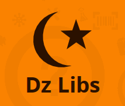

نسبة معتبرة من الأعمال التي نقوم بها، نحن المبرمجون أو المصممون، هي عبارة عن مهام روتينية، سواء من ناحية المنطق البرمجي، أو من ناحية البيانات التي نحتاجها في كل مرة لإتمام تطبيق أو تصميمٍ يستهدف بلدا معينا كوطننا الجزائر.

	  * فالبرمجة: منطق + بيانات (أو تقريبا)
	  * التصميم: إبداع + بيانات

من جهة المنطق، فالأمر أسهل، مع انتشار أطر العمل Frameworks، الشفرات البرمجية هنا وهناك، مع قليل من التخصيص وإعمال للذهن، لكن من جهة البيانات فالأمر أصعب، فتكون أمام خيارين: إما البحث عن تلك البيانات التي لا تملكها، أو التكفل بمهمة إنشائها بنفسك، وفي كلتا الحالتين، الأمر مُكلف من ناحية الجهد والوقت، وقد يكون عقبة لك في حال غياب المعلومة أو عدم كمال الصورة.

كمثال على ما سبق، كم من مرة يحتاج المبرمج ملف الولايات (المحافظات) على هيئة ملف XML أو JSON لبلدنا الجزائر فقط لإدخالها على قائمة مندسلة أو ما شابه، مرات أخرى يحتاج المصممون شعار الجامعة الفلانية، أو حتى الملف المصدري للعلم الجزائري ... وهكذا، وفي كل مرة يضيع وقت لتوفير هذه المصادر.

من جهة المنطق أو الخوارزميات، فأحيانا تحتاج الخوارزمية التي تحول المبالغ المالية بالعملة الجزائرية من أرقام إلى كلمات، خوارزميات حساب الضريبة في الجزائر، استهلاك الكهرباء ... الخ

الشيء الأكيد، أن هناك أحدهم واجهة المشكلة مسبقا، وعمل عليها وحلّها، .. أن هناك طلابا أو أساتذة عملوا على هذه المشاكل أو حتى على مشاكل لا نعلم بوجودها، لكنها بقيت في أقراصهم الصلبة أو ربما ضاعت. نفس الأمر يحدث مع المصممين أيضا.

جميع هذه الأشياء **قابلة لإعادة الاستعمال**، أو البناء عليها في عمل شيء ما، لكنا دائما ما نعيد اختراع العجلة ولا نعمل بمبدأ [DRY](http://en.wikipedia.org/wiki/Don%27t_repeat_yourself).

إذا تبقى الحلقة الناقصة، شيئا ما يلم هذا الدّر المنثور، يضعه في مكان واحد، يصنفه، يفهرسه ويسهل عملية الوصول إليه في المستقبل. مع مشاركة وعطاء الجميع يتحقق النفع العام وندفع بعجلة التطوير البرمجي، **ونركز على حل مشاكل أهم**.

ببساطة هذه هي فكرة موقع [DzLibs.io](http://dzlibs.io/)، **الفهرس الجزائري للمكتبات والمصادر البرمجية القابلة لإعادة الاستعمال**.

وقد قسمته لقسمين:

	  * قسم [**التويزة**](http://www.tomohna.com/vb/showthread.php?t=43627): وهي من عادات وتقاليد الجزائر، سُنّة حسنة قام بها أسلافنا في الجزائر ولا يزالون يقومون بها في بعض المناطق حيث يتعاون سكان منطقة مُعينة على القيام بأعمال تعود بالنفع على الجميع كالحرث أو الحصاد أو ما شابه ، أردت صقلها والإشادة بها على الويب بين الجزائريين.
	  * قسم الـ APIs: يوفر واجهة برمجية ليعض من هذه المصادر عبر طلبات http مباشرة، مفيد لمطوري تطبيقات الهاتف والويب.

بعبارة أخرى، أود لموقع Dzlib أن يكون تويزة برمجية نساعد فيها بعضنا البعض نحن معاشر المُبرمجين والمُصممين سيرا على خًطى أبائنا وأجدادنا.

يجدر الذكر أن الموقع مفتوح المصدر، [تجدون مصدره من هنا](https://github.com/01walid/dzlibs) لمن أراد المساهمة في تحسينه.

تسرني مشاركاتكم، أفكاركم، ملاحظاتكم، الموقع لا يزال في مرحلة تجريبية، لكن يمكنكم البدء في المشاركة.

	  * [صفحة الموقع على الفيس بوك](https://www.facebook.com/dzlibs).
	  * حساب الموقع [على تويتر](https://twitter.com/dzlibs).
	  * [الموقع نفسه](http://dzlibs.io/).

