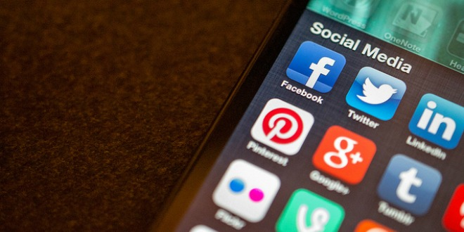
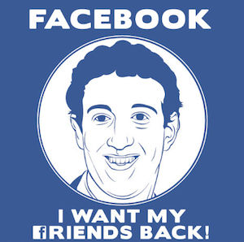
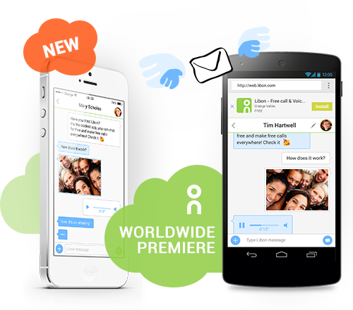
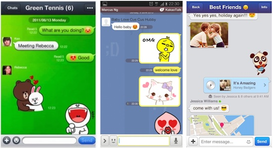

دعونا نبدأ بحادثة ربما تكون  قد حدثت معك أو لأحد معارفك. قام شخص بإرسال رسالة نصية قصيرة SMS إلى صديق قديم له يطلب منه لقاءه حول وجبة غداء. بحكم أن هذا الصديق يستخدم تطبيق Viber على هاتفه الذكي فإنه استقبل الرسالة النصية القصيرة مُباشرة داخل هذا التطبيق. وبحكم أن المُرسل يملك بدوره تطبيق Viber على هاتفه رغم أنه لا يستعمله إطلاقا فإنه تمت مواصلة المُحادثة على هذا التطبيق لتحديد الموعد والمكان المُناسب لهذا اللقاء. اهتم بطل قصتنا بتطبيق Viber من جديد نظرا لمُختلف الوظائف التي يُقدمها له لكن بعد استعمالات عديدة أزعجته كثرة التنبهيات التي يقوم التطبيق بإرسالها وشراهة استهلاكه للذاكرة فقرر التخلص من التطبيق نهائيا.

في اليوم المُحدد للقاء ذهب بطلنا إلى المكان المُحدد في الوقت المُحدد ليجد نفسه وحيدا هناك، وهو ما دفعه إلى الاتصال هاتفيا هذه المرة بصديقه لمعرفة سبب عدم مجيئه، وتبين حينها بأن هذا الصديق قد منعه مانع من الحضور وأعلم صديقه بالأمر عبر رسالة أرسلها على … Viber لكن وبحكم أن المُستقبل لتلك الرسالة (أي بطل القصة) قد قام بحذف التطبيق من على هاتفه الذكي فإن الرسالة ضاعت دون أن يتم إعلام الطرف المُرسل بأن رسالته لم تصل أو أن المُستقبِل المُفترض لها قد حذف التطبيق من الهاتف.

قد تبدو هذه حادثة جانبية نادرة الحدوث، لكنها في حقيقة الأمر مثال حي عن **تفتيت المحادثات وتجفيف منابع الويب المفتوح لصالح تطبيقات هواتف ذكية تستخدم بروتوكولات اتصال مملوكة**. ما نشهده حاليا هو خطر مُحدق بمُستقبل الإنترنت وبطبيعته المفتوحة التي نعرفها، خطر أكبر بكثير من استخدام مُتصفح Internet Explorer في وقت سابق لوسوم HTML غير قياسية، لا يفهمها أحد سواه.

## الانتقال من ويب مفتوح إلى منصات اجتماعية مُغلقة

لفت Chris Anderson الانتباه في مقاله [The Web Is Dead. Long Live the Internet](http://www.wired.com/magazine/2010/08/ff_webrip/) إلى أن الويب (صفحات HTML) لا تُمثل سوى جزءا يسيرا من عمليات التواصل والمحادثات على الإنترنت. لكن بعد مرور ما يقرب من 4 سنوات من نشر هذا المقال فإنه بإمكاننا أن نفهم ما يعنيه ذلك المقال بشكل أفضل، حيث أن مُستقبل الإنترنت أصبح فعلا رهينة لعوامل عديدة. فمن جهة فإن عالمية الإنترنت وقابلية الوصول إليه مرهونة بشركات الاتصال ([The Internet Is F***ed](http://www.theverge.com/2014/2/25/5431382/the-internet-is-fucked))، ومن جهة أخرى لدينا ما أصبح يُطلق عليه اسم الصحافة الفيروسية ([Social-Media Traffic to News Sites Has Increased 57% Since 2009](http://mediame.com/en/news/headlines/media-business/social-media-traffic-news-sites-has-increased-57-2009)) وأصبحنا ننشر المقالات على الشبكات الاجتماعية حتى قبل قراءتها ولمجرد أن عناوينها تُعجبنا ([You're not going to read this but you'll probably share it anyway](http://www.theverge.com/2014/2/14/5411934/youre-not-going-to-read-this)).

تعالت العديد من الأصوات خلال العام المُنصرم ضد فيس بوك والطرق الملتوية التي تتبعها من أجل تحقيق أكبر استفادة مالية من منصتها، حيث أصبحت الشبكة الاجتماعية تُعامل جميع مُستخدميها كمُعلنين، لكن رغم ذلك تبقى فيس بوك الشبكة الاجتماعية المُفضلة لدى الكثيرين. بعبارة أخرى نعاني حاليا من مُشكل تبعية كبير لفيس بوك التي يُمكن اعتبارها كالعلبة السوداء التي لا نفهم آلية عملها خاصة خوارزميتها Endge Rank (أو الخوارزمية التي استبدلت بها)، علبة سوداء لا نملك أية حيلة أو أية وسيلة تحكم معها (لا يملك الجميع ما تملكه NSA من صلاحيات).

على خلاف ما هو عليه الحال مع تويتر أو Youtube فإنه لا يُمكنك تصفح ملف شخصي (كاملا) على فيس بوك أو المُحتويات المنشورة عليه ما لم تكن تملك حسابا عليه، وهو ما يُطلق عليه الأمريكيون وصف "الحديقة المسورة" walled garden. بعبارة أخرى **ما قامت به فيس بوك هو إخلال وزعزعة لأحد مبادئ الويب المفتوح، حيث استحوذت على قسم ليس باليسير من الويب ووضعته خلف أبواب موصدة**. قد يقول قائل بإن الويب يعج بالمجتمعات المُغلقة التي لا يُمكن للخارج عنها أن يعرف أي شيء مما يحدث داخلها، هذا صحيح، لكنه لم يسبق لأي من هذه المُجتمعات أن وصلت إلى الأهمية أو الحجم الذي وصلت فيس بوك إليه الآن. بوادر المشاكل الناجمة عن ذلك بدأت في الظهور خاصة على طبقة الشباب (والمراهقين) الذين أصبح الشغل الشاغل لها هو الحصول على إعجاب غيرها بها [Social media and the perils of looking for ‘likes’](http://edition.cnn.com/2014/02/18/opinion/rushkoff-social-media-likes/). وما يزيد الطين بلة هو أن يتم أغلب هذا التواصل داخل بيئات مملوكة ومُغلقة مثلما هو عليه الحال مع Viber.

## تطبيقات الهواتف الذكية ترغب في القضاء على رسائل SMS النصية القصيرة

اعتمد التواصل الإلكتروني خلال القرن الماضي على معايير وتقنيات عالمية مفتوحة، ونقصد بذلك صفحات HTML والبريد الإلكتروني فيما يخص الويب إضافة إلى رسائل SMS أو رسائل MMS فيما يخص التواصل على الأجهزة المحمولة، لكن للأسف الشديد اختلف الوضع حاليا بشكل كبير، **حيث يتم احتجاز جزء ليس بالهيّن من هذا التواصل داخل تطبيقات هواتف ذكية مُغلقة تجزئ التواصل وتحجزه كرهينة لديها**، وهذا سواء تعلق الأمر بالتطبيقات التابعة للمنصات الاجتماعية الرئيسية (Instagram، Vine...) أو تطبيقات الهواتف الذكية أمريكتها وآسويتها (Snpachat، Whatsapp، Kik Messenger، WeChat، Line...).

ظهرت هذه التطبيقات بداية الأمر كبدائل لرسائل SMS أو للاتصالات الهاتفية قبل أن **تفرض نفسها على رقعة التواصل الاجتماعي وتحشد مئات ملايين المُستخدمين حولها**، وللوصول إلى هذه الأعداد الضخمة، دخلت هذه التطبيقات في سباق نحو التسلح بأكبر عدد من الخواص والمزايا إلى درجة أصبحت لا تختلف عن بعضها البعض إلا في تفاصيل قليلة، وهو ما [يدفع بالتساؤل إن كان](http://pando.com/2013/12/11/all-social-apps-are-the-same-now-are-we-headed-toward-one-mega-app-to-rule-them-all/)[ت هذه التطبيقات ستحول في يوم من الأيام إلى تطبيق واحد يتحكم في هذا النوع من التواصل](http://pando.com/2013/12/11/all-social-apps-are-the-same-now-are-we-headed-toward-one-mega-app-to-rule-them-all/). لكن ماذا سيحدث عندما سنجد أنفسنا فعلا أمام تطبيق واحد ووحيد للتواصل عبر الرسائل النصية القصيرة؟ هل يجب علينا حينها أن نمتثل لشروط الاستخدام الذي ستفرضه علينا؟ وهل يجوز لنا التساؤل إن كانت عملية شراء فيس بوك لتطبيق Whatsapp قد تم وهذا الأمر (أي الامتثال لشروط استخدام التطبيق الواحد والوحيد) في خلفية الصورة؟

بالرغم من وفرة وقوة الخواص التي تُقدمها هذه التطبيقات خاصة الشرق آسيوية منها (مثيلات Kine وkakao التي تسبق نظيراتها الأمريكية بأشواط طويلة)، إلا أنه **من المُؤسف فعلا أن نتخلى عن معايير قياسية ومفتوحة مثل SMS (أو حتى MMS) والانغلاق على المعايير مملوكة التي تقترحها هذه التطبيقات**، رغم أنه كان بالإمكان أخذ أفضل ما في العالمين للحصول على معايير أفضل مثلما تقوم به [شركة ](http://www.orange.com/en/press/press-releases/press-releases-2014/Orange-breaks-down-instant-messaging-barriers-with-Libon-Open-Chat-technology-places-Libon-at-core-of-rich-communications-strategy)[Orange ](http://www.orange.com/en/press/press-releases/press-releases-2014/Orange-breaks-down-instant-messaging-barriers-with-Libon-Open-Chat-technology-places-Libon-at-core-of-rich-communications-strategy)[مع خدمتها ](http://www.orange.com/en/press/press-releases/press-releases-2014/Orange-breaks-down-instant-messaging-barriers-with-Libon-Open-Chat-technology-places-Libon-at-core-of-rich-communications-strategy)[Open Chat](http://www.orange.com/en/press/press-releases/press-releases-2014/Orange-breaks-down-instant-messaging-barriers-with-Libon-Open-Chat-technology-places-Libon-at-core-of-rich-communications-strategy).

## طويل جدا، لم أقرأه (tl;dr)

الأدهى والأمر هو أننا الآن نشهد ظهور موجهة جديدة من تطبيقات الهواتف الذكية مثيلات Tinder، Pheed أو Wordeo والتي تقوم بتحويل رسائل إلى مقاطع مُتحركة: [Messaging App Wordeo Blends Text With Getty Stock Footage To Take Video Messaging More Mainstream](http://techcrunch.com/2014/01/14/wordeo/).

**خطر هذه التطبيقات يكمن في دفعها المُستخدمين إلى تفضيل الصور على حساب الكلمات.** لسنا هنا للتحذير أو الحديث عن خطر التدهور الفكري الذي يُمكن أن نصل إليه، لكن هل فعلا يُمكن أن نتصور مستقبلا للتواصل البشري يكون مبنيا على الصور؟ ألم تتطور البشرية لتُحول الصُور التي كانت ترسمها على الجدران الصخرية وترتقي إلى الكلمات أم أننا نريد فعلا أن نرجع إلى تلك المرحلة؟ قد يقول قائل بأن في الأمر مُبالغة واضحة. نعم، قد يكون الأمر كذلك، لكن لما نسمع بأنه يتم إرسال ما لا يقل عن 500 مليون صورة على Whatsapp لوحدها كل يوم لم يعد للتساؤل عن السلامة اللغوية للرسائل النصية التي تُرسل عبرها محلٌ من الإعراب.

[caption id="attachment_12794" align="aligncenter" width="550"] مثال عن تواصل عبر ما يُطلق عليه اسم Stickers[/caption]

نعيش حاليا في عالم سريع جدا، في عالم لا نجد الوقت الكافي للقراءة (“tl;dr” = “too long; don’t read“) أما الكتابة فحدث ولا حرج، فهذه عملية تستهلك أضعاف ما تحتاجه القراءة من وقت حتى ولو كان كل المطلوب هو مُجرد كُليمات، فأصبحت اللغة مُختصرة وأصبح البعض يختصر حتى OK لتصبح K (ألم تكن OK أصلا اختصارا لكلمة Okey؟). أخبرني من فضلك، **هل يُعقل فعلا أننا أصبحنا نتواصل بأصوات أحادية المقطع فقط monosyllabes، بنقرات Like أو بالصور الشخصية selphies أو بالملصقات Stickers؟** (حنين إلى العصر الحجري؟).

تجدر الإشارة إلى أن هدف هذا المقال ليس التصدي لما تتعرض له اللغات البشرية من إفقار متواصل لصالح التواصل البصري، لكن لتبيين أن الحال الذي وصلنا إليه مع هذه التطبيقات هو نتيجة تقهقر استمر لمدة طويلة. العجيب في هذا الأمر أن من يُزعجهم الأمر هم قلة فقط. حتى ولو نظرنا إلى الأمر من منظور نفعي بحت لساءنا الأمر أيضا، فالتعقيدات اللغوية التي تمتاز بها كل لغة جعلت من الصعب الاستماع وتحليل جميع المحادثات، والحال يستعقد أكثر فأكثر مع الوسائل الجديدة للتواصل. ففي عالم سيكون التواصل فيه بصريا بامتياز يصبح من الأصعب أن نحلل مقدار رضا الزبائن ومعرفة شعورهم نحو العلامات التجارية أو المُنتجات التي يستخدمونها.

## كل شيء مجاني... أو بالأحرى ستدفع الثمن لاحقا...

لنرجع إلى النقطة التي بدأنها بها، وإلى مشكل تفتيت المحادثات. كما هو معروف فإن صفحات نتائج البحث على Google مُتاحة ومتوفرة للجميع وبالتالي فإن دراسة تموضعك على هذه الصفحات مجاني (بطبيعة الحال ستحتاج إلى معارف مُعينة للقيام بذلك). نفس الحال مع فيس بوك، حيث أن تحليل المُحادثات التي تتم حول علامتك التجارية أو مُنتجك مجاني، شريطة استخدامك للأدوات المُناسبة لذلك، **لكن ما الذي سيمنع مُنتجي تطبيقات الهواتف الذكية هذه من محاولة التربح من منصاتها عبر توفير بياناتها ومحادثاتها للمُعلنين مقابل مبالغ مالية؟** بالرغم من أن تطبيقات التواصل الاجتماعي الشرق آسيوية تُدر مداخيل كبيرة على منتجيها حيث أن تجارة المُلصقات Stickers والسلع الرقمية virtual goods رائجة هناك، إلا أنه من المُستبعد جدا أن يتم استنساخ تلك التجربة في الأسواق الأمريكية نظرا للاختلافات الثقافية ما بين ضفتي المُحيط، وهو ما سيدفع من دون الشك بالتطبيقات الأمريكية إلى البحث عن سبل أخرى للتربح من منصاتها، ويكفي أن تحتل واحدة منها حصة مُعتبرة من السوق حتى تستطيع فرض قانونها وشروط الاستخدام الخاصة بها على الجميع.

خلاصة القول: يُعتبر الإنترنت وصيلة تواصل مُتغيرة بشكل مُتواصل، ولا يُمكن لأي كان إيقاف تطورها. لكن في المقابل يبدو بأننا في حاجة إلى لفت الانتباه إلى المُنعرج الخطير الذي نحن فيه الآن بسبب تطبيقات التواصل الاجتماعي على الهواتف الذكية آنفة الذكر، حيث أنها لا تقوم بتفتيت المُحادثات وإفراغها من مُحتوياتها فحسب، لكنها تقوم باحتجازها كرهينة خلف أسوار عالية وأبواب موصدة. بطبيعة الحال يحق لأي كان أن يُكون الرأي الذي يريده حول هذا الأمر، لكنه يُمكن أيضا القوا **بأن هذا الوضع أخطر بكثير من عمليات تجسس NSA أو جشع شركات الاتصالات**.

ترجمة -وبتصرف- للمقال: [Les applications mobiles vont-elles tuer les conversations (et le web) ?](http://www.mediassociaux.fr/2014/03/05/les-applications-mobiles-vont-elles-tuer-les-conversations-et-le-web/)
