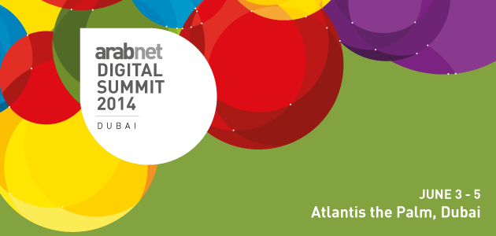

للسنة الثانية على التوالي، تستضيف دبي أكبر تجمع لأهم الخبراء في مجال المشاريع وريادة الأعمال الرقمية، في منطقة الشرق الأوسط وشمال إفريقيا، قمة عرب نت الرقمية 2014 . ويشارك في القمة أكثر من 130متحدثًا من المنطقة وبقية أرجاء العالم، وحضور يزيد على ألف شخص، وأكثر من خمسين شركة من أسرع الشركات الصغيرة ومتوسطة الحجم نموًا. تُقام الفعاليات في فندق الأتلانتس في منطقة النخلة، بين الثالث والخامس من يونيو 2014 ، وتهدف المناسبة إلى تنمية القطاع الرقمي في المنطقة من خلال وصل المشاريع التجارية العربية برواد هذا القطاع في أنحاء العالم.

ومن فعاليات القمة المنتدى الذي يستكشف أحدث التطورات في عالم الأعمال الرقمية كالتجارة الإلكترونية، والتسويق والإعلان الرقميين، وشبكات التواصل الاجتماعي والأجهزة الجوالة، بالإضافة إلى التكنولوجيا التي تغير طبيعة الأسواق التقليدية. كما يسلط هذا المنتدى الضوء على أبرز الاتجاهات الرقمية الجديدة، كالتكنولوجيا القابلة للارتداء، والطباعة ثلاثية الأبعاد، والمحفظات الجوالة، وغيرها.

ويشارك أبرز الأعضاء في النظام الإيكولوجي لريادة الأعمال، كالمستثمرين بالخبرة والمستثمرين برؤوس الأموال، والمسرعات، والمنظمات غير الحكومية، وأصحاب المصلحة من الحكومات،ليجروا نقاشًا عميقًا حول دعم رواد الأعمال خلال كافة مراحل تطور شركاتهم، من مرحلة تطوير الفكرة إلى مرحلة التوسع العالمي مرورًا بمرحلة تطوير المنتج.

كما تتضمن قمة عرب نت الرقمية مسار البحث، الذي يقدم دراسات لحالات من السوق، وأوراق عمل، وإحصائيات مركّزة، ونقاشات هامة تتمحور حول الاتجاهات الرقمية في منطقة الشرق الأوسط وشمال إفريقيا.

وبالتوازي مع المسارات الرئيسية، تزخر المسارات الفرعية بورشات العمل، وجلسات التعارف المهني، والمؤتمرات الصحفية. كذلك، يحتوي برنامج عمل القمة على نشاطات مثيرة متنوعة، تتنوع بين حفلات التعارف وجلسات الطاولة المستديرة المقتصرة على المدعوين.

وفي اليوم الثالث، تُقام البطولة النهائية للمطورين، حيث يشارك 16مطورًا، من بلدان عربية مختلفة فازوا ببطولات بلادهم، في المنافسة على لقب "أفضل مطور".

وتشكل فعالية التعارف السريع أحدث إضافة لهذا الحدث من عرب نت، والتي أُطلقت لأول مرة خلال "عرب نت بيروت 2014 "، وكانت من أهم فعاليات المؤتمر. وبعد نجاح الفعالية لأول مرة، تعيد "عرب نت" تنظيم جلسات تعارف سريع خلال القمة الرقمية.

يبدأ [التسجيل](http://arabnet.me/conference/summit/program/) عبر الإنترنت لحضور القمة اليوم، مع تخفيضات خاصة للطلاب والشباب.

**عن عرب نت**

عرب نت هي مركز للمحترفين الرقميين ولرجال الأعمال العرب، تخلق لهم منصات على شبكة الإنترنت وخارجها لكي يتواصلوا ويتعلموا. رؤية عرب نت هي تنمية قطاعي الإنترنت والجوال في المنطقة العربية؛ هي تهدف أيضاً من خلال أنشطتها إلى بناء جسور تجارية في جميع أنحاء الشرق الأوسط، وتحفّز على نمو المعرفة العربية، كما أنها تدعم إنشاء الشركات الجديدة وخلق فرص عمل للشباب.
