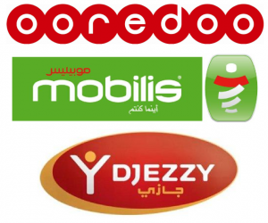
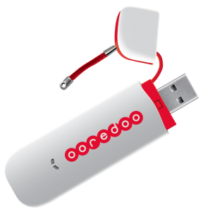
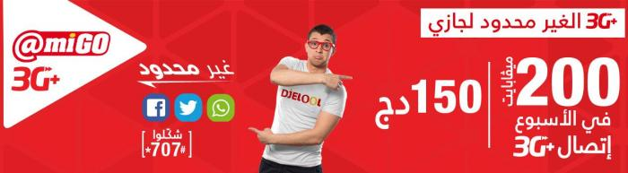

يبدو بأن ضجة إطلاق **اتصال ****3G** (بالرغم من محدوديتها) في **الجزائر** مؤخرا قد وفرت غطاء لبعض التجاوزات من طرف مُتعاملي الهاتف النقال ثلاثتهم (ooredoo، Djezzy و Mobilis)، التي قد لا تبدو للوهلة الأولى ذات أثر كبير، لكنها في حقيقة الأمر أمور تتوجب التعديل والتصحيح.

المشكل الأول يتعلق بالمتعامل [أوريدو](http://www.ooredoo.dz/particuliers/) (الذي لا يملك موقعا باللغة العربية لدى كتابة هذه السطور) والذي قام بتفعيل خاصية كانت من قبل اختيارية، والمُتعلقة بالسماح لمن أراد ذلك، بإبلاغ المُتصل لما يكون جهاز مُراسله (الشخص الذي يود الاتصال به) مُغلقا أو خارج نطاق التغطية عبر رسالة نصية قصيرة لما يصبح بالإمكان الاتصال به من جديد (يعني تتصل بي وإن كان جهازي مُغلقا ستقوم "العصفورة" بإخبارك بمُجرد أن أفتح جهازي من جديد).

هذه الخاصية مُفيدة في كثير من الأحيان خاصة في حال السفر إلى مناطق تكون التغطية فيها ليس مثالية، ولكن بشرط أن يقوم الزبون هو من يختار بمحض إرادته تفعيلها.

مؤخرا قامت أوريدو بتفعيل هذه الخاصية **بشكل آلي لجميع المُستخدمين **(أو على الأقل في الدائرة الضيقة التي قمت بالتحقق منها). يعني سواء قمت باختيار الأمر أو لم تختره ستقوم تلك “العصفورة” بالتربص بك أيما ذهبت وبُمجرد أن تقوم بفتح جهازك من جديد ستطير صارخة “يا ناس يا ناس فلان الفلاني قد فتح هاتفه من جديد،... هجووووووم”.

شخصيا أعتبر ذلك **انتهاكا صارخا لخصوصية المُستخدم**(الذي يتم الاتصال به)، لأن الجميع لا يرغب بالضرورة في إبلاغ الآخرين متى يكونون داخل نطاق التغطية (أحيانا أقفل الجهاز لأنني -وبكل بساطة- لا أرغب أو لا أقدر على استقبال اتصالات، لكنني قد أرغب في الاتصال بغيري).

الأمر الثاني المُتعلق ب**عروض ****3G** حيث أن المتعاملين الثلاثة لا يقومون بتوفير drivers الخاصة بمفاتيح الاتصال سوى على أنظمة Windows وهو أمر يمنع مُستخدمي أنظمة التشغيل المنافسة مثل Linux المجاني ومفتوح المصدر (وحتى أنظمة Mac) من الاستفادة من هذه العروض. بعبارة أخرى (ودعوني أبالغ قليلا في هذه النقطة) وكأن هناك تفاهما خفيا ما بين Microsoft الجزائر وما بين المتعاملين لإجبار الزبون الذي يريد استخدام مفتاح 3G على اقتناء رخصة استغلال نظام Windows (أو على الأقل استخدام نسخة مُقرصنة من النظام).

الحل الوحيد المُتوفر حاليا لمُستخدمي أنظمة التشغيل المُنافسة هو تفعيل الاتصال على الهاتف وتشاركه مع الحاسوب.

بالمناسبة، يُمكن استغلال هذه النقطة للتسويق أيضا، وبحكم أن الشركات الثلاثة تُعاني من "مُتلازمة الأول" (يعني أول من يُطلق خاصية مُعينة) يُمكن لها أن تكون "أول من يدعم مُستخدمي البرمجيات مفتوحة المصدر" مثلا.

ما الحل في هذه الحالة؟ الأمر سهل يكفي لكل مُتعامل أن يقوم بتضمين Drivers لأنظمة التشغيل الرئيسية مثلما يقوم حاليا مع Windows أو على الأقل يقوم بإرفاق روابط لتحميلها من مواقع مُصنعي أجهزة الاتصال التي يقومون ببيعها، فلا يُعقل أن تُجبر في كل مرة على المرور عبر الهاتف الذكي أو استخدام نظام تشغيل بعينه في كل مرة ترغب فيها في استخدام هذه الخدمات، وهو أمر يُعتبر مهمة أقرب من الُمستحيل لمن لا يملك أية خلفية تقنية.

أما النقطة الثالثة، فهي عروض بنكهة شرودنجرية (هل سبق لك أن سمعت ب[قطة شرودنجر](http://ar.wikipedia.org/wiki/%D9%82%D8%B7%D8%A9_%D8%B4%D8%B1%D9%88%D8%AF%D9%86%D8%BA%D8%B1)) فلا أدري إن كانت إعلانات مُتعاملي الهاتف النقال تهدف إلى إثارة عقول زبائنها وحثهم على التفكير بهذه العروض أم هو فعلا استغباء، لأنه آخر مرة تحققت في القاموس (أبالغ من جديد) من مفهوم "غير محدود" كانت تعني من "دون سقف علوي" فلا يُعقل أن يحتوي نفس الإعلان على "غير محدود" من جهة و200MB من جهة أخرى (اللهم إن كان من كتب الإعلان مُبرمجا قام بتحديد ثابت constant أسماه "غير محدود" وأعطاه القيمة 200MB وهو أمر أتفهمه حينها ). بعبارة أخرى إما أن العرض محدود أو أنه غير محدود، ولا يُمكن له أن يكون محدودا وغير محدود في آن واحد (اللهم إن كان الزبون الوحيد الذي تستهدفه بهذا الإعلان هو شرودنجر أو قطته).

بالمناسبة، إن كنت ستدفع "ثروة" مُقابل نشر إعلان على صفحة كاملة بالألوان في جريدة ذات شعبية تطبع ما يقارب من نصف مليون نسخة يوميا، فعلى الأقل قم بتوظيف مُدقق لغوي (تدفع له ربع عُشر تلك الثروة ليقوم بتدقيق جميع إعلاناتك) يقوم بتصحيح "الغير المحدود" و "الغير محدود" التي تعج بها هذه الإعلانات وإعلانات أخرى، لأنه في آخر مرة تحققت (وهنا لا أبالغ) [لا تقبل "غير" التعريف بـ 'ال'](http://www.alfaseeh.com/vb/showthread.php?t=1424) التعريف وإنما يتم تعريفها بالإضافة (أما الهمزات التي تظهر في غير محلها وتغيب أي يجب عليها الظهور، فحدث ولا حرج).

هل هناك جمعيات لحماية حقوق المُستخدم التي يُمكن لها أن تتدخل لتصحيح الوضع؟ هل هناك أية حلول أخرى؟
