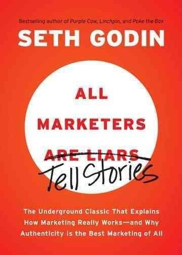

إن كنت جزائريًا وكان لديك تعامل مباشر مع التجارة ومع أهلها فمن المُرجح أنه سبق وأن سمعت عبارة "الدراهم ما يغلطوش" (النقود لا تخُطئ) ، والتي عادة ما تُستعمل لدى مقارنة سلعتين يفترض بهما أن تقدما نفس الخدمة لكنه تم تصنيعهما في بلدين مُختلفين أو من طرف شركتين مُختلفتين، حيث يُفترض بالسلعة الأغلى أن تكون أجود وأفضل. لكن ما مدى صحة هذه العبارة؟ هل هي صحيحة دائما؟ أم أنها محل نظر؟.

في كتابه [All Marketers Are Liars](http://amzn.to/2fwEezu)، أشار Seth Godin إلى أن بعض متذوقي النبيذ يعتقدون بأن النبيذ إذا تم تذوقه في أحد أنواع كؤوس التذوق الخاصة (وخص بالذكر شركة تقوم بتصنيعها) والتي تباع مقابل 20 دولار للكأس الواحدة، فإنه يُفترض بذلك النبيذ أن يكون "أطيب" ذوقا، وأحسن. في حين يرى Godin بأن الأمر غير منطقي إطلاقا نظرا لأن الزجاج الذي صُنعت منه هذه الكؤوس لا يُمكن له أن يؤثر كيميائيا على النبيذ في حد ذاته وبالتالي لا مجال لتحسين الذوق، يرى الكاتب بأن الأمر له علاقة بـ"كذبة" (ومنه نفهم معنى عنوان الكتاب) أو فكرة تسويقية أطلقتها الشركة المُصنعة لتلك الكؤوس، قرر متذوقو النبيذ بمحض إراداتهم تصديقها، إما للتميز أو للشعور بالانتماء إلى "طائفة" من علية القوم ممن مكنت لهم أموالهم ومناصبهم من تذوق أفخر أنواع النبيذ وأغلاها ثمنا. لكن هل يُمكن لكأس "خاصة" أن تزيد من جودة ذلك النبيذ فعلا؟

يبدو بأن خداع البشر لأنفسهم أعمق مما يبدو عليه الوضع في المثال السابق. إحدى حلقات بودكاست Freakonomics والتي تحمل العنوان [Do More Expensive Wines Taste Better?](http://freakonomics.com/2010/12/16/freakonomics-radio-do-more-expensive-wines-taste-better/) تُبيّن بأنه يُمكن خداع حتى من يُطلقون على أنفسهم مختصي تذوق نبيذ، حيث يكفي أن تضع سعرا أغلى على زجاجة أرخص ليتحول ذوقها إلى "أفضل" في نظرهم، أو أنه يكفي أن تشير إلى أن ثمن ذلك النبيذ المُعتق هو عُشر ثمنه الحقيقي ليعتقد المُتذوق بأن ذوقه أسوأ. بل يُمكن لنفس النبيذ أن يحصل على تقييمين مُختلفين من طرف نفس الشخص إن هو اعتقد بأن ما تذوقه هو نوعان مُختلفان.

نلاحظ نفس الأمر مع المنازل أيضا: هل المنزل الأغلى دائما ما يكون أفضل؟، والملابس: هل سعر الحذاء الرياضي يتوافق طردا مع نوعيته؟، وحتى السيارات، هل فعلا أداء سيارات Porsche ذات 80 ألف دولار أفضل بكثير من أداء سيارات Volkswagen “عادية" ذات 36 ألف دولار والتي -من الناحية التقنية- تعتبران نفس السيارة لكن بشكلين مُختلفين.

في كتاب All Marketers Are Liars أشار الكاتب بأن بعضا من قرؤوا الإصدار الأول من كتابه لم يفهموا جيدا ما الذي يقصده، فالهدف ليس الكذب لبيع السلعة (أن تضع لها سعرا أغلى لكي يعتقد المُشتري بأنها أفضل مثلا) ولهذا تجده "شطب" Are Liars (يكذبون) من عنوان الكتاب واستبدلها بـ Tell stories (يحكون قِصصًا)، ثم أضاف The Underground Classic That Explains How Marketing Really Works--and Why Authenticity Is the Best Marketing of All (شرح مبادئ عمل التسويق ولماذا تُعتبر الأصالة/الموثوقية أفضل وسيلة تسويق) كعنوان ثانوي للتأكيد على ذلك، لكن لو قرأت الكتاب (حتى في إصداره المنقح) لالتبس عليك الأمر قليلا، حيث أنه من جهة وكأن المطلوب هو أن تتقن الكذب يعني أن تكون كذبتك متناسقة ولها مخارج للهروب لو حوصرت، لكن من جهة أخرى إتقان ذلك لا يكون سوى عبر الصدق (إما أن تكون صادقا بشكل كامل أو أن تُصدّق كذبتك أيضا)، حتى وإن كانت الكذبة التي يسوق لها الكتاب أقرب ما تكون من "الفكرة التسويقية" منها إلى الكذبة الحقيقية.

هناك جانب آخر، أحيانا نرغب كبشر أن لا تقال لنا كامل الحقيقة وذلك لجعل القصص التي تُروى لنا أجمل. لتجنب إطالة هذا المنشور أكثر من اللازم سأضرب مثلا لتوضيح الأمر. منذ فترة انتشرت [فيديو حول رجل مطافئ يقوم بإنقاذ قطة صغيرة](http://www.youtube.com/watch?v=CjB_oVeq8Lo) ويقوم بإنعاشها بعد أن استخرجها من بيت محترق. الفيديو حصلت على أزيد 32 مليون مشاهدة تشاركها الكثيرون وكتبت عنها العديد من المواقع الشهيرة. الفيديو هذه وبحكم أنها تنتهي نهاية سعيدة، حصلت على هذا العدد الكبير من الزيارات، لكن ما لا يعلمه الكثيرون هو أن النهاية ليست بتلك السعادة، فبالرغم من إنقاذ القطة في البداية، [ماتت لاحقا جراء ما تعرضت له](http://gawker.com/this-cat-rescue-video-will-make-you-very-happy-then-re-1400886345). السؤال الذي يطرح نفسه، هل كنت لتشارك هذه الفيديو مع أصدقائك لو تمت الإشارة إلى هذه النهاية "المأساوية"؟ جواب الكثيرين سيكون بـ "لا"، وبالتالي من سيحتاج أكثر إلى إخفاء جزء من الحقيقة؟ أليس المشاهد الذي يبحث عن نهاية سعيدة؟

أزيدك من الشعر بيتا، القصص الجميلة التي ساهمت ديزني في انتشارها، عادة ما كانت مختلفة عن القصص الأصلية لها، والتي لم تكن تنتهي بتلك النهايات السعيدة، ولهذا اضطرت ديزني إلى إعطائها نهايات مُختلفة حتى يطرب لها المشاهدون.

هل هذا الخداع الذي نخدع به أنفسها هو حاجة بشرية نحتاجها للشعور بالانتماء والتميز؟ أم كذبة رخيصة للعيش في أوهام؟ هل نحتاج إلى تلك الأوهام؟ ما هو الحد الفاصل ما بين الأمرين؟ هل هناك خداع سلبي وآخر إيجابي؟

ملاحظة: قبل أن تسأل، لا أعاقر الخمر ولا أتذوق النبيذ وليست لدي نية في القيام بذلك، لكن يبدو بأن عيوب البشر تظهر أكثر وضوحا لما تحضر المُسكرات وتذهب عقولهم، يُمكنك استبدال “النبيذ” بالشكولاطة أو بالجبن أو بأي أمر وستبقى الفكرة صحيحة.

كتاب All Marketers Are Liars متوفّر على أمازون عبر هذا الرّابط: [http://amzn.to/2fwEezu](http://amzn.to/2fwEezu) (إن اشتريت من خلال هذا الرابط فستكافئني أمازون على ذلك :) ).

ملاحظة: النسخة الإلكترونية من الكتاب أغلى ثمنًا من النسخة الورقية، فهل يعني ذلك بأن النسخ الإلكترونية أفضل؟ :) أترك لك الإجابة على هذا السؤال.
