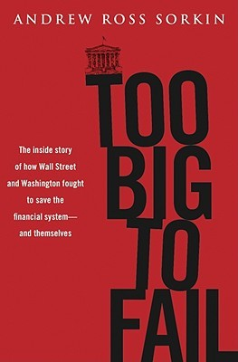

كتاب يستعرض الأزمة المالية التي عصفت بالاقتصاد الأمريكي سنة 2008 والتي كانت لها تبعات على كل الاقتصاد العالمي.

الكتاب مُمّل في أغلبه، تفاصيل كثيرة لا تمت للموضوع بصلة، خاصة ما تعلّق منها باستعراض تاريخ بعض الشخصيات (مدراء بنوك)، الكتاب ضخم (600 صفحة) ولا أرى السبب الذي دفع الكاتب إلى حشوه بهذا الشكل (لو كان كتابًا قصيرًا لتفهمت الحاجة إلى ذلك) أو ربما كان ذلك الحشو سببًا في وصول الكتاب إلى 600 صفحة. يعني لو شرعت في قراءة الكتاب وهممت بتركه، فقد ترغب في الانتقال إلى الفصول الأخيرة منه، وبالتحديد مع بداية الأزمة التي عصفت ببنك ليمان براذرز.
بعض الأفكار السريعة التي رسبت في ذهني بعد الفراغ من قراءة الكتاب:

 	  * الأزمة كان سببها الرئيسي هو جشع البنوك وإعطاؤها لقروض لكل من يستطيع التوقيع حتى من دون التحقق من إمكانية تسديده للقرض، ومن ثم بيع تلك الديون على شكل منتجات اقتصادية في غاية التعقيد لا يفهمها حتى مدراء البنوك أنفسهم، إضافة إلى ثقافة المُغامرة والمُقامرة التي تتميّز بها الأوساط المالية وثقافة مصرفيي وال ستريت.
 	  * البنوك مرتبط بعضها ببعض (يشتري هذا من ذاك، ويبيع هذا لذلك) لدرجة أن سقوط أحد البنوك قد يتسبب في سقوط باقي البنوك تباعًا.
 	  * أول البنوك المُتضررة كان بنك ليمان براذرز، أرادت الحكومة الأمريكية أن يكون عبرة لمن يعتبر، عبر إرسالها برسالة "لن يتدخل الاحتياطي الفدرالي لإنقاذ البنوك الخاصة التي ستفلس بسبب سياساتها غير المدروسة" لكن تبين للحكومة الأمريكية أن عدم تدخّلها لإنقاذ هذا البنك كانت له عواقب وخيمة، حيث تسبب ذلك في أزمة ستعصف بباقي البنوك الواحد تلو الآخر، ثم ما لبثت أن عادت بعد أسبوع فقط لتنقذ باقي البنوك (يعني إفلاس ليمن براذرز كان بسبب سوء التوقيت، وأنها أول البنوك التي تعرضت للعاصفة).
 	  * الكتاب سلّط الضوء على جشع البنوك ومقامراتها ومغامراتها التي تسببت في الأزمة، لكن أشار أيضًا إلى الاتصالات المُتكرّرة بـ"وارن بافت" التي قامت بها العديد من الأطراف المعنية بالأمر، وكيف أن وارن بافت مُستثمر رزين، ولا يستثمر سوى في المشاريع والصفقات التي يفهمهما بشكل جيّد والتي يضمن ربحيتها (يعني يُمكن القول أن كل “الأساطير” التي قد تكون سمعتها عنه يفترض بها أن تكون صحيحة).
 	  * من دون تدخل الحكومة الأمريكية / الاحتياطي الفدرالي لكانت الأزمة أعقد وأشد، لكن عدم تدخله في الوقت المناسب عقد من الوضع نسبيًا.
 	  * رغم أن الأزمة تسببت فيها البنوك التي لم يكن لتنجو لولا تدخل السلطات الأمريكية، إلّا أن مدراء تلك البنوك وموظفيها الكبار حصلوا على علاوات ومِنح تُقدّر بملايين الدولارات بعد أن ضخت السلطات الأمريكية مليارات من المال العام فيها.

الكتاب مليء بالتفاصيل والشخوص والأسماء التي لن يهتم لها إلا من يرغب في دراسة هذه الأزمة بشكل عميق. إن لم تكن أمريكيًا أو مقيمًا في أمريكا أو مُهتمًا بالشأن الاقتصادي الأمريكي/ العالمي فقد لا ترغب في قراءة هذا الكتاب (قد يكفيك ملخص له أو بضعة مقالات أو حتى بعض الوثائقيات المبنية على مثل هذا الكتاب).
