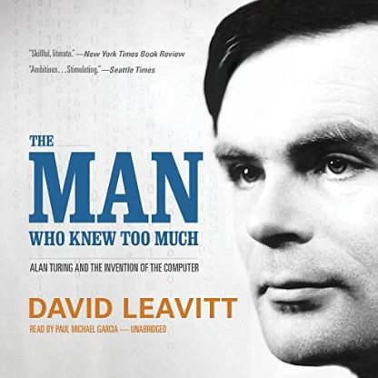

كتاب يتحدث عن Alan Turing آلان تورينج أحد ألمع العقول التي تركت بالغ الأثر على عالم الحواسيب، بل يُعتبر أحد منظّريه وصاحب الفضل الكبير عليه.

الكتاب يحكي قصّة ألان تورينج منذ طفولته إلى آخر أيامه، يركّز بشكل أساسي على جانب "إعادة اكتشاف ما اكتُشف من قبل" لكن بطريقته الخاصة، وهو ما صوّره الكاتب على أنه سوء حظ، حيث أنه وبسبب انعزاله وقلة علاقاته الاجتماعية في شبابه، كان يركزّ على عمله دون أن يهتم بالعالم الذي حوله إلى درجة أن أحد أبرز أعماله والوثائق البحثية التي نشرها والمُتعلقة بالآلة التي حملت اسمه (آلة تورينج) كادت أن تندثر لأنه لما شارف على إنهائها وقبل نشرها، نُشر بحث آخر للرياضي تشيرش والتي توصّلت إلى نفس النتائج، إلا أنه وبفضل بساطة الطريقة التي عرض بها نتائجه وبحكم أنها طريقة مُغايرة (وبفضل تواصل أستاذه مع الرياضي Church) انتهى بهذا العمل أن يحمل اسميهما معًا فرضية تشيرتش-تورينج [Church–Turing thesis](https://en.wikipedia.org/wiki/Church%E2%80%93Turing_thesis).

يهتم الكتاب أيضًا بالدّور الذي لعبه تورينج في التغلب على آلات التشفير إنيجما [Enigma machine](https://en.wikipedia.org/wiki/Enigma_machine)  التي كان يستخدمها الجيش الألماني في الحرب العالمية الثانية، حيث طوّر آليات وآلة سمحت للحلفاء بفك تشفير الرسائل التي كان يتراسل بها الجيش الألماني مما سمح للحلفاء بالانتصار.
الكتاب يعجّ بالتفاصيل التقنية جدًا والتي قد تُنفّر من لم تكن لديه خلفية تقنية أو معرفة سابقة بأعمال تورينج (أو بالبرمجة بشكل عام). يركّز الكتاب أيضًا بشكل كبير على مثلية تورينج الجنسية، حيث أنه لم يصوّرها أو يُعالجها على أنها جانب من جوانب حياة تورينج بل صوّرها بشكل ما على أنها الركيزة التي ارتكزت عليها حياته وحتى أثرت في أفكاره وأعماله. صحيح بأن الأمر أدى إلى إلقاء القبض عليه وإدانته والحكم عليه بـ"العلاج من المثلية" مما أدى به إلى الانتحار لاحقًا، لكن بدا لي بأنه تم تضخيم الأمر نسبيًا لحاجة في نفس الكاتب.

لا أنصح باستهلاك هذا الكتاب كمادة صوتية، نظرًا لصعوبة تتبّع عدة أجزاء منه، خاصة ما تعلق ببعض النظريات الرياضية وأمثلتها إن لم تكن لديك خلفية جيّدة حول الموضوع.
