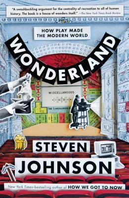

كتاب مُفيد، يُعالج موضوع "اللهو" وكيف أن اللهو كان السبب الرئيس وراء العديد من الاختراعات والتقدم العلمي والحضاري الذي نشهده الآن.

يُمكن تلخيص الكتاب في التالي: **إن كانت الحاجة هي أم الاختراع كما يُقال، فإن اللهو هو أبوها، أو على الأقل أحد أقربائها**. ما يهدف الكتاب إليه هو إيصال فكرة أن الكثير من الاختراعات وحتى العلوم التي نعتمد عليها الآن بشكل أساسي كانت في السّابق مُجرّد لهو ولعب، ما لبثت أن تطوّرت حتى أصبحت أحد أساسيات الحياة.

الكتاب يتركّز حول فكرة في غاية الأهمية، وبدأ بداية قوّية جدًا، فمقدّمة الكتاب تأخذنا إلى بغداد وإلى دار الحكمة، وإلى [بني موسى](https://ar.wikipedia.org/wiki/%D8%A8%D9%86%D9%88_%D9%85%D9%88%D8%B3%D9%89) وخاصة كتابهم الأكثر شهرة "كتاب الحِيل" والتي يُعتبر من أوائل ما أٌلِّف في علم الميكانيكا (أو الحِيل) والذي احتوى تفاصيل بناء نحو 100 آلة ميكانيكية. إلى أن باقي الفصول لم ترقَ إلى قوة المُقدّمة ولم يُعط للفكرة كامل حقّها، رغم ذلك ستخرج -بعد الفراغ من قراءة الكتاب- بنظرة مُختلفة عن ما يُعتبر لهوًا، فلهو اليوم هو تكنولوجيا المُستقبل وربما حتى أحد ركائزه الاقتصادية.

الكتاب يعتمد نفس أسلوب كتاب "كيف وصلنا إلى هنا" والذي يستعرض تاريخ 6 مجالات (الزّجاج، التبريد، الصوت، النظافة، الوقت والزّمن)، كيف تطوّرت، كيف أثّرت الاختراعات في كل من هذه المجالات بطرق ربما لم يسبق لها أن خطرت على بالك على مجالات أخرى، وكيف تؤثّر الاختراعات بشكل سلبي أو إيجابي على مُختلف نواحي الحياة. يُمكن الاطّلاع على مُراجعتي له من [هنا](https://www.goodreads.com/review/show/1972408031?book_show_action=false&from_review_page=1)

من بين الأفكار التي استعرضها الكتاب:

- علم الإحصاءات statistics لم يظهر للوجود إلا بعد أن اهتم مؤسّسوه بألعاب الحظ ورغبتهم في دراسة حُظوظهم في ألعاب القمار التي كانوا يُمارسونها.

- أول جهاز قابل للبرمجة لم تكن آلة [تشالرز بابيج](https://ar.wikipedia.org/wiki/%D8%AA%D8%B4%D8%A7%D8%B1%D9%84%D8%B2_%D8%A8%D8%A7%D8%A8%D9%8A%D8%AC) كما هو مُتعارف عليه بل هي "[الآلة التي تزمّر بنفسها](http://sanjakdar-chaarani.com/ma-j3x/index.php/2013-09-18-18-19-48/2013-12-18-21-52-20/2013-12-20-20-19-33)" التي بناها بنو موسى والتي هي عبارة عن آلة قابلة للبرمجة، وتزمّر (أي تعزف على المزمار) من تلقاء نفسها بناء على المقطوعة الموسيقية (البرنامج) التي توضع فيها.

- لعبت الموسيقى والآلات الموسيقية دورًا كبيرًا في تطوّر العديد من المجالات وظهور العديد من الاختراعات، فعلى سبيل المثال، لوحة المفاتيح التي أكتب هذه المُراجعة من خلالها لم تكن لتظهر لولا تطوير لوحات المفاتيح الخاصة بالعديد من الآلات الموسيقية

- تطور العلوم والمعارف البشرية لا يتّبع دائمًا حاجة البشر إلى تلك العلوم والمعارف، حيث يُشير الكتاب إلى وجود العديد من الآثار القديمة لآلات موسيقية (مزامير بشكل أساسي) تعود إلى حقبة سبقت ظهور العديد من الأدوات التي يحتاجها الإنسان في حياته اليومية. كما أن سكان أمريكا الأصليون توصّلوا إلى تصنيع الكرات من المطّاط، وهي الكرات التي كانت تُستخدم للهو واللعب، في حين أنهم لم يتوصّلوا إلى فكرة "العجلة" التي كانت لتفيدهم بشكل أكبر.

- العديد من الرحلات الاستكشافية القديمة لم تكن بسبب الحاجة إلى أمور أساسية أو ضرورية لحياة الإنسان، بقدر ما كانت رحلات هدفها تحصيل بعضًا مما يُعتبر ترفًا، كالحصول على القطن أو اللون الأرجواني (المُستخرج من نوع مُعيّن من الحلازين) أو حتى مُختلف التوابل والنُكهات.

- لعبة الحانات والمقاهي دورًا كبيرًا في تطّور النظريات والآراء السياسية الحديثة، حيث سمحت لمُختلف طبقات المجتمع بالاجتماع وتبادل الأفكار في مكان عام، كما عرفت نشوء العديد من الحركات المُجتمعية والأحزاب السياسية في هذه الأماكن المُخصّصة للهو.

الكتاب مُفيد من حيث أنه سيعطيك نظرة مُختلفة عن اللهو بشكل عام، وسيغيّر نظرتك للعديد من التقنيات التي كنت تنظر إليها على أنها مجرّد ألعاب. لم يتم ذكر ذلك في الكتاب، لكن نظرتي إلى بعض التقنيات تغيّرت بعد قراءة هذا الكتاب وخاصة ما تعلّق منها بالواقع المُعزّز augmented reality و الواقع الافتراضي virtual reality.

