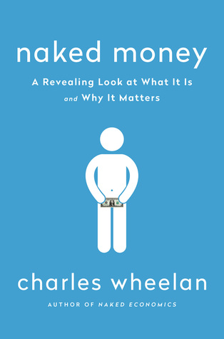

كتاب يتحدّث عن المال وعن خباياه، وعن آليات عمله. كتاب يأخذك في رحلة مُمتعة لسبر أغوار عالم كنت تعتقد بأنك تعلم عنه ما يكفي لاعتقادك بأنه مجال بسيط لا يملك أي عمق، وستخرج بعد الفراغ من قراءة الكتاب – أو على الأقل هذا ما حدث معي- مُقتنعًا بأنك تجهل أكثر مما كنت تتصوّر، لكن على الأقل ستكوّن فكرة عن الأفكار التي تجهلها، أو كما يُسمّيها دونالد رامسفيلد "المجاهيل المعروفة".

صراحة يصعب تلخيص كتاب مثل هذا الكتاب، ليس للكم الهائل من المعلومات الذي يحتويه فحسب، بل لكثرة تعقيد الموضوع، ولصعوبة فهمه (رغم البساطة التي قد يبدو عليها)، إضافة إلى صعوبة التّحقق من الفهم الصحيح لها، تبيّن الحقائق من الآراء، ومُحاولة فهم الأمور من جانب مُحايد وليس من جانب كاتب أمريكي مُقيم في أمريكا ينظر إلى الأمر من زاوية الأمريكي الذي يكترث لمصالح بلده بشكل أساسي (سأعود إلى هذه النقطة لاحقًا).

مجموعة من الأفكار الأساسية التي وردت (حسب فهمي لها) في الكتاب (قد لا تكون المعلومات في السطور التالية صحيحة أو دقيقة بشكل أساسي، حيث أنني لا أتحكم بشكل جيّد في الموضوع الذي يُعالجه هذا الكتاب):

 	  * 

لكي نُطلق على أي "أمر" ما وصف "المال" فإنه يجب أن يحمل على الأقل المواصفات التالية: يصلح كوحدة قياس، يُحافظ على القيمة ويُسهّل التّبادل، وعليه فإنه يُمكن إطلاق وصف "المال" على ما يُستخدم للتبادل التجاري داخل السجون الأمريكية، فكان السّجناء الأمريكيون يستخدمون السجائر كعملة داخلية، وبعد أن مُنع التّدخين فيها أصبح المساجين يتبادلون السلع والخدمات مُقابل علب الأسماك المُصبّرة

 	  * 

ما يُعطي للمال قيمته هو الثقة التي يضعها المُستخدمون فيه، فعلى سبيل المثال سيقبل منك أي أمريكي أية عملية ورقية رسمية (الدولار الأمريكي) حتى ولو قصّيت صورة الشخصية التي فيها أو كتبت عليها، مادام يظهر على الورقة النقدية الرقمان التسلسليان الخاصان بها، لأن الأمريكي يثق بأنه ما دام الرقمان حاضران فإنه بإمكانه استبدال تلك الورقة النقدية في أي بنك، في حين لو قدّمت لهندي ورقة نقدية مُمزّقة (مثلما يحدث في الجزائر مع بعض القطع النقدية التي أصابها تشوّه) فإنه لن يقبلها منك، رغم أن القانون الهندي ينصّ على نفس ما ينص عليه القانون الأمريكي فيما يخص الرقمين التّسلسليين.
في المقابل فإنه في الصومال وبعد انهيار الحكومة المركزية هناك، لا يزال الصوماليون يتبادلون بعملتها رغم أنه لا وجود ل"راعٍ رسمي لها" (الحكومة المركزية)، بل وحتى أن بعض العملات الورقية المُزوّرة بإتقان تُقبل كوسيلة للتبادل.

 	  * 

الكاتب يؤكّد على أن ليس من الحِكمة إطلاق عملات في الورق الراهن تكون مقترنة بشكل مُباشر بالذّهب، حيث يُشير إلى أن الذّهب كان السبب الرئيسي وراء الكساد الكبير الذي عرفه الاقتصاد الأمريكي في ثلاثينيات القرن السابق. يشير الكاتب أنه للتحكم في الوضع الاقتصادي ولامتلاك القدرة على إنعاش الاقتصاد بعد كساده فإنه ينبغي للبنوك المركزية أن تمتلك آليات للتحكم في[ أسعار الفائدة](https://ar.wikipedia.org/wiki/%D8%B3%D8%B9%D8%B1_%D8%A7%D9%84%D9%81%D8%A7%D8%A6%D8%AF%D8%A9) وفي الكتلة النقدية المتوفرة في السوق. إن كانت العملة مُرتبطة بشكل مُباشر بالذهب (الكمية المُتوفّرة منه) فإنه سيستحيل طباعة/ضخ المزيد من العملة في السوق للتأثير عليه. كما أن توفر أية كميات إضافية مُعتبرة من المعدن النفيس سيؤثر بشكل كبير على الأسعار والتّضخّم، مثلما حدث في الفترة التي اكتشف فيها الأوروبيون العالم الجديد، حيث أنه وبعد أن جلبوا كمّيات مُعتبرة من الذهب معهم إلى أوروبا، حدث تضخم في الأسعار بشكل مُعتبر (كمية المال المُتوفّرة لشراء السلع أكبر بكثير من السابق دون نمو فعلي للاقتصاد، وبالتالي ارتفعت أسعار المُنتجات لتتوافق مع ذلك . وعليه فإنه وحسب الكاتب أي اقتصاد تكون عملته الرئيسية مرتبطة بالذهب بشكل مُباشر هو اقتصاد مُعرّض للأزمات الاقتصادية التي ما تلبث أن تعصف به إن لم يُفكّ الارتباط ما بين عملة البلد وقيمة الذهب، مثلما فعلت أمريكا للخروج من أزمتها الاقتصادية الكبيرة (الكساد الكبير)، حيث لم يعد المُواطن الأمريكي قادرًا على استبدال الدولار بالذهب في فترة أولى، قبل أن يقضي الرئيس الأمريكي ريتشارد نيكسون سنة 1971 على ما تبقى من ارتباط، حيث ألغى إمكانية تحويل باقي الدول الدولار إلى ذهب (كان مُمكنا إلى غاية ذلك الإعلان). هذه النقطة بالذات دفعتني إلى أن التشكيك بشكل ما في الفكرة التي يُحاول الكاتب إيصالها (عدم جدوى الرجوع إلى معيار الذهب في العملات)، فما أشار إليه هو صحيح وفعّال من وجهة نظر الاقتصاد الأمريكي، لكن هل هو صحيح من وجهة نظر باقي الاقتصادات العالمية؟ لا أملك إجابة على هذا السؤال بعد.

 	  * 

حسب الكتاب، التّضخم شر لا بد منه، بل ويُمكن القول بأنه لا وجود لحركة اقتصادية دون تضخّم. يُشير الكتاب إلى أن البنوك المركزية والحكومات يجب أن لا تسعى إلى القضاء على التضخم بشكل كامل، بقدر ما يجب عليها استهداف تضخم يُمكن التحكم فيه (ما بين 1 إلى 3 بالمئة)، حيث أنه وفي حالة وقوع اقتصاد تلك الدولة في أزمة اقتصادية، فإنه يُمكن للبنك المركزي التأثير على سعر الفائدة (السعر الذي يُعير به البنك المركزي الأموال للبنوك التجارية) سلبًا، مما سيدفع تلك البنوك للاقتراض وتمويل العجلة الاقتصادية من جديد. سيكون بإمكان البنك المركزي إعارة البنوك بفائدة 1 بالمئة مثلا إن كانت نسبة التضخم هي 3 بالمئة (يعني سيكون "سعرًا" مُغريًا) لكن لن يكون في يد البنك المركزي أية حلول لو كانت نسبة التضخم 0، فلن تستطيع بكل بساطة أن تُعير أموالها بسعر فائدة سلبي (-1 بالمئة مثلًا).

 	  * 

فكرة جانبية خلصت إليها بعد قراءتي لبعض فصول الكتاب، قد لا تكون صحيحة وقد لا تكون مقصودة من الكتاب: بحكم أن التضخم شر لا بد منه، وبحكم أن جميع الاقتصادات العالمية تعرف نسبًا مُتفاوتة منه، فإن أية قروض آجلة (سداها بعد سنوات) تكون نسبة الفائدة فيها أقل من نسبة التضخم، هو أشبه باستعارة مبلغ مُعين من المال (100 دولار مثلا) وإرجاع مبلغ أقل منه (98 دولار) خلال 5 سنوات إن لم يعرف الاقتصاد أي تضخّم. هل يعني ذلك لا وجود لما يُسمى بالقروض الربوية إن كانت نسبة الفائدة أدنى من نسبة التّضخّم؟ (أو ربما مفهوم الربى ينطبق على المعادن النفيسة فقط؟).
مثال عملي لتوضيح الفكرة. لنفرض وجود عملة قيمة الواحدة منها تُعادل قيمة غرام من الذهب الآن. إن أقرضتك 100 وحدة الآن على شرط أن تُرجع لي المبلغ العام القادم، ولنفرض أنني أقرضتك المبلغ بفائدة قدرها 5 بالمئة (يعني يجب أن ترجع لي 105 وحدة) ولنفرض أن العملة تعرف تضخما قدره 10 بالمئة. والمبلغ الذي سترجعه لي (105 وحدة) سيمكنني من شراء 94.5 غرام من الذهب فقط (سترجع لي 105 وحدة لكنها فقط 10 بالمئة من قيمتها)، أي أقل من الذهب التي كان بإمكاني شراءه العام الماضي لو لم أقرضك ذلك المال.

 	  * 

بحكم أن معيار الذهب ليس معيارًا عمليا حسب الكاتب، فكيف يُمكن لنا معرفة القيمة الحقيقية لكل عملة مُقابل العملات الأخرى؟ يشير الكاتب إلى وجوب ربط العملة بسلة من المنتجات الأساسية ومعرفة مقدار العملة اللازمة للحصول على نفس السلة في بلدان مُختلفة. فعلى سبيل المثال يعتمد بعض الاقتصاديين على معيار Big Mac Index، والذي يقارن سعر وجبة Big Mac من ماكدونالدز في مُختلف البلدان، حيث تحتوي الوجبة على مكونات أساسية مُختلفة (الحبوب، اللحم، …) ويُمكن معرفة ما إذا كانت سعر عملة ما مُضخّما أومنكمشًا مقارنة بعملات أخرى اعتمادًا على هذا المعيار.

لم تكن هذه سوى بعض من الأفكار الأساسية في الكتاب (الكتاب يحتوي على كم كبير من المعلومات). أنصح الجميع بقراءة هذا الكتاب أكثر من مرة، وأنصحك بتدوين ملاحظات لدى قراءتك له.
