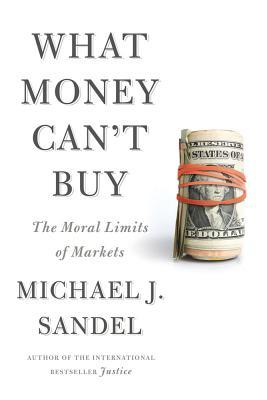

كتاب "ما لا يُمكن للمال شراؤه" ([What Money Can't Buy](https://www.amazon.com/What-Money-Cant-Buy-Markets/dp/0374533652)) يتحدث عن ما يُمكن تسميته بـ"الجانب الأخلاقي للأسواق". يبدو لي بأن عنوان الكتاب يُفترض به أن يكون "ما يجب أن لا يكون المال قادرًا على شرائه" بدل "ما لا يُمكن للمال شراؤه" لأنه ومثلما يبدو من مُختلف فصول وأمثلة الكتاب، استطاع المال خلال العقود الماضية شراء كل شيء حتى الأمور التي يُفترض بها أنها ليست قابلة للبيع أو أنه يُفترض أن يُنظر إلى شرائها وبيعها بنوع من الريبة.

الكاتب هو مايكل ساندل، الفيلسوف والأستاذ المُحاضر في جامعة هارفارد والذي يُعتبر أحد أشهر أستاذة الفلسفة في الوقت الراهن، يهتم بشكل أساسي بفلسفة السياسة وأخلاقياتها. اشتهر بشكل كبير بعد نشره بشكل مجاني لسلسة دروس ألقاها في جامعة هارفارد تحت عنوان [Justice: what’s the right thing to do](https://www.youtube.com/watch?v=kBdfcR-8hEY&list=PL30C13C91CFFEFEA6) (التي يُمكن ترجمتها إلى “العدالة: ما الذي يجب القيام به”؟) والذي حوّله بعدها إلى [كتاب يحمل نفس الاسم](https://www.amazon.com/Justice-Whats-Right-Thing-Do/dp/0374532508). يُكرر نفس الأمر هذه المرة بسلسلة دروس أخرى حوّلها إلى هذا الكتاب الذي أكتب عنه اليوم.

هدف ساندل من هذا الكتاب هو لفت الانتباه إلى نقطة مهمة، والمُتعلّقة بالتّحول الذي حدث خلال العقود الأخيرة في العالم بشكل عام وفي المُجتمع الأمريكي بشكل خاص، حيث انتقلنا -حسب الكاتب- من اقتصاد السوق إلى مجتمع يتحكم فيه السوق، أو إلى مُجتمع سوقي إن جازت ترجمة Market Society إلى ذلك (“سوقي" هنا لا تحمل نفس دلالة نفس الكلمة في عبارة "ألفاظ سوقية" مثلا بل هي إعطاء المُجتمع أوصاف وخصائص السوق مثل العرض والطلب).

يشير الكاتب إلى أن المُجتمع أصبح خاضعا لمعايير السوق حيث أن هناك جوانب وأمورًا يفترض أن لا يكون للسوق فيها أي دخل، إلا أنها أصبحت قابلة للبيع والشراء. فعلى سبيل المثال، حضور جلسات المحكمة العُليا في الولايات المُتّحدة مفتوح للجميع ومجاني، وهو ما ينتج عنه وقوف لساعات عديدة في الطوابير الطويلة. بعد دخول مبادئ اقتصاد السوق هنا، نتج التالي: ظهور شركات خاصة بالوقوف في الطوابير توظف أشخاصًا (متشرّدين بشكل أساسي) للوقوف في تلك الطوابير، وبيع تلك الأماكن لمن يرغب فيها. صحيح بأن الجميع رابح في هذه القضية (من وجهة نظر اقتصاد السوق)، فالمتشرد الذي لم يكن له مدخول حصل على ما يسدّ به رمقه، والأماكن المحدودة في المحكمة سيحصل عليها من يرغب أكثر في الحصول عليها (من سيدفع أكثر). لكن في المُقابل أُخرِج الأمر من سياقه الطبيعي، فما كان في البداية حقًا للجميع (في حدود الأماكن المحدودة) ومُتاحًا بشكل مجاني أصبح سلعة تُباع وتُشترى.

مثال آخر ضربه الكاتب وهو إعطاء مُقابل مادي للأطفال مُقابل قراءة الكُتب لحثّهم على القراءة. في حين أن عدد الكُتب التي قرأها الأطفال ارتفع، إلا أن ذلك لا يعني استفادة الأطفال مما يقرؤونه، خاصة لما يلجأ بعضهم إلى قراءة الكتب القصيرة (أو التي لن تفيدهم بالضرورة). مما يُحول علاقة الأطفال بالكتب من علاقة شغف وحب للاطلاع وزيادة المعارف إلى مُجرد أمر روتيني يجب القيام به للحصول على دولارات معدودات.

فكرة أخرى يُحاول الكاتب دحضها والمُتعلقة بمبدأ "أن الأسواق مُحايدة ولا تؤثر على السلع المعروضة للبيع". بعبارة أخرى إن حصلت منك على سلعة أيا كان السعر أو الطريقة التي حصلت بها عليها فإن السلعة لن تتأثر، وهي فكرة غير دقيقة (أو بالأحرى خاطئة) حسب الكاتب.

فعلى سبيل المثال وبعد وقوع اختيار سويسرا على إحدى مدنها الصغيرة كمكان لتخزين الفضلات النووية الخاصة بالبلاد وبعد سبر آراء سكان تلك المدينة حول مدى قبولهم لتلك الفكرة، تبيّن أن 51 بالمئة من السكان وافقوا على ذلك إن قرر البرلمان بأن مدينتهم هي المكان الأنسب للقيام بذلك. في حين أن نسبة المُوافقين نزلت إلى 25 بالمئة فقط لما عُرض على نفس السكان مُقابل مادي شهري كبير نسبيا (في حدود 8000 دولار سنويا) مقابل نفس الخدمة. حيث ما كان يُنظر إليه على أنه واجب وطني يجب القيام به تحول إلى سلعة تُباع وتشترى، و"قُتِل" بذلك الحس الوطني مما غير طبيعة السلعة في حد ذاتها وتسبب في الرفض.

لكن المثال الذي يلخصّ الفكرة بشكل جيّد، والذي يُمكن اعتباره أفضل مثال على الفساد الأخلاقي الذي تتسبب فيه الأسواق، وهو فساد قد لا يكون في الكثير من الحالات إصلاحه مُمكنًا هو التالي:

في إسرائيل وفي إحدى المدارس الابتدائية، أرادت إدارة المدرسة أن تقضي على تأخر الأولياء مساء كل يوم في استرجاع أولادهم، حيث أنه ولدى تأخر ولي تلميذ ما، فإن على إدارة المدرسة أو على أحد معلميها أن ينتظر قدوم الوالد لاسترجاع ابنه أو ابنته. الحل الذي عمدت إليه الإدارة هو فرض غرامة مالية على كل تأخّر. في حين أنه من وجهة نظر اقتصاد السوق يُفترض بمثل هذا الإجراء أن يقضي على التّأخرات، كان له أثر عكسي، حيث زادت نسبة التأخرات أكثر، حيث لم يُعد يُنظر إلى التّأخّر على أنه إزعاج يجب تجنّبه، ولم يعد يُنظر إليه على أنه أمر يستوجب الخجل، بل أصبح مُجرد سلعة أخرى: “أنا أدفع لك مُقابل تأخري، وعليه سأتأخّر كلما رغبت في ذلك ولن أخجل من الأمر". الأدهى والأمر هو أنّه وبعد إلغاء تلك الغرامات، لم ترجع نسبة التأخّرات إلى سابق عهدها، وإنّما بقيت مرتفعة كما وأن الغرامات لا تزال فعّالة، لأنه وبكل بساطة كُسر الحاجز النفسي السابق، وهو الحاجز الذي لم يكن إلغاء الغرامات كفيلًا بإصلاحه من جديد.

يلقي الكتاب الضوء على نقطة أخرى في غاية الأهمية والتي تنتج عن هذه التغيرات، وهو اتساع الهوة ما بين طبقات المُجتمع. فإن كان بإمكانك الحصول على كل ما ترغب فيه (من سلع ومما لا يفترض أن يكون سلعًا) مقابل المال، فتصبح الطبقة الأغنى قادرة على الحصول على كل ما تريد حتى ولو لم يكن أخلاقيًا، وستضطر الطبقة الأكثر فقرًا لبيع تلك الخدمات مقابل مبالغ مالية. يُشير الكاتب إلى أنه في حين لا تشترط الديمقراطية لكي تُحقق المطلوب منها وجود مساواة ما بين جميع أفرادها، إلا أنها تفترض وجود نوع من "التخالط" والتبادل ما بين مُختلف طبقات المُجتمع، ويضرب مثالا بمدرجات الملاعب في أمريكا والتي كانت في ستينيات القرن الماضي تجمع الفقير والغني في مكان واحد، حيث يحصلون على نفس "تجربة المُستخدم"، فيجلس الجميع على نفس النوعية من المقاعد، ويأكلون نفس الشطائر ويشربون نفس المشروبات، بل حتى ويقفون في نفس الطابور للدخول إلى نفس دورة المياه. إلى أن الأمر تغير الآن، فيمكن للأغنياء أن يُشاهدوا مبارياتهم المفضلة في أماكن خاصة مُغلقة بعيدة عن "باقي البشر" ويقل الاحتكاك ما بين طبقات المُجتمع مما يُهدد مُستقبل الديمقراطيات الحديثة.

كتاب أنصح الجميع بقراءته، يحمل العديد من الأفكار والمفاهيم الفلسفية التي يضعها في قالب يسهل على الجميع فهمها. ستلاحظ أيضا لدى قراءتك للكتاب بأن الكاتب لا يُحاول فرض فكرة بعينها (لا يقول مثلا بأن هذا هو الصواب وهذا هو الخطأ) بقدر ما يُحاول أن يستعرض الأفكار بأسلوب حضاري ويترك القارئ يخرج بالخلاصات التي يرغب فيها.

إن رغبت في الاستزادة حول الأمر دون قراءة الكتاب، ألق نظرة على هذه الفيديو:

<iframe src="https://www.youtube.com/embed/GvDpYHyBlgc" allowfullscreen="allowfullscreen" height="315" frameborder="0" width="560"></iframe>

أو على هذه السلسلة:

<iframe src="https://www.youtube.com/embed/EU8QGK6pn5U" allowfullscreen="allowfullscreen" height="315" frameborder="0" width="560"></iframe>
