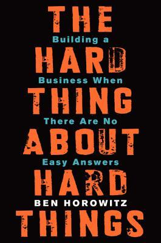

من الكتب التي يصعب وصفها بدقّة أو حتى تلخيصها. من الكتب التي لما تفرغ منها لا تذكر أفكارًا مُعيّنة بالذات لكن تُحسّ بأنك اكتسبت فهما أفضل للمجال الذي يُعالجه.

يحكي الكاتب Ben Horowitz (أحد مؤسسي netscape) قصّته عبر مُختلف الشركات الناشئة التي أنشأها، مُختلف الصعوبات التي واجهها، كيف استطاع التغلب على جملة من العقبات التي واجهته، والمُفاوضات والنقاشات العديدة التي أجراها لدى بيع شركاته الناشئة ليس مع المُشترين المُحتملين فحسب وإنما مع أعضاء مجلس الإدارة وحتى موظّفيه.

الكتاب يخرج على المألوف في كُتب وقصص الشركات الناشئة والتي تركّز عادة على ما يُطلق عليه "الطريق السعيد" في الشركات الناشئة، بل يُركّز على الجوانب الصعبة فيها، والتي عادة لا توجد إجابات جاهزة حولها.

بعض الأفكار المُهمّة في الكتاب:

- يجب التركيز لدى توظيف أي موظف على نقاط القوة التي يملكها وليس على نقاط الضعف التي لا يُعاني منها.

- يجب أن توظف المُوظّف (خاصة التنفيذيين منهم) للمهام التي ستوكل لهم الآن وليس لاحقًا. بعبارة أخرى إن كانت شركتك لا تملك سوى 100 زبون فلا حاجة لأن توظّف مدير تسويق أو مبيعات لديه خبرة في الشركات التي تملك مليون زبون، لأن الخبرات التي يحتاجها الموظف/التنفيذي في كل مرحلة ستختلف بشكل جذري على المرحلة الأخرى.

- من بين أصعب الأمور في إدارة الشركات الناشئة هو استبدال التنفيذيين مع نمو الشركة. من بين الأمور التي يجب أن تُوضّح للمُوظّف هو أنه وبعد نمو الشركة فإنه وبالرغم من أن المُسمى الوظيفي لم يتغير فإن الوظيفة في حد ذاتها تغيّرت بشكل جذري (إدارة خادوم واحد مثلا ليس مثل إدارة أسطول من الخواديم بشكل مؤتمت وبيع المُنتج لمئة عميل ليس كبيعه لمليون عميل) وعليه فإنه يجب على الموظف أن ينمو مع وظيفته للحفاظ عليها.

- يجب أن يحذر المُدير التنفيذي من تقييم أداء موظّفيه بالأرقام فحسب. فليست جميع الأهداف قابلة للقياس بالأرقام. قد تطلب من المُوظّف تحقيق هدف مُعيّن، كرقم أعمال مُعيّن مع نهاية كل فصل، لكن قد لا تحصل على النتيجة المُثلى التي تطمح إليها، فقد تحصل على تلك الأرقام بالذات لكن سيكون ذلك على حساب أهداف أخرى لا يُمكن قياسها بالأرقام.

- هناك فرق ما بين "المدير التنفيذي في حالة الحرب" و "المدير التنفيذي في حالة السلام" المقصود بالأول هو المدير الذي يدير شركته في المراحل المفصلية منها والتي تُواجه فيها عقبات وصعوبات كثيرة، أما الثاني فالمقصود به المدير الذي يدير شركته بعد خروجها من المرحلة الحرجة. تحتاج كل مرحلة إلى أسلوب خاص بالإدارة، المدير التنفيذي المُتميّز هو من يتقن فنّ المرحلتين معًا.

- أغلب كتب الإدارة تركّز على سيناريوهات مرحلة السلام، ولهذا فإن هذه الكُتب لا تقدّم أية فائدة حقيقية لمؤسس/المدير التنفيذي للشركة الناشئة.

- هل يجب بيع الشركة الناشئة؟ ومتى يجب التفكير في ذلك؟ بشكل أساسي يُنصح ببقاء الشركة ناشئة مُستقلة إن كان بمقدورها أن تصبح الأفضل في مجالها وبفرق كبير جدًا. يضرب الكاتب مثالا بشركاته الناشئة، حيث فضّل البقاء مستقلًا لما كان بإمكان أن يصبح الرقم 1 في مجال تخصّصها وبفارق كبير على أي منافس قريب، لكنه فضّل أن يبيع إحدى شركاته لما كانت في السوق شركتان قويتان، وكان بإمكان أي شركة أكبر منهما أن تشتري إحدى الشركتين وتقضي على الشركة المُتبقّية.

- يرى الكاتب بأن المُؤسس التقني هو أفضل شخص يُمكن له أن يُدير شركة تقنية، في المقابل يعتقد بأنه يصعب لهذا المؤسس أن يتعلم و يُصبح مديرًا تنفيذيا جيّدا لدى إدارته لشركته، وعليه يصل إلى نتيجة أن رؤوس المال المُخاطر يجب أن تُساعد المُؤسس التقني على امتلاك المهارات اللازمة ليصبح مديرًا تنفيذيّا جيّدا بدل أن تُحاول أن تجلب مديرًا تنفيذيا خارجيًا لإدارة الشركة.

- ترقية موظّف من داخل الشركة ليشغل منصب مدير تنفيذي أفضل بكثير من جلب مدير خارجي، لأن نجاح أي تنفيذي يرتكز بشكل أساسي على المعرفة العميقة بالمُنتج، وبالتقنيات المُستخدمة، وبثقافة الشركة، يمكن للموظف الداخلي أن يتعلّم ما ينقصه من مهارات بشكل أفضل بكثير مما سيتعلم المُوظّف الخارجي النقاط آنفة الذكر.

- بعض الموظّفين يبنون المُنتج، وبعضهم يبيعه. مهمة المدير التنفيذي هي اتّخاذ القرارات. قوّة وصحّة تلك القرارات تعتمد على امتلاك أكبر قدر من البيانات. بيانات حول المُستخدم وبيانات حول المُنتج وبيانات حول المُنافسين. بعبارة أخرى يتوجب على المُدير التنفيذي أن يكون مثل الإسفنجة التي تمتص أكبر قدر من البيانات المُمكنة، لأنه سيجد نفسه في أغلب الحالات في وضع يتطلب منه اتخذا قرارات دون توفر جميع الأدلة والبيانات اللازمة حول ذلك القرار بالضّبط، وعليه امتلاك أكبر قدر من البيانات حول الشركة سيُسهّل عليه المهمة.

- أحد أهم الوسائل للحصول على البيانات المُهمة لإدارة الشركة هي اللقاءات الثنائية One-on-one meeting مع المُوظّفين، يتوجب على المدير التنفيذي أن يقوم بذلك باستمرار (خاصة مع باقي التنفيذيين في الفريق) كما يتوجب على كل تنفيذي أن يقوم بذلك مع المُوظّفين الذين يديرهم.

- لكي تأمل في تحقيق أي نجاح في عالم الشركات الناجحة فيجب عليك أن تولي اهتمامك بالجانب البشري ثم بالمُنتج ثم بالأرباح على هذا الترتيب، إن كنت لا تعطي موظّفيك (أو حتى من هم حولك خارج الشركة) الاهتمام اللازم فسيصعب عليك التركيز على المُنتج أو على تحقيق الأرباح.

- يجب على المدير التنفيذي أن يحذر مما يُطلق عليه بـ "السياسة" داخل الشركة. المقصود هنا ليس الحديث عن السياسة، بل استخدام بعض المُوظّفين لبعض الحِيل والخُدع للوصول إلى أهدافهم الشخصية. فعلى سبيل المثال يجب على المدير التنفيذي أن يتجنب إعطاء زيادة في الراتب لأي موظف لمجرد أنه طلب ذلك أو لأنه حصل على عرض من شركة أخرى ويرغب في الإبقاء عليه برفع راتبه، لأنه إن فعل ذلك فسيُكتب ذلك في سجل "السياسات المُتّبعة في الشركة" بشكل آلي. بعبارة أخرى، أي موظّف يرغب في طلب زيادة سيفعل (بغضّ النّظر على أدائه) وقد يلجأ بعض المُوظّفين إلى الحصول على عروض عمل من شركات أخرى لمجرد أن يستخدموا ذلك كأداة ضغط للحصول على زيادة في الراتب. الحل هو في ربط الزيادات بالأداء، وتحديد أوقات مُعيّنة في كل سنة تتم فيها دراسة أداء المُوظّفين لمعرفة أيهم أهل لتلك الزيادات.

أنصح بقراءة الكتاب حتى ولو لم تكن تنوي إطلاق شركة ناشئة. يصلح الكتاب أيضا لمن يعمل في شركات ناشئة، حيث سيسمح لك بفهم ما يحصل حولك بشكل أفضل.
