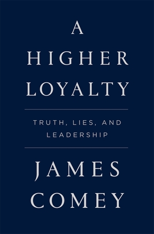

كتاب خيّب ظنّي كثيرًا. بعد قراءتي لكتاب [Fire and Fury ](https://www.it-scoop.com/2018/01/fire-and-fury-inside-the-trump-white-house/)"[نار وغضب](https://www.it-scoop.com/2018/01/fire-and-fury-inside-the-trump-white-house/)" الذي يحكي أسرار البيت الأبيض في زمن ترامب، الذي كتبه الصحفي الأمريكي مايكل وولف Michael Wolff، كنت أتوقّع أن أعرف المزيد حول الأمر عبر هذا الكتاب الذي كتبه المدير السابق لمكتب التحقيقات الفيدرالي James Comey "جيمس كومي"، لكن لم يقدّم لي ما كنت أبحث عنه.

الكتاب يتمحور حول فكرتين أساسيتين: الأولى أن التحقيقات التي قام بها مكتب التحقيقات الفيديرالي حول ما يُسمى "قضيّة رسائل البريد الإلكتروني الخاصة بهيلاري كلينتون" لم تكن ذات خلفية سياسية، يعني لم تدفع أية آراء سياسية المكتب للتحقيق في ذلك، وإنما مُختلف مكونات القضية والمعلومات التي توفّرت حولها قبل انتخابات نوفمبر 2016 هي التي دفعت إلى ذلك.

والثانية هي أن دونالد ترامب طلب من المدير ولاء مُطلقًا لشخصه في أكثر من مُناسبة وأنّه طُرِد من منصبه لأنه لم يُقدّم ذلك الولاء المطلوب منه.

تحدث الكاتب عن هاتين الفكرتين في الفصول الأخيرة من الكتاب. أما باقي فصول الكتاب لم تكن سوى مقدّمة حول تاريخ الكاتب ومِهنيّته. ستلاحظ بأنه حاول أن يُعلّل كل الأفكار والمُصطلحات المُستخدمة في الفصول الأخيرة عبر باقي فصول الكتاب. بعبارة أخرى الأسلوب المُتّبع في الكتاب لا غُبار عليه (هناك تسلسل منطقي وأسلوب كتابة منظّم) إلا أن الكتاب – في رأيي- يصلح أن يُنشر كمقال أو كمجموعة مقالات في أفضل الحالات على إحدى الجرائد أو المواقع الإلكترونية.

لدى قراءتي للفصول الأولى، كان من الواضح والجلي أن الكاتب يُحضّر "قضيّته" ويُرافع عنها كمن يُرافع أمام هيئة مُحّلفين في المحكمة. كانت هذه العبارة تتردّد في بالي طيلة الكتاب "Too good to be true” (القصّة أجمل من أن تكون كل تفاصيلها حقيقية). بعبارة أخرى، إما أن الكاتب رجل نزيه ووطني (أضف أي وصف جميل ترغب فيه هنا) أو أنه حاول الظهور بمثل هذا المظهر.

رغم ذلك، بعض الأفكار "المهمة" التي ترسبّت لدي بعد الفراغ من الكتاب:

- حتى من يشغل مناصب حكومية عالية في أمريكا لن يحصل على رواتب عالية. أشار الكاتب في أكثر من مُناسبة إلى راتبه المُتواضع وكيف أن وظيفة أقل شأنا في القطاع الخاص كانت لتُدّر عليه أكثر (هل كان ذلك السبب وراء تأليف كتاب والاستفادة المادية منه؟ لا أعتقد ذلك لكن لا أستبعد أن يكون الجانب المادي حاضرًا في ذهن الكاتب لدى عمله على هذا الكتاب).

- يُشير الكاتب أن أغلب من يعمل في مكتب التحقيقات الفيدرالي يبقى في وظيفته إلى غاية تقاعده، وهو الأمر الذي يحضّره لوظيفة أفضل بكثير (قيادية بشكل عام) في القطاع الخاص بعد ذلك. يرى الكاتب بأن المكتب يُدرّب ويكّون العديد من القادة في مجالات مُختلفة يستفيد منهم القطاع الخاص بعد تقاعدهم.

- مكتب التحقيقات الفيدرالي يُفترض به أن لا يكون تابعًا لأي حزب أو توجّه سياسي، ولهذا فإن مديره يُعيّن لفترة تمتد لأطول من الفترة التي يحكمها رئيس الولايات المُتّحدة. رغم ذلك فإنه يُمكن للرئيس أن يُنهي مهامه.

لا أنصح بقراءة هذا الكتاب خاصّة لمن سبق له أن تابع حيثيات فصل مُدير المكتب من منصبه في وقتها. إن كنت ترغب في معرفة ما يحدث في البيت الأبيض في زمن ترامب، فقد ترغب في الاطلاع على كتاب "نار وغضب". يُمكن أن تقرأ مُراجعتي له من هنا: https://www.it-scoop.com/2018/01/fire-and-fury-inside-the-trump-white-house/

على الهامش: هذا الكتاب وبالرغم من أنه صدر حديثا (شهر أبريل الماضي) إلّا أنه تُرجِم إلى العربية. لا أفهم على أي أساس تُقرّر دور النشر العربية ترجمة الكُتب إلى العربية. فالعديد من الكُتب التي تُرجمت إلى أغلب لغات العالم والتي صدرت منذ سنوات لا تجد من يترجمها. في حين أن كتاب مثل هذا الكتاب الذي لن يقدّم أي فائدة مُطلقة للقارئ العربي الذي يقرأ بالعربية فقط يُترجم بهذه السرعة.
