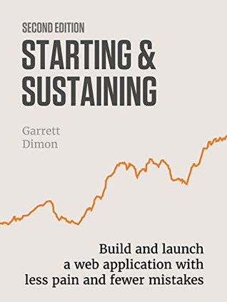

أعتبر كتاب **Starting & Sustaining**: Build and launch a web application with less pain and fewer mistakes.  أحد أفضل الكتب التي قرأتها حول ريادة الأعمال في الآونة الأخيرة. ما أعجبني فيه أنه لا يركّز على إطلاق الشركة فحسب وإنما يُعالج مواضيع تخص إدارة الشركة وإنجاحها، بل وحتى بيعها وتسليمها لغيرك.

الكتاب -في رأيي- يصلح بشكل أكثر للريادي الذي لا يملك خلفية تقنية، ليس لأن الكتاب لا يخوض في التفاصيل التقنية، بل بالعكس لأنه يوضّح جميع النقاط المهمة التقنية التي يجب أن تلقي لها بالًا والتي قد يغفل عنها الكثيرون، بل قد يغفل عنها حتى من يملك خلفية تقنية، فستكتشف جوانب ربما لم تسمع عنها من قبل أو لم تُلقي لها بالًا أو تعُطي لها تلك الأهميّة.

الكتاب متكوّن مما يقرب من 70 فصلًا، كل فصل يُعالج نقطة صغيرة، يعطيك ما يجب أن تعرفه بشكل عام حول تلك النقطة، مما سيسمح لك بالاستزادة إن أردت لاحقًا بالبحث حول الموضوع، حيث ستكون لديك فكرة أوضح عما يجب البحث عنه وعن الكلمات المفتاحية التي يجب أن تستخدمها. أغلب فصول الكتاب قصيرة (أقرب ما تكون من مقالات)، مما يُسهّل من استهلاك الكتاب.

الكتاب فعلًا واقعي، ولا يصوّر لك عالم ريادة الأعمال (أو بالأحرى رحلة إطلاق شركة تقنية ناجحة) بتلك الصورة النمطية الوردية، بل يحكي من تجارب الكاتب الشخصي والذي أطلق تطبيق sifter ووصل به إلى نجاح مُعتبر قبل أن يُضطرّ إلى بيعه لأسباب صحّية. فعلى سبيل المثال ستجد فصلًا في بداية الكتاب يقول لك "لا تترك وظيفتك الحالية" على عكس ما قد تقرأه عادة في كتب ومقالات "ريادة الأعمال الوردية".

من بين الأفكار المُهمّة في الكتاب:

- لا تترك وظيفتك الحالية، حاول أن تبقى في وظيفتك الحالية أطول فترة ممكنة، إلى أن يدرّ عليك مشروعك الجديد من الأرباح وينمو بشكل سريع بشكل تحتاج فيها الوقت التي تقضيه في وظيفتك اليومية لإدارة ذلك.

- كن حذرًا فيما يخص الأرقام وتوقّعاتك لمستقبل التطبيق. لا تبنِ قرارات مصيرية على أرقام وهمية.

- لا تُعطي "يوم إطلاق المشروع" أهمية بالغة، بل حاول أن يكون مجرد مرحلة عادية من مراحل حياة المشروع. يذهب الكاتب إلى أبعد من ذلك ويشير إلى أنه من الأفضل أن لا تحاول الحصول على كل الزيارات التي تقدر على تحصيلها في يوم واحد فقط. تخيّل حدوث خلل ما في التطبيق في اليوم الأول من الإطلاق، وتخيل كل ذلك الجهد المبذول والضائع بسبب ذلك. لو حصلت على تلك الزيارات مقسّمة على عدّة أيام فسيكون بمقدورك إصلاح العطب وتفادي ضياع زيارات باقي الأيام سُدًى.

- أغلب الشركات التقنية الناشئة لا تموت بسبب مشاكل تقنية أو بسبب المُنافسين المُباشرين، وإنما تموت لقلة/انعدام المبيعات.

- رغم كون شركتك الناشئة تقنية فإنك كمدير/صاحب المشروع لن تمضي 90 بالمئة من وقتك في البرمجة وفي الأمور التقنية. إن كان هدفك هو أن تمضي جل وقتك في البرمجة فيجب عليك أن تعمل لصالح شركة أخرى ولا تُطلق شركتك الناشئة.

- يجب عليك أن تهتمّ بالأمور "المُملّة" وأن تُعدّها قبل أن تكون في حاجة لها (أو على الأقل أن تكون على عِلم بوجودها وبضرورة القيام بها). على سبيل المثال لا الحصر تسجيل الشركة والحصول على "وجود قانوني" لها، فتح حساب بنكي تجاري، الحصول على الرعاية الصّحّيّة، كتابة "شروط الخدمة" وما إلى ذلك.

- لا تقم باستضافة خدمات مفتوحة المصدر بنفسك أو تقوم ببناء تطبيقات إدارة داخلية بنفسك. إن كنت بحاجة إلى خدمة أو تطبيق خارجي وما لم تكن وظيفة هذه الخدمة/التطبيق الخارجي إحدى ركائز مُنتجك فيجب عليك أن تدفع مقابلها بدل أن تطوّرها أو حتى أن تستضيفها بنفسك على خواديمك، لأن ما ستضيّعه من وقت وجهد لدى قيامك بذلك سيكون أضعاف ما ستدفع مقابل خدمة تجارية.

- لا تُحاول أن تُظهر شركتك أكبر مما هي عليه. إن كانت شركتك مكوّنة من فرد أو أفراد قلائل فلا حاجة أن يظهر موقع شركتك بنفس مظهر الشركات الكبيرة. صِغر حجم الشركة هو نقطة قوّة وليس نقطة ضعف. استغل صغر حجم شركتك لصالحك.

- احذر من بعض الأفكار والمُصطلحات الرنانة التي تسعى العديد من الشركات الناشئة وراءها. على سبيل المثال قد ترغب في إعادة حساباتك أكثر من مرّة قبل أن تتّبع أسلوب "الشفافية" التي نجده لدى بعض الشركات الناشئة مثل buffer.

- أفضل طريقة لتعرف ما إذا كان منتجا مُفيدًا ليس عبر تجربة أصدقائك ومعارفك له، بل استقبال مال مُقابله هو أفضل دليل على ذلك.

- احذر من استخدام مُصطلحي "مجاني" أو "غير محدود" لدى وصفك لمُنتجاتك وخدماتك. قد تجد من الزبائن من يأخذ هذين الوصفين على محمل الجد وقد تجد نفسك في مأزق بسبب ذلك.

- جهّز نفسك للتعامل مع عمليات الدفع الفاشلة. هناك أسباب عديدة لفشل عمليات الدفع ويجب عليك أن تبني آلية مدروسة للتعامل بشكل يسمح لك بتجنب الخسائر المُترتّبة عنها.

- لا تُلقي بالًا لإحصائيات الموقع أو عدّاد الزيارات في المرحلة الأولى بعد إطلاق مُنتجك. فلا يمكنك استنتاج أو استخلاص أية نتائج خلال تلك الفترة، لكن رغم ذلك لا تغفل عن تضمين آليات للحصول على تلك الإحصائيات منذ اليوم الأول لإطلاق مشروعك.

- يجب عليك أن تبني نظاما يسمح لك بحفظ نسخ احتياطية لقواعد بياناتك بشكل دوري، ويجب عليك أن تبني نظاما يسمح لك بالتحقق من صلاحية تلك النسخ الاحتياطية بشكل دوري أيضًا. كما يجب عليك أن تحفظ تلك النسخ الاحتياطية في أماكن معزولة عن خواديمك الرئيسية.

- يجب أن تكون لديك آلية لتتبع أداء الخدمة على مُستويات مُختلفة: توفر الخدمة (هل يمكن الدخول إلى الموقع من أماكن مُختلفة من العالم)، الأخطاء البرمجية، الثغرات الأمنية، أداء الخواديم، معدّلات الزيارات، أداء المبيعات ونحو ذلك.

- لا تنتظر حتى تجهز جميع خصائص تطبيقك قبل أن تُطلق المُنتج. لكن هذا لا يعني أن تُطلق مُنتجًا لا يعمل.

- يجب أن تكون جاهزًا للتعامل مع المُحتالين ومع السخام. لا تحتاج إلى بناء نظام لا يترك أي مجال للمُحتالين والسخام، فذلك سيأخذ منك الكثير من الوقت والجهد كما أنه قد يجعل تجربة المُستخدم سيّئة لباقي العملاء والمُستخدمين، كلما تحتاجه هو بناء نظام يُصعّب المهمة عليهم لأنه في أغلب الحالات يكفي ذلك لجعل موقعك/خدمتك هدفًا غير مرغوب فيه.

- حضّر نفسك لبيع شركتك حتى ولو لم تكن لديك الرغبة في ذلك. التحضير لبيع الشركة سيدفعك إلى توثيق كل شيء في الشركة، وإلى إدخال تحسينات عديدة على النظام، مما سيكون بالنفع عليك وعلى شركتك بشكل عام.

- إن قررت البيع فمن الأفضل أن تتواصل مع سماسرة بيع التطبيقات بدل بيع التطبيق مُباشرة بنفسك. رغم النسبة التي سيقتطعها السمسار لقاء خدماته فإن ذلك كفيل بضمان الحصول على أفضل العروض المُمكنة.

- يجب أن تحسب قيمة شركته في حال بيعها وفق أسس صحيحة ومدروسة وليس وفق أهوائك الشخصية. بعبارة أخرى قد تبيع الشركة بأقل مما كنت تتوقّعه.

- افهم جيّدا آلية بيع الشركات وما يترتب عليها قبل قيامك بذلك. إقدامك على بيع الشركة دون دراسة مُعمّقة وفهم دقيق قد يُضفي إلى عقد بيع لا يتوافق مع ما تصبو إليه أو ما كنت تتوقّعه.

الكتاب في غاية الأهمية لكل من يرغب في إطلاق تطبيق خدمي أو مُنتج تقني (خاصّة الذين ينوون إبقاء شركاتهم صغيرة الحجم). مُحتواه مُتوفّر بشكل مجاني على موقع الكتاب (على هيئة مقالات) كما يُمكنك الحصول على نسخة إلكترونية أو مسموعة (بمقابل) على نفس الموقع:

[https://startingandsustaining.com](https://startingandsustaining.com/)
