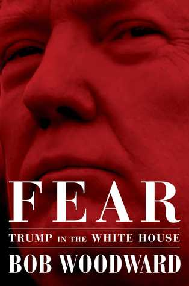

كتاب يتناول قصّة دخول ترامب غمار السياسة، كيف ترشّح وكيف وصل إلى سدّة الحكم، وكيف أدار الفترة الأولى من حكمه للبيت الأبيض.

هذا ثالث كتاب أقرأه حول البيت الأبيض في زمن ترامب. الكتاب الأول "[نار وغضب](https://www.it-scoop.com/2018/01/fire-and-fury-inside-the-trump-white-house/)" كان مُمتعًا بحكم أنه اعتمد أسلوب نقل الأخبار (وربما بعض الطرائف) حول ترامب. الكتاب الثاني "[ولاء أعلى](https://www.it-scoop.com/2018/08/a-higher-loyalty-truth-lies-and-leadership-review/)" كان مُحاولة كاتبه تبييض صورته ورفضه تحمل أية مسؤولية في وصول ترامب إلى سدّة الحكم. أما هذا الكتاب فقد يُصبح مصدرًا من مصادر كتابة التاريخ لاحقًا، حيث تميّز بالرّصانة وحاول نقل الأوضاع كما هي، بل وحتى تجنيب تصوير أي "شخصية" في الكتاب بصورة أسوأ مما هي عليه.

إن لم تقرأ أيّا من الكُتب آنفة الذكر وترغب في قراءة كتاب واحد فقط حول الموضوع، فقد يكون هذا الكتاب أفضلها، ليس فقط لإحاطته بمواضيع ربما لم تُذكر في الكتابين الآخرين وإنما للجدّيّة التي يتّسم بها الكتاب، ولتكوين فكرة أفضل حول نوعية وجودة الصحافة الاستقصائية والتي -للأسف- من النادر أن نجد لها مثيلًا على الساحة العربية.

بعض الأفكار التي ترسّبت لديّ بعد الفراغ من الكتاب:

- ترامب لم يكن يحضّر لفترة ما بعد فوزه بالانتخابات الرئاسية. الرجل لم يكن يعتقد بأنه سيخسر لكن لم يكن يعي بأن عدم خسارته تعني فوزه بالانتخابات. فعلى سبيل المثال يُفترض بأي مترشح جاد أن يُحضّر فريقًا لإدارة المرحلة الانتقالية ما بين الفترتين الرئاسيتين. كما قد تتوقّع من الجملة السابقة لم يقم ترامب بذلك، بل سعى لعدم القيام بذلك، وكل ما تم تحضيره هو أمور قاعدية فقط.

- في أول لقاء ما بين مكتب التحقيقات الفيدرالي والرئيس المُنتخب ترامب، تحدث مدير المكتب جيمس كومي عن الجهود الروسية للتأثير على الانتخابات الرئاسية. الكاتب وصف التقرير المُقدّم على أنه مثال على التقارير عالية الجودة، لكنه استغرب إرفاق قضية ما يُسمّى بالـ golden shower في نهاية التقرير. في حين أن التقرير الرئيسي اعتمد على بيانات وأدلة وقرائن جُمّعت من مصادر مُختلفة، فإن التقرير الإضافي الذي أرفق في الهامش لا يعتمد على أسس وأدلة قوّية. يُشكّك الكاتب في جدوى وجدّية القيام بذلك، ويُلمّح إلى وجود نيّة مُبطّنة وراء ذلك. إن صحّ ذلك فإن جميع ما ذكره جيمس كومي في كتابه "ولاء أعلى" قد يفقد من مصداقيّته الكثير.

- لا يملك ترامب أية خبرة مُسبقة مع السياسة، ولا يبدو بأنه يملك أيّة خبرة مع الإدارة أيضًا رغم النجاح الظاهر لأعماله ومشاريعه التجارية.

- يدير ترامب البيت الأبيض كمن يدير بقّالة صغيرة في قرية معزولة. لا يُعطي أي وزن للدبلوماسية ولا للأعراف السياسية. يرغب في الخروج من اتفاقيات دولية عديدة لمجرد أنه قرّر أنه يرغب في الخروج من ذلك ولأنه يرى بأنه لا تخدم مصالح بلاده.

- يسعى ترامب جاهدًا لإرضاء قاعدته الشعبية، وتصّب مُختلف قراراته في هذا الاتّجاه. على سبيل المثال رغبته في فرض رسوم إضافية على العديد من المُنتجات المُستوردة وخاصة الصّلب يهدف إلى إرضاء هذه القاعدة الشعبية التي وعدها بالحفاظ على وظائفها رغم أن مثل هذا القرار له عواقب سيّئة على باقي الاقتصاد الأمريكي، وربما حتى على أمنها القومي.

- ذكر الكاتب أكثر من مرة قيام أعضاء في فريقه بسحب أوامر تنفيذية كانت على مكتبه كان ينوي توقيعها. سُحِبت هذه الأوامر التنفيذية لأنها لا تخدم مصالح البلد الاقتصادية أو الأمنية. الطريف في الأمر أن ترامب وبحكم أنه لا يملك أية أجندة واضحة لا يلحظ غياب تلك الوثائق وقد ينسى رغبته في توقيع تلك الأوامر التنفيذية إما لبعض الوقت أو لا يتذكّر وجودها إطلاقًا.

- لا يملك ترامب أدنى فهم لمبادئ عمل الموازنة المالية، فعلى سبيل المثال كان يسأل "لماذا لا نطبع المزيد من المال" ظنًا منه أن طباعة المزيد من المال سيكون الحل السحري لمشاكل التمويل التي كانت بين يديه.

- يحتاج فريق ترامب ومساعدوه لشرح نفس الأفكار القاعدية فيما يخص الاقتصاد والسياسة والأمن القومي أكثر مرّة حتى يفهم جزءًا منها، وما يلبث بعد ذلك أن يُصّر على صحّة آرائه ويسعى لتنفيذها رغم توضيح فريقه بأنه على خطأ.

- أراد ترامب سحب قواته من كوريا الجنوبية وتساءل عن جدوى إبقائها هناك، وتساءل أكثر من مرة عن جدوى دفع أمريكا مقابل حماية كوريا الجنوبية من تهديدات جارتها الشمالية. رغم توضيح فريقه بأن نظام الحماية ذلك سيسمح لأمريكا في اكتشاف أية هجمات صاروخية لكوريا الشمالية على الأراضي الأمريكية في غضون 7 ثوانٍ فقط مقابل 15 دقيقة للنظام الموجود في ألاسكا، إلا أن ذلك لم يُقنع ترامب بجدوى العلاقات العسكرية المقرونة باتفاقيات تجارية مع كوريا الجنوبية.

- يعتقد ترامب أن علاقته الشخصية مع رؤساء الدّول القوية أهم من أية أعراف ديبلوماسية. فعلى سبيل المثال يعتقد بأن الرئيس الصيني يُحبّه ويعتبره صديقًا وعليه فإنه يُحاول أن لا يُغضبه لإبقاء على تلك الصداقة الوهمية.

- فريق ترامب في البيت الأبيض يعرف نسبة تغيير مُرتفعة جدًا، فإما أن يطردك ترامب أو أن تصل إلى قناعة أنه لا جدوى من العمل معه لتستقيل.

- يُشاهد ترامب ما قد يصل في بعض الحالات 8 ساعات من التلفزيون يوميًا. يُعتبر التلفزيون مصدره الأهم للأخبار، حيث أن ترامب لا يقرأ حتى التقارير التي توضع ما بين يديه.

- حدث أكثر من مرة أن عرف بعض أعضاء فريق ترامب في البيت الأبيض عن طردهم (أو توظيفهم) عبر تغريدات يرسلها الرئيس على تويتر.

- بحكم أن تويتر هي أداء الخطاب المُفضّلة لترامب فإنه طلب طباعة التغريدات التي حصلت على أكبر قدر من التفاعل ليدرسها بشكل أعمق لمعرفة سبب نجاحها واستخدام نفس الأسلوب في تغريداته القادمة.

- أراد ترامب إلغاء الاتفاق النووي مع إيران. بالرغم من تأكيد خبرائه بأن إيران لم تخرق الاتفاق ولا يوجد ما يدفع إلى إلغائه إلّا أنه ظلّ يُكرر الطلب أكثر من مرة.

- أشار الكاتب إلى محادثة تمت بين ترامب والرئيس المصري عبد الفتاح السيسي، والذي سأله عن التحقيقات بخصوص التدخل الروسي في الانتخابات. أشار الكاتب أن الرئيس المصري "هل ستواصل معنا" في إشارة إلى توجّس السيسي من أية تبعات قد تنتج عن سقوط ترامب.

- لا يعتقد المُحامي السابق لترامب جون داوْد John Dowd أنه يملك من المؤّهلات العقلية ما يسمح له بالإدلاء بشهادته في التحقيقات التي يُجريها روبرت مولر حول تدخّل روسيا في الانتخابات الأمريكية. طلب منه أكثر من مرة عدم الإدلاء بشهادته، حيث أخبره بأنه إما أن يمتنع عن الإدلاء بشهادته أو أنه سيجده نفسه مُرتديًا البدلة البرتقالية (المقصود بذلك أنه سيجد نفسه في السجن).

- أشار الكاتب إلى أن مُحامي ترامب تعاون بشكل كبير مع المُحقق مولر، حيث كان يعمل معه بشكل ودّي حتى تُحّل القضية بشكل أسرع.

- إن كان يُمكن تلخيص الكتاب في فكرة واحدة هي أن "ترامب كذّاب". حسبما ما فهمت من الفصول الأخيرة من الكتاب أن الكاتب يعتقد بأنه لا توجد اتهامات واضحة يُمكن يُتّهم بها ترامب مُباشرة في قضية التّدخّل الروسي في الانتخابات الرئاسية، حيث يُشير إلى أن خطّة فريق المُحقق مولر قد تدور حول فكرة استجواب الرئيس تحت القسم، وبحكم أنه كذّاب فإنه سينتهي به المطاف إلى الكذب تحت القسم وهو ما سيُسقط برأسه.

- ترامب يصرّ على فكرة الاستجواب عكس ما نصه محاميه به لأنه يعتقد أن عدم قبوله بالاستجواب قد يُرسل رسالة سلبية إلى قاعدية الشعبية. بسبب هذا الإصرار اضطر مُحاميه إلى الاستقالة.

كما أشرت إليه في البداية، الكتاب يعتمد على الصحافة الاستقصائية التي يجب أن تُتّخذ كمثال يُحتذى به. الكاتب وهو أحد مُفجّري فضيحة واترجيت التي عصفت برئاسة نيكسون ودفعت به إلى الاستقالة، وحاول أن يبقى حياديًا قدر الإمكان ونقل الأحداث كما سمعها أو تلقاها من مصادر مُختلفة. إن سبق لك قراءة كُتب أخرى حول الجزء الأول من فترة رئاسة ترامب فلربما لن تجد أيّة أخبار/حقائق صادمة جديدة في هذا الكتاب، لكن ستحصل على تأكيد من مصادر موثوقة لما سبق لك قراءته أو سماعه حول الأمر.
